# LMDJ 当前产品架构

更新时间：2026-07-14

本文从产品和业务流程角度说明 LMDJ 当前已经落地的系统、各模块的职责，以及尚处于规划阶段的能力。它描述的是当前仓库和本地闭环，不代表规划中的生产云基础设施已经上线。



## 如何阅读这张图

- 实线表示当前已经实现的主要业务链路。
- 虚线表示下一阶段规划中的能力或依赖。
- 点线表示数据契约、Schema 校验或架构约束关系。
- 灰色节点是当前产品和服务；蓝灰节点是参考 Pipeline 及其输出。
- 蓝色节点是 LMDJ 自己的产品模型、Patchify 和统一契约。
- 黄色虚线节点是尚未落地的规划模块。

## 当前已经跑通的产品闭环

当前核心产品流程是“把一首歌变成一个可演奏的 Patch”：

1. 用户从 Web 上传歌曲，或者加载本地 Patch 目录、内置示例。
2. App API 接收上传，创建 Job，并向 Web 提供任务状态与产物访问接口。
3. Audio Worker 管理 Job 状态并启动参考 Song Pipeline 子进程。
4. Song Pipeline 完成分轨、Loop 检测、切片、MIDI 编排和质量验证，输出 Pipeline Package。
5. Patchify 将参考 Pipeline 的专用输出转换成 LMDJ 自己的 `patch.json`。
6. Web 通过统一 Patch Loader 读取 Patch Bundle。
7. 用户进入 8-Pad 工作台，执行 Pattern 回放、Pad 触发和静音组合。

这一闭环已经在浏览器中跑通。当前实现以本地进程和 Job 目录为主，还没有接入生产队列、对象存储、数据库或鉴权系统。

## 模块职责与代码边界

| 模块 | 当前状态 | 主要职责 | 仓库位置 |
| --- | --- | --- | --- |
| Web App | 已落地 | 上传、轮询状态、加载 Patch、8-Pad 演奏体验 | [`apps/web/`](../../apps/web/) |
| App API | 已落地 | 接收音频、创建 Job、返回状态和 Patch 产物 | [`apps/api/`](../../apps/api/) |
| Audio Worker | 已落地 | 编排 Pipeline 子进程、维护 Job 状态、调用 Patchify | [`workers/audio/`](../../workers/audio/) |
| Song Pipeline | 参考实现 | 分轨、Loop、切片、MIDI 编排与质量验证 | [`references/demos/lmdj-song-pipeline/`](../../references/demos/lmdj-song-pipeline/) |
| Patchify | 已落地 | 将 Pipeline Package 适配为稳定的 LMDJ Patch | [`packages/patchify/`](../../packages/patchify/) |
| Core Models | 已落地 | 定义 Patch、Pattern、Pad、Scene、Element 等产品对象和 JSON Schema | [`packages/core-models/`](../../packages/core-models/) |
| Generation Worker | 规划中 | 将一句话创意或 Creative Brief 转换成音乐材料 | [`workers/generation/`](../../workers/generation/) |
| Render Worker | 规划中 | 将 Patch 或 Scene 渲染为成品音频 | [`workers/render/`](../../workers/render/) |

## 为什么 `lmdj.patch.v1` 是架构中枢

`lmdj.patch.v1` 是 Web、CLI、Audio Worker、Patchify 和云端 API 共同使用的产品契约。它把参考 Pipeline 的 `samples/*.wav`、`chart.mid`、`lanes.json` 和 `report.json` 统一成稳定的 `patch.json`，并携带标准化的 Pattern note events。

因此，下游消费者只需要理解 LMDJ 的 Patch 对象，不需要重新解析 MIDI，也不需要依赖参考 Demo 的内部 `Sample` 或 `LoopWindow` 类型。JSON Schema 的单一真相源位于 [`packages/core-models/`](../../packages/core-models/)，Web 侧通过同步生成物校验契约是否漂移。

## 正式产品代码与参考 Demo 的边界

正式产品源码从仓库根目录的 `apps/`、`packages/` 和 `workers/` 开始。`references/demos/lmdj-song-pipeline/` 目前仍作为可运行的音频处理参考实现、fixture 来源和迁移来源，由 Audio Worker 通过子进程调用。

新的正式产品能力不应继续写入参考 Demo。需要复用其输出时，应通过 Patchify 或新的 LMDJ-owned Worker/Package 建立稳定边界。

## 下一阶段规划

- Generation Worker：支持从一句话音乐想法生成可交给 Audio Worker 的音乐材料。
- Render Worker：将 Patch、Pattern 或 Scene 渲染为可导出的成品音频。
- 导出、分享与 Remix：围绕 Patch 和 Lineage 建立可传播的产品闭环。
- 生产基础设施：引入队列、对象存储、Postgres、鉴权、限流和 Job 清理机制。

这些模块在图中使用黄色虚线表示，不应被理解为当前已经部署。

## 维护这张图

图的可维护源文件是 [`assets/lmdj-current-product-architecture.mmd`](assets/lmdj-current-product-architecture.mmd)，渲染配置是 [`assets/mermaid-config.json`](assets/mermaid-config.json)。修改架构后，在仓库根目录运行：

```powershell
npx -y @mermaid-js/mermaid-cli `
  -i docs/architecture/assets/lmdj-current-product-architecture.mmd `
  -o docs/architecture/assets/lmdj-current-product-architecture.svg `
  -c docs/architecture/assets/mermaid-config.json `
  -b '#181818'
```

渲染后应检查：业务关系是否仍准确、规划模块是否仍使用虚线、连线批注是否保持深蓝底浅色字，以及 SVG 是否能通过 XML 解析。
