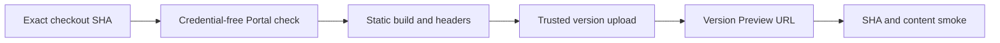

# Architecture Portal 部署、验证与回滚

## Cloudflare 固定地址配置（2026-09-08）

用户已选定 `https://docs.lmdj.workers.dev/`。独立配置位于
`apps/architecture-portal/deploy/wrangler.json`；配置存在不表示已经发布。
`lmdj` Worker 继续保留既有试点，`docs` 通过 Git 构建部署。

`.github/workflows/deploy-cloudflare-portal.yml` 由 `main` push 触发，在现有
`ci-general` 自托管 runner 构建和验证精确 Git SHA。生产并发组串行化发布，排队的
中间 push 可以被 GitHub 合并为最新待处理工作，不取消正在发布的事务。
部署凭据保存在只接受受保护分支的 `portal-cloudflare` Environment；构建与 CLI
安装步骤不注入 token，部署步骤才使用它。

`scripts/cloudflare-portal-deploy.py` 先上传版本 Preview 并验证同一 Git SHA，再发布
同一个 version ID；初始 Worker 在 Preview 通过前关闭主路由。生产 HTTP smoke
有界重试等待路由传播，失败后核对活动版本并恢复 exact prior 或关闭首次部署入口。
操作观察保留为 workflow artifact。自有域名、旧 Netlify 地址与 `lmdj` 试点保持原状。
正常发布由 Git 触发；本地目录不能作为手动生产上传输入。

日期：2026-08-04

状态：已生效

生产站点：`https://lmdj.netlify.app/`

## 1. 状态必须分开报告

| 状态 | 证据 |
| --- | --- |
| Local check | `scripts/architecture-portal.sh check` 完整输出 |
| CI | Architecture Portal workflow 对目标 SHA 为绿色 |
| Deploy Preview | Netlify Preview URL、Deploy ID、目标 SHA 与 smoke |
| Production deploy | `lmdj.netlify.app` 当前 immutable Deploy ID 与目标 SHA |
| Test release verified | `canary`/`dev`/`beta` 构建证据、匹配 Product Build 快照与目标环境 smoke |
| Stable release verified | 生产 smoke、匹配 Product Build 快照、Release 证据和关键页面人工抽查 |

前一状态不自动证明后一状态。PR Preview 成功不等于 production；Netlify 显示 Published 不等于内容身份正确。

## 2. 正常构建与发布

仓库根 `netlify.toml` 是唯一生产构建配置。Netlify 从 Git checkout 执行：

```text
base: apps/architecture-portal
command: npm ci && npm run check
publish: build
Node: 22
```

Pull Request 使用 Deploy Preview；合入受保护 `main` 后由 Netlify Git integration 自动生产部署。正常流程禁止 Netlify API、CLI `deploy --prod`、ZIP、拖拽或单个 HTML 手工上传。临时诊断如确需手工 deploy，必须使用独立非生产站点并明确记录，不能覆盖 `lmdj.netlify.app`。

普通 Preview 不创建永久文档快照。Product Build 一旦分配并交付给测试者，必须先用
`scripts/architecture-portal.sh version PRODUCT_BUILD CHANNEL` 生成匹配快照，并通过
`scripts/architecture-portal.sh check`；`stable` 发布在此基础上追加 Release 与生产验证。

## 3. 部署后 smoke

GitHub `deployment_status=success` 且 URL host 为 `*.netlify.app` 时，工作流 checkout 部署 SHA 并执行：

```bash
scripts/architecture-portal.sh smoke "https://DEPLOYMENT.netlify.app"
```

Smoke 有界并发检查 HTTPS、2xx、HTML MIME、current Product Build/revision、`/versions/1.0.13.0/`、所有顶层区、七个 Module 以及页面引用的同源静态资产。它会捕获“HTML 被当作 `text/plain` 源码显示”的回归。

生产 release verification 还应人工打开首页、一个 Module、全产品图、版本下拉与正式快照，确认暗/亮主题和移动端可读性。

## 4. Deploy ID 与证据记录

在 Netlify Site → Deploys 中选择目标 deploy，记录 Deploy ID、immutable deploy URL、production alias、创建时间、Git SHA 与 build log URL。也可在已授权环境中用 Netlify CLI/API只读查询 deploy 列表；不得为了获取 ID 触发新 deploy。

一条完整记录至少包含：

```text
Git SHA:
Product Build:
Netlify Deploy ID:
Immutable Deploy URL:
Production URL:
HTTP status / Content-Type:
Smoke workflow run:
Formal snapshot route:
Verified at UTC:
Verifier:
```

## 5. 回滚

1. 确认最近一次通过 production smoke 的 immutable Deploy ID 和 Git SHA。
2. 在 Netlify 对该既有 deploy 执行 Publish deploy/restore，不重新打包本地目录。
3. 重新运行 production URL smoke，记录新的发布事件与恢复所用 Deploy ID。
4. 保留失败 deploy、build log 和事故记录；不要删除证据。
5. 另起修复 Task/PR 修复 `main`，使 Git Source of Truth 与生产重新收敛。

回滚只切换 Netlify production alias，不移动 Product tag、不改写正式文档快照、不伪造新的 Product Build，也不隐含 Channel promotion。

## Cloudflare Portal pilot (#873)

The observed LMDJ account is `0b62b8881c07f48f7935f5380a1f55db`; the user-created
Worker is `lmdj`, with workers.dev subdomain `lmdj`. The observed Worker has
its main workers.dev route disabled; the pilot keeps that route disabled and
enables version Preview URLs only. These are cloud resource
identities, not Product identities. Production Portal remains on Netlify.

The root `wrangler.json` selects the complete static build with generated 404
handling. `.node-version` pins Node 22.16.0; npm is explicitly 10.9.3. From the
repository root, run the following without a deployment credential:

```bash
npx --yes npm@10.9.3 --prefix apps/architecture-portal ci
npx --yes npm@10.9.3 --prefix apps/architecture-portal run check
```

For Workers Builds, keep root directory `/` and explicitly set those two commands
joined with `&&` as the build command. Set `SKIP_DEPENDENCY_INSTALL=1` if using
that explicit install. Workers Builds does not honor Wrangler custom builds in
all contexts; the root config's custom command supports direct CLI usage and is
not a replacement for the dashboard build command.

Use pinned `npx --yes wrangler@4.129.1 versions upload` for the pilot upload,
including when the dashboard labels the branch production. Do not use the default
`wrangler deploy` to promote this pilot. Before activating broader branch builds,
prove the build token is isolated from production mutation; a command choice alone
is not a security boundary. A trusted publisher must never execute PR build
scripts with its deployment credential. The production Git/Netlify path and
Creator/Runtime release paths are unchanged by this pilot configuration.



A trusted operator may upload the verified static output using a temporary
upload config derived from the root config with `build` omitted and the assets
path made absolute. This prevents executing build commands with the upload token. Record the prior active
version before upload and re-read deployments afterwards to prove it did not
change. Keep local credentials outside the repository. Verify the version URL's
current SHA, Product Build, snapshot routes, HTML MIME, security headers and
unknown-path 404 using the existing smoke entry point plus HTTP assertions.
A version URL is not a permanent snapshot. Do not report a local upload as a
Git-triggered PR deployment or a successful GitHub status check.

Sources:
- https://developers.cloudflare.com/workers/ci-cd/builds/build-image/
- https://developers.cloudflare.com/workers/ci-cd/builds/configuration/
- https://developers.cloudflare.com/workers/wrangler/custom-builds/
