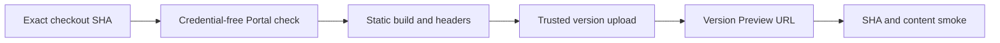

# Architecture Portal 部署、验证与回滚

## Cloudflare 固定地址配置（2026-09-08）

用户已选定 `https://docs.lmdj.workers.dev/`。独立配置位于
`apps/docs-site/deploy/wrangler.json`；配置存在不表示已经发布。
`lmdj` Worker 继续保留既有试点，`docs` 通过 Git 构建部署。

`.github/workflows/deploy-cloudflare-portal.yml` 由 `main` push 触发，在现有
`ci-general` 自托管 runner 构建和验证精确 Git SHA。生产并发组串行化发布，排队的
中间 push 可以被 GitHub 合并为最新待处理工作，不取消正在发布的事务。
部署凭据保存在只接受受保护分支的 `portal-cloudflare` Environment；构建与 CLI
安装步骤不注入 token，部署步骤才使用它。

`scripts/cloudflare-portal-deploy.py` 先上传版本 Preview 并验证同一 Git SHA，再发布
同一个 version ID；初始 Worker 在 Preview 通过前关闭主路由。生产 HTTP smoke
有界重试等待路由传播，失败后核对活动版本并恢复 exact prior 或关闭首次部署入口。
操作观察保留为 workflow artifact。自有域名、旧 Netlify 地址与 `lmdj` 试点保持原状。
正常发布由 Git 触发；本地目录不能作为手动生产上传输入。

## 当前 CI 和部署证据

门户生产由上述 Cloudflare workflow 管理。构建不注入部署 token，执行锁定 npm 安装与完整 Portal check；发布脚本在版本 Preview 与生产 smoke 中验证同一 Git SHA。普通 Preview 不创建永久快照，Product Build 的冻结和来源验证要求保持不变。

记录 Git SHA、Cloudflare version/deployment ID、Preview URL、生产 URL、HTTP/MIME、Product Build/revision、正式快照路由、workflow run 和验证时间。版本上传成功不等于生产验证通过。发布失败时保留失败观察，按发布脚本恢复 exact prior 版本分配和路由状态；不移动 tag 或改写快照。

## Netlify 退役

用户已停用 Netlify。仓库移除旧构建配置、Netlify CLI 依赖和 deployment-status smoke workflow。Cloudflare 的构建、Preview 与生产 smoke 继续执行。

GitHub 上的 netlify/lmdj/deploy-preview、Header rules、Redirect rules 和 Pages changed 由外部 Netlify 集成生成。站点管理员需在 Netlify 断开本仓库的 Git 集成，或在 GitHub 的 Netlify App 授权中移除本仓库。不要卸载其他仓库仍使用的集成，不删除历史 deploy 或 CheckRun。仓库变更不能代替这一步；用后续新 PR 检查清单确认不再出现旧检查。

#867 的旧失败证据保留。目标是退役旧服务，不是恢复 Netlify Preview；Cloudflare 逐 PR Preview 是否启用须另以真实 PR URL、SHA 和线上内容确认。

## Cloudflare Portal pilot (#873)

The observed LMDJ account is `0b62b8881c07f48f7935f5380a1f55db`; the user-created
Worker is `lmdj`, with workers.dev subdomain `lmdj`. The observed Worker has
its main workers.dev route disabled; the pilot keeps that route disabled and
enables version Preview URLs only. These are cloud resource
identities, not Product identities. This historical pilot is separate from the current fixed Cloudflare production workflow.

The root `wrangler.json` selects the complete static build with generated 404
handling. `.node-version` pins Node 22.16.0; npm is explicitly 10.9.3. From the
repository root, run the following without a deployment credential:

```bash
npx --yes npm@10.9.3 --prefix apps/docs-site ci
npx --yes npm@10.9.3 --prefix apps/docs-site run check
```

For Workers Builds, keep root directory `/` and explicitly set those two commands
joined with `&&` as the build command. Set `SKIP_DEPENDENCY_INSTALL=1` if using
that explicit install. Workers Builds does not honor Wrangler custom builds in
all contexts; the root config's custom command supports direct CLI usage and is
not a replacement for the dashboard build command.

Use pinned `npx --yes wrangler@4.129.1 versions upload` for the pilot upload,
including when the dashboard labels the branch production. Do not use the default
`wrangler deploy` to promote this pilot. Before activating broader branch builds,
prove the build token is isolated from production mutation; a command choice alone
is not a security boundary. A trusted publisher must never execute PR build
scripts with its deployment credential. The fixed Cloudflare production path and Creator/Runtime release paths remain
separate from this historical pilot configuration.



A trusted operator may upload the verified static output using a temporary
upload config derived from the root config with `build` omitted and the assets
path made absolute. This prevents executing build commands with the upload token. Record the prior active
version before upload and re-read deployments afterwards to prove it did not
change. Keep local credentials outside the repository. Verify the version URL's
current SHA, Product Build, snapshot routes, HTML MIME, security headers and
unknown-path 404 using the existing smoke entry point plus HTTP assertions.
A version URL is not a permanent snapshot. Do not report a local upload as a
Git-triggered PR deployment or a successful GitHub status check.

Sources:
- https://developers.cloudflare.com/workers/ci-cd/builds/build-image/
- https://developers.cloudflare.com/workers/ci-cd/builds/configuration/
- https://developers.cloudflare.com/workers/wrangler/custom-builds/


## First-version Preview readiness

The trusted PR publisher waits up to 60 seconds for `index.html` to match the
verified artifact byte length and SHA-256 before starting full route/header/file
smoke. Each readiness request is bounded at 10 seconds and the loop remains
inside the existing 600-second smoke process limit. A successful upload receipt
alone does not establish HTTP readiness. Missing, late or wrong entry bytes fail
closed; inspect the retained exact version and artifact before retrying. All
final route, snapshot, header and artifact checks still run.

Pilot #963 first version uploaded successfully but immediate HTTP returned 404;
the publisher correctly wrote failure on the exact head (run 34225091683).
Subsequent same-version HTTP availability is separate reconciliation evidence,
not a rewrite of that failed run. #965 tracks this readiness correction.
