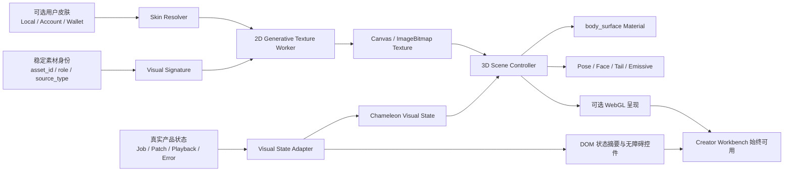

# KUMALEON 视觉、3D、生成艺术与 Web3 技术研究

> 研究对象：[kumaleon.com](https://kumaleon.com/)
>
> 研究日期：2026-07-26
>
> 用途：为 LMDJ 的 3D AI 伙伴、生成式视觉、响应式工作台与可选数字藏品能力提供参考
>
> 状态：研究与设计建议，不代表 LMDJ 已批准或已实现本文提出的 3D、皮肤、钱包或 NFT 能力

## 0. 结论先行

KUMALEON 的价值不在于“一个会换贴图的 3D 熊”，而在于它把五个层次绑定成了同一个产品语言：

1. **固定、可识别的角色轮廓**：角色始终是同一只 KUMALEON，变化发生在表面、背景和组合关系上。
2. **规则驱动的生成艺术**：Okazz 的图形不是 AI 出图，而是几何、网格、调色板、随机种子与时间函数组成的视觉语法。
3. **实时 3D 材质系统**：网页把生成艺术的 Canvas 复制成 Three.js 的动态纹理，再赋给角色的 `body` 材质。
4. **日系可爱新粗野主义的展览式网页编排**：粗黑边框、米白纸面、巨型字、网格、漂浮符号和强烈留白让页面像互动海报，而不是常规 SaaS；完整风格命名与边界见 3.2。
5. **可组合的链上所有权**：皮肤不仅是 UI 主题；KUMALEON 把基础 3D NFT 与子级生成艺术 NFT 组合，所有权、拆分和展示由合约与元数据共同承担。

对 LMDJ 最值得保留的不是 KUMALEON 的熊、字体或具体皮肤，而是这个结构：

```text
固定品牌角色
  + 可验证的 AI / 音乐处理状态
  + 确定性生成视觉
  + 实时 3D 表面
  + 可选的用户皮肤与收藏层
```

LMDJ 不应直接复制 KUMALEON 的 Web3 路径。当前更合理的优先级是：

- 先把变色龙做成**真实处理状态的视觉反馈器**；
- 再做本地、无需钱包的皮肤系统；
- 最后才评估收藏品、钱包和 NFT，而且绝不能把核心音乐工作流锁在钱包之后。

## 1. 研究方法与证据等级

本报告综合了四类证据：

| 等级 | 证据 | 本报告中的用法 |
|---|---|---|
| A | 官网实时页面、DOM、网络响应、公开前端包和 GLB | 判断实际视觉、响应式行为、前端框架、Three.js 管线和模型结构 |
| A | [KUMALEON 官方文档](https://docs.kumaleon.com/)与公开合约入口 | 判断项目机制、授权、NFT 分配、动态 NFT 和编码挑战 |
| B | 公开索引与第三方 OpenProcessing 数据快照 | 统计 Okazz 近期作品的代码习惯；不视为实时完整档案 |
| C | 基于实现证据的工程推断 | 转译为 LMDJ 的架构、性能预算和路线建议 |

### 1.1 已知限制

- [Okazz 的 OpenProcessing 主页](https://openprocessing.org/user/128718)在研究时触发 Cloudflare 连接验证，因此没有绕过验证或批量抓取实时个人主页。
- Okazz 的量化统计来自公开的 [OpenProcessing sketches 数据快照](https://huggingface.co/datasets/t14n/openprocessing-sketches)，是历史样本，不代表作者当前主页的完整状态。
- 官网前端包能证明所用运行时代码和公开客户端逻辑，但不能证明私有后台、部署流水线或未公开合约的全部结构。
- 本文提到的 LMDJ 方案均为建议。现有项目状态以 [工作 PRD](../prd/working-prd.md)和已确认的设计规格为准。

## 2. 产品与品牌定位

KUMALEON 的官方叙事是“生成艺术与收藏品之间的桥梁”。它不是把生成图案放在商品 mockup 上，而是让角色成为生成艺术的承载体：

- 3D 角色负责身份与亲和力；
- 生成艺术负责差异性与艺术家署名；
- 皮肤组合负责收藏与表达；
- 网页负责让组合过程可以被感知、预览和传播；
- 链上资产负责所有权与拆装关系。

这种架构特别适合 LMDJ，因为音乐 AI 也有一个类似问题：内部过程抽象、耗时、难以感知。变色龙可以把“系统正在做什么、对声音理解到了哪里、结果是否需要复核”转成颜色、纹理和运动，而不是成为独立于产品的吉祥物动画。

## 3. 视觉设计语言拆解

### 3.1 基础视觉语法

官网的核心视觉元素如下：

| 视觉元素 | 实际表现 | 产生的感受 |
|---|---|---|
| 纸面底色 | 接近 `#F8F6F0` 的暖米白 | 印刷品、画册、艺术书，而非科技蓝黑 SaaS |
| 墨色 | 高对比纯黑边框、分隔线与正文 | 把自由生成图形约束在严谨版式中 |
| 外框 | 页面四周粗黑描边 | 页面像一张被框住的海报或展签 |
| 网格 | Header、正文和功能区使用表格化分割 | 形成理性秩序，承接随机图案 |
| 巨型字 | 超大描边字、超出视口、被角色遮挡 | 构建空间层级，而不仅是标题 |
| 小字 | 边角的低字号说明、编号和标签 | 模仿展览说明、目录与作品卡 |
| 高饱和图案 | 颜色块、条纹、几何纹理 | 提供变化和收藏差异 |
| 漂浮符号 | 小型几何图标围绕角色排列 | 同时承担导航提示与可交互皮肤入口 |

最重要的设计对比是：

```text
严格版式（网格、边框、字号秩序）
                 ×
受控随机（颜色、图形、排列、动画）
```

没有严格版式，生成艺术会显得像屏保；没有受控随机，页面又会变成普通的国际主义平面设计。KUMALEON 的辨识度来自两者同时存在。

### 3.2 风格命名与边界

如果需要用一句话描述 KUMALEON 官网当前的整体风格，最贴切的工作名称是：

> **日系 Kawaii Neo-Brutalism（可爱新粗野主义）× Generative Art（生成艺术）的 WebGL 角色展厅。**

其中，“Generative Art”是 KUMALEON 官网和官方文档使用的项目自述；其余名称是基于实时页面构图、排版、角色与交互做出的设计分析，不应写成 KUMALEON 官方声明。它不是单一流派，而是以下语言的组合：

| 层次 | 风格归类 | 对应页面特征 |
|---|---|---|
| UI 与版式骨架 | Playful / Digital Neo-Brutalism；Swiss Grid | 粗黑外框、硬分隔线、表格化导航、大字号与小型系统标签并置 |
| 角色与品牌亲和力 | Japanese Kawaii；Art Toy / Character IP | 圆润熊形、低威胁面部、潮玩式中心角色与可换皮肤 |
| 动态内容 | Generative Art；Algorithmic Pattern | 由规则、随机种子、调色板和时间函数驱动的持续变化纹理 |
| 色彩与装饰 | Y2K；Neo-Memphis；Bauhaus-inspired Geometry | 高饱和色块、圆方线条、漂浮符号和基础几何组合 |
| 网页呈现方式 | WebGL Character Showcase；Interactive Exhibition Microsite | 全屏 3D 角色、视差、换肤与海报式信息层共同构成在线展厅 |

因此，把它简称为“Y2K 风格”会遗漏最关键的结构。Y2K 主要解释高饱和几何装饰；真正建立辨识度的是：

```text
新粗野主义 / 瑞士网格式的理性外框
  + 日系可爱潮玩角色
  + 实时生成艺术表面
  + WebGL 互动展览式呈现
```

用于设计检索时，可组合使用：

- `kawaii neo-brutalism`
- `playful brutalist web design`
- `generative art character`
- `WebGL character showcase`
- `Swiss grid interactive poster`
- `Y2K geometric art toy`

用于 LMDJ 设计 Brief 时，可以写成：

> **日系可爱新粗野主义的生成艺术角色工作台：以瑞士网格和粗黑边界维持工具秩序，以原创 AI 宠物、音乐驱动纹理和展览式舞台提供情绪与品牌识别。**

这一定义只描述可借鉴的视觉关系，不授权复制 KUMALEON 的角色轮廓、Logo、字体、原始皮肤或品牌资产。

### 3.3 首页构图

桌面首页是固定视口的互动海报：

- 角色处于视觉中心并遮挡巨型 `KUMALEON` 字样；
- 顶部是表格状导航，左侧品牌、中央滚动信息、右侧链接；
- 漂浮图标沿角色外圈分布；
- 说明文字和换肤提示压在底部边角；
- 3D Canvas 覆盖主展示区，不依靠普通 `` 拼出主体。

构图使用了三层深度：

1. **远景**：米白背景、巨型字与生成艺术底纹；
2. **中景**：3D KUMALEON；
3. **近景**：图标、文字说明、边框和交互控件。

巨型字被遮挡仍然可读，是因为品牌词较短且重复出现。LMDJ 如果采用类似处理，应限制背景大字长度，并避免让关键操作标签承担这种装饰性遮挡。

### 3.4 内页设计

不同内页并不套用同一张普通内容模板：

- **Theory**：黑色长页面、白色网格、巨型文本和生成艺术图像，像策展叙事。
- **About**：米白长页面、超大角色背面和超大描边宣言。
- **Artist**：`OKAZZ` 巨型字母内部填入不同生成图案，形成文字蒙版式作品墙。
- **Hatch**：灰色舞台、单颗花纹蛋、极少控件，聚焦连接钱包和揭示。
- **Playground**：白色基础角色、钱包入口和组合功能，是工具页而不是叙事页。

这说明它遵循的是“同一套视觉语法，不同页面不同舞台”，而不是“所有页面共享相同 Card 组件”。

对 LMDJ 的启示是：Creator Workbench 需要稳定、可操作的框架；上传等待、空状态、处理阶段和导出完成页可以拥有更具叙事性的 3D 舞台。不要把全屏海报式构图硬塞进每一个编辑状态。

### 3.5 字体与排版

实时页面显示：

- 拉丁文字主体使用 Proxima Nova，来自 Adobe Typekit；
- 日文内容另外加载 Noto Serif JP；
- 字号跨度极大：装饰性巨型字与约 14px 的说明文字并置；
- 大写、描边字和窄行距用于品牌层；
- 表格标签和编号用于系统层。

潜在问题是小字号与低信息密度：在视觉展览中成立，在生产工具中会降低长时间可用性。LMDJ 可以保留巨型品牌字和编号系统，但正文、状态和错误信息必须遵守可读字号与对比度。

## 4. 动效与交互语言

### 4.1 动效不是单一动画，而是四种节奏

| 层级 | 动效 | 目的 |
|---|---|---|
| 入场 | 全屏彩色百分比 Loader、Logo 变化 | 建立仪式感并掩盖资源加载 |
| 环境 | 图标漂浮、角色轻微运动、背景纹理变化 | 让页面持续“活着” |
| 指针 | 鼠标移动影响镜头视差；触摸拖动提供对应反馈 | 建立空间感 |
| 决策 | 点击图标切换角色皮肤；钱包与组合操作改变资产状态 | 让视觉变化成为明确动作结果 |

### 4.2 皮肤切换

首页会自动轮换生成艺术，也允许用户点选周围图标。切换的核心不是更换 GLB，而是：

1. 获取生成艺术页面或运行时 Canvas；
2. 把源 Canvas 复制到受控的 2D Canvas；
3. 创建 `THREE.CanvasTexture`；
4. 设置纹理方向、重复和过滤方式；
5. 将纹理赋给 GLB 的 `body` 材质；
6. 标记材质需要更新，同时协调背景和周边 UI。

这使角色的轮廓、眼睛、嘴和腮红不变，只替换身体表面。身份稳定，表达变化。

### 4.3 命中测试

官网对周边生成艺术图标使用了 GPU 颜色拾取：

- 把目标场景渲染到 1×1 的离屏 RenderTarget；
- 每个可点击对象用唯一颜色编码；
- 读取该像素的 RGBA；
- 解码出指向的生成艺术编号。

这对大量 3D 图标很有效，但会带来 GPU 回读成本。LMDJ 若只有少量角色热点，优先使用 DOM 覆盖控件或 Three.js Raycaster；只有对象数量和视觉布局确实需要时，才采用颜色拾取。

### 4.4 滚动与页面节奏

首页以固定视口为主，内页则采用长页面和自定义节奏。固定舞台适合展示，但不适合复杂操作。LMDJ 应将：

- 固定 3D 舞台用于空状态、处理中、完成庆祝；
- 原生或可预期滚动用于 Creator Workbench、Inspector 和 Export Checklist；
- 角色缩成伴随式反馈器，而不是永久占据核心操作面积。

## 5. 响应式设计

### 5.1 不是等比缩小，而是重新编排

在约 390×844 的移动视口下，官网会：

- 保留粗黑外框、米白背景、巨型文字和 3D 角色；
- 将桌面导航替换成可访问名称明确的汉堡按钮；
- 打开全屏菜单，链接变成大面积黑色行；
- 重排底部说明、CTA 与换肤提示；
- 调整 3D 相机、角色比例和漂浮图标半径；
- 继续运行同一实时 Canvas，而不是退化为静态截图。

这证明响应式逻辑同时存在于 DOM/CSS 和 3D 场景：

```text
视口变化
  ├─ DOM 布局模式
  ├─ 相机参数
  ├─ 模型缩放与位置
  ├─ 图标分布半径
  └─ 交互方式：pointer → touch
```

### 5.2 可借鉴的部分

- 移动端保留核心角色，不牺牲品牌识别；
- 导航重构为适合触控的全屏层，而不是挤压桌面链接；
- 文本、角色与 CTA 重新排位；
- 3D 参数跟随布局模式，而非只改 Canvas 宽高。

### 5.3 不应照搬的部分

- 首屏长时间 Loader 在弱网移动端会推迟可用内容；
- 固定视口容易与浏览器工具栏、横屏和低高度窗口冲突；
- 核心 Canvas 缺少可读替代和明确 ARIA 描述；
- 小字、持续运动和装饰性巨大文字不适合作为生产工具的默认状态。

## 6. 底层前端技术

### 6.1 可确认的技术栈

| 层 | 证据结论 |
|---|---|
| Web 框架 | Next.js Pages Router + React |
| 样式 | Emotion CSS-in-JS |
| 3D | 原生 Three.js 运行时 |
| 模型 | glTF 2.0 / GLB，Blender 导出 |
| 动效 | GSAP 风格 Tween 运行时；前端包中也包含 Framer Motion 基础设施 |
| 字体 | Adobe Typekit + Google Fonts |
| 钱包与链 | ethers.js 5.x、MetaMask/浏览器钱包、WalletConnect 相关运行时 |
| NFT 数据 | Alchemy NFT API 客户端逻辑 |
| 部署 | Cloudflare 前置，Vercel 源站响应头 |

官网不是 Webflow 视频背景，也不是预渲染 3D 序列。页面在浏览器内创建 `WebGLRenderer`、相机、RenderTarget 和动画循环，并加载真实 GLB。

### 6.2 公共资源体量

研究时记录到的主要原始文件大小：

| 资源 | 原始大小 | 说明 |
|---|---:|---|
| 主 `_app` JavaScript | 1,742,868 B | 包含大量共享运行时，不等于压缩传输大小 |
| 首页页面 JavaScript | 8,370 B | 页面入口较小，大量能力在共享包 |
| GLB | 496,864 B | 约 485.2 KiB |
| 生成艺术网格图集 | 668,919 B | 静态图集 |
| 生成艺术图标图集 | 84,330 B | 静态图集 |
| 顶部文字图集 | 16,193 B | 静态图集 |
| 顶部提示图集 | 2,753 B | 静态图集 |

这些是未压缩原始资源，不可直接当作实际首屏网络传输量。它们仍解释了官网为什么需要强 Loader 和预加载策略。

### 6.3 渲染器策略

可见实现包含：

- `WebGLRenderer`；
- 透视与正交相机；
- `requestAnimationFrame` 连续循环；
- `setPixelRatio(window.devicePixelRatio)`；
- 依据像素总量动态降低 DPR；
- 透明 Canvas；
- 首页启用 `preserveDrawingBuffer: true`；
- 离屏 RenderTarget 和像素读取。

像素比保护值得借鉴。基础阈值约为 500 万像素，首页按浏览器和场景调整到约 300 万或 750 万像素，超过阈值就降低 DPR，且不低于 1。

`preserveDrawingBuffer` 则不应成为 LMDJ 默认值。它会限制浏览器复用缓冲区，通常只在截图、像素读取或导出确有需要时短时启用。

### 6.4 资源组织

官网把大量 UI 图形组织成图集：

- `genArtIcons.png`
- `genArtGrids.jpg`
- `topTexts.png`
- `topAttentionIcons.png`
- 多尺寸 pattern 背景

图集减少请求和对象数量，但会牺牲独立资源的响应式选择与缓存粒度。LMDJ 可以对大量小图标使用 SVG sprite 或纹理图集；对皮肤大图则应采用独立、可缓存且能按设备选分辨率的资产。

## 7. 3D 模型与材质结构

### 7.1 GLB 实际结构

公开 GLB 的关键信息：

- glTF 2.0；
- 由 `Khronos glTF Blender I/O v1.6.16` 导出；
- 1 个场景；
- 主要模型节点为 `kumaleon_tail01`；
- 主要网格为 `Mesh.004`；
- 材质分为眼睛、耳朵、嘴、身体、轮廓线和腮红等；
- 眼睛、嘴和腮红使用嵌入 PNG；
- `body` 是动态皮肤的主要表面；
- 没有 glTF animation；
- 没有 skeleton/skin；
- 没有扩展声明。

因此，官网角色的动态主要来自场景节点、相机和 Tween，而不是骨骼动画。若 LMDJ 希望表达聆听、思考、失败、完成等状态，不能假设“照用类似 GLB 就自然具有表情系统”。

### 7.2 LMDJ 模型建议

LMDJ 的 3D 变色龙建议采用明确命名的材质与轻量动画契约：

| 结构 | 建议 |
|---|---|
| `body_surface` | 生成纹理与用户皮肤的唯一主表面 |
| `body_line` | 固定品牌轮廓，不被皮肤破坏 |
| `eye_left/right` | 可由骨骼、Morph Target 或独立节点控制 |
| `mouth` | 少量状态 Morph 或贴图切换 |
| `cheek/accent` | 处理强度、警告或完成状态 |
| `tail` | 低成本循环与状态速度反馈 |
| `state_emissive` | 可选，用于聆听/处理中脉冲，移动端可关闭 |

动画保持少而明确：

- `idle`
- `listen`
- `process`
- `review`
- `success`
- `error`

每个动画都要能在 `prefers-reduced-motion` 下被静态姿态替代。避免为了“更像游戏角色”引入复杂骨骼、布料或粒子系统。

## 8. Okazz / OpenProcessing 的生成艺术语言

### 8.1 官方作品谱系

[KUMALEON Gen Art Overview](https://docs.kumaleon.com/gen-art-overview)列出的系列包括 BUBBLE、WAVE、PALETTE、FLOW FIELD、HAZE、FLOWER、OVERLAPPING、INTERSECTION、CIRCLE CLOUD、CIRCLE ORBIT、GEOMETRIC、MOZAIC、TRIANGLE、CYLINDER、MESH、GLASS、JUMBLE、TRANSFORMATION、PATTERN、STREAM 等。

这些名称本身就揭示了方法：围绕少量图元或空间规则做系统性变体，而不是每张作品换一套完全无关的风格。

### 8.2 近期公开样本统计

第三方快照中，Okazz 最近 100 个可检索样本呈现：

| 特征 | 数量 |
|---|---:|
| p5.js | 97 |
| HTML | 3 |
| 使用 `random()` | 95 |
| 明确调色板/颜色数组 | 94 |
| 网格或 cell 结构 | 73 |
| 有持续 `draw()` 动画 | 92 |
| easing / lerp | 61 |
| 使用 class 封装图元 | 68 |
| 使用 `noise()` | 6 |
| 使用 WEBGL | 0 |
| 鼠标/键盘处理器 | 0 |

统计来自公开快照，不等于实时完整主页。它仍足以说明三个稳定倾向：

1. **作品主要是 2D p5.js，而不是 3D WebGL。**
2. **随机性被网格、调色板、图元类别和缓动约束。**
3. **动画多为自主循环，而不是依赖用户操作。**

### 8.3 典型代码语法

公开样本常见模式：

- 方形画布，例如 900×900；
- 先选有限调色板；
- 建立规则网格或递归分区；
- 用圆、方、线、弧、条纹构造单元；
- 为单元建立 class；
- 每个单元保存自己的时间、相位、旋转和目标值；
- 使用 `lerp` 或 easing 在状态间过渡；
- 允许随机，但限制随机的可选集合；
- 使用 HSB、Blend Mode 或叠加形成层次。

这可以概括为：

```text
视觉结果 = 固定语法 × 有限参数 × 可复现种子 × 时间函数
```

而不是：

```text
视觉结果 = 不受约束的随机绘制
```

### 8.4 对 LMDJ 的生成视觉建议

每个 Pad 和变色龙皮肤都应来自同一套视觉语法，但参数不同：

- 图元：圆、方、线、条纹、波形段；
- 结构：4×4、8×2、环形、流场；
- 色彩：由 `role`、处理阶段和音频特征决定；
- 种子：来自稳定的 `asset_id` 或其他公开稳定标识；
- 动态：由 BPM、播放状态和置信度控制；
- 限制：必须保持品牌轮廓、可读性与无障碍对比度。

现有 [Stage 1 Creator Workspace UI 设计](../design/2026-07-24-stage1-creator-workspace-ui-design.md)已经定义了确定性 Pad Signature，和这一方法高度一致。3D 角色应复用同一个 `VisualSignature`，避免 Pad 是一套视觉算法、角色又是另一套随机皮肤。

## 9. Web3 与 NFT 架构

### 9.1 官方资产模型

根据 [官方授权说明](https://docs.kumaleon.com/license)，每个 KUMALEON 组合包含：

1. 基础 3D KUMALEON；
2. 生成艺术 NFT。

生成艺术作品自己的作者授权优先于 KUMALEON 的通用授权。这一点非常关键：组合式 NFT 不代表所有子资产自动继承同一商业权利。

公开主合约地址为 [`0x8270FC3B2d23DE703b265b2ABE008883954fea8E`](https://etherscan.io/address/0x8270fc3b2d23de703b265b2abe008883954fea8e)，位于 Ethereum 主网。

[官方分配文档](https://docs.kumaleon.com/nft-allocation)记录总量 3,000：

| 分配 | 数量 | 比例 |
|---|---:|---:|
| Allowlist | 2,550 | 85% |
| Charity | 33 | 1.1% |
| Team | 207 | 6.9% |
| Community | 210 | 7% |

### 9.2 Playground 的组合机制

公开前端逻辑显示：

- 基础 KUMALEON 使用 ERC-998 可组合 NFT 结构；
- 生成艺术子项是 ERC-721；
- 组合时会处理 child token 的合约地址和 token ID；
- 合约暴露 `childTokenDetail`、`safeTransferChild`、`ReceivedChild`、`TransferChild` 等接口；
- “Molt” 可把基础 KUMALEON 与生成艺术拆分回独立资产；
- Playground 读取持有者 NFT 和元数据，并生成组合后的动画 URL；
- 组合展示依赖基础 Token、子 Token、艺术家/作品类型与元数据参数。

这和普通“登录后切换主题色”有本质区别：

```text
钱包所有权
  → 读取可用资产
  → 选择父 NFT 与子 NFT
  → 合约转移 / 组合
  → 元数据与动画展示更新
  → 可再次拆分
```

### 9.3 动态 NFT

[Bright Moments 动态 NFT 文档](https://docs.kumaleon.com/bright-moments-thank-you-kumaleon)描述了持有特定生成艺术与 KUMALEON 时，可以改变角色并更新 NFT 自身的玩法。

动态 NFT 的吸引力来自“持有关系改变作品状态”，但工程与运营成本也更高：

- 链上交易和 Gas；
- 元数据更新一致性；
- 索引器与市场缓存延迟；
- 动画服务长期可用性；
- 子作品授权追踪；
- 合约审计；
- 钱包签名与钓鱼风险；
- 主网费用和用户门槛。

### 9.4 LMDJ 不应首先复制 ERC-998

LMDJ 的推荐顺序：

1. **本地皮肤**：无需登录或钱包，随项目和设备设置使用。
2. **账户权益**：常规账户系统记录已获得皮肤，可跨设备同步。
3. **钱包只读验证**：可选连接钱包，验证收藏品并解锁外观。
4. **链上发行**：只有在版权、社区和长期元数据托管方案成熟后再做。
5. **可组合 NFT**：确认用户真的需要转移、拆装和二级市场后再评估。

核心音乐创建、上传、分轨、演奏和导出不能依赖钱包。NFT 只能改变外观、纪念章或可选社交表达，不能成为音频结果的所有权证据，也不能让未持币用户得到残缺的 Creator 体验。

## 10. 授权与品牌边界

### 10.1 可以学习的

- 生成艺术作为实时材质；
- 固定角色与可变表面的双层身份；
- 米白、黑线、网格、巨型字和高饱和图形的对比；
- p5.js 的规则化图元和确定性随机；
- 响应式 3D 相机与布局共同变化；
- 皮肤资产的作者和许可随组合传播。

### 10.2 不应复制的

- KUMALEON 角色轮廓、面部、熊形和具体 GLB；
- 官方生成艺术作品、图集或艺术家皮肤；
- KUMALEON 名称、Logo、文案和品牌识别；
- 未核实授权的 OpenProcessing 代码；
- 原站版式的逐像素复刻。

[官方 Coding Challenge](https://docs.kumaleon.com/coding-challenge)允许在特定挑战语境中使用模型并提供 p5.js 示例，但这不等于 LMDJ 可把 KUMALEON 品牌资产用于商业产品。LMDJ 应保留自己已归档的变色龙线稿方向，并建立原创 3D 模型、动画、图元库和皮肤许可清单。

## 11. 可访问性、性能与工程风险

### 11.1 官网值得改进的可访问性点

实时页面中观察到：

- `<html>` 未设置有效 `lang`；
- 主 Canvas 没有可读 ARIA 描述；
- ticker 和标题存在重复语义；
- 持续 WebGL 动画是核心体验；
- 前端包包含 Framer Motion 的 reduced-motion 基础设施，但未发现官网核心 WebGL 明确尊重系统的站点级降动效策略；
- 小字和装饰层会增加低视力与认知负担。

LMDJ 必须提供：

- Canvas 的文字替代和状态摘要；
- 所有操作使用真实 DOM button；
- 颜色之外的状态图标与文字；
- `prefers-reduced-motion`；
- 静态角色姿态；
- 键盘、触控与 MIDI 不互相排斥；
- Canvas 失效时 Creator Core 仍可工作。

### 11.2 官网的性能压力

主要压力包括：

- 大型共享 JavaScript；
- 3D 模型和图集预加载；
- 连续 RAF；
- 高 DPR；
- `preserveDrawingBuffer`；
- GPU 像素回读；
- 多层生成纹理和环境动画。

官网已经通过 DPR 像素阈值保护部分设备，但 LMDJ 作为音频工作台还要与 Web Audio、波形、MIDI 和上传轮询竞争主线程与电量，必须更保守。

### 11.3 LMDJ 建议预算

以下是首轮原型的工程目标，不是当前已实现指标：

| 项目 | 建议预算 |
|---|---|
| 初始 2D Creator Shell | 不等待 3D 即可操作 |
| 3D 代码 | 路由/功能级懒加载；gzip 后目标 ≤250 KiB |
| GLB | 首版目标 ≤500 KiB，硬上限 1 MiB |
| 纹理 | 首屏每张 ≤512²；桌面按需升级到 1024² |
| DPR | 默认上限 1.5；低端或像素超阈值降到 1 |
| 空闲帧率 | 15–30 FPS 或按需渲染 |
| 交互帧率 | 目标 60 FPS，最低稳定 30 FPS |
| 后台标签页 | `document.hidden` 时暂停动画 |
| 处理状态 | 只有真实 Job 状态变化才驱动强动画 |
| 截图缓冲 | 默认不启用 `preserveDrawingBuffer` |

## 12. LMDJ 当前状态映射

### 12.1 已落地

- 16-pad Creator Workbench；
- Pattern / 播放 / 静音 / 键盘 / Web MIDI；
- Creator Export；
- Web 只读取 `patch.json`；
- 上传、队列、状态轮询和刷新恢复；
- `queued → separating → extracting → patchifying → completed|failed` 等真实处理阶段；
- 以米白、黑线、网格、巨型字、高饱和角色色和确定性 Pad Signature 为方向的 Stage 1 视觉规格；
- 变色龙线稿概念已归档为视觉参考。

### 12.2 部分接入或仅有设计依据

- 现有 UI 规格已借鉴 KUMALEON 的设计语言，但不是完整 3D 角色系统；
- Pad Signature 已有设计与实现基础，但尚未作为 3D 皮肤的统一输入；
- 当前真实 Job 状态可供角色映射，但尚未形成角色状态机；
- 变色龙作为 AI 伙伴/宠物的角色概念已讨论，模型、表情、运动和声音状态合同尚未批准。

### 12.3 尚未实现

- LMDJ 自有 3D 变色龙 GLB；
- Canvas 生成纹理到 3D 材质的管线；
- 角色表情、Morph、骨骼动画和降动效姿态；
- 用户皮肤库、许可 Manifest 与跨设备同步；
- 钱包连接；
- NFT 读取、铸造、组合或交易；
- 链上元数据与长期动画托管；
- 对上述能力的产品、法律、安全与商业批准。

## 13. 推荐的 LMDJ 视觉架构



### 13.1 合同边界

不要为了 3D 或 NFT 往 `lmdj.patch.v1` 塞展示平台专属字段。推荐新增独立的表现层对象：

```ts
type ChameleonVisualState = {
  phase:
    | "idle"
    | "uploading"
    | "separating"
    | "extracting"
    | "patchifying"
    | "review"
    | "ready"
    | "playing"
    | "error";
  intensity: number;       // 0..1，来自真实进度或音频能量
  confidence?: number;     // 只有真实指标存在时才设置
  roleFocus?: PadRole;
  reducedMotion: boolean;
};

type VisualSignature = {
  seed: string;
  paletteId: string;
  grammarId: string;
  density: number;
  motionRate: number;
};

type SkinEntitlement = {
  skinId: string;
  source: "builtin" | "account" | "wallet";
  licenseId: string;
  author?: string;
};
```

这些对象应从公开产品状态和稳定标识派生，不能读取 `materials.json`、`lanes.json` 或内部 Worker 文件。

### 13.2 技术选型

| 方案 | 优点 | 缺点 | 建议 |
|---|---|---|---|
| 原生 Three.js | 包装少、控制精确、最接近 KUMALEON | 与 React 状态同步需要自建生命周期 | 适合单一独立舞台 |
| React Three Fiber | 与现有 React/Vite 状态和组件树契合，生态成熟 | 增加抽象层和包体，需要团队规范 | **推荐用于 LMDJ 原型** |
| 预渲染视频/序列帧 | 兼容性好，视觉可控 | 无实时皮肤和状态组合，体积高 | 仅作为降级或营销素材 |
| CSS/SVG 伪 3D | 轻量、无障碍容易 | 难以承载真实材质和空间互动 | 作为加载前与低性能回退 |

生成纹理推荐运行在独立 Worker：

```text
seed + palette + grammar + state
  → OffscreenCanvas（可用时）
  → ImageBitmap
  → Three.js texture
  → body_surface
```

不支持 OffscreenCanvas 时，退回主线程低频更新的普通 Canvas。皮肤切换不应每帧重建 Texture；只有参数或状态离散变化时更新，连续动效优先交给轻量 Shader uniform。

## 14. AI 伙伴状态设计建议

这是建议矩阵，不是已批准的角色规范：

| 产品状态 | 颜色/纹理 | 动作 | 文本责任 |
|---|---|---|---|
| Idle | 米白底、低密度呼吸图案 | 尾巴慢摆、眨眼 | 引导上传或打开项目 |
| Uploading | 水平流动条纹 | 身体轻微前倾 | 显示文件名和真实上传进度 |
| Separating | 四组分离色带 | 四向脉冲 | 明确“正在分离 stems” |
| Extracting | 网格中图元被逐个识别 | 观察/聚焦姿态 | 明确“正在提取 materials” |
| Patchifying | 图元归位到 4×4 | 节奏性归档动作 | 明确“正在生成 16-pad Patch” |
| Review | 局部黄色/黑色警示纹 | 停止自动循环，指向问题 | 列出低质量或缺失 Pad |
| Ready | 稳定高饱和完整皮肤 | 短庆祝后回到静态 | 显示可演奏与 Export 状态 |
| Playing | 由 BPM 和当前 Pad 驱动 | 尾巴/眼睛跟拍，不夺取注意力 | Creator 操作仍是主角 |
| Error | 低饱和、断裂但不闪烁 | 收缩或静止 | 提供错误原因和恢复动作 |

三条硬规则：

1. 角色不能伪造进度；没有真实百分比时只展示阶段。
2. 错误不能只靠变红；必须有文字、图标和恢复按钮。
3. 进入 Workbench 后角色降低存在感，不能遮挡 Pattern、Pad、Inspector 或 Export。

## 15. 皮肤系统设计

### 15.1 三层皮肤

```text
Identity Layer
  固定轮廓、眼睛比例、尾巴、Logo 关系

State Layer
  系统根据真实 AI / 音乐阶段控制颜色、速度、密度和局部发光

Expression Layer
  用户选择的皮肤、艺术家合作或可选收藏品
```

优先级应为：

```text
可访问性与错误提示
  > 产品状态
  > 用户皮肤
  > 装饰性环境动画
```

例如用户选择了红色皮肤，错误状态不能再简单地“变红”；应使用断裂纹、警示轮廓、图标和文本。

### 15.2 皮肤 Manifest

每个皮肤需要正式 Manifest：

```json
{
  "skin_id": "builtin.flow-grid.01",
  "version": 1,
  "title": "Flow Grid 01",
  "author": "LMDJ",
  "license": "LMDJ-Product-Asset",
  "grammar": "flow-grid",
  "palette": ["#11110F", "#F6F2E8", "#FF5C35", "#2E6BFF"],
  "seed_policy": "asset-id",
  "motion": {
    "idle_fps": 20,
    "reduced_motion": "static"
  },
  "compatibility": {
    "model": "chameleon-v1",
    "material": "body_surface"
  }
}
```

艺术家合作皮肤必须额外记录：

- 作者；
- 来源链接；
- 商业使用范围；
- 是否允许修改；
- 是否允许用户导出或二次销售；
- 到期或撤销条款；
- 内容安全限制；
- 链上与链下元数据是否一致。

## 16. 响应式方案

应延续现有 Stage 1 断点，并同时定义 3D 场景策略：

| 视口 | Creator 布局 | 3D 角色 |
|---|---|---|
| ≥1280 | 8×2 Pad，完整 Inspector | 空状态/处理中可大；工作中缩到边角助手 |
| 960–1279 | Inspector 抽屉 | 降低模型比例，减少漂浮图元 |
| 600–959 | 4×4 Pad | 使用半身或头像构图，纹理 512² |
| 360–599 | 4×4 Pad、触控优先 | 默认静态或 30 FPS，隐藏装饰粒子 |
| 低性能/无 WebGL | 完整 DOM Creator | SVG 线稿 + 静态皮肤缩略图 |

移动端的核心不是“把桌面熊缩小”。需要为每个断点显式设置：

- 相机距离和 FOV；
- 模型锚点；
- 可见身体比例；
- 纹理分辨率；
- 最大 DPR；
- 是否渲染环境图标；
- DOM 控件位置；
- Touch 与 MIDI/键盘提示的优先级。

## 17. 分阶段路线

### Phase 0：角色与状态批准

交付：

- 角色职责；
- 状态矩阵；
- 线稿/轮廓；
- 色彩与生成语法；
- 3D 动作清单；
- 可访问性回退。

通过条件：产品、设计和工程共同确认“角色在每个真实状态下为什么出现、展示什么、何时退场”。

### Phase 1：无钱包的 3D 技术原型

交付：

- 原创低面数 GLB；
- `body_surface` 动态材质；
- 3 套内置确定性皮肤；
- Idle / Processing / Ready / Error；
- 桌面与 390×844 响应式；
- SVG/静态回退；
- 性能仪表。

不接真实用户账户，不接 NFT，不修改 `lmdj.patch.v1`。

### Phase 2：接入真实 LMDJ 状态

交付：

- Job 状态适配器；
- 上传、分轨、提取、Patchify、复核、失败、完成；
- BPM/Playing 驱动但不干扰音频主线程；
- Canvas 文本替代；
- reduced-motion；
- 真实浏览器与移动设备验证。

### Phase 3：皮肤产品化

交付：

- Skin Manifest；
- 内置与账户皮肤；
- 许可追踪；
- 皮肤预览和恢复默认；
- 跨设备同步；
- 内容安全与版本迁移。

### Phase 4：可选 Web3 研究

只有完成以下前置项后启动：

- 有明确用户需求，而不是为了“显得 Web3”；
- 法律确认音频、生成艺术和品牌授权；
- 钱包签名安全设计；
- 合约审计预算；
- 元数据与动画长期托管方案；
- 不持币用户的完整体验；
- 链上失败、索引延迟和网络切换的恢复流程。

首个实验应是只读钱包验证解锁外观，不是铸造、ERC-998 组合或主网交易。

## 18. 原型验收标准

### 18.1 视觉

- 不使用 KUMALEON 的角色、品牌资产和原始皮肤；
- 变色龙轮廓在纯色、复杂纹理和静态回退下都可识别；
- 皮肤不破坏眼睛、嘴、轮廓和状态提示；
- Creator 核心操作的视觉优先级始终高于角色。

### 18.2 功能

- 同一稳定 seed 在不同设备得到语义一致的皮肤；
- 状态只来自公开、真实产品状态；
- WebGL 关闭后上传、播放、Pad、MIDI 和导出仍可用；
- 皮肤切换不重建 AudioContext、不打断播放；
- 页面刷新后角色状态与恢复后的 Job 一致。

### 18.3 响应式

- 覆盖 1440×900、1280×720、1024×768、768×1024、390×844；
- 角色不遮挡 Pattern、Pad、Inspector、错误和恢复按钮；
- Touch target ≥44×44 CSS px；
- 低高度窗口可以滚动；
- 移动端 DPR、纹理和帧率符合预算。

### 18.4 性能

- 主 Creator Shell 不被 3D 下载阻塞；
- 3D 懒加载期间有品牌一致的静态占位；
- 后台标签页停止渲染；
- 音频播放时 3D 不造成可听爆音或明显主线程掉帧；
- 连续运行 15 分钟无持续显存、Texture 或事件监听器增长。

### 18.5 可访问性

- 所有核心功能均可键盘操作；
- Canvas 有实时文字摘要；
- 颜色不是唯一状态载体；
- reduced-motion 下没有持续漂浮、快速脉冲或镜头跟随；
- 状态更新使用合适的 live region，不重复朗读每一帧进度。

## 19. 风险登记

| 风险 | 影响 | 缓解 |
|---|---|---|
| 3D 抢走 Creator 注意力 | 工具可用性下降 | 只在关键阶段放大，工作中缩成助手 |
| 主线程与音频竞争 | 爆音、掉帧、MIDI 延迟 | 懒加载、Worker 生成纹理、DPR/帧率预算 |
| 皮肤破坏状态可读性 | 错误和进度不清 | 固定轮廓层、状态优先级、文本冗余 |
| 随机结果不可复现 | 项目身份漂移 | 稳定 seed、版本化 grammar |
| 生成艺术授权不清 | 商业和二次销售争议 | Skin Manifest、作者许可优先、法务审核 |
| 钱包成为进入门槛 | 普通用户流失 | 核心功能无钱包，Web3 只做可选权益 |
| 合约或签名漏洞 | 资产损失 | 最小权限、交易预览、审计、只读试点 |
| 元数据服务失效 | NFT 视觉消失 | 内容寻址存储、版本化渲染、静态备份 |
| 参考对象过度接近 | 品牌与版权风险 | 原创模型、原创图元语法、设计审查 |
| 角色状态伪造进度 | 用户信任下降 | 仅映射真实阶段，无数据时不显示百分比 |

## 20. 最终建议

### 应立即吸收

- “固定角色 + 可变表面”的身份模型；
- 米白纸面、黑色结构线、网格和高饱和生成色的对比；
- 生成视觉的确定性语法；
- DOM 与 3D 同时响应式重排；
- 真实处理状态驱动角色，而不是装饰性随机动画；
- 3D 可降级、Creator Core 永远独立可用。

### 应原型验证

- React Three Fiber + 原创 GLB；
- Worker/OffscreenCanvas 生成纹理；
- `VisualSignature` 同时驱动 Pad 与角色；
- Idle / Processing / Review / Ready / Error 六态；
- 桌面大舞台、工作中边角助手、移动端静态优先。

### 应推迟

- 钱包登录；
- NFT 铸造；
- ERC-998 组合；
- 动态 NFT；
- 链上音乐所有权；
- 任何把核心导出、音频结果或 Creator 能力与持币绑定的设计。

KUMALEON 最成熟的地方，是把技术藏在清晰的艺术概念后面。LMDJ 也应该如此：用户不需要知道 CanvasTexture、GLB、Worker 或钱包索引器；用户只需要看到变色龙正在听、理解、拆解、整理、复核，并最终把一首歌变成可以演奏的 16-pad Patch。

## 21. 主要来源

- [KUMALEON 官网](https://kumaleon.com/)
- [KUMALEON 官方文档](https://docs.kumaleon.com/)
- [Gen Art Overview](https://docs.kumaleon.com/gen-art-overview)
- [Coding Challenge](https://docs.kumaleon.com/coding-challenge)
- [License](https://docs.kumaleon.com/license)
- [NFT Allocation](https://docs.kumaleon.com/nft-allocation)
- [Bright Moments / Dynamic NFT](https://docs.kumaleon.com/bright-moments-thank-you-kumaleon)
- [KUMALEON Ethereum Contract](https://etherscan.io/address/0x8270fc3b2d23de703b265b2abe008883954fea8e)
- [OpenProcessing](https://openprocessing.org/)
- [Okazz OpenProcessing Profile](https://openprocessing.org/user/128718)
- [OpenProcessing sketches public dataset snapshot](https://huggingface.co/datasets/t14n/openprocessing-sketches)
- [Three.js Fundamentals](https://threejs.org/manual/en/fundamentals.html)
- [LMDJ Working PRD](../prd/working-prd.md)
- [LMDJ Stage 1 Creator Workspace UI Design](../design/2026-07-24-stage1-creator-workspace-ui-design.md)
