# Koala Sampler 业务流程、UI 布局与流程设计研究

> 研究日期：2026-07-28
>
> 研究范围：`SAMPLE`、`SEQUENCE`、`PERFORM` 三个核心界面，以及贯穿三者的 Resample、Record Song、Mixer、Export 流程
>
> 相关文档：[Koala Sampler 产品研究与 LMDJ 启示](./2026-07-28-koala-sampler-product-research.md)

## 0. 阅读方式与交付物

本报告同时提供两种图：

1. 文档内 Mermaid 图：适合在 GitHub/Codex 中直接阅读和维护。
2. Archify 交互式 HTML：支持深色/浅色主题，并可导出 PNG、JPEG、WebP 或 SVG。

### 0.1 交互式流程图

- [端到端创作闭环](./diagrams/koala-sampler-flows/00-overview.html)
- [SAMPLE 业务流程](./diagrams/koala-sampler-flows/01-sample.html)
- [SEQUENCE 业务流程](./diagrams/koala-sampler-flows/02-sequence.html)
- [PERFORM 业务流程](./diagrams/koala-sampler-flows/03-perform.html)

对应的 Archify JSON 源文件保存在同一目录，便于后续修改和重新生成。

### 0.2 图中层次

每个流程都按以下五层分析：

| 层次 | 关注内容 |
| --- | --- |
| 用户目标 | 用户此时想完成什么 |
| 用户操作 | 点击、按住、拖动、双击、捏合、切换等动作 |
| UI 反馈 | 选中态、录音态、波形、播放位置、效果状态等 |
| 系统结果 | 音频、参数、Note Event、Sequence、录音文件等 |
| 设计意图 | 为什么用这种步骤和布局，而不是传统 DAW 流程 |

### 0.3 研究边界

- 流程事实主要来自 [Koala 官方完整手册](https://manual.koalasampler.com/one-page/)、[Samurai](https://www.koalasampler.com/samurai/)、[Mixer](https://www.koalasampler.com/mixer/) 和 [Roland SP-404MKII Koala Controller Mode](https://static.roland.com/manuals/sp-404mk2_v4_koala_sampler/eng/164266033.html)。
- UI 线框是基于官方界面结构的抽象重建，用于表达信息架构，不是像素级截图复刻。
- Koala 会根据手机/平板、横屏/竖屏和平台能力调整控件布局。本文强调稳定的区域关系和交互逻辑。
- Samurai、Mixer、AUv3 和外部插件等付费或平台特定能力会明确标注。

---

## 1. Koala 的业务主流程

## 1.1 一句话模型

```text
SAMPLE：把声音变成 Pad
SEQUENCE：把 Pad 演奏变成可重复结构
PERFORM：把结构变成一次实时表演
RESAMPLE：把表演重新变成声音
EXPORT：把结果交给外部工作流
```

## 1.2 端到端业务流程

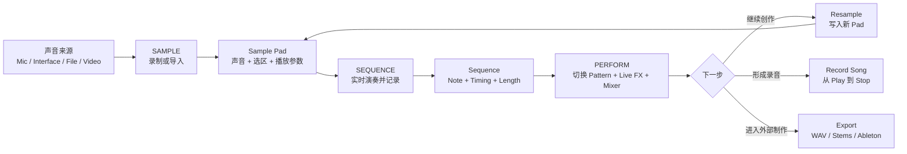

### 核心观察

传统 DAW 的主线通常是：

```text
素材 → Track → Clip → Timeline → Mixer → Export
```

Koala 的主线则是：

```text
声音 → Pad → Sequence → Performance → 新声音
```

两者最大的区别是：Koala 把最后的 Performance 再次变成可以采样的声音，因此产品不是一条直线，而是一个闭环。

## 1.3 三个页面的职责边界

| 页面 | 主要输入 | 用户完成的核心决定 | 主要输出 |
| --- | --- | --- | --- |
| SAMPLE | 麦克风、音频接口、文件、视频、应用自身输出 | 这个声音是什么、落在哪个 Pad、播放哪一段、如何触发 | 可演奏的 Sample Pad |
| SEQUENCE | Sample Pad 演奏 | 何时触发哪个 Pad、持续多久、力度和概率如何、Pattern 多长 | Sequence / Note Events |
| PERFORM | 一个或多个 Sequence | 什么时候切换 Pattern、何时施加 FX、是否锁定效果、如何混合 | Performance、Song Recording 或 Resampled Pad |

## 1.4 页面间跳转不是线性向导

底部导航让用户可以随时在三个页面间切换：

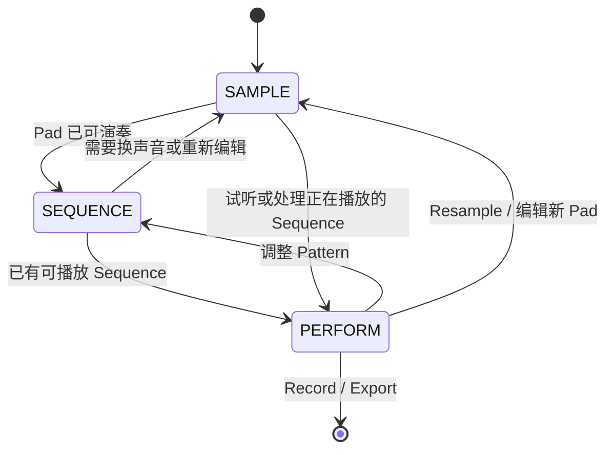

这种设计没有设置强制步骤门槛。用户可以：

- 只使用 SAMPLE，把 Koala 当采样器。
- 在 SAMPLE 与 SEQUENCE 之间反复制作 Beat。
- 在 PERFORM 中把 Koala 当实时效果器。
- 通过 Resample 在三个页面间循环。

---

## 2. 全局 UI 信息架构

## 2.1 稳定区域

尽管三个页面的主体不同，整体上都可以拆成以下区域：

```text
┌──────────────────────────────────────────────┐
│ 全局顶部区域                                 │
│ Menu / Song Context / Transport / Tempo      │
├──────────────────────────────────────────────┤
│                                              │
│ 页面主体                                     │
│ SAMPLE：Pad + Sample Controls                │
│ SEQUENCE：Sequence Slots + Input Surface     │
│ PERFORM：Sequence Slots + 16 Live FX         │
│                                              │
├──────────────────────────────────────────────┤
│ 页面级工具                                   │
│ Edit / Bars / Clear / Hold / Mixer 等         │
├──────────────────────────────────────────────┤
│ SAMPLE         SEQUENCE         PERFORM       │
│                 主导航                       │
└──────────────────────────────────────────────┘
```

### 布局设计思考

1. **导航稳定，创作面变化**

   用户始终知道自己处于采样、编序还是表演阶段。

2. **Transport 连续**

   Sequence 可以在不同页面继续播放，使用户在调整 Sample 或 FX 时不会失去音乐上下文。

3. **主要对象占据最大面积**

   SAMPLE 让 Pad 成为视觉主体；SEQUENCE 让 Pattern 和演奏输入成为主体；PERFORM 让 FX 触控面成为主体。

4. **手机优先的分页策略**

   小屏幕上，Sample Editor 控件分三页；PERFORM 竖屏时 16 FX 分为 STRAWBERRY 和 VANILLA 两页。横屏则尽量同时展示全部效果。

## 2.2 全局菜单是横切业务层

Main Menu 不属于 SAMPLE、SEQUENCE 或 PERFORM 的某一个阶段，而是管理整个 Song：

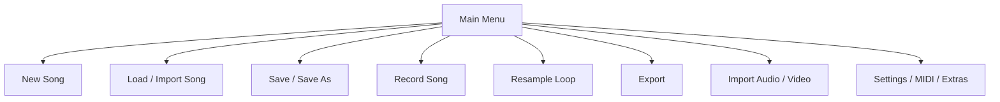

| 菜单动作 | 用户操作 | 系统结果 |
| --- | --- | --- |
| New | 选择 NEW；当前 Song 有修改时确认保存 | 创建空 Song |
| Load | 打开列表并选择 Song | 当前工作上下文切换到已保存 Song |
| Save | 点击 SAVE | 保存当前 Song；iOS 还会持续后台保存 |
| Save As | 输入新名称 | 复制为新的 Song 文件 |
| Record Song | 先启用录制，再从任意 Sequence/PERFORM 页面 Play | 从 Play 到 Stop 捕获完整音频 |
| Resample Loop | 选择当前 Sequence 后执行 | 把当前 Sequence 快速写到下一个空 Pad |
| Export | 选择 Sample、Sequence、Stem、Ableton 等目标 | 生成外部可用文件 |

---

## 3. SAMPLE：声音进入产品的流程

## 3.1 用户任务

SAMPLE 页面解决四个连续问题：

1. 声音从哪里来？
2. 声音放在哪个 Pad？
3. 这段声音应该从哪里开始、在哪里结束？
4. 按下 Pad 时，声音应该如何播放？

## 3.2 SAMPLE UI 抽象布局

```text
┌──────────────────────────────────────────────┐
│ MENU       INPUT: MIC / FILE / RESAMPLE      │
│             MIC FX / 当前输入状态            │
├──────────────────────────────────────────────┤
│ BANK A   BANK B   BANK C   BANK D            │
├──────────────────────────────────────────────┤
│ ┌──────┐ ┌──────┐ ┌──────┐ ┌──────┐         │
│ │ PAD1 │ │ PAD2 │ │ PAD3 │ │ PAD4 │         │
│ ├──────┤ ├──────┤ ├──────┤ ├──────┤         │
│ │ PAD5 │ │ PAD6 │ │ PAD7 │ │ PAD8 │  4×4    │
│ ├──────┤ ├──────┤ ├──────┤ ├──────┤  Pad    │
│ │ ...                                  │     │
│ └──────┘ └──────┘ └──────┘ └──────┘         │
├──────────────────────────────────────────────┤
│ 选中 Pad：VOL   PITCH   PAN   EDIT   DELETE   │
├──────────────────────────────────────────────┤
│ [SAMPLE]        SEQUENCE        PERFORM       │
└──────────────────────────────────────────────┘
```

进入 `EDIT` 后：

```text
┌──────────────────────────────────────────────┐
│ 当前 Pad / 播放状态 / 关闭编辑               │
├──────────────────────────────────────────────┤
│               Waveform                       │
│      [Start ├──────────────┤ End]             │
│      Pinch Zoom / Drag Selection              │
├──────────────────────────────────────────────┤
│ ONE SHOT / HOLD   LOOP   REVERSE              │
│ ATTACK   RELEASE   TONE   CHOKE               │
│ STRETCH*  TOOLS   MIX/EQ*   BUS*              │
├──────────────────────────────────────────────┤
│ 手机上的控件可能分 3 页，用箭头切换           │
└──────────────────────────────────────────────┘
```

`*` 表示 Samurai、Mixer 或设置中启用的能力。

## 3.3 SAMPLE 主流程

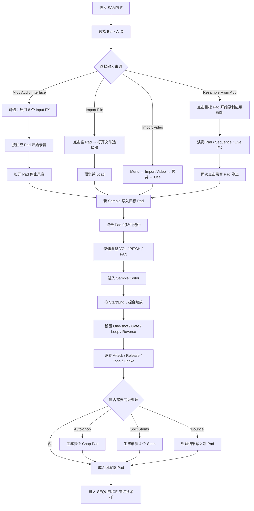

## 3.4 SAMPLE 逐步操作、结果与设计意图

| 步骤 | UI 区域 | 用户操作 | 对应结果 | 用户可见反馈 | 流程设计思考 |
| --- | --- | --- | --- | --- | --- |
| S1 | Bank | 选择 A、B、C 或 D | 切换当前 16 Pad 视图 | 当前 Bank 高亮，Pad 内容变化 | 用 Bank 扩容，但始终保持 4×4 肌肉记忆 |
| S2 | Input Selector | 选择 Mic、Import File 或 Resample From App | 确定点击空 Pad 后的行为 | 输入来源标签变化 | 同一个空 Pad 根据来源承担录制或导入入口，减少独立向导 |
| S3 | Mic FX | 录音前启用输入效果 | 效果被直接写入采样 | 监听到处理后的输入 | 把声音设计前移到采集动作中 |
| S4 | Empty Pad | Mic 模式下按住空 Pad | 立即开始采集音频 | Pad 显示录音态 | Pad 同时是目标容器、录音按钮和未来乐器键 |
| S5 | Empty Pad | 松开 | 停止录音并保存 Sample | Pad 变为有内容状态 | 通过身体动作界定 Sample 长度，没有额外 Stop 按钮 |
| S6 | Empty Pad | File 模式下点击 | 打开文件浏览器 | 显示可选择文件 | 同一空间位置始终代表“把声音放到这里” |
| S7 | File Browser | 预览并点击 Load | 文件写入当前或下一个空 Pad | 回到 SAMPLE，Pad 有内容 | 预览减少错误导入，仍保持短链路 |
| S8 | Main Menu | Import Video → 选视频 → Use | 提取视频音频到下一个空 Pad | 转换进度后出现 Sample | 把移动端真实素材来源纳入采样流程 |
| S9 | Resample Target | Resample 模式下点击目标 Pad | 开始捕获 Koala 自身输出 | 目标 Pad 显示录音状态 | 让应用输出重新成为素材，形成产品飞轮 |
| S10 | Pad Grid | 点击已有 Pad | 播放并选中该 Pad | Pad 高亮、声音播放、参数区更新 | 试听和选择是同一动作 |
| S11 | Quick Controls | 按住 VOL/PITCH/PAN 并滑动 | 修改选中 Pad 参数 | 声音和参数即时变化 | 连续参数使用直接手势，避免旋钮弹窗 |
| S12 | Quick Controls | 双击 VOL/PITCH/PAN | 恢复默认值 | 参数回到原始或中心值 | 给探索行为提供低成本复位 |
| S13 | EDIT | 点击 Edit | 打开波形和 Sample Editor | 当前 Pad 波形成为主体 | 只有明确进入编辑时才展示深层能力 |
| S14 | Waveform | 拖动选区两端 | 修改 Start/End | 红色播放区实时变化 | 直接操作声音边界，不使用数字表单作为主入口 |
| S15 | Waveform | 捏合缩放、拖动视图 | 改变观察精度和位置 | 波形缩放或平移 | 采用触屏原生手势，不模拟桌面滚动条 |
| S16 | Playback Mode | 切换 One-shot / Gate / Loop | 改变 Pad 触发规则 | 试听行为立刻变化 | 把关键行为模型压缩为少数明确开关 |
| S17 | Loop Controls | 设置 Ping Pong、Loop Point、Crossfade | 改变循环方向、区间或接缝 | 循环试听即时反馈 | 高级循环仍附着在一个 Pad，而非创建新轨道 |
| S18 | Envelope/Tone | 调 Attack、Release、Tone | 改变包络和音色 | 每次触发都使用新参数 | 只保留最影响演奏感的高频参数 |
| S19 | Choke | 选择 1–6 组 | 同组声音互相停止 | Open/Closed Hat 等关系成立 | 用组关系表达演奏规则，而不是复杂 Voice 管理 |
| S20 | Tools | Crop / Normalize / Trim Silence / Mono | 处理当前声音 | 波形或响度变化 | 将文件级操作集中在 Tools，避免挤占主界面 |
| S21 | Auto-chop* | 选择 Transient、Equal 或 Lazy | 产生多个切片并分配到 Pad | Chop 标记和新 Pad 出现 | 自动、结构化和演奏式切片对应不同用户心智 |
| S22 | Split Stems | 执行四轨分离 | 产生 Drums/Bass/Vocals/Other | 新 Stem 可被放到 Pad | AI 结果最终仍回到统一 Pad 对象 |
| S23 | MIX/EQ* | 调整 3-band EQ 或 Bus | 保存 Pad 级音色与路由 | 频谱、EQ 点或 Bus 状态变化 | 混音能力延后出现，不阻塞首次采样 |
| S24 | Bounce | 把选区或处理结果写到新 Pad | 新 Sample Asset | 新 Pad 可立即触发 | 把复杂参数“提交”为简单声音，降低后续认知负担 |
| S25 | DELETE | 点击 Delete 并确认 | 删除当前 Sample | Pad 变空 | 单个破坏操作有确认；批量熟练操作可通过长按加速 |

## 3.5 SAMPLE 的关键状态

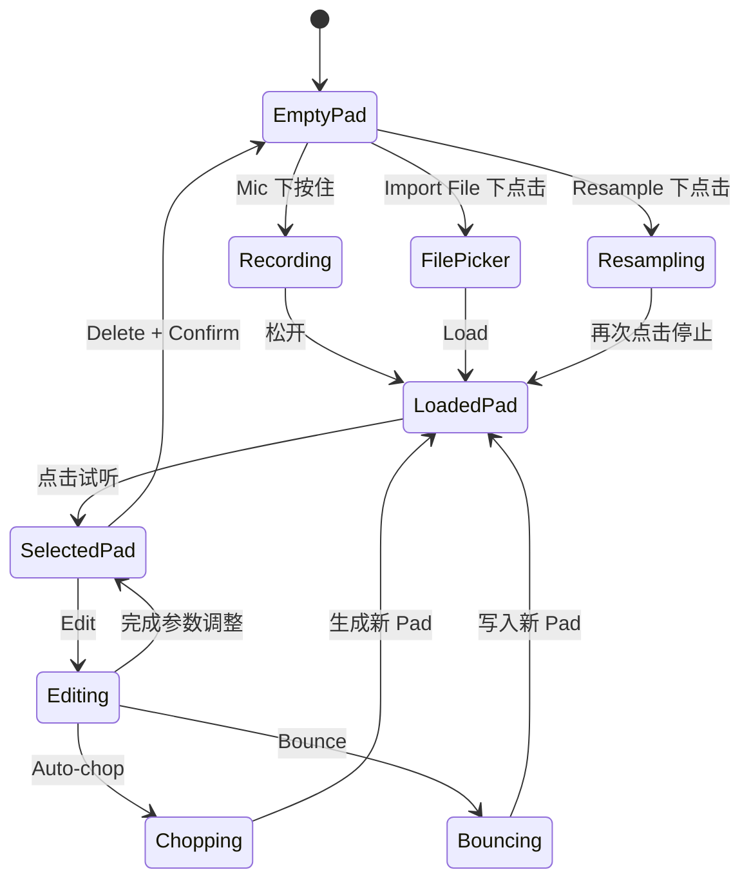

## 3.6 SAMPLE 的异常与边界

| 情况 | 产品反馈/结果 | 设计意义 |
| --- | --- | --- |
| 没有麦克风权限 | 无法开始 Mic 采样，需要系统授权 | 移动端权限是采样入口的一部分 |
| 连接音频接口 | 默认输入可以切换到接口 | 专业输入不应改变 Pad 工作流 |
| Auto-chop 数量超过空 Pad | Chops Bar 变红 | 在执行前暴露容量约束 |
| Stem Split 未启用 | 需要下载约 150 MB 的额外能力 | 重资源功能不默认占用设备空间 |
| AUv3 模式 | 部分输入、Stem Split、Mute/Solo 能力受限 | 同一产品在插件和 Standalone 中职责不同 |
| 删除单个 Sample | 默认确认 | 保护不可逆操作 |
| 长按 Delete 后批量点击 | 可跳过逐项确认 | 给熟练用户提供快速通道 |

## 3.7 SAMPLE 的流程设计判断

### 判断 A：空 Pad 是最重要的 CTA

传统应用会提供“录音”“导入”“创建 Sampler”三个入口。Koala 把它们统一到空 Pad：

```text
先选择输入意图 → 再点击想让声音落下的位置
```

用户始终围绕最终对象工作，不需要理解中间文件管理。

### 判断 B：每个编辑动作都必须可立即试听

Start/End、Pitch、Envelope、Loop 都作用于当前可触发 Pad。编辑没有离开乐器语境。

### 判断 C：高级能力最终必须回到 Pad

Auto-chop、Stem Split 和 Bounce 的最终结果不是报告或文件列表，而是更多可演奏 Pad。产品对象模型因此保持稳定。

---

## 4. SEQUENCE：演奏变成结构的流程

## 4.1 用户任务

SEQUENCE 页面解决五个问题：

1. Pattern 的 Tempo、拍号和长度是什么？
2. 演奏何时被记录？
3. 是否量化，还是保留原始 Timing？
4. 如何修正已经录下的 Note？
5. 多个 Pattern 如何复制、混合、拼接和切换？

## 4.2 SEQUENCE UI 抽象布局

```text
┌──────────────────────────────────────────────┐
│ MENU   ◀PLAY▶   ●REC   METRONOME   TEMPO     │
│                         BPM / QUANTIZE / SNAP │
├──────────────────────────────────────────────┤
│ Sequence Slots                               │
│ [01] [02] [03] [04] [05] [06] [07] [08]     │
│ [09] [10] ...                         [32]   │
│ 选中态 / 播放态 / 待切换态 / 录制态           │
├──────────────────────────────────────────────┤
│ Live Input Surface                           │
│ Pad Grid / Keyboard* / Grid Scale* / Repeat* │
├──────────────────────────────────────────────┤
│ BARS   DOUBLE UP   UNDO   CLEAR               │
├──────────────────────────────────────────────┤
│ SAMPLE        [SEQUENCE]        PERFORM       │
└──────────────────────────────────────────────┘
```

双击 Sequence Slot 后进入 Piano Roll：

```text
┌──────────────────────────────────────────────┐
│ Bars / Loop Range / Playhead                 │
├───────────────┬──────────────────────────────┤
│ Pad Rows      │ Time Grid                    │
│ A1            │  ▪      ▪  ▪                 │
│ A2            │     ▪                        │
│ ...           │  Notes / Length / Selection  │
│ D16           │                              │
├───────────────┴──────────────────────────────┤
│ PEN  VEL  DICE  SNAP  UNDO  REDO             │
└──────────────────────────────────────────────┘
```

`*` 为 Samurai 能力。

## 4.3 SEQUENCE 主流程

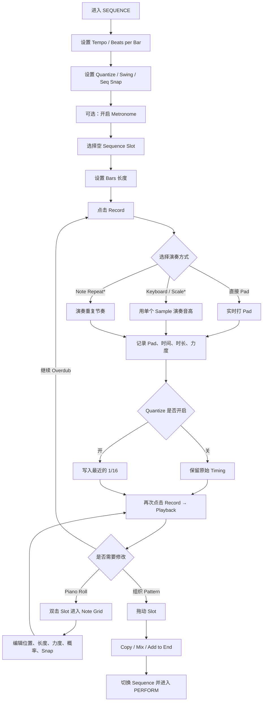

## 4.4 SEQUENCE 逐步操作、结果与设计意图

| 步骤 | UI 区域 | 用户操作 | 对应结果 | 用户可见反馈 | 流程设计思考 |
| --- | --- | --- | --- | --- | --- |
| Q1 | Tempo Menu | 双击 Tempo | 打开时间设置 | Tempo、拍号、Quantize、Seq Snap、Swing 出现 | 将全局时间规则放在 Transport 附近 |
| Q2 | Tempo | 拖动、点击 +/- 或 Tap Tempo | 修改 BPM | 数值与播放速度变化 | 同时支持精确、步进和身体输入三种方式 |
| Q3 | Beats per Bar | 选择每小节 Beat 数 | 修改拍号 | Grid 和 Bar 结构变化 | 时间结构是 Song 级规则，不依赖单个 Pad |
| Q4 | Quantize | 开启或关闭 | 决定新录事件使用原始时间或最近的 1/16 | 后续录制落点变化 | 量化在输入阶段明确选择，避免用户误以为演奏被原样保存 |
| Q5 | Swing | 拖动 Swing | 改变播放律动 | Note 播放位置产生摆动 | Groove 是全局演奏感，而不是逐 Note 编辑前置 |
| Q6 | Seq Snap | 选择 Off、1 Beat、1 Bar、Seq End | 设定 Pattern 切换边界 | 切换请求等待对应时间点 | 将“点击时机”与“实际切换时机”分离，保护现场连贯性 |
| Q7 | Metronome | 点击开关 | 启停节拍器 | 听到或停止 Click | 基础录制辅助保持一键可达 |
| Q8 | Sequence Slots | 选择空 Slot | 设为录制目标 | Slot 高亮 | 先指定容器，再开始时间性操作 |
| Q9 | Bars | 选择长度或 +/- | 设置 Pattern 长度 | Slot/Grid 长度变化 | 在录制前明确循环边界，减少“录到哪里算结束”的不确定 |
| Q10 | Record | 点击 Record | 当前 Slot 进入录制 | Record 状态明显变化 | 录制入口与播放 Transport 并列 |
| Q11 | Input Surface | 演奏 Pad | 产生 Note Event | 声音播放，事件写入当前循环 | 演奏本身就是数据输入，不要求预先画 Grid |
| Q12 | Keyboard* | 选择 Pad 后切换 Keyboard/Grid | 一个 Sample 以音阶或半音演奏 | 键盘或音阶布局出现 | 高级输入模式附着于已理解的 Sample Pad |
| Q13 | Note Repeat* | 调整重复率，选择 Snap/Triplets | 连续生成节奏事件 | 重复速率随触摸位置变化 | 把复杂重复事件转换成实时手势 |
| Q14 | Record | 再次点击 | 停止录制并进入回放 | 已录 Sequence 循环播放 | 录完直接听，不进入单独“完成”页面 |
| Q15 | Record | 已有内容时再次录制 | Overdub 到原 Sequence | 新 Note 叠加 | 默认鼓励逐层构建，而不是创建多轨工程 |
| Q16 | Sequence Slot | 录制中点击其他 Slot | 可以无缝切换录制目标 | 新 Slot 进入当前状态 | 支持现场式连续构建 Pattern |
| Q17 | Play | 点击 Play/Stop | 启停 Sequencer | Playhead 和音频同步变化 | Transport 在多个页面保持一致 |
| Q18 | Slot | 播放中点击另一 Slot | 根据 Seq Snap 请求切换 | 新 Slot 高亮，实际切换可能延迟 | 把量化切换用于现场可靠性 |
| Q19 | Slot | 双击 | 打开 Note Grid/Piano Roll | 每行对应 Bank A1 到 D16 | 深层编辑从已有 Pattern 进入，而不是成为首页 |
| Q20 | Grid / Pen | 点击空白或 Note | 添加/删除 Note | Grid 即时更新 | 提供传统精确编辑作为第二层 |
| Q21 | Note Edge | 拖动 Note 开始或结束 | 改变位置或时长 | Note 矩形变化 | 与音频波形编辑共享“直接拖边界”的语言 |
| Q22 | VEL | 在 Note 上上下拖动 | 修改 Velocity | 力度值/视觉变化 | 把力度变成可连续触摸的维度 |
| Q23 | DICE | 在 Note 上上下拖动 | 修改触发概率 | Chance 参数变化 | 允许 Pattern 产生非固定变化 |
| Q24 | SNAP | 选择 Grid 粒度 | 移动和改变长度时吸附 | Note 对齐 Grid | 精确与自由放置可以切换 |
| Q25 | Selection | 框选多个 Note | 批量 Delete/Copy/Snap/Legato/Reverse/Stretch/Repeat | 选区和操作菜单出现 | 批处理只在用户创建明确选区后出现 |
| Q26 | BARS | Double Up | Pattern 长度翻倍并复制原内容 | 后半段出现相同 Note | 用一个动作创建可变化的第二段 |
| Q27 | Sequence Slot | 拖到空 Slot | Copy | 新 Slot 出现相同 Pattern | 空间操作替代文件式 Duplicate 菜单 |
| Q28 | Sequence Slot | 拖到已有 Slot → Mix | 合并两个 Pattern | 目标 Slot 包含两者事件 | 把 Pattern 当作可组合对象 |
| Q29 | Sequence Slot | 拖到已有 Slot → Add to End | 前后拼接 | 目标 Pattern 变长 | 在没有完整 Timeline 时完成基础 Arrangement |
| Q30 | Clear/Trash | 清空或拖到垃圾区 | 删除 Sequence 内容 | Slot 恢复为空 | 与 SAMPLE 的拖拽删除语言保持一致 |

## 4.5 Quantize 与 Seq Snap 是两个不同问题

```text
Quantize：决定 Note 写到时间轴的哪里
Seq Snap：决定 Pattern 切换在什么时候发生
```

### Quantize

- 关闭：事件按用户实际演奏时间记录。
- 开启：官方手册说明新事件记录到最近的 1/16。

### Seq Snap

- `OFF`：立即切换，新 Sequence 匹配当前 Playhead 位置，可能从中间开始。
- `1 BEAT`：等当前 Beat 结束后，从新 Sequence 开头切换。
- `1 BAR`：等当前 Bar 结束。
- `SEQ END`：等当前 Sequence 结束。

这种分离非常重要：一个控制演奏数据，一个控制现场结构。

## 4.6 SEQUENCE 的对象转换

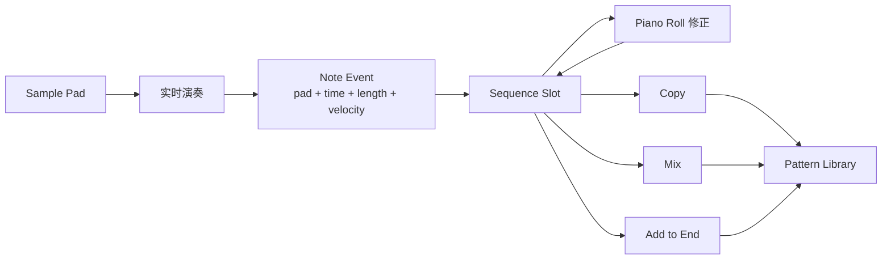

## 4.7 SEQUENCE 的流程设计判断

### 判断 A：先录，再编辑

Koala 的默认路径是：

```text
选 Slot → Record → 演奏 → 回放
```

而不是：

```text
进入 Piano Roll → 选择工具 → 画 Note
```

这使产品首先像乐器，其次才像编序软件。

### 判断 B：Pattern 比 Track 更重要

用户组织的是完整 Sequence Slot，而不是多个 Track。复制、混合和拼接围绕 Pattern 发生。

### 判断 C：现场切换规则是正式产品能力

Seq Snap 不是边缘设置。它使用户能够提前点击下一段，同时保持节拍完整，是从“编曲工具”进入“表演工具”的关键桥梁。

---

## 5. PERFORM：结构变成表演的流程

## 5.1 用户任务

PERFORM 页面解决四个问题：

1. 从哪个 Sequence 开始？
2. 什么时候切换到下一个 Sequence？
3. 如何用实时 FX 改变整段音乐？
4. 这次表演是保存为成品，还是重采样为下一轮素材？

## 5.2 PERFORM UI 抽象布局

横屏/大屏逻辑：

```text
┌──────────────────────────────────────────────┐
│ MENU   PLAY/STOP   RECORD STATE   SEQUENCES  │
│ [01] [02] [03] [04] ...                     │
├──────────────────────────────────────────────┤
│ CRUSH    PITCH    COMB     RING              │
│ REVERB   STUTTER  GATE     FILTER            │
│ CUTTER   REVERSE  DUB      DELAY              │
│ TALKBOX  VIBRO    DIRTY    COMPRESSOR         │
│                                              │
│ 每一条都是可按住、滑动的二维效果控制区域       │
├──────────────────────────────────────────────┤
│ HOLD                     MIXER*               │
├──────────────────────────────────────────────┤
│ SAMPLE        SEQUENCE        [PERFORM]       │
└──────────────────────────────────────────────┘
```

手机竖屏逻辑：

```text
┌──────────────────────────┐
│ Transport + Sequences    │
├──────────────────────────┤
│ STRAWBERRY / VANILLA     │
│ 当前页的 8 个 FX         │
│                          │
├──────────────────────────┤
│ HOLD / MIXER             │
├──────────────────────────┤
│ SAMPLE / SEQ / PERFORM   │
└──────────────────────────┘
```

## 5.3 PERFORM 主流程

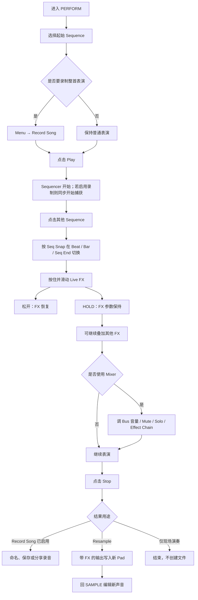

## 5.4 PERFORM 逐步操作、结果与设计意图

| 步骤 | UI 区域 | 用户操作 | 对应结果 | 用户可见/可听反馈 | 流程设计思考 |
| --- | --- | --- | --- | --- | --- |
| P1 | Sequence Slots | 选择起始 Sequence | 确定 Play 后的第一段 | Slot 高亮 | 表演从已有结构开始，不需要额外 Setlist 页面 |
| P2 | Main Menu | 可选：Record Song | 系统进入等待录制状态 | 录制计时/状态准备 | 先声明“我要捕获”，真正开始仍与 Play 对齐 |
| P3 | Play | 点击 Play | Sequencer 开始；Record Song 同步开始 | Play 状态、Playhead、声音 | 录音边界绑定音乐 Transport，避免手动对齐 |
| P4 | Sequence Slots | 点击下一 Sequence | 提交切换请求 | 新 Slot 显示待切换/选中状态 | 允许用户提前操作，降低现场压力 |
| P5 | Seq Snap | 系统等待 Beat、Bar 或 Sequence End | 在音乐边界切换 | 无断拍地进入新段落 | 把结构变化变成可预测的现场行为 |
| P6 | FX Area | 按住某个效果区域 | 效果立即作用于 Full Mix | 声音和位置参数同步变化 | 每个 FX 是可演奏表面，而不是插件窗口 |
| P7 | FX Area | 在区域内滑动 | 连续改变效果 Amount、方向或 Tempo Division | 声音随手势连续变化 | 触摸位置同时承担参数值和演奏姿态 |
| P8 | FX Area | 松开 | 默认解除效果 | 声音恢复 | Momentary 是安全默认，不容易“忘记关效果” |
| P9 | HOLD | 点击 Hold | 当前效果状态在松手后保留 | HOLD 状态和效果继续存在 | 把瞬时手势显式转换成持续状态 |
| P10 | Multi-touch | 用多个手指按多个 FX | 多个效果同时生效 | 声音叠加变化 | 触屏多点能力成为硬件旋钮矩阵的替代 |
| P11 | FX Signal Order | 同时使用多个效果 | 按左到右、上到下顺序串行处理 | 组合顺序产生不同声音 | 空间布局同时表达信号顺序 |
| P12 | Tempo FX | 点击 Stutter/Cutter 的不同横向分区 | 选择与 Tempo 锁定的 Division | 节奏效果保持同步 | 将时间参数映射为空间区段，减少数值设置 |
| P13 | Directional FX | 从中线向不同方向滑动 | Pitch/Filter/VibroFlange 使用不同方向调制 | 正负或不同滤波方向可听 | 中线提供中性点和双向语义 |
| P14 | Mixer* | 打开 Mixer | 进入 4 Bus + Main | Fader、Meter、Mute/Solo、Effect Slots 出现 | 深度混音作为可选层，不侵入基础表演 |
| P15 | Mixer Fader | 拖 Bus 电平 | 调整该 Bus 音量 | Meter 和声音同步变化 | 仍采用直接触摸，不以数字输入为主 |
| P16 | Mixer M/S | 点击 Mute 或 Solo | 修改 Bus 可听状态 | 按钮状态和混音变化 | 用通用混音语言服务高级用户 |
| P17 | Effect Slot | 点击空槽并选效果 | 效果加入当前 Bus 或 Main | 新效果模块出现 | Effect Chain 可配置，但位于付费高级层 |
| P18 | Effect Chain | 拖动效果顺序 | 改变串行处理顺序 | Chain 顺序和声音变化 | 高级复杂度只在明确进入 Mixer 后出现 |
| P19 | Stop | 点击 Stop | 停止 Sequencer；若 Record Song 已启用则停止录音 | 播放与录制状态一起结束 | 一个 Transport 动作定义完整 Take 边界 |
| P20 | Save Prompt | 输入名称并保存/分享 | 生成录音文件 | 文件可访问 | 表演结果成为可交付成品 |
| P21 | Resample Workflow | 在 SAMPLE 选择 Resample From App 并指定 Pad，然后进行表演 | 捕获带 FX/Mixer 的输出 | 目标 Pad 录音并产生新 Sample | 同一次表演既可作为终点，也可作为下一轮素材 |

## 5.5 Live FX 的交互语法

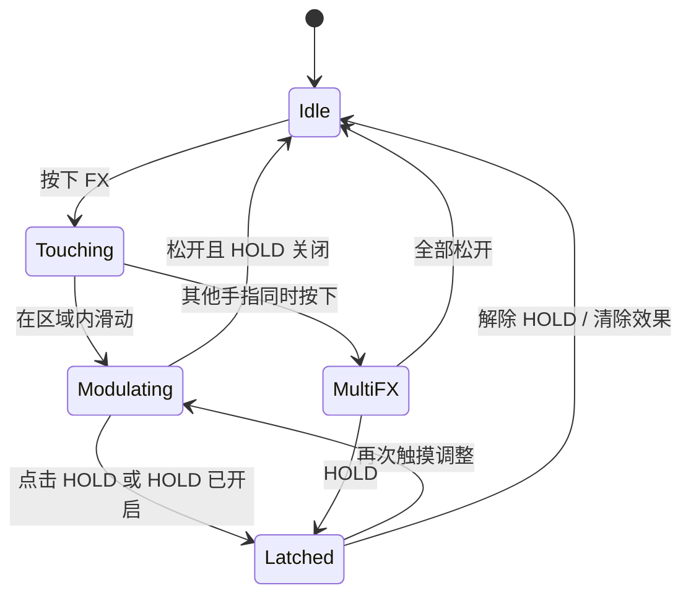

### Momentary 与 Latched

Koala 把 FX 默认设计为 Momentary：

```text
按下 = 生效
松开 = 恢复
```

只有用户明确按下 HOLD 后，动作才从“瞬时表演”变成“持续状态”。

这比默认 Toggle 更适合现场：

- 手离开后自动回到安全状态。
- 用户能够大胆试错。
- HOLD 是清晰的状态承诺。

## 5.6 PERFORM 的信号流程

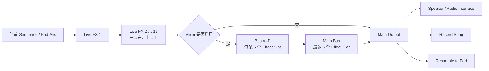

## 5.7 PERFORM 的流程设计判断

### 判断 A：Pattern 与 FX 分工明确

- Sequence 决定“播放什么结构”。
- Live FX 决定“此刻如何表达”。
- Mixer 决定“声音如何分组和长期处理”。

三者没有被压成同一时间线。

### 判断 B：空间布局承担信号顺序

16 FX 不只是按钮矩阵。官方手册明确说明，信号按左到右、上到下通过效果。视觉顺序就是音频顺序。

### 判断 C：表演必须能被捕获

如果实时动作不能录下来，PERFORM 就只是试听页。Koala 提供两类捕获：

- Record Song：把表演视为成品 Take。
- Resample：把表演视为下一轮素材。

---

## 6. 三个页面如何形成业务闭环

## 6.1 对象生命周期

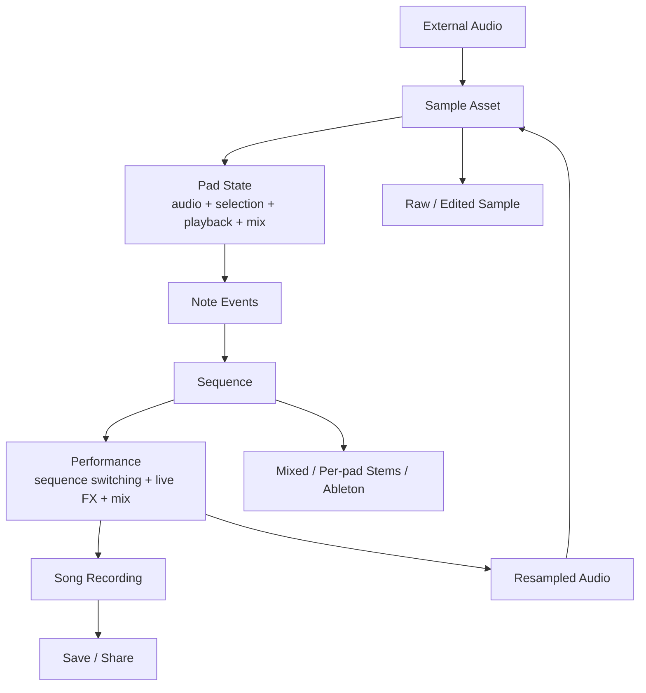

## 6.2 页面间的用户意图转换

| 从 | 到 | 典型触发 | 用户意图变化 |
| --- | --- | --- | --- |
| SAMPLE | SEQUENCE | 至少一个 Pad 已可演奏 | 从“准备声音”转为“组织时间” |
| SEQUENCE | SAMPLE | 某 Pad 不合适或需要新声音 | 从“写 Pattern”回到“修乐器” |
| SEQUENCE | PERFORM | 已有一个或多个 Sequence | 从“写结构”转为“实时表达” |
| PERFORM | SEQUENCE | 切换或 Note 内容需要修正 | 从“演奏”回到“编辑结构” |
| PERFORM | SAMPLE | Resample 完成或要调整声音 | 表演结果重新成为素材 |
| 任意页面 | Main Menu | 保存、加载、录音或导出 | 从创作动作切换到 Song 管理 |

## 6.3 两条结束路径

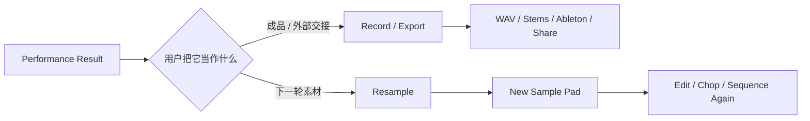

这是 Koala 最关键的业务设计之一：

- 对“做完了”的用户提供导出。
- 对“还想继续”的用户提供回流。
- 两条路径来自同一表演结果，不需要重新建立工程。

---

## 7. 服务蓝图：用户动作与系统处理

| 阶段 | 用户前台动作 | UI 前台反馈 | 应用后台处理 | 持久对象 |
| --- | --- | --- | --- | --- |
| Capture | 按住空 Pad、导入文件或选择视频 | 录音态、文件预览、转换状态 | 采集、解码、视频音频提取 | Sample Asset |
| Edit | 拖波形、改播放模式、调包络 | 波形选区、参数、即时试听 | 保存非破坏参数或执行文件处理 | Pad State |
| Transform | Auto-chop、Split Stems、Bounce | 切点、新 Pad、进度 | 分析、渲染或分离 | 多个 Sample Asset |
| Record | 选 Slot、Record、演奏 | Record、Playhead、Slot 状态 | 捕获 Note、Timing、Length、Velocity | Note Events |
| Refine | 双击 Slot、编辑 Grid | Piano Roll、Selection、Snap | 更新 Event List | Sequence |
| Arrange | 拖 Slot、Mix、Add to End | 新/更新的 Sequence Slot | 复制、合并或拼接事件 | Sequence Library |
| Perform | Play、切 Pattern、按 Live FX | Slot 切换、FX 位置、HOLD | 实时音频链和 Seq Snap | Performance State |
| Capture Result | Stop、Save 或 Resample | Save Prompt 或新 Pad | 写 WAV 或写回 Sample | Recording / Sample |
| Handoff | Export | Export Options、Share Sheet | 渲染 Mixed、Stems、Ableton 文件 | External Package |

---

## 8. 关键流程设计原则

## 8.1 对象优先，而不是工具优先

Koala 的页面围绕对象组织：

- SAMPLE 围绕 Pad。
- SEQUENCE 围绕 Sequence Slot。
- PERFORM 围绕正在播放的结构和 FX。

用户先选择对象，工具才围绕对象出现。

## 8.2 先产生声音，再增加精度

Koala 的基本顺序是：

```text
快速获得结果 → 立即试听 → 再决定是否深入
```

而不是：

```text
先配置所有参数 → 再允许用户听到结果
```

## 8.3 Progressive Disclosure

| 能力层 | 用户首先看到的内容 | 深层能力 |
| --- | --- | --- |
| SAMPLE | Pad、录制、VOL/PITCH/PAN | Waveform、Chop、Stem、Stretch、EQ、Bus |
| SEQUENCE | Slot、Play、Record、Bars | Keyboard、Note Repeat、Piano Roll、Probability |
| PERFORM | Sequence、16 FX、HOLD | Mixer、Effect Chain、Plugin Hosting |

付费层也遵循相同结构：Samurai 增加编辑和表达深度，Mixer 增加混音深度，但基础创作闭环已经成立。

## 8.4 直接操作

Koala 重复使用少量手势语言：

| 手势 | 在不同页面中的含义 |
| --- | --- |
| 点击 | 选择、试听、切换、开关 |
| 按住 | 录音、瞬时 FX、进入连续参数控制 |
| 拖动 | 移动 Sample/Sequence、调参数、框选、改变 Note |
| 拖边界 | 改 Sample Start/End 或 Note Length |
| 双击 | Reset 参数、打开 Tempo、进入 Piano Roll |
| 捏合 | Waveform Zoom |

复用手势降低了功能增长带来的学习成本。

## 8.5 Momentary 默认，Commit 显式

Koala 多处体现这种原则：

- Mic 录音：按住期间录，松开提交。
- Live FX：按住期间生效，松开恢复。
- HOLD：明确把瞬时 FX 转成持续状态。
- Bounce/Resample：明确把处理结果提交为新声音。
- Delete：单项默认确认。

用户可以自由探索，但不可逆或持续变化需要更明确的动作。

## 8.6 用 Resample 管理复杂度

传统软件通过保留所有参数和路由管理复杂度；Koala 经常通过 Resample 把复杂状态转换成简单声音。

优点：

- 降低后续认知成本。
- 鼓励做决定。
- 新结果仍能使用所有基础工具。

代价：

- 可逆性降低。
- 多轮 Bounce 后来源关系不清楚。
- 很难像 DAW 一样修改早期参数。

## 8.7 保持音乐连续

Sequence 在多个页面可以继续播放；用户可以在播放中：

- 切 Sequence。
- 调 Sample。
- 使用 Live FX。
- 调 Mixer。
- 开始 Resample。

UI 切换不会自动等于音乐停止。这种“Transport 独立于页面”的设计对于保持 Flow State 非常重要。

---

## 9. 可用性风险与观察点

## 9.1 隐藏手势

Koala 的效率依赖长按、双击、拖动目标区域和多点触控。熟练用户很快，但新用户可能不知道：

- 双击 Tempo 打开完整菜单。
- 双击 Sequence 进入 Piano Roll。
- 拖 Sequence 到另一 Slot 会出现 Mix/Add to End。
- HOLD 会改变 FX 的释放逻辑。
- 长按 Edit 可以多选 Pad。

因此，产品需要通过教程、动效、状态标签或渐进提示补充可发现性。

## 9.2 模式与状态必须可见

以下状态如果不清楚，容易造成错误：

- 当前 Bank。
- 当前选中 Pad。
- Input Source。
- Pad 是 One-shot、Gate 还是 Loop/Hold。
- 当前 Sequence Slot。
- Record、Overdub、Playback。
- Seq Snap 待切换状态。
- FX 是否被 HOLD。
- Pad 路由到哪个 Mixer Bus。
- Record Song 是否正在等待或录制。

## 9.3 手机分页增加上下文成本

- Sample Editor 控件分三页。
- PERFORM 竖屏把 FX 分成两页。
- 用户看不到的参数仍可能处于生效状态。

小屏布局必须用明确的分页标签和激活状态，避免“声音变了但找不到原因”。

## 9.4 付费层影响流程一致性

Samurai 和 Mixer 会改变页面能力。文档、教程和 UI 必须区分：

- 基础能力。
- 付费能力。
- 平台不可用能力。

否则用户会把“功能未购买”“平台不支持”和“功能入口隐藏”混为一谈。

---

## 10. 对 LMDJ 的流程启示

本节是竞品研究推论，不代表已批准规格。

## 10.1 不复制页面，复制对象转换逻辑

Koala 的对象转换是：

```text
Audio → Sample Pad → Note Events → Sequence → Performance → Audio
```

LMDJ 可以形成自己的转换：

```text
Finished Song
→ AI Material Package
→ Stable 16-Pad Patch
→ User Pad Edit
→ Take Events
→ Performance WAV / MIDI / JSON
→ Edited Asset / New Patch Version
```

## 10.2 SAMPLE 对 LMDJ Sampler Edit 的启示

优先保留：

- Pad 选择与试听是同一动作。
- 波形直接拖 Start/End。
- Loop/One-shot 是高频显式状态。
- 参数修改始终可即时试听。
- Bounce 产生新资产，同时保留原 Pad Role 和 Lineage。

不应照搬：

- 64 Pad 和四 Bank。
- 完整通用 Sampler 工具集。
- 不保留来源关系的多轮破坏性 Resample。

## 10.3 SEQUENCE 对 Take Recording 的启示

优先路径应当是：

```text
Record → 演奏 16 Pad → Stop → 回放 → 可选 Quantize
```

建议同时保存：

- Raw Event Timing。
- Quantized Event Timing。
- Velocity。
- Pad Slot / Role。
- Take Length。
- 使用的 Patch Version。

Piano Roll 不应成为第一版 Take Recording 的前置条件。

## 10.4 PERFORM 对 LMDJ 的启示

LMDJ 可以明确区分：

- Pattern：机器或用户编辑的结构。
- Take：用户真实演奏行为。
- Performance State：Mute、Volume、Loop、触发来源等。
- Bounce：Take 的 Stereo WAV。
- Export：JSON/MIDI/WAV 交付。

与 Koala 不同，LMDJ 应利用自己的 Lineage 模型保留“原始歌曲 → AI Material → Patch → User Edit → Take”的可追溯关系。

## 10.5 云端生成后的第一屏

Koala 的优势来自本地即时性；LMDJ 有 Upload、Queue、Separating、Extracting 和 Patchifying 等等待阶段。

等待结束后的第一屏应该直接满足：

```text
看见稳定 4×4 Pad
→ 点击即响
→ 角色与位置稳定
→ 立即可以 Record Take
```

用户不应在 AI 完成后再次经历导入、映射和工程配置。

---

## 11. 结论

Koala 的三页面流程不是三个独立功能模块，而是一套逐层承诺：

1. `SAMPLE` 承诺：任何声音都能快速变成乐器。
2. `SEQUENCE` 承诺：任何演奏都能快速变成可重复结构。
3. `PERFORM` 承诺：任何结构都能重新变成有身体表达的音乐。
4. `RESAMPLE` 承诺：任何结果都能再次成为素材。
5. `EXPORT` 承诺：用户可以离开 Koala，在其他环境继续完成作品。

最值得研究的不是 Koala 放了多少按钮，而是它如何让对象在页面间转换，同时尽量不打断音乐：

```text
声音不会停在文件里，
Pattern 不会停在 Grid 里，
表演也不会停在一次播放里。
```

---

## 12. 主要来源

1. [Koala Sampler 官方完整手册](https://manual.koalasampler.com/one-page/)
2. [Koala Sampler 官网](https://www.koalasampler.com/)
3. [Samurai 功能说明](https://www.koalasampler.com/samurai/)
4. [Mixer 功能说明](https://www.koalasampler.com/mixer/)
5. [Koala Release Notes](https://cdn.koalasampler.com/builds/release-notes.html)
6. [Roland SP-404MKII Koala Controller Mode](https://static.roland.com/manuals/sp-404mk2_v4_koala_sampler/eng/164266033.html)
