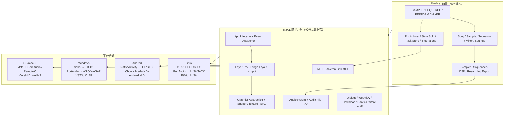
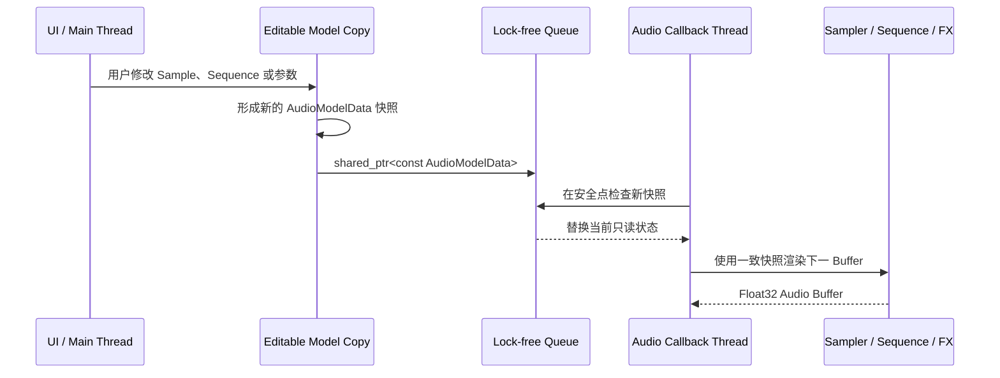
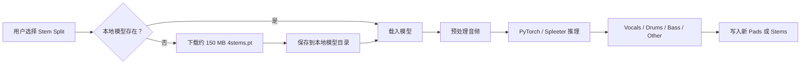

# Koala Sampler 技术栈、底层架构与工具链研究

> 研究日期：2026-07-28
>
> 研究对象：[Koala Sampler](https://www.koalasampler.com/) 及其公开基础框架 [MZGL](https://github.com/elf-audio/mzgl)
>
> 当前版本参照：Koala 2.0.0、MZGL 公开仓库 2026-07-24 快照
>
> 研究性质：公开资料、公开源码和官方 Linux 发行包的只读技术取证；不是 Koala 私有源码审计

相关研究：

- [Koala Sampler 产品研究与 LMDJ 启示](./2026-07-28-koala-sampler-product-research.md)
- [Koala Sampler 业务流程、UI 布局与流程设计研究](./2026-07-28-koala-sampler-business-flows.md)
- [Koala 能力迁移到纯前端 Web App 的技术可行性分析](./2026-07-28-koala-web-app-feasibility-analysis.md)

---

## 0. 结论先行

Koala 的底层不是 Flutter、React Native、Unity 或一个 WebView 应用，也不是用 JUCE 搭出的常规音频应用。它的主干是：

```text
私有 Koala 产品代码
        ↓
共享 C++ 音频、状态、业务与 UI 代码
        ↓
自研跨平台框架 MZGL
        ↓
平台专用渲染 / 音频 / MIDI / 插件 / 文件 / 商店接口
```

这套方案的核心特征是：

1. **共享原生 C++ 核心，而不是共享网页运行时。**
2. **UI 是 C++ 自绘的 Layer Tree，不依赖 iOS Auto Layout 或 Android View 体系作为主要创作界面。**
3. **图形后端按平台切换：Apple Metal、Windows Direct3D 11、Android/Linux OpenGL ES。**
4. **音频后端按平台切换：iOS RemoteIO、macOS CoreAudio、Android Oboe、Windows/Linux PortAudio。**
5. **实时音频状态很可能通过不可变快照和无锁队列从 UI 线程交给 Audio Thread。**
6. **Stem Split 是可选下载的 Deezer Spleeter + PyTorch 模型，不是 Koala 自研分离网络。**
7. **插件、MIDI、Ableton Link、Ableton 工程导出、SP-404MKII 等能力都作为外部工作流接口存在。**
8. **原生核心之外仍嵌有 HTML/JavaScript 页面，但主要用于 Sample Pack 商店、分享、映射编辑和内部工具，而不是承担采样器主 UI。**

最值得关注的并不是某一个库，而是 Koala 对边界的划分：

```text
高频实时路径：C++ + 原生音频回调 + GPU
系统集成路径：每个平台单独适配
低频内容页面：HTML / JavaScript / WebView
可选重计算能力：按需下载 ML 模型
```

---

## 1. 证据等级与阅读规则

由于 Koala 应用源码并未公开，本文不会把“公共框架中存在”直接写成“Koala 当前构建一定启用”。每条结论按以下等级表达：

| 标记 | 含义 | 例子 |
| --- | --- | --- |
| **官方确认** | 官网、手册、开发者文章、版本说明或官方许可页直接说明 | 开发者确认使用自研 C++ 框架；Koala 2.0 使用 Metal |
| **公开源码** | MZGL 当前公开源码和构建文件可以直接验证 | Windows 默认 Sokol/D3D11；Android链接 Oboe |
| **发行包确认** | 官方 Linux 2.0.0 可执行文件、动态依赖、符号或资源直接出现 | ALSA、JACK、PortAudio、ReaderWriterQueue、GLSL Shader |
| **强推断** | 多条独立证据指向同一实现，但缺少私有源码确认 | UI 修改后把不可变 AudioModel 快照推入 Audio Thread |
| **未知** | 公开资料不足，不做结论 | Modern Time Stretch 的具体算法或第三方库 |

还需区分三个时间切片：

1. **2019–2020 的开发者访谈**：解释 Koala 最初如何形成，只代表早期架构。
2. **2026 年公开 MZGL**：可以观察框架今天的能力，但不等于 Koala 私有仓库的精确依赖锁定。
3. **Koala 2.0.0 发行物**：最接近当前实际构建，但 Linux 包不能证明 iOS、Android、Windows 的全部实现。

---

## 2. 总体技术架构



### 2.1 为什么不是常见的跨平台方案

开发者 Marek Bereza 在 [How It Was Made](https://www.elf-audio.com/koala/how-it-was-made.php) 和 [Synth Talk 访谈](https://www.synthtalk.net/articles/marek-bereza-creator-of-the-koala-sampler) 中说明：

- Koala 使用他自己的 C++ 框架；
- 这个框架受到 openFrameworks 启发；
- 早期已经覆盖绘图、音频路由、ZIP、平台移植等底层能力；
- UI 绘制直接在 C++ 中完成；
- 不使用 Apple Auto Layout 作为主 UI 布局；
- Android 初次移植之所以快，是因为产品主体已经在共享 C++ 层，新增工作主要是平台粘合代码；
- 开发环境支持把重新编译的 C++ 代码动态注入正在运行的 App，用于快速试听 DSP 和交互变化。

因此，Koala 的跨平台策略不是：

```text
一套 React/Flutter UI → 多个平台渲染
```

而是：

```text
一套 C++ 产品模型、DSP 和自绘 UI
→ 每个平台接入窗口、GPU、音频、MIDI、插件和系统服务
```

### 2.2 MZGL 的定位

[MZGL README](https://github.com/elf-audio/mzgl) 把它描述为支持 macOS、Windows、iOS、Android 和 Linux 的跨平台应用库。公开仓库中包含：

- App 生命周期和事件分发；
- Layer Tree UI；
- 图形抽象、纹理、Shader、字体和 SVG；
- 音频设备和音频文件接口；
- MIDI；
- AUv3 包装；
- Dialog、WebView、文件下载、触觉反馈等平台能力；
- Yoga、GLM、PortAudio、RtMidi、GLFW、ZipFile 等依赖。

Koala Linux 二进制的未剥离符号和编译路径多次出现 `lib/mzgl`，因此 MZGL 不只是概念上相似的公开实验项目，而是 Koala 实际共享基础设施的一部分。

---

## 3. 语言、构建系统与开发工具

### 3.1 主要语言

| 语言 | 使用范围 | 证据与判断 |
| --- | --- | --- |
| C++ | 产品模型、DSP、Sequencer、自绘 UI、跨平台框架 | **官方确认 + 发行包确认** |
| C++17 | 当前公开 MZGL 构建标准 | **公开源码**；不等于所有历史 Koala 版本 |
| Objective-C++ | Apple 窗口、Metal、AudioUnit、AVFoundation、WebKit 等桥接 | **公开源码** |
| C | Native App Glue、系统库和部分第三方 DSP/编解码库 | **公开源码 + 发行包确认** |
| Java/Kotlin | Android 系统界面、权限、软键盘、商店等可能的桥接层 | 开发者称会按需要使用；精确 Koala 文件未公开 |
| GLSL | Android/Linux OpenGL Shader、背景视觉插件、控件效果 | **发行包确认 + 公开源码** |
| Metal Shading Language / HLSL | 由 Shader 编译流程为 Apple Metal 和 Windows D3D11 生成 | **公开源码** |
| HTML/CSS/JavaScript | Sample Pack 商店、KoalaShare、MIDI/QWERTY 映射、内部编辑器和小游戏 | **发行包确认** |
| Ruby/Liquid | 官方手册的 Jekyll 构建 | **官方文档仓库确认** |
| Python | 从 PSD 提取手册素材、图像处理 | **官方文档仓库确认** |
| Node.js | Puppeteer 生成手册 PDF、链接检查 | **官方文档仓库确认** |

### 3.2 当前公开构建系统

MZGL 当前使用：

- CMake，最低版本为 3.18.1；
- C++17；
- Git Submodule 管理 GLM、PortAudio、GLFW、RtMidi；
- 条件编译选择 Apple、Windows、Android、Linux 后端；
- `sokol-shdc` 把 GLSL 编译为：
  - Apple Metal Shader；
  - Windows HLSL 5；
  - GLES 3；
- 预编译头用于改善 C++ 编译时间；
- Android NDK `native_app_glue`；
- 平台 Framework / System Library 通过 CMake 条件链接。

公开源码能说明框架能力，但 **Koala 私有主仓库的完整构建脚本、CI Matrix、签名、商店上传和依赖锁定没有公开**。

### 3.3 开发与原型工具

开发者访谈明确提到过：

- **Sketch**：早期界面设计和 SVG 输出；
- **纸面原型**：先推演界面和交互；
- **真实设备尺寸照片原型**：确认手指触控尺寸；
- **Pixelmator**：视觉素材处理；
- **Max for Live**：音频交互或算法原型；
- **Ocenaudio**：音频查看与处理；
- **自研 C++ 热注入 / Live Coding**：在 App 运行时替换代码，快速 A/B DSP；
- **Beta 测试群体**：用真实音乐人工作流校正功能。

这些工具主要说明 Koala 的开发方法，不代表它们是最终 App Runtime 的依赖。

---

## 4. UI、布局与图形渲染

### 4.1 自绘 UI，而不是原生控件树

MZGL 的主要 UI 模型是一个 `Layer` Tree：

```text
App
└── Root Layer
    ├── Page Layer
    ├── Pad / Button / Slider Layers
    ├── Overlay / Modal Layers
    └── Text / SVG / Texture / Shader Layers
```

每个 Layer 可以拥有：

- 边界与布局；
- 子 Layer；
- 绘制逻辑；
- Touch、Mouse、Keyboard 等输入处理；
- 动画和可见状态；
- 页面级 `doLayout()`。

这让 Koala 在不同屏幕和平台上保持同一套视觉与触控语义，同时绕开原生控件在音频乐器界面上的限制。

### 4.2 Yoga 布局

官方许可页列出了 Facebook Yoga，MZGL 也把 Yoga 作为静态库构建。它适合提供类似 Flexbox 的：

- Row / Column；
- Padding / Margin；
- Grow / Shrink；
- 对齐；
- 响应式尺寸计算。

开发者早期访谈提到的内部 Padding / Margin 规则，与后来引入 Yoga 的方向一致。合理的架构是：

```text
Yoga 负责矩形布局
→ MZGL Layer 负责事件和绘制
→ GPU Backend 负责把几何、字体、SVG 和 Shader 送到屏幕
```

Yoga 的存在不等于 Koala 全部页面都完全使用 Flexbox；自定义波形、Piano Roll、Pad Matrix 和 Mixer 很可能仍有大量专用布局计算。

### 4.3 图形后端演进

#### 历史实现

2020 年访谈中，Koala 的界面主要使用 OpenGL 并由 C++ 绘制。这是历史事实，不应直接当作 2026 年所有平台的当前实现。

#### 当前公开框架默认值

[MZGL GraphicsBackend.cmake](https://github.com/elf-audio/mzgl/blob/main/cmake/GraphicsBackend.cmake) 定义三种后端：

| 后端 | 目标 |
| --- | --- |
| OpenGL | Desktop OpenGL / OpenGL ES 3 |
| Sokol | Apple Metal、Windows D3D11、其他平台 GLES 3 |
| Metal | Apple 原生 Metal 后端 |

默认映射为：

| 平台 | 当前默认渲染路径 | 证据 |
| --- | --- | --- |
| iOS | 原生 Metal | MZGL 公开源码 + Koala 2.0 Release Notes |
| macOS | 原生 Metal | MZGL 公开源码 + Koala 2.0 Release Notes |
| Windows | Sokol → Direct3D 11 | MZGL 公开源码 + Koala Release Notes |
| Android | EGL + OpenGL ES | MZGL 公开源码 |
| Linux | EGL/OpenGL ES + GTK 窗口集成 | MZGL 公开源码 + Linux 动态依赖 |

[Koala Release Notes](https://cdn.koalasampler.com/builds/release-notes.html) 进一步确认：

- Koala 2.0 的 iOS/macOS 切换到新的 Metal Renderer；
- Windows 切换到 Direct3D；
- 旧版本曾修复 Android Shader 问题。

### 4.4 Sokol 与 Shader 编译

Sokol 在当前 MZGL 中不是 UI 框架，而是 GPU API 抽象层。Windows 默认通过 Sokol 使用 D3D11；Apple 默认使用另一个原生 Metal 后端，但二者可以消费同一套预编译 Shader。

构建期的 Shader 方向大致是：

```text
GLSL Shader 源
        ↓ sokol-shdc
┌──────────────┬──────────────┬──────────────┐
│ GLSL 300 ES  │ HLSL 5       │ Metal Shader │
│ Android/Linux│ Windows D3D11│ Apple Metal  │
└──────────────┴──────────────┴──────────────┘
```

Linux 2.0.0 包中可以直接看到：

- `slider.vert/.frag`
- `performSlider.vert/.frag`
- `pianoroll/note.vert/.frag`
- `mixer/chorus.vert/.frag`
- `mixer/phaser.vert/.frag`
- `postfx.vert/.frag`
- `roundedRectMask.vert/.frag`

这说明 Shader 不只用于装饰背景，也用于控件、Piano Roll、Mixer 和后处理。

### 4.5 SVG、字体、皮肤与视觉资源

发行包中包含：

- 大量 SVG 图标；
- Dosis 字体；
- 合并后的 Noto Emoji 字形；
- `.koalaskin` 皮肤配置；
- PNG 商业功能说明图；
- Gettext `.mo` 本地化资源；
- JSON + GLSL 组成的背景效果插件。

背景插件目录还公开了一个简单参数接口，给 Shader 提供：

- 时间；
- 音频电平；
- 滚动量；
- 最多两个用户 Slider。

这是一种轻量“视觉插件”机制：渲染代码以资源方式加载，不需要把每一个背景效果硬编码为完整 UI 类。

### 4.6 NanoVG 与 Poly2Tri 的边界

官方许可页列出 NanoVG、Poly2Tri 和 fast-poly2tri，但 MZGL README 同时说明 NanoVG “not really used”。因此更谨慎的判断是：

- 这些库曾经或仍然参与矢量图形、路径三角化或历史渲染路径；
- 它们不一定是 Koala 2.0 当前高频 UI 的主要 Renderer；
- 当前主要渲染路径已经明显转向 MZGL 自己的 Graphics API、Shader、Metal/Sokol/OpenGL Backend。

---

## 5. 音频引擎与实时线程

### 5.1 信号格式

[官方手册](https://manual.koalasampler.com/one-page/) 说明：

- 内部音频处理使用 32-bit；
- 导出可以选择 16-bit 或 24-bit；
- 设置页可以查看或选择 Sample Rate、Channel 和 Buffer Size；
- 输入可以来自麦克风、音频接口或系统允许的媒体文件。

公开源码的 AudioSystem 接口和 iOS RemoteIO 实现使用 `float` / `Float32` Buffer，与 32-bit Float 实时 DSP 路径一致。

### 5.2 平台音频 I/O

| 平台 | 当前可见路径 | 说明 |
| --- | --- | --- |
| iOS | AVAudioSession + RemoteIO AudioUnit | 公开 MZGL 直接配置输入/输出、Sample Rate 和 Buffer Duration |
| macOS | 直接 CoreAudio / HAL AudioUnit | Release Notes 明确从 PortAudio 迁移到直接 CoreAudio |
| Android | Oboe | 当前 MZGL CMake 构建并链接 Oboe；Koala 私有 AudioSystem Glue 未公开 |
| Windows | PortAudio → ASIO / WASAPI | Release Notes 和公开构建均确认 |
| Linux | PortAudio → ALSA / JACK | 发行包符号和动态依赖确认 |

#### iOS

公开 `AudioSystemIOS.mm` 包含：

- `AVAudioSessionCategoryPlayback` / `PlayAndRecord`；
- `DefaultToSpeaker` 和 `MixWithOthers`；
- Preferred Sample Rate；
- Preferred I/O Buffer Duration；
- RemoteIO AudioUnit；
- Float32 Interleaved PCM；
- 输入和输出回调；
- Audio Route Change 监听。

#### macOS

公开 `CoreAudioSystem.cpp` 直接处理：

- HAL Output AudioUnit；
- Audio Device 枚举；
- 输入/输出设备变化；
- Sample Rate；
- Buffer Size；
- Latency；
- Device Listener。

这与版本说明中的“moved from PortAudio to CoreAudio directly”一致。

#### Android

MZGL 当前：

- 使用 Android NDK NativeActivity；
- 链接 Oboe；
- 链接 `mediandk`；
- 使用 Android Native App Glue；
- 以 EGL / GLES 绘图；
- 通过专用 Android MIDI 实现替代桌面 RtMidi。

公开 MZGL 没有包含 Koala 最终使用的 Android AudioSystem 类，因此不能从公共仓库确认：

- Oboe 的 Sharing Mode；
- Performance Mode；
- AAudio / OpenSL ES 实际选择；
- Buffer Burst 数量；
- 断开重连和设备兼容策略。

Oboe 本身会根据 Android 版本和设备能力选择 AAudio 或 OpenSL ES，但 Koala 的具体 Builder 参数仍是未知项。

#### Windows

PortAudio 构建明确启用 ASIO。公开 AudioSystem 还把以下 Host API 映射成稳定枚举：

- MME；
- DirectSound；
- ASIO；
- WDM-KS；
- WASAPI。

Release Notes 明确写出 ASIO 和 WASAPI 支持，因此至少这两条路径是当前产品能力。

#### Linux

官方 Linux 2.0.0 可执行文件动态依赖：

- ALSA；
- JACK；
- GTK3 / GLib / GObject；
- EGL / GLES；
- zlib；
- OpenSSL Crypto；
- libpng；
- 标准 C/C++ Runtime。

未剥离符号中同时出现 PortAudio 的 ALSA/JACK Host API 和 RtMidi ALSA 实现。

### 5.3 UI 线程到 Audio Thread 的状态传递

Linux 二进制暴露了以下具有架构意义的符号：

- `AudioModelData`
- `AudioModel::edit(function<void(AudioModelData&)>)`
- `ReaderWriterQueue<shared_ptr<const AudioModelData>, 512>`
- `checkForNewAudioModelsOnAudioThread`
- `Dispatcher::runOnAudioThread`
- `Dispatcher::pollAudioThreadQueue`

据此可以形成一个**发行包支持的强推断**：



这种方式的价值是：

- Audio Callback 不需要等待 UI Mutex；
- 一个 Buffer 内读取的是一致状态；
- UI 可以以普通可变模型完成编辑，再发布只读快照；
- 队列容量允许合并或消化突发参数变化；
- `shared_ptr<const ...>` 明确表达 Audio Thread 不应修改控制状态。

仍不能仅凭符号确认：

- 是否所有连续参数都走快照；
- 高频 Slider 是否另有 Atomic / Smoothing 通道；
- 队列满时是丢弃旧状态还是拒绝新状态；
- Sample PCM 大对象是否共享、Copy-on-write 或另有 Asset Store。

### 5.4 可能的实时音频原则

结合符号、库选择和产品行为，Koala 的实时层很可能遵守：

- 音频回调内避免锁；
- 音频回调内避免文件 I/O；
- 参数变化在主线程组织后提交；
- Sample 数据生命周期跨线程共享；
- UI Meter / Playhead 从 Audio Thread 反向发送轻量状态；
- 音频设备重配在回调外执行；
- 重采样、导出、Stem Split 等非实时任务与实时回调隔离。

这是架构推断，不应误写成官方公开的线程规范。

---

## 6. DSP、Sampler 与效果

### 6.1 官方能确认的处理能力

官方手册和产品页确认的 DSP 包括：

- Sample Start / End；
- One-shot / Gate / Loop；
- Reverse；
- Pitch；
- Pan / Volume；
- Attack / Release；
- Tone；
- Normalize；
- Trim Silence；
- Make Mono；
- Resample；
- Auto Chop / Transient Chop / Equal Chop / Lazy Chop；
- Time Stretch：Modern、Retro、Beats、Re-pitch 等模式；
- Performance FX；
- Mixer Channel / Main FX；
- LUFS Meter；
- Compressor、Limiter、Filter、Delay、Reverb、Chorus、Flanger、Phaser、Distortion 等。

### 6.2 不能确认的算法

公开许可与 Linux 字符串中没有发现足够证据把 Time Stretch 归因于以下常见库：

- Rubber Band；
- Signalsmith Stretch；
- SoundTouch；
- Elastique。

因此：

- 可以确认 Koala 有多种 Time Stretch 模式；
- 不能确认具体算法、FFT Size、Phase Lock、Granular 实现或第三方供应商；
- `Modern / Retro / Beats / Re-pitch` 是用户模型，不是公开的技术实现名称。

同样，不能从效果名称推断所有算法都是第三方库。Koala 很可能同时包含自研 DSP、许可代码和平台 API。

### 6.3 Simple Dynamics 与 LUFS

官方许可页列出：

- ChunkWare / Simple Dynamics；
- Klangfreund LUFSMeter。

较合理的角色映射为：

- Simple Dynamics：部分 Compressor / Limiter / Dynamics 基础实现；
- LUFSMeter：响度测量。

但无法确认每一个 Mixer 或 Performance Effect 的具体代码来源。

### 6.4 Speex Resampler

官方许可页列出 Speex Resampler，Linux 二进制也包含相应符号。它可能用于：

- 导入文件与工程 Sample Rate 不一致时转换；
- 音频设备 Sample Rate 变化；
- 导出；
- 某些 Pitch / Playback 路径的基础重采样。

不能仅凭依赖确认所有 Pitch Shift 或 Time Stretch 都由 Speex 实现。

---

## 7. Stem Split：Spleeter、PyTorch 与模型分发

### 7.1 已确认组件

官方许可页明确列出：

- [Deezer Spleeter](https://github.com/deezer/spleeter)
- [PyTorch](https://pytorch.org/)

官方手册说明 Stem Split：

- 输出 Vocals、Drums、Bass、Other 四轨；
- 首次使用需要下载约 150 MB 模型；
- 模型可以在设置中卸载；
- 只在 Standalone App 中工作；
- Linux 当前不可用。

Linux 发行包字符串进一步出现：

- `models/4stems.pt`
- `SpleeterModelDownloader`
- `SpleeterModal`
- `doSpleet`
- 对四个输出 Stem 的说明；
- “Stem splitter not available on Linux”。

### 7.2 推测执行链



`.pt` 文件名与 PyTorch 许可强烈指向 PyTorch 序列化或 TorchScript 模型，但公开资料未说明：

- 使用 LibTorch、PyTorch Mobile 还是自定义裁剪 Runtime；
- 模型是否经过量化；
- 推理是 CPU、GPU、Metal、NNAPI 还是混合执行；
- 音频分块和 Overlap 策略；
- 不同平台是否使用同一模型文件；
- Stem 写回 Pad 时的归一化和对齐规则。

“模型按需下载并存放本地”强烈说明下载完成后在设备侧推理，但官方没有公开逐平台的离线保证和实现细节，因此不将其写成绝对结论。

### 7.3 为什么模型不随安装包分发

按需下载带来几个产品和工程收益：

- 主 App 安装包更小；
- 不使用 Stem Split 的用户不承担模型体积；
- 模型可以独立更新或卸载；
- 平台不支持时可以隐藏入口；
- 大模型许可和分发可以与 App Binary 解耦。

---

## 8. MIDI、同步与外部硬件

### 8.1 MIDI 实现

官方功能包括：

- MIDI Note 输入；
- Velocity；
- MIDI CC；
- MIDI Learn；
- MIDI Channel / Note Offset；
- MIDI Clock；
- Bluetooth MIDI；
- MIDI Output；
- 外部控制器映射。

底层实现可见：

| 平台 | MIDI 路径 |
| --- | --- |
| Apple | CoreMIDI Framework |
| Windows/Linux/macOS Desktop | RtMidi；macOS 也可落到 CoreMIDI |
| Android | MZGL 专用 Android MIDI Device 实现 |

官方许可页和 Linux 二进制都确认 RtMidi。公开 MZGL 在 Android 构建中不加入桌面 RtMidi，而是加入 `AllMidiDevicesAndroidImpl.cpp`。

### 8.2 Ableton Link

Release Notes 确认 macOS 和 Android 的 Ableton Link 支持；Linux 二进制中出现：

- `ableton::link` 符号；
- Link 使用的 Asio 命名空间。

Link 用于网络节拍、相位和 Tempo 同步，不等同于传输音频，也不同于 MIDI Clock。

### 8.3 SP-404MKII

Roland 为 Koala 提供专门 Controller Mode，连接后可以映射：

- Pad；
- Sample/Sequence 操作；
- Effect；
- Transport；
- USB Audio / MIDI 工作流。

这是产品级集成，但公开资料不足以判断 Koala 端是：

- 普通 MIDI Mapping；
- SysEx 协议；
- 设备 VID/PID 识别；
- Roland 私有握手；
- 多种方式组合。

因此本文只确认“存在专门集成”，不虚构协议细节。

---

## 9. 插件架构

### 9.1 Koala 自身作为插件

官方手册确认 iOS 上 Koala 可以作为：

- AUv3 Instrument；
- AUv3 Effect；
- AUv3 Multi-bus 实例。

MZGL 公开源码中包含 AUv3 App Extension、Audio Unit View 和 `MZGLEffectAU` 等 Apple 桥接代码。

### 9.2 Mixer 插件托管

[Mixer 官方页面](https://www.koalasampler.com/mixer/) 给出的平台矩阵：

| 平台 | 可托管格式 |
| --- | --- |
| iOS | AUv3 |
| macOS | AUv3、VST3、CLAP |
| Windows | VST3、CLAP |
| Android | 无；官方解释为平台缺乏相应插件格式 |
| Linux | 当前发行包提示不支持 Plugin Hosting |

Windows 版本说明还确认插件使用 **Out-of-process** 方式运行。其可能目标是：

- 插件崩溃时不直接带崩 Koala 主进程；
- 隔离第三方插件状态；
- 为不同插件格式建立统一 IPC 边界；
- 避免插件在主 Audio/UI Thread 中破坏实时性。

公开资料没有说明：

- Host/Scanner 进程数量；
- Audio Buffer 通过共享内存还是 Pipe 传输；
- 插件状态序列化方式；
- Crash Recovery 策略；
- VST3 SDK / CLAP SDK 版本；
- 插件黑名单和兼容数据库。

### 9.3 平台能力并不完全对称

Koala 不是追求“所有平台功能逐项完全相同”，而是共享核心工作流，再按平台开放能力：

- Android 没有第三方插件托管；
- Linux 没有 Stem Split 和 Plugin Hosting；
- iOS 有 AUv3 和系统级 Audio Unit 工作流；
- Windows 重点处理 ASIO、WASAPI 和插件进程隔离；
- Apple 平台使用 Metal 与原生音频 Framework。

这是原生跨平台音频产品常见而现实的取舍。

---

## 10. 音频文件、编解码与媒体导入

### 10.1 官方用户层能力

Koala 可以：

- 录制麦克风或音频接口；
- 导入音频；
- 从视频提取音频；
- 导出 WAV；
- 导出 Mix 或 Stems；
- 把 Samples / Stems 打包为 ZIP；
- 导出 Ableton Drum Rack 和 Live Set。

手册把可导入格式描述为设备默认媒体能力可处理的音频/视频，而不是给出一张完全统一的跨平台 Codec 表。这意味着部分 Decode 能力可能委托给操作系统。

### 10.2 可见的编解码组件

Linux 二进制符号中可见：

- `DrWavFileReader`
- `DrFlacFileReader`
- `DrMp3FileReader`
- libFLAC 1.3.4 标识
- zlib / minizip

这说明 Linux 至少包含：

- WAV 读取；
- FLAC 读取；
- MP3 读取；
- ZIP 压缩/解压。

公开 MZGL 在 Android 链接 Media NDK，并有 Android 专用 Audio File 实现；Apple 则链接 AVFoundation、CoreMedia、AudioToolbox。合理边界是：

```text
通用格式：跨平台 Reader / Writer
平台媒体：AVFoundation 或 Android Media NDK
工程打包：Zipper / ZipFile / minizip / zlib
```

当前没有证据显示 Koala 内置 FFmpeg，因此不应因为它支持视频导入就自动写成“使用 FFmpeg”。

---

## 11. 项目、预设、资源与导出格式

| 格式/扩展名 | 用途 | 已知底层 |
| --- | --- | --- |
| `.koala` | 跨设备 Koala Song / Project | 官方格式；内部 Schema 未公开 |
| `.wav` | 单 Sample、Mix、Stem、Resample | 16/24-bit 导出 |
| `.zip` | Samples / Stems 批量导出 | Zipper、ZipFile、minizip、zlib |
| `.mid` | MIDI 导入/导出 | Craig Stuart Sapp Midifile |
| `.adg` | Ableton Drum Rack | 发行包包含 XML 模板 |
| Ableton Live Set | 将结果交给 Live | 官方导出能力；完整生成方式未公开 |
| `.kpk` | Koala Sample Pack | 发行包含内置 Basics Pack；内部结构未公开 |
| `.quokka` | Quokka Synth Preset | 多数可读为资源驱动 Preset；Schema 未公开 |
| `.koalaskin` | 视觉皮肤 | 发行包确认；为 JSON 风格配置 |
| `.bg.json` + `.fx.xml` | 背景视觉插件 | 元数据 + GLSL Shader |
| `.mo` | UI 本地化 | Gettext Message Catalog |

### 11.1 Ableton Drum Rack

Linux 包中有：

- `data/adg-template/drumrack-template.xml`
- `data/adg-template/pad-template.xml`

这说明 `.adg` 至少部分通过模板化 XML 构建，而不是依赖本机启动 Ableton 完成导出。

### 11.2 JSON 与 XML

官方许可页和二进制确认：

- `nlohmann/json`
- `pugixml`

它们合理地覆盖：

- Settings；
- Preset；
- Skin；
- Pack Metadata；
- Shader Metadata；
- Ableton XML；
- 其他项目或插件状态。

不能仅凭库存在反推出 `.koala` 工程内部的精确字段。

---

## 12. 第三方包、库与可能职责

### 12.1 官方许可页直接列出的依赖

以下名称来自 [Koala 官方 About / Licenses](https://www.koalasampler.com/about.html)：

| 库/项目 | Koala 中的可能职责 | 置信度与边界 |
| --- | --- | --- |
| Boost | 通用 C++ 工具、历史 Filesystem 等 | 官方依赖；当前具体模块未知 |
| Deezer Spleeter | 四轨 Stem Split | 官方确认 |
| PyTorch | Spleeter 模型加载与推理 | 官方确认；Runtime 形态未知 |
| GLM | 向量、矩阵、图形数学 | 官方 + MZGL Submodule |
| moodycamel readerwriterqueue | 单生产者/单消费者无锁队列 | 官方 + 二进制符号 |
| moodycamel concurrentqueue | 多线程无锁队列 | 官方 + MZGL 构建 |
| Catch2 | C++ 单元测试 | 官方依赖；不属于最终用户功能 |
| nlohmann/json | JSON 读写 | 官方 + 二进制符号 |
| fast-poly2tri | 多边形三角化 | 官方；当前使用热度未知 |
| Poly2Tri | 多边形三角化 | 官方；可能为历史/矢量路径 |
| NanoVG | 矢量图形 | 官方；MZGL 称当前并非主要使用 |
| pugixml | XML 解析/生成 | 官方 + MZGL 构建 |
| Midifile | Standard MIDI File 读写 | 官方 + 二进制 `smf::` 符号 |
| RtMidi | 实时 MIDI I/O | 官方 + MZGL Submodule + 二进制 |
| Zipper | ZIP 封装 | 官方 |
| minizip | ZIP 底层读写 | 官方 + 发行包 |
| Speex Resampler | Sample Rate Conversion | 官方 + 二进制 |
| Simple Dynamics / ChunkWare | Compressor / Limiter 类 DSP | 官方；效果到代码的精确映射未知 |
| Facebook Yoga | Flexbox 风格布局 | 官方 + MZGL 静态构建 |
| Klangfreund LUFSMeter | LUFS 测量 | 官方 + 产品 UI |
| Flite | Speech Synthesis / 文本转语音 | 官方 + 二进制；具体入口未充分公开 |

### 12.2 MZGL 公开源码增加的依赖

| 组件 | 作用 | 平台 |
| --- | --- | --- |
| CMake | 原生构建编排 | 全平台 |
| Sokol GFX | GPU 抽象，Windows 默认落到 D3D11 | 主要为 Windows，也可跨平台 |
| `sokol-shdc` | Shader 交叉编译 | 构建期 |
| GLFW | Desktop Window / Input Context | Desktop |
| PortAudio | Desktop Audio I/O | Windows、Linux；macOS 已迁出主路径 |
| Oboe | Android Low-latency Audio | Android |
| Android Native App Glue | NativeActivity 生命周期与输入 | Android |
| EGL / GLES | Android/Linux 图形上下文 | Android、Linux |
| Metal / MetalKit | Apple GPU | iOS、macOS |
| CoreAudio / AudioUnit / AudioToolbox | Apple Audio I/O 和插件 | iOS、macOS |
| AVFoundation / CoreMedia | Apple 媒体与音频会话 | Apple |
| CoreMIDI | Apple MIDI | Apple |
| WebKit | 原生 WebView Overlay | Apple |
| GTK3 | Linux Window / Dialog Integration | Linux |
| ALSA / JACK | Linux Audio/MIDI Host | Linux |

### 12.3 Linux 发行物额外暴露的组件

| 组件 | 证据 | 作用 |
| --- | --- | --- |
| libFLAC 1.3.4 | 二进制 Vendor String | FLAC Decode/Encode 相关 |
| dr_wav | 二进制类名 | WAV Reader |
| dr_flac | 二进制类名 | FLAC Reader |
| dr_mp3 | 二进制类名 | MP3 Reader |
| OpenSSL libcrypto 3 | 动态依赖 | Hash、签名、网络或许可等；具体用途未知 |
| zlib | 动态依赖 | ZIP / Deflate |
| libpng16 | 动态依赖 | PNG |
| Gettext `.mo` | 资源文件 | 本地化 |
| Ableton Link SDK + Asio | 二进制符号 | 网络 Tempo / Phase 同步 |

### 12.4 JUCE：应该如何准确描述

最准确的说法不是“Koala 使用 JUCE”，也不是“Koala 完全没有 JUCE”：

- Koala 的主应用框架是 MZGL，不是 JUCE；
- UI、布局、渲染、App Lifecycle 和跨平台组织没有采用 JUCE 的完整框架；
- 公开 MZGL 当前包含一个小型 JUCE 派生 CoreAudio Adapter 目录；
- 同一仓库同时有直接 CoreAudio 实现；
- Koala Release Notes 明确说明 macOS 当前从 PortAudio 迁移到直接 CoreAudio；
- 官方 Koala 许可页没有把 JUCE 列为主要产品依赖。

因此，JUCE 最多是 MZGL 内部的局部或历史音频适配代码，不能把 Koala 归类为“JUCE App”。

### 12.5 当前能看到的版本与 Commit

| 组件 | 可见版本 / Commit | 边界 |
| --- | --- | --- |
| MZGL | `f27eb29444571eb478dad9af25ac55c8dfa0e8b1`，2026-07-24 | 本次研究的公共仓库快照，不代表 Koala 2.0 的精确 Pin |
| GLFW Submodule | `37fc28bff6cad7164aa67e828e9317596f8080da` | 公共 MZGL HEAD |
| GLM Submodule | `6ad79aae3eb5bf809c30bf1168171e9e55857e45` | 公共 MZGL HEAD |
| PortAudio Submodule | `f217b421cf7336a5e7cc03181289df6c8974966e` | 公共 MZGL HEAD |
| RtMidi Submodule | `b7829535944b47e9189dfdf4bbcffe9a44cca8b5` | 公共 MZGL HEAD |
| CMake | 最低 3.18.1 | 公共 MZGL 构建要求 |
| C++ | C++17 | 公共 MZGL 构建要求 |
| nlohmann/json | 二进制 ABI 名包含 `json_abi_v3_11_3` | 强烈指向 3.11.3；只证明 Linux 2.0 构建 |
| libFLAC | 1.3.4 / 2022-02-20 Vendor String | Linux 2.0 二进制 |
| GCC | 11.4.0 / Ubuntu 22.04 系列 | Linux 2.0 二进制编译器字符串 |
| jQuery | 3.6.0 | KoalaShare 内嵌资源 |
| jQuery | 3.7.1 | 营销站点，不属于 App 核心 |
| Puppeteer | `^24.32.1` | 官方手册 PDF 工具 |
| Spleeter Model | `4stems.pt`，约 150 MB | 没有公开模型 Revision 或 Hash |

很多许可依赖没有在发行包中暴露稳定版本字符串。缺少版本时，应记录为“版本未知”，而不是拿 MZGL 最新上游版本替代 Koala 的实际 Pin。

---

## 13. HTML、JavaScript 与内嵌 Web 工具

Linux 发行包内含完整的 HTML/CSS/JS 资源：

- KoalaShare 页面；
- Sample Pack Store；
- Pack Detail 和 Preview Player；
- Purchase Bridge；
- MIDI Mapping；
- QWERTY Mapping Editor；
- Metadata Editor；
- Simple Pack Editor；
- 两个 Canvas 小游戏；
- jQuery 资源。

页面中同时出现：

- Apple `window.webkit.messageHandlers` Bridge；
- Android Bridge；
- 本地数据和购买接口。

由此可以推断，Koala 使用原生 WebView 承载低频、内容型或可快速迭代的页面：

```text
Web 内容层
    ↓ JavaScript Bridge
原生 Koala
    ↓
购买、Pack 下载、预览播放、文件操作、设置
```

这样做不会影响主采样器界面的实时性，又能降低 Store、帮助和编辑工具的 UI 开发成本。

需要强调：

- SAMPLE / SEQUENCE / PERFORM 主界面不是网页；
- jQuery 的存在不能证明 Koala 是 Hybrid App；
- WebView 主要承担外围工作流。

---

## 14. 商店、Sample Pack 与内容分发

发行包中可见：

- `com.elf.koala.samplepack.*` 类 Product ID；
- `.kpk` Pack；
- Pack Preview 音频；
- 内嵌产品列表与购买 JS；
- Apple / Android Purchase Bridge；
- Cloud Pack / Cloud Sample 图标。

可以确认 Koala 有一层统一的 Pack Browser / Store UI，再通过平台 Bridge 接入购买与下载。

不能确认：

- 服务端技术栈；
- 数据库；
- 对象存储；
- CDN 源站；
- 支付收据验证服务；
- 用户账户模型；
- Pack Manifest 的完整 Schema；
- DRM 或签名策略。

`cdn.koalasampler.com` 和 `manual.koalasampler.com` 当前经过 Cloudflare；营销站点响应头显示 nginx。它们属于 Web 交付层，不能代表 App Backend 的全部基础设施。

---

## 15. 官方手册与网站工具链

### 15.1 手册仓库

官方 [koala-documentation](https://github.com/elf-audio/koala-documentation) 仓库公开了手册生产流程：

- Jekyll；
- Ruby Bundler；
- Minima Theme；
- `jekyll-toc`；
- `jekyll-sitemap`；
- `jekyll-seo-tag`；
- Markdown / Liquid；
- Google Analytics 配置；
- GitHub Workflows。

### 15.2 从产品 PSD 到手册素材

仓库中 Python 依赖包括：

- psd-tools；
- Pillow；
- NumPy；
- SciPy；
- scikit-image；
- imageio；
- PyWavelets；
- tifffile；
- aggdraw。

其用途是从 Koala 的移动/平板 PSD 中提取、处理或生成文档图片。这再次说明产品设计资源与文档保持一定自动化连接。

### 15.3 PDF 生成

Node 侧使用 Puppeteer 24.x：

```text
启动 Jekyll One-page Manual
→ Puppeteer 打开页面
→ 等待字体与资源
→ Chromium 打印为 PDF
```

另有 Node 脚本检查内部链接。

### 15.4 营销站点

研究日期可见：

- nginx；
- jQuery 3.7.1；
- jQuery Cycle2；
- FitVids；
- Google Tag Manager；
- Cloudflare CDN。

这部分与音频产品 Runtime 没有直接关系，只说明 Koala 的营销站点保持轻量传统 Web 技术栈。

---

## 16. 官方 Linux 2.0.0 发行包取证

### 16.1 检查对象

来源：

- [Koala 官方 Desktop Download](https://www.koalasampler.com/download/)
- 官方 Ubuntu 下载跳转

只读检查对象为 Koala 2.0.0 Linux x86-64 Bundle。未修改、重打包或执行应用。

### 16.2 可执行文件

| 项 | 结果 |
| --- | --- |
| 文件 | `bin/Koala` |
| 架构 | ELF 64-bit x86-64 |
| 类型 | PIE 动态链接可执行文件 |
| 符号 | Not stripped |
| Build ID | `b8b9ba130aa5c394f23d8011a783ee00f9f85f76` |
| Linux ABI 标记 | GNU/Linux 3.2.0+ |
| 编译器字符串 | GCC 11.4.0 / Ubuntu 22.04 系列 |

目录名历史上包含 `i686`，但 Readme 和 ELF Header 都表明当前包是 64-bit x86-64；判断架构时应以 ELF 为准。

### 16.3 动态依赖

直接动态依赖可见：

```text
libcrypto.so.3
libz.so.1
libGLESv2.so.2
libgtk-3.so.0
libgobject-2.0.so.0
libglib-2.0.so.0
libasound.so.2
libjack.so.0
libm.so.6
libxcb.so.1
libpng16.so.16
libstdc++.so.6
libgcc_s.so.1
libc.so.6
```

### 16.4 资源构成

解包后约 270 个文件，主要包括：

- 1 个约 22 MB 原生主程序；
- 64+ Quokka Preset；
- 30+ GLSL Shader；
- 70+ SVG；
- `.koalaskin`；
- `.kpk` 基础 Pack；
- Ableton XML 模板；
- HTML/JS/CSS；
- 字体；
- 本地化 Catalog；
- 产品说明图片。

这个构成支持以下整体判断：

```text
原生 C++ Runtime
+ 大量资源驱动的 UI / Preset / Skin / Shader
+ 少量内嵌 Web 页面
+ 平台系统动态库
```

### 16.5 编译与 CI 痕迹

二进制符号中的源码路径包含：

```text
/home/.../actions-runner/_work/koala/koala/lib/mzgl/...
```

这强烈指向基于 GitHub Actions Runner 目录结构的 Linux 构建环境，很可能是自托管 Runner。仅凭路径无法确认完整 Workflow、Runner 所有权或 Release Automation。

---

## 17. 哪些内容仍然未知

以下问题在公开材料中没有可靠答案：

### 私有应用架构

- Koala 主仓库的目录结构；
- 精确 MZGL Commit；
- 每个平台的完整依赖锁定；
- Song / Sequence / Sample / Mixer 类的真实字段；
- Undo/Redo、Autosave、Crash Recovery 机制；
- `.koala` 文件的内部 Schema 与版本迁移；
- Sample PCM 的内存映射、Copy-on-write 和缓存方式。

### DSP

- Time Stretch 的具体实现；
- Pitch Shift 算法；
- Transient Detection 算法；
- Auto Chop 阈值和特征；
- Reverb、Filter、Performance FX 的逐项代码来源；
- Mixer Plugin 的 Delay Compensation；
- Internal Oversampling 和 Denormal 处理。

### ML

- PyTorch Runtime 形态；
- Spleeter 模型是否量化；
- GPU / NPU 使用；
- 分块大小和重叠；
- 模型更新与兼容策略。

### 插件

- VST3 / CLAP SDK 版本；
- Scanner 和 Host 进程 IPC；
- AUv3 多输出内部 Bus Mapping；
- 插件 Crash / Hang Recovery；
- Plugin State 和 Koala Project 的绑定方式。

### 云与商业系统

- Sample Pack API；
- 对象存储；
- 用户身份；
- 购买收据后端；
- Analytics / Crash Reporting SDK；
- Remote Config；
- Desktop Auto Update；
- CDN 源站与发布流水线。

遇到这些未知项时，不应从常见行业方案直接补全为“Koala 一定使用”。

---

## 18. 对 LMDJ 的技术启示

这部分是研究启示，不是已经批准的架构变更。

### 18.1 不要照搬 C++ 跨平台技术选型

Koala 的核心环境是本地原生 App；LMDJ 当前 Creator Workbench 是 Web 产品。两者可以学习相同原则，但实现工具不同：

| Koala 原则 | LMDJ Web 中的等价方向 |
| --- | --- |
| Audio Thread 不等待 UI | AudioWorklet 与 React/Main Thread 隔离 |
| 发布不可变 AudioModel 快照 | 版本化 Patch/Performance State 消息 |
| GPU 自绘高频表面 | Canvas/WebGL 只用于确有性能收益的区域 |
| 平台后端隔离 | 浏览器能力、Web MIDI、Audio Context 建立 Adapter |
| ML 模型按需下载 | Worker Pipeline 与前端 Patch 消费解耦 |
| Project / Export 明确格式 | 继续保持 `lmdj.patch.v1` 单一公共合同 |

### 18.2 最值得学习的是实时状态边界

Koala 二进制揭示的不可变 `AudioModelData` + 无锁队列思路，与 LMDJ 的 Patch Contract 很契合：

```text
用户编辑状态
→ 形成明确版本
→ 发给播放引擎
→ 引擎在安全边界原子切换
→ Export 指向确定版本
```

这比让 React Component、Web Audio Node 和 Export 各自维护一份隐式状态更可靠。

### 18.3 把高频与低频 UI 分开

Koala 的技术分区很清楚：

- Pad、波形、Piano Roll、FX：原生实时 UI；
- Store、Pack、Mapping：WebView 内容 UI。

LMDJ 也可以按交互频率与实时性分区：

- Pad Trigger、Playhead、Meter：需要稳定帧率和低延迟；
- Song Library、Export Checklist、帮助说明：普通 React DOM 足够；
- 不应因为局部高频界面而把整个产品改造成 Canvas App。

### 18.4 可选能力不要污染基础闭环

Koala 把 Stem Split 模型、Mixer、插件托管和 Samurai 放在基础 Sample/Sequence/Perform 之外。LMDJ 也应保持：

```text
基础闭环：Patch 可加载 → 16 Pad 可演奏 → Take 可记录 → Export 可交付
高级能力：编辑、更多 DSP、生成、插件或更复杂 Arrangement
```

底层技术应首先保障基础闭环，而不是先堆积高级依赖。

### 18.5 不要从依赖清单反推产品价值

Koala 使用大量底层库，但用户感受到的仍然是：

```text
按住 Pad 录音
→ 松开即可演奏
→ 录成 Sequence
→ Effect 后 Resample
```

技术栈的成功标准不是库多，而是这些库是否被压缩成短、稳定、可预期的用户动作。

---

## 19. 技术选型速查表

| 层 | Koala 当前可见技术 |
| --- | --- |
| 产品核心 | 私有 C++ |
| 跨平台框架 | MZGL |
| 语言标准 | 当前公开 MZGL 为 C++17 |
| 构建 | CMake + Git Submodules + 平台工具链 |
| UI | C++ Layer Tree + Yoga + 自绘控件 |
| Apple Graphics | Metal / MetalKit |
| Windows Graphics | Sokol → D3D11 |
| Android Graphics | NativeActivity + EGL + GLES |
| Linux Graphics | GTK3 + EGL/GLES |
| iOS Audio | AVAudioSession + RemoteIO AudioUnit |
| macOS Audio | Direct CoreAudio / HAL AudioUnit |
| Android Audio | Oboe |
| Windows Audio | PortAudio + ASIO/WASAPI |
| Linux Audio | PortAudio + ALSA/JACK |
| MIDI | CoreMIDI、RtMidi、Android MIDI |
| Network Sync | Ableton Link + Asio |
| Layout | Facebook Yoga |
| Math | GLM |
| Thread Queue | moodycamel readerwriterqueue / concurrentqueue |
| JSON | nlohmann/json |
| XML | pugixml |
| MIDI File | Craig Stuart Sapp Midifile |
| ZIP | Zipper / ZipFile / minizip / zlib |
| Resample | Speex Resampler |
| Stem ML | Deezer Spleeter + PyTorch + `4stems.pt` |
| Loudness | Klangfreund LUFSMeter |
| Dynamics | ChunkWare / Simple Dynamics |
| Speech | Flite |
| Tests | Catch2 |
| Plugin | AUv3、VST3、CLAP；Windows Out-of-process |
| Embedded Content UI | HTML/CSS/JavaScript + jQuery + Native Bridge |
| Documentation | Jekyll + Ruby + Python PSD Tools + Puppeteer |
| Web Delivery | nginx、Cloudflare、jQuery、Google Tag Manager |

---

## 20. 主要来源

### Koala 官方

1. [Koala Sampler 官网](https://www.koalasampler.com/)
2. [Koala 官方完整手册](https://manual.koalasampler.com/one-page/)
3. [Koala Release Notes](https://cdn.koalasampler.com/builds/release-notes.html)
4. [Koala About / 第三方许可](https://www.koalasampler.com/about.html)
5. [Koala Mixer 与插件格式](https://www.koalasampler.com/mixer/)
6. [Koala Desktop Download](https://www.koalasampler.com/download/)
7. [Elf Audio：How It Was Made](https://www.elf-audio.com/koala/how-it-was-made.php)

### 公开源码

8. [elf-audio/mzgl](https://github.com/elf-audio/mzgl)
9. [MZGL Graphics Backend](https://github.com/elf-audio/mzgl/blob/main/cmake/GraphicsBackend.cmake)
10. [MZGL Android NativeActivity](https://github.com/elf-audio/mzgl/blob/main/lib/mzgl/app/android/mainAndroid.cpp)
11. [MZGL iOS AudioSystem](https://github.com/elf-audio/mzgl/blob/main/lib/mzgl/audio/iOS/AudioSystemIOS.mm)
12. [MZGL macOS CoreAudioSystem](https://github.com/elf-audio/mzgl/blob/main/lib/mzgl/audio/mac/CoreAudioSystem.cpp)
13. [Koala 官方文档仓库](https://github.com/elf-audio/koala-documentation)

### 开发者与集成资料

14. [Synth Talk：Marek Bereza Creator of the Koala Sampler](https://www.synthtalk.net/articles/marek-bereza-creator-of-the-koala-sampler)
15. [Roland SP-404MKII Koala Sampler Integration](https://www.roland.com/global/support/by_product/sp-404mk2/updates_drivers/174cc2fc-ddb2-4128-87a0-848b882cdcea/)
16. [SP-404MKII Koala Controller Mode 映射](https://static.roland.com/manuals/sp-404mk2_v4_koala_sampler/eng/164266033.html)

---

## 21. 研究边界

- MZGL 是公开基础框架，不是 Koala 私有产品源码的完整镜像。
- 公开 MZGL HEAD 可能领先或落后于 Koala 2.0.0 实际使用的 Commit。
- Linux 二进制只证明 Linux 构建和跨平台共享符号，不能单独证明其他平台的每一个代码路径。
- 依赖存在不等于每个版本、平台和功能都实际调用它。
- “强推断”部分用于解释最可能的架构，不应在实施或采购决策中当作官方保证。
- 产品、平台和依赖信息以 2026-07-28 可访问资料为准，后续版本可能变化。
