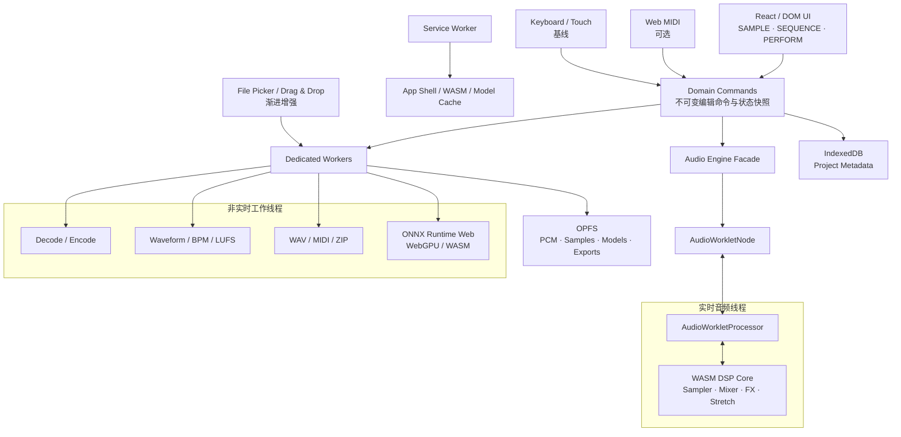

# Koala 能力迁移到纯前端 Web App 的技术可行性分析

> 研究日期：2026-07-28
>
> 目标：评估 Koala Sampler 的产品能力、底层技术和工作流在“所有创作计算均在浏览器本地完成”的 Web App 中能否实现
>
> 研究对象：Koala 2.0.0、公开 MZGL 架构、当前主流浏览器音频与计算平台，以及 LMDJ Creator Workbench 的现有实现
>
> 结论性质：技术可行性与产品架构建议，不是开发排期、最终选型批准或浏览器兼容性承诺

相关研究：

- [Koala Sampler 产品研究与 LMDJ 启示](./2026-07-28-koala-sampler-product-research.md)
- [Koala Sampler 业务流程、UI 布局与流程设计研究](./2026-07-28-koala-sampler-business-flows.md)
- [Koala Sampler 技术栈、底层架构与工具链研究](./2026-07-28-koala-sampler-technical-stack.md)

---

## 0. 执行摘要

### 0.1 最短结论

**可以在纯前端 Web App 中实现一款完整、有生产价值的“Koala-like”采样创作乐器；不能在浏览器中获得 Koala 原生 App 的全部平台集成能力。**

纯浏览器可以可靠覆盖：

- 麦克风录音、文件导入、波形浏览和非破坏编辑；
- Pad 采样、One-shot、Loop、Choke、Mute、Gain、Pan、Pitch；
- 64 Pad、Pattern、Step Sequencer、实时 Take、Quantize、Piano Roll；
- 内置 Mixer、实时效果、Master FX、Performance 手势；
- 应用内部输出的 Resample；
- 本地项目保存、崩溃恢复、PWA 离线启动；
- WAV、MIDI、JSON、ZIP、Stems 等本地导出；
- 键盘、触控以及部分浏览器中的 Web MIDI；
- 桌面优先、条件启用的浏览器端 Stem Split。

纯浏览器不能等价覆盖：

- 扫描、加载和托管任意 VST3、CLAP、AUv3 原生插件；
- 把 Web App 自身作为 AUv3、VST3 或 CLAP 插件插入 DAW；
- 直接兼容依赖 UDP Multicast 的原生 Ableton Link；
- 获得 ASIO/CoreAudio Exclusive 级别的设备、Buffer 和多路输出控制；
- 保证锁屏、切后台、页面冻结或内存回收期间持续录音、渲染和推理；
- 保证所有 Safari/iOS 用户能使用 Web MIDI、输出设备选择和原生文件句柄；
- 把 Koala 的 PyTorch `.pt` 模型或平台二进制直接放进浏览器运行。

### 0.2 产品应按四层能力发布

| 能力层 | 定义 | 典型功能 | 产品承诺 |
| --- | --- | --- | --- |
| **Baseline** | 主流现代浏览器共同具备 | Sample、Sequence、Perform、Resample、WAV/MIDI/ZIP、本地项目 | 正式支持 |
| **Enhanced** | Feature Detection 后启用 | Web MIDI、用户可写文件句柄、输出设备选择 | 渐进增强 |
| **Experimental** | 依赖设备性能、模型和浏览器实现 | WebGPU Stem Split、长视频解码、复杂实时 Stretch | Beta / Desktop-first |
| **Native-only** | 浏览器安全模型或网络模型根本不提供 | VST/CLAP/AUv3 Host、原生 Link、ASIO、多路硬件输出 | 明确不支持或提供桌面桥 |

### 0.3 推荐架构



核心原则：

1. **UI 主线程不承担逐 Sample DSP。**
2. **AudioWorklet 是实时发声和精确事件时钟，`setInterval` 只可做前置调度或 UI 更新。**
3. **WASM 用在稳定、重计算、需要复用 C/C++ 算法的部分，不是所有代码都必须 WASM。**
4. **解码、波形、导出、ZIP 和 ML 推理放 Dedicated Worker，不阻塞触控和绘制。**
5. **大音频不长期以多份 `AudioBuffer`/`Float32Array` 常驻内存；用 OPFS 作为本地素材仓。**
6. **SharedArrayBuffer 是增强路径，不是唯一正确路径；必须有 MessagePort/Transferable 降级。**
7. **按能力检测发布，不用 User-Agent 猜测。**

### 0.4 最重要的架构判断

Koala 原生技术不能按“库对库”直接翻译成 Web。正确迁移单位是：

```text
产品能力 + 实时性要求 + 数据契约 + 线程边界
```

而不是：

```text
CoreAudio → 某个 npm 包
Metal → WebGPU
MZGL → Canvas
```

例如：

- Koala 的 Metal Renderer 不意味着 Web 版必须用 WebGPU；Pad、按钮和大部分布局使用 DOM/CSS 更合适。
- Koala 的 CoreAudio/Oboe 音频回调应迁移为 AudioWorklet，而不是用 `HTMLAudioElement`。
- Koala 的无锁音频消息应迁移为不可变快照、预分配事件和可选的 SharedArrayBuffer Ring Buffer。
- Koala 的 Resample 是一个产品闭环；Web 版即使底层实现不同，也应保留“表演结果重新成为 Sample”的对象转换。

---

## 1. 本报告所说的“纯 Front-end”

### 1.1 允许的基础设施

本文把以下形态视为纯前端：

- 静态站点或 CDN 托管 HTML、CSS、JavaScript、WASM 和模型文件；
- HTTPS；
- Service Worker；
- `Cross-Origin-Opener-Policy` 与 `Cross-Origin-Embedder-Policy` 响应头；
- 浏览器本地的 IndexedDB、OPFS、Cache Storage；
- 用户主动导入和导出的本地文件；
- 所有音频处理、项目编辑、推理和导出均在用户设备完成。

这仍然需要一个能正确返回静态文件和安全响应头的 Host。完整能力不能以 `file://` 双击 HTML 的方式交付。

### 1.2 不允许的服务器职责

严格纯前端模式不包含：

- 上传音频到云端分析；
- 云端 Stem Separation；
- 云端项目存储；
- 云端渲染或导出；
- 服务端 WebRTC Signaling；
- 服务端协作、账号同步或分享；
- 远程任务队列和跨设备恢复。

### 1.3 需要明确的产品代价

纯前端不是“没有后端所以更简单”。复杂度会从云端迁移到：

- 浏览器能力探测；
- 跨浏览器降级；
- 内存和存储配额管理；
- 页面生命周期恢复；
- 大模型分发和缓存；
- 用户设备性能差异；
- 本地项目丢失风险；
- 导出与迁移体验。

因此，纯前端方案适合“本地即时创作工具”，不天然适合“跨设备、可协作、可追踪的云端生产系统”。

---

## 2. 可行性评级规则

| 等级 | 含义 | 发布策略 |
| --- | --- | --- |
| **A：可直接实现** | 标准 Web API 足够，主流浏览器共同支持 | Baseline |
| **B：可用 Web 等价实现** | 原生实现不能复用，但产品结果可以达到 | Baseline / Enhanced |
| **C：条件可行** | 依赖浏览器、设备、权限、格式或性能 | Feature Detection + 降级 |
| **D：仅实验可行** | 能做 Demo，但难以作跨设备产品承诺 | Desktop Beta |
| **E：纯浏览器不可行** | 缺少系统权限、原生 ABI 或网络能力 | 排除 / Native Bridge |

“可行”不等于：

- 与 Koala 使用完全相同的算法；
- 与原生 App 具有相同最低延迟；
- 所有手机都能承载相同项目规模；
- 切后台后仍然继续运行；
- 可以绕开浏览器权限和用户手势要求。

---

## 3. 总体模块迁移矩阵

### 3.1 产品能力

| Koala 能力 | 评级 | Web 实现 | 关键限制 |
| --- | --- | --- | --- |
| Pad 触发与多复音播放 | A | Web Audio + AudioWorklet | 首次发声需用户手势解锁 |
| One-shot / Loop / Gate | A | Worklet Voice Engine 或 AudioBufferSourceNode | BufferSource 一次性，需要 Voice 管理 |
| Choke / Exclusive Group | A | Voice Group 状态机 | 需统一音频时钟 |
| Start / End / Crop | A | 非破坏 Sample Region | 避免每次拖动都复制 PCM |
| Reverse | A | Worker 中反转 PCM 或 Worklet 反向读 | 大素材需避免主线程复制 |
| Normalize | A | Worker 扫 Peak/LUFS，再设置 Gain 或导出时写入 | Peak Normalize 与 LUFS 要区分 |
| Mono / Stereo | A | Worker Downmix / Upmix | 需定义声道规则 |
| Pitch | A | `playbackRate` 或自定义 DSP | `playbackRate` 会同时改变速度 |
| 独立 Time Stretch | B/C | WASM Phase Vocoder / Signalsmith Stretch | CPU、算法质量和 License |
| 自动 Chop / Slice | A/B | Onset/BPM 分析 + Region 生成 | 算法质量决定体验，不是 API 限制 |
| 麦克风录音 | A | `getUserMedia` → Worklet PCM Capture | 权限、设备处理、移动端中断 |
| 文件导入 | A | `<input type=file>`、Drag & Drop | 解码格式依赖浏览器 |
| 视频提取音频 | C | WebCodecs + Demux，或浏览器媒体解码路径 | 容器/Codec/移动端差异 |
| 内部 Resample | A/B | Master Bus → Worklet PCM Writer | 不能依赖主线程定时采样 |
| 64 Pad / Bank | A | Domain Model + Voice Engine | 主要瓶颈是同时活跃 Voice 数，不是 Pad 数 |
| Pattern / Sequence | A | Worklet Transport + Event Queue | UI 定时器不能作为唯一时钟 |
| 实时 Performance Take | A | 音频时钟时间戳事件 | 原始时间与量化结果应分离 |
| Quantize / Swing | A | 非破坏 Event Transform | 需统一 BPM、PPQ 和循环边界 |
| Piano Roll | A | DOM/Canvas + Event Model | 不是音频瓶颈 |
| Mixer / Internal FX | A/B | Web Audio Nodes + WASM Worklet | 自定义复杂 FX 需 CPU 预算 |
| Momentary Performance FX | A/B | 参数自动化 + Worklet | 高频触控消息需要合并/采样 |
| Master Record / Song Record | A | Worklet PCM Capture | 长时录音要流式写 OPFS |
| Stem Split | C/D | ONNX Runtime Web + WebGPU/WASM | 模型转换、内存、移动端性能 |
| Web MIDI Input | C | Web MIDI API | Safari/iOS 不支持 |
| MIDI Export | A | 自写 SMF 或 `@tonejs/midi` | 与设备输入支持无关 |
| Ableton Project 导出 | B/C | 生成 MIDI/WAV/模板文件 | `.als`/`.adg` 版本兼容维护 |
| Ableton Link | E | 无等价纯前端实现 | 浏览器无 UDP Multicast |
| VST3/CLAP/AUv3 Host | E | 只能设计 Web 自有 DSP Module 格式 | 浏览器不能载入原生插件 ABI |
| Koala 作为 DAW Plugin | E | 需要原生 Wrapper / 桌面应用 | Web 页面不能注册为 AU/VST/CLAP |
| 多路硬件输出 | D/E | 部分浏览器仅能选单一输出设备 | 无 ASIO/CoreAudio 多 Bus 控制 |
| 离线安装 | A/B | PWA + Service Worker | iOS 安装、缓存和存储政策不同 |
| 本地项目恢复 | A/B | IndexedDB + OPFS + 自动保存 | 站点数据可能被用户清除/驱逐 |

### 3.2 Koala / MZGL 技术到 Web 的映射

| 原生技术 / 库 | 原职责 | Web 迁移方式 | 迁移判断 |
| --- | --- | --- | --- |
| C++17 产品核心 | 状态、Sequencer、DSP | 业务模型用 TypeScript；DSP 选择性编译 WASM | 不应全量照搬 |
| MZGL App / Layer Tree | 生命周期、UI、输入 | React + DOM + Pointer Events + 状态层 | 产品语义可迁移，代码不可直接复用 |
| Facebook Yoga | Flexbox 布局 | CSS Grid / Flexbox | 直接使用浏览器布局能力 |
| Metal / D3D11 / GLES | UI 与视觉渲染 | DOM/CSS、Canvas 2D、WebGL2、可选 WebGPU | 无需逐后端对译 |
| NanoVG / SVG Parser | 矢量 UI | SVG、Canvas 2D | Web 原生能力更直接 |
| GLM / Poly2Tri | 图形数学、几何 | `gl-matrix`、JS、WASM 或 WebGL Shader | 仅复杂可视化需要 |
| CoreAudio / Oboe / PortAudio | 低延迟音频回调 | AudioContext + AudioWorklet | 产品等价，不是 API 等价 |
| AudioSystem | 设备配置和音频图入口 | Audio Engine Facade | 浏览器设备控制能力较弱 |
| moodycamel 队列 | UI/Audio Thread 通信 | MessagePort；隔离环境下 SAB + Atomics Ring Buffer | 思路可直接迁移 |
| RtMidi / CoreMIDI | MIDI 设备 | Web MIDI + 键盘/触控降级 | 条件可行 |
| Ableton Link + Asio | LAN 时间同步 | 无纯前端兼容层 | 不可迁移 |
| nlohmann/json | JSON 读写 | 原生 `JSON` + Schema Validation | 直接替换 |
| pugixml | XML 读写 | DOMParser / XMLSerializer | 可替换 |
| Midifile | SMF 读写 | `@tonejs/midi` 或专用 SMF Writer | 可替换 |
| Zipper / minizip / zlib | 项目/Stem 打包 | `fflate` Worker、zip.js 或流式 ZIP | 可替换 |
| Speex Resampler | Sample Rate Conversion | WASM Speex、自研 Polyphase 或 OfflineAudioContext | 可迁移，质量需验证 |
| Simple Dynamics | Compressor/Limiter | DynamicsCompressorNode 或自定义 Worklet | 内建节点参数语义不同 |
| LUFSMeter | Loudness | WASM / TS 实现 EBU R128 | 可迁移，需测试基准 |
| Flite | 本地 TTS | SpeechSynthesis 或 Flite WASM | 浏览器 Voice 不确定、不完全离线 |
| Spleeter + PyTorch `.pt` | Stem Split | 转 ONNX/TFJS，ORT Web WebGPU/WASM | 不能直接加载，条件可行 |
| Catch2 | C++ 测试 | Vitest、Playwright；WASM DSP 保留 native tests | 测试意图可迁移 |
| 原生 WebView | Pack Store、Share 等内容页面 | 普通 React Route / Web 页面 | Web 版反而更简单 |
| AUv3/VST3/CLAP Host | 第三方插件生态 | Web 自有 Worklet/WASM Effect SDK | 只能建立新生态，不能兼容 |

---

## 4. 推荐的浏览器运行时架构

### 4.1 线程职责

### UI 主线程

只负责：

- React 状态与页面布局；
- Pointer/Keyboard 事件；
- 波形和 Piano Roll 的视口交互；
- 低频参数展示；
- 发送编辑命令；
- 接收节拍、Meter 和进度摘要。

不得负责：

- 每 128 Frame 的 DSP；
- 大文件全量扫描；
- WAV 编码；
- ZIP 压缩；
- Stem 推理；
- 依赖 `setInterval` 的 Sample-accurate 调度。

### AudioWorklet 实时线程

负责：

- Voice 分配与回收；
- Pad 触发；
- Transport；
- Pattern Event 消费；
- Sample-accurate 参数自动化；
- Mixer、Choke 和 Master Bus；
- 实时 FX；
- Resample / Recording PCM Tap；
- 输出 Meter 的降采样摘要。

[`AudioWorklet`](https://developer.mozilla.org/en-US/docs/Web/API/AudioWorklet) 在独立 Web Audio Rendering Thread 上执行，适合低延迟 DSP。当前浏览器通常以 128 Frame Render Quantum 调用 [`process()`](https://developer.mozilla.org/en-US/docs/Web/API/AudioWorkletProcessor/process)，但实现不应把 128 写死，因为规范允许未来改变 Block Size。

在 48 kHz 下：

```text
128 / 48,000 = 2.667 ms
```

这意味着 Worklet 的一次实时计算必须在大约 2.67 ms 的音频预算内完成；内存分配、日志、DOM、Promise、网络和不可控 GC 都不应进入该路径。

### Dedicated Worker

建议至少拆分为：

1. **Media Worker**：解码、声道转换、波形 Peak、Normalize、Reverse、Chop Analysis；
2. **Export Worker**：WAV、MIDI、ZIP、项目 Manifest；
3. **ML Worker**：Stem Split 与其他可取消推理；
4. **Storage Worker**：长录音和大文件 OPFS 流式 I/O。

早期产品可以合并 Worker，正式承担长素材和模型后再拆。

### Service Worker

只负责：

- App Shell 缓存；
- WASM、Worker、Model 静态资源缓存策略；
- 离线启动；
- 版本更新；
- 可选的下载恢复。

Service Worker 不是实时后台任务系统，不能承担持续音频、录音或长时间 ML 推理。浏览器可以冻结或终止它。

### 4.2 线程通信

### 低频控制

使用 `AudioWorkletNode.port` / `MessagePort`：

- Load Project；
- Replace Sample；
- 设置 Mixer Snapshot；
- Transport Start/Stop；
- Bank/Pattern 切换；
- 请求状态摘要。

### 高频事件

两条实现路线：

**基线方案：预先批量发送时间戳事件**

```text
主线程/Worker 计算未来事件
    → 一次发送一个 Event Batch
    → Worklet 按 Audio Frame 消费
```

优点是无需 Cross-origin Isolation，兼容简单。对 Koala-like Sequencer 已足够。

**增强方案：SharedArrayBuffer Ring Buffer**

```text
UI / Worker Producer
    → Atomics + Fixed Struct Ring
    → Worklet Consumer
```

适合：

- 高频 MIDI/触控事件；
- PCM Capture；
- 长时 Resample；
- 自定义 DSP 参数流；
- Wasm Threads。

SharedArrayBuffer 与 Wasm Pthreads 需要 Cross-origin Isolation。部署通常要返回：

```http
Cross-Origin-Opener-Policy: same-origin
Cross-Origin-Embedder-Policy: require-corp
```

详见 [COOP/COEP 指南](https://web.dev/articles/coop-coep) 和 [Emscripten Pthreads 文档](https://emscripten.org/docs/porting/pthreads.html)。启用后必须重新验证第三方 Script、Iframe、字体、图片、登录 Popup 和 CDN 的 CORS/CORP 策略。

### 4.3 状态模型

建议把状态分成三种：

| 状态 | 示例 | 权威位置 |
| --- | --- | --- |
| Project State | Sample Region、Pad、Pattern、Mixer 参数 | Domain Store / Project Document |
| Runtime State | 当前 Voice、Playhead、Meter、录音指针 | AudioWorklet |
| Asset State | 原始文件、Decoded PCM、Waveform、Export | OPFS + Metadata |

UI 不应逐帧读取整个 Audio Runtime State。Worklet 以 20–30 Hz 发送摘要即可：

```ts
interface AudioRuntimeSnapshot {
  audioFrame: bigint;
  playing: boolean;
  patternId: string | null;
  playheadBeat: number;
  activePadIds: string[];
  peakL: number;
  peakR: number;
  underrunCount: number;
}
```

项目编辑建议使用显式命令：

```ts
type ProjectCommand =
  | { type: "pad.sample.replace"; padId: string; assetId: string }
  | { type: "sample.region.set"; sampleId: string; startFrame: number; endFrame: number }
  | { type: "pattern.note.add"; patternId: string; note: NoteEvent }
  | { type: "mixer.gain.set"; channelId: string; linearGain: number };
```

它比把任意 React State 直接传到音频线程更易于：

- Undo/Redo；
- 自动保存；
- Session Recovery；
- Worklet Snapshot；
- 导出；
- 测试；
- 将来迁移到服务器或 Native Wrapper。

---

## 5. SAMPLE 流程的 Web 可行性

### 5.1 麦克风采样

### 用户操作

1. 点击空 Pad；
2. 点击 Record；
3. 浏览器请求麦克风权限；
4. 用户选择或确认输入；
5. App 显示预备/录音状态；
6. 用户停止，或达到最大时长自动停止；
7. 新素材写入 OPFS，并生成波形与默认 Region；
8. Pad 立即可播放。

### 推荐实现

```text
getUserMedia
  → MediaStreamAudioSourceNode
  → Input Monitor / Meter
  → AudioWorklet PCM Capture
  → Ring Buffer / Transferable Chunks
  → Storage Worker
  → OPFS WAV/PCM Asset
```

[`getUserMedia()`](https://developer.mozilla.org/en-US/docs/Web/API/MediaDevices/getUserMedia) 需要 HTTPS 和用户授权。可以请求：

```ts
{
  audio: {
    echoCancellation: false,
    noiseSuppression: false,
    autoGainControl: false
  }
}
```

但这些只是 Constraint；产品必须通过 `getSupportedConstraints()`、实际 Track Settings 和录音校准确认设备是否接受，不能保证所有移动浏览器都提供“完全原始”的输入。

### 为什么不把 MediaRecorder 当唯一录音核心

[`MediaRecorder`](https://developer.mozilla.org/en-US/docs/Web/API/MediaRecorder) 适合快速录音和压缩容器输出，但：

- 可用 MIME/Codec 因浏览器而异；
- Chunk 时间边界不保证 Sample-accurate；
- 编码格式可能是 WebM/Opus、Ogg 或 MP4/AAC；
- 不适合作为内部 Resample 的确定性 PCM 真相源。

因此：

- 语音备忘式录音可以用 MediaRecorder；
- 乐器 Sample 和 Resample 建议由 AudioWorklet 捕获 Float PCM，再在 Worker 中编码 WAV。

### 主要风险

- iOS 切后台、锁屏、来电、耳机切换会使 AudioContext `interrupted`；
- Bluetooth 输入输出延迟高且不稳定；
- 浏览器可能添加硬件或 OS 级处理；
- Input 和 Output Latency 不能由 Web App 完全控制；
- 第一次录音必须处理权限拒绝和“永久拒绝”状态。

### 5.2 文件导入

### 基线入口

- `<input type="file">`；
- Drag & Drop；
- Clipboard File；
- PWA Share Target（平台允许时）。

### 增强入口

[`showOpenFilePicker()`](https://developer.mozilla.org/en-US/docs/Web/API/Window/showOpenFilePicker) 可以提供持久 File Handle，但目前不是跨浏览器基线，必须保留 `<input>`。

### 解码策略

[`decodeAudioData()`](https://developer.mozilla.org/en-US/docs/Web/API/BaseAudioContext/decodeAudioData) 简单且覆盖常见格式，但：

- 要求完整文件，而不是任意 Fragment；
- 解码结果会被重采样到 AudioContext Sample Rate；
- 大文件常产生“原始 ArrayBuffer + 解码 PCM + 编辑副本”多份内存。

建议：

| 文件规模 | 策略 |
| --- | --- |
| 小 Sample | `decodeAudioData()`，结果直接装入内存 |
| 中等 Song | Worker 解码/分析，PCM 分块写 OPFS |
| 长视频/特殊容器 | WebCodecs + Demux 或明确拒绝/转码提示 |

[`WebCodecs`](https://developer.mozilla.org/en-US/docs/Web/API/WebCodecs_API) 提供低层 `AudioDecoder`/`AudioEncoder`，但不提供完整容器 Demux/Mux，也没有自动把 `AudioData` 连接到 Web Audio 的高级桥。使用它意味着还要引入 MP4/WebM 等容器解析，并维护 Codec Capability Matrix。

### 5.3 波形和非破坏编辑

推荐数据层：

```ts
interface SampleAsset {
  id: string;
  sourceFileName: string;
  sampleRate: number;
  channels: number;
  frameLength: number;
  opfsPath: string;
  waveformPyramidPath: string;
}

interface SampleRegion {
  assetId: string;
  startFrame: number;
  endFrame: number;
  reversed: boolean;
  gain: number;
  fadeInFrames: number;
  fadeOutFrames: number;
}
```

Start/End、Fade、Reverse、Gain 不应立刻生成新文件。只有以下动作需要渲染新 Asset：

- Consolidate；
- Bounce；
- Resample；
- 导出；
- 用户明确选择“应用/冻结编辑”。

波形建议生成多分辨率 Peak Pyramid：

```text
Level 0: 每 256 Frame 一组 min/max
Level 1: 每 1,024 Frame
Level 2: 每 4,096 Frame
...
```

这样缩放和滚动只读取视口需要的数据，不把完整 PCM 送给 Canvas。

`wavesurfer.js` 可以作为 UI 参考或小文件方案，但它不是音频引擎；其官方说明也提醒，完整解码的大文件可能受浏览器内存限制。

### 5.4 Normalize、LUFS 与 Dynamics

### Peak Normalize

完全可行：

```text
Worker 扫描绝对峰值
  → 计算目标 Gain
  → 非破坏记录或导出时应用
```

### Loudness Normalize

需要实现 EBU R128 / ITU-R BS.1770 的：

- K-weighting；
- Momentary / Short-term / Integrated；
- Absolute / Relative Gate；
- True Peak 或近似 Oversampling。

这是算法工程，不是浏览器障碍。Koala 许可中的 LUFSMeter 不能假设可直接用于 Web；可使用自有/WASM 实现并与参考音频和已知工具做 Golden Test。

### Compressor/Limiter

`DynamicsCompressorNode` 适合基础产品，但参数、Knee、Envelope 和 Meter 语义受浏览器实现约束。若需要跨浏览器完全一致、可复现的 Koala-like Sound，应使用自定义 AudioWorklet/WASM DSP。

### 5.5 Pitch 与 Time Stretch

### Pitch + Speed 联动

`AudioBufferSourceNode.playbackRate` 可直接实现经典 Sampler 行为：

```text
+12 semitones = playbackRate 2.0
-12 semitones = playbackRate 0.5
```

优点是便宜、稳定；缺点是 Pitch 和 Duration 一起变化。

### 独立 Time Stretch / Pitch Shift

推荐优先评估：

- [Signalsmith Stretch](https://github.com/Signalsmith-Audio/signalsmith-stretch)：MIT、C++11，官方提供 Web Audio/WASM 路径；
- 自研 Phase Vocoder / WSOLA；
- [Rubber Band](https://github.com/breakfastquay/rubberband)：质量成熟，但 GPL 或商业许可需要产品决策。

工程上有两种模式：

| 模式 | 优点 | 缺点 |
| --- | --- | --- |
| 离线 Render | 质量高、不会挤占实时预算 | 参数修改有等待 |
| Worklet 实时 Stretch | 立即反馈、适合表演 | CPU 高、移动端 Voice 数受限 |

推荐：

- 编辑时先用低成本 Preview；
- 用户停止拖动后在 Worker 生成高质量 Cache；
- Perform 中限制同时启用高质量 Stretch 的 Voice 数；
- 明确质量档位和设备降级。

### 5.6 Chop / Auto Slice

可以完全本地完成。典型流水线：

```text
PCM
  → Downmix / Pre-emphasis
  → Spectral Flux / Energy Envelope
  → Onset Peak Picking
  → 最短间隔与阈值过滤
  → Slice Boundary
  → 用户微调
```

可选增强：

- BPM / Beat Grid；
- Transient 类型分类；
- Silence Trim；
- Zero Crossing 微调；
- 每 Slice 自动 Fade；
- 均分 2/4/8/16；
- 按 Beat/Bar Chop。

[Essentia.js](https://github.com/MTG/essentia.js) 可提供大量 WASM 音频分析算法，但其 AGPL-3.0 许可需要先审查；闭源商业产品不能把“技术可用”直接当作“法律可用”。

### 5.7 Resample

Resample 是纯 Web 版本最值得保留的 Koala 设计。

### 正确音频路径

```text
Voices
  → Channel FX
  → Mixer
  → Master FX
  → Master Tap
      ├─ Destination
      └─ PCM Capture Worklet
           → OPFS
           → New SampleAsset
           → Target Pad
```

### 必须定义的语义

- Pre-fader 还是 Post-fader；
- 是否包含 Master FX；
- 是否包含 Metronome；
- 是否包含 Input Monitor；
- 是否从下一个 Bar 开始；
- 停止时是否自动 Trim；
- 发生 AudioContext Interruption 时如何标记失败；
- 是否保留源 Pad/Pattern/FX Lineage。

### 不推荐

- 用 `setInterval` 定时从 Analyser 读取；
- 通过扬声器再用麦克风录回；
- 长录音先把全部 PCM 堆在主线程数组；
- 录完才开始做唯一一次持久化。

---

## 6. SEQUENCE 流程的 Web 可行性

### 6.1 Transport 和调度

### 可接受的早期实现

主线程 Lookahead Scheduler：

```text
每 20–30 ms 唤醒
  → 将未来 100–150 ms 的 Note
  → 调度到 AudioContext.currentTime
```

这比按 Note 用 `setTimeout` 可靠，因为发声时间由 Audio Clock 决定。

### 正式 Koala-like 实现

Worklet Transport：

```text
Project Pattern Events
  → 转为 Audio Frame / Beat Event
  → 提前批量写入 Event Queue
  → Worklet 逐 Quantum 消费
```

优势：

- Pattern、Take、Automation 使用同一个时钟；
- 页面主线程掉帧不直接破坏节奏；
- Resample 的事件时间和 PCM 时间一致；
- 可以统计 Late Event 和 Underrun；
- Swing、Tempo Change、Loop Boundary 更容易验证。

### 6.2 Note Event 数据

推荐保留原始表演和派生量化：

```ts
interface RawTakeEvent {
  padId: string;
  type: "press" | "release";
  audioFrame: bigint;
  velocity: number;
  source: "touch" | "keyboard" | "midi";
}

interface PatternNote {
  padId: string;
  beat: number;
  durationBeats?: number;
  velocity: number;
  microOffsetBeats: number;
  probability?: number;
}
```

不要在录制瞬间破坏原始时间：

```text
Raw Take
  ├─ Original Playback
  ├─ Quantized View
  ├─ Swing Transform
  └─ MIDI Export
```

这样用户可以改变 Quantize Strength 而不丢失 Groove。

### 6.3 Pattern、Scene 与循环

浏览器对 Pattern 数量没有实质限制。真正的复杂度来自：

- Tempo Map；
- 每 Pattern 不同长度；
- Pattern 切换 Quantization；
- Note-off 跨 Loop；
- Loop Voice 在 Pattern 切换时是否持续；
- FX Automation 生命周期；
- Undo/Redo 与 Take 录制的事务边界。

建议把切换定义为：

```ts
interface LaunchRequest {
  targetPatternId: string;
  quantization: "immediate" | "beat" | "bar" | "2-bars";
  requestedAtFrame: bigint;
}
```

Worklet 计算实际 Launch Frame，并回传确认，UI 不自行假设切换已经发生。

### 6.4 Piano Roll 与 Step Grid

这部分完全适合 Web：

- DOM/SVG：可访问性和少量 Note；
- Canvas：大量 Note、高频滚动；
- WebGL/WebGPU：只在超大工程或复杂可视化时必要。

建议 UI 视图读取派生 View Model，不让 Canvas 自己持有业务真相：

```text
Pattern Document
  → Viewport Query
  → Visible Note Rects
  → Canvas/SVG
```

编辑命令仍写回 Pattern Document，便于 Undo、测试和导出。

### 6.5 Web MIDI

[`Web MIDI API`](https://developer.mozilla.org/en-US/docs/Web/API/Web_MIDI_API) 能支持：

- Note On/Off；
- Velocity；
- CC；
- Pitch Bend；
- Device Connect/Disconnect；
- MIDI Clock 的部分自定义实现。

但它是增强功能：

- Chromium Desktop/Android 可用；
- 当前 Firefox Desktop 可用；
- Safari、iOS Safari 和 Firefox Android 不能作为支持前提；
- 需要 HTTPS、用户授权和 Permission Policy；
- SysEx 需要额外 `sysex: true` 权限，不能作为普通 Controller 的必需路径。

Baseline 必须保留：

- Touch；
- Pointer；
- QWERTY Keyboard；
- 可配置 Key Map；
- 屏幕 Pad；
- 可选 Gamepad（如果产品有价值）。

MIDI 导出与 Web MIDI 输入是两件事。Safari 即使不能接 MIDI 设备，仍然可以生成标准 MIDI 文件。

### 6.6 Timing 风险

### 主线程卡顿

来源：

- React 大量 Re-render；
- 波形重绘；
- ZIP；
- JSON 大对象；
- DevTools；
- GC；
- 页面在后台被节流。

缓解：

- 发声在 Worklet；
- UI 只订阅 20–30 Hz Snapshot；
- 波形 Worker + OffscreenCanvas（可用时）；
- 大对象 Transfer，不 Clone；
- 避免在每个 Pointer Move 产生完整 Project Snapshot；
- 调度窗口和 Late Event 指标可观测。

### 页面切后台

浏览器可能：

- 降低 Timer 频率；
- 冻结页面 Task Queue；
- 暂停/中断 AudioContext；
- 在内存压力下丢弃页面。

[Chrome Page Lifecycle](https://developer.chrome.com/docs/web-platform/page-lifecycle-api) 和 [Page Visibility](https://developer.mozilla.org/en-US/docs/Web/API/Page_Visibility_API) 都明确说明后台生命周期不由页面控制。

恢复策略：

1. 监听 `visibilitychange` 与 AudioContext `statechange`；
2. 每个重要编辑短 Debounce 自动保存；
3. 恢复后重建 Transport 起点；
4. 丢弃已经过期的大量事件，禁止“醒来瞬间补播几百个 Note”；
5. 未完成 Recording 标记为 Interrupted Take；
6. 向用户明确显示需要点击 Resume Audio。

---

## 7. PERFORM 流程的 Web 可行性

### 7.1 Mixer

基础 Mixer 可用 Web Audio Node：

```text
Voice
  → Pad Gain
  → Pad Pan
  → Channel/Bus FX
  → Channel Gain
  → Master FX
  → Destination
```

可行控件：

- Volume；
- Pan；
- Mute；
- Solo；
- Send；
- EQ；
- Compressor；
- Limiter；
- Meter；
- Channel Record Arm。

如果要保证跨浏览器一致声音，关键 EQ、Filter、Saturation、Limiter 和 Time FX 应逐步迁到自定义 Worklet/WASM，而不是长期依赖所有内建 Node 的实现细节。

### 7.2 Performance FX

Koala 的 Momentary FX 本质是：

```text
手指位置
  → 参数映射
  → 平滑与限幅
  → DSP Parameter
  → 松手恢复/保留
```

Web 可完整实现，但要避免每个 `pointermove` 都产生 React 全树更新。

推荐路径：

```text
Pointer Event
  → Lightweight Controller
  → 60/120 Hz 合并
  → AudioParam Automation 或 SAB Param Lane
  → UI Store 低频同步
```

参数必须定义：

- Mapping Curve；
- Smoothing Time；
- Gesture Start Snapshot；
- Release Behavior；
- 多点触控冲突；
- Automation Record；
- Cancel / Pointer Capture Lost。

### 7.3 FX 迁移难度

| FX 类型 | Web 难度 | 建议 |
| --- | --- | --- |
| Gain / Pan / Mute | 低 | 原生 Node |
| Filter / Simple EQ | 低 | Biquad 或 WASM |
| Delay / Echo | 低 | DelayNode 或 Worklet |
| Compressor | 低/中 | 原生 Node 起步 |
| Bitcrusher | 低 | Worklet |
| Gate / Trance | 低 | Audio Clock Automation |
| Stutter / Beat Repeat | 中 | Worklet Circular Buffer |
| Vinyl Stop / Tape Stop | 中 | Playback/Resample Engine |
| Reverb | 中/高 | Convolver 或算法 Reverb |
| Pitch Shift | 高 | WASM DSP |
| Spectral FX | 高 | FFT/WASM，限制 Voice/FFT Size |
| Master Limiter | 中/高 | 自定义并做 True Peak 验证 |

### 7.4 Performance Recording

应同时支持两种不同对象：

1. **Event Take**：Pad、Pattern、FX Gesture 的可编辑事件；
2. **Audio Bounce**：Master 输出的不可逆声音结果。

```text
Performance
  ├─ Raw Events → 可重放、量化、编辑
  └─ Master PCM → WAV / Resample / Share
```

不要用音频录音替代事件录制，也不要用事件录制假装已经记录所有自定义 DSP 的最终声音。

### 7.5 原生插件 Host：明确不可迁移

浏览器不能：

- 扫描用户系统上的 VST3/CLAP/AUv3；
- `dlopen` 原生插件；
- 运行任意 Native ABI；
- 弹出插件原生编辑器；
- 让第三方插件直接访问音频设备和文件系统；
- 将插件进程隔离模型原样搬入页面。

可建立自己的 Web Effect Module：

```text
Signed Manifest
  + AudioWorklet JS/WASM
  + Parameter Schema
  + Optional UI Component
  + Preset State
```

但它是一个新插件生态，不兼容现有 VST/CLAP/AU。还需要解决：

- 供应链签名；
- CSP；
- 代码审查；
- CPU 配额；
- Worklet 崩溃隔离；
- 版本固定；
- 项目可复现；
- 第三方代码对 OPFS/网络的权限。

如果“托管行业插件”是硬需求，应使用 Native Desktop Wrapper 或独立桌面产品，而不是把纯前端定义拉宽。

### 7.6 多输出和音频设备控制

浏览器的 [`AudioContext.setSinkId()`](https://developer.mozilla.org/en-US/docs/Web/API/AudioContext/setSinkId) 目前主要是 Chromium 能力，不能作为全平台基线。

即使支持，也不等价于：

- ASIO Driver；
- CoreAudio Aggregate Device；
- Exclusive Mode；
- 固定 Hardware Buffer Size；
- 多 Bus 分配到不同物理输出；
- Sample Clock 选择；
- 稳定 Round-trip Latency 报告。

[`latencyHint`](https://developer.mozilla.org/en-US/docs/Web/API/AudioContext/AudioContext) 只是请求，浏览器可以忽略。`baseLatency` 是观测信息，不是硬件控制。

---

## 8. Stem Split 与浏览器端 ML

### 8.1 Koala 原实现不能直接搬

Koala 公开证据指向：

```text
Spleeter Model
  + PyTorch Runtime
  + 可选下载约 150 MB Model
```

浏览器不能直接加载：

- 原生 PyTorch Runtime；
- `.pt` 中任意 Python/PyTorch 运算；
- 平台动态库；
- CUDA/MPS 后端。

需要独立的模型迁移项目：

```text
原模型
  → 固化输入/输出和前后处理
  → Export ONNX / TensorFlow Graph
  → Operator Compatibility Audit
  → 数值与听感 Parity
  → Quantization / Graph Optimization
  → ORT Web / TFJS Runtime
```

### 8.2 可选 Runtime

### ONNX Runtime Web

[ONNX Runtime Web](https://onnxruntime.ai/docs/tutorials/web/) 支持：

- WASM；
- WebGL；
- WebGPU；
- WebNN（环境允许时）。

推荐优先：

```text
WebGPU
  → WASM SIMD + Threads
  → WASM SIMD
  → 不支持 / 改用低成本功能
```

但必须按模型 Operator 实测。[WebGPU Execution Provider](https://onnxruntime.ai/docs/tutorials/web/ep-webgpu.html) 可用不等于所有模型、设备和 Operator 都能高效运行。

### TensorFlow.js

[TensorFlow.js Model Conversion](https://www.tensorflow.org/js/guide/conversion) 可以转换 SavedModel/Keras，支持分片权重和量化，但不支持的 Operator 仍然会阻断迁移。

### 不应同时维护过多 Runtime

早期不要为了“兼容”同时维护 ORT、TFJS 和自研 Runtime。建议：

1. 用目标模型做 Operator Audit；
2. 选择一个主 Runtime；
3. 一个后备 EP；
4. 不满足门槛的设备隐藏该功能。

### 8.3 内存预算

48 kHz、Float32 解码 PCM：

| 时长 | Mono | Stereo | 四路 Mono Stem |
| --- | ---: | ---: | ---: |
| 1 分钟 | 11.0 MiB | 22.0 MiB | 43.9 MiB |
| 3 分钟 | 33.0 MiB | 65.9 MiB | 131.8 MiB |
| 5 分钟 | 54.9 MiB | 109.9 MiB | 219.7 MiB |
| 10 分钟 | 109.9 MiB | 219.7 MiB | 439.5 MiB |

这只是最终 PCM，不包含：

- 原始压缩文件；
- Input Tensor；
- Output Tensor；
- STFT Complex Tensor；
- Window / Overlap Buffer；
- Model Weight；
- WebGPU Buffer；
- JS ↔ WASM Copy；
- 导出副本；
- Waveform Cache。

一个 150 MB 模型叠加 5 分钟 Stereo Input、4 Stem Output 和中间 Tensor，峰值很容易超过 0.5–1 GB。Wasm32 理论地址空间并不是可用移动内存保证。[WebAssembly Memory](https://developer.mozilla.org/en-US/docs/WebAssembly/Reference/JavaScript_interface/Memory/Memory) 的地址上限和浏览器/设备实际可分配内存是两回事；Emscripten Memory Growth 还可能引发明显停顿。

### 8.4 推荐推理策略

```text
用户选择 Stem Split
  → Capability + Memory Preflight
  → 下载/校验 Model
  → 缓存到 Cache/OPFS
  → Chunked Decode
  → Worker Inference
  → Chunked Output to OPFS
  → Loudness/Phase/Duration QA
  → 创建 Stem Assets
```

产品必须提供：

- 下载大小；
- 预计时间；
- 剩余空间；
- 取消；
- 失败原因；
- 页面必须保持前台的提示；
- 低内存设备的明确拒绝；
- 原文件不丢失；
- 中间文件清理；
- 模型版本；
- 输出可复现性。

### 8.5 建议的设备策略

| 设备层 | 策略 |
| --- | --- |
| 高性能桌面 + WebGPU | 完整模型、3–5 分钟上限起步 |
| 普通桌面 + WASM Threads | 更短时长或 Quality/Speed 档 |
| 高端平板 | Beta，严格内存/时长 Gate |
| 普通手机 | 不作为首发承诺；可提供 Preview/短片段 |
| 无 Isolation / 无 WebGPU | WASM 单线程短片段或隐藏功能 |

### 8.6 质量 Gate

不能只看“模型跑完”。至少要比较：

- Stem 数量与长度；
- Sample Rate；
- NaN/Inf；
- Peak；
- Clipping；
- 混回 Reconstruction Error；
- SDR/SIR/SAR 或适合产品的代理指标；
- 人工盲听；
- 与原生/服务器参考实现的切片对齐；
- 不同 Runtime/EP 的数值差异；
- Cancel/Resume 后文件完整性。

---

## 9. 存储、项目和导出

### 9.1 推荐本地存储分层

| 存储 | 用途 | 不应承载 |
| --- | --- | --- |
| IndexedDB | Project Metadata、索引、设置、Undo Checkpoint | 大量长期 PCM Blob |
| OPFS | Sample、PCM、Waveform、Model、临时渲染、Export | 用户唯一备份 |
| Cache Storage | App Shell、WASM、Worker、可重新下载 Model | 用户 Project Truth |
| Memory | 活跃 Voice、短 Sample、可视区数据 | 全工程多份复制 |
| 用户文件系统 | 显式 Export / Backup | 无权限时的自动写入 |

[`OPFS`](https://developer.mozilla.org/en-US/docs/Web/API/File_System_API/Origin_private_file_system) 面向站点私有高性能文件，Worker 中可使用同步 Access Handle。它适合音频 Asset Store，但：

- 用户不能像普通文件夹一样浏览；
- 配额由浏览器决定；
- 清除站点数据会删除；
- 在存储压力下可能被驱逐；
- 不是云备份。

应调用 [`navigator.storage.persist()`](https://developer.mozilla.org/en-US/docs/Web/API/StorageManager/persist) 请求持久存储，但浏览器可能拒绝。

### 9.2 项目目录建议

```text
/projects/{projectId}/
  project.json
  autosave/
    checkpoint-000123.json
  assets/
    {assetId}.pcm
    {assetId}.meta.json
  waveform/
    {assetId}.peaks
  takes/
    {takeId}.events
    {takeId}.wav
  renders/
    {renderId}.wav.partial
  exports/
    {exportId}.zip.partial
```

Manifest 使用稳定 ID 和相对路径，不持有临时 Blob URL。

### 9.3 自动保存

触发点：

- Sample 导入成功；
- Pad Assignment；
- Region Edit 结束；
- Pattern 命令；
- Take Stop；
- Mixer Gesture 结束；
- Transport Stop；
- 页面隐藏；
- 版本迁移前。

原则：

- Command Log 短 Debounce；
- 大资产先完成原子写，再更新 Manifest；
- 临时文件使用 `.partial`；
- 启动时清理孤儿；
- 永远不依赖 `beforeunload` 完成唯一保存；
- Project Schema 必须版本化和可迁移。

### 9.4 配额与驱逐

产品需要 Storage Dashboard：

```text
已用空间
预计剩余空间
Project/Model/Cache 分类
清理临时文件
删除 Model
导出备份
恢复失败提示
```

进入长录音、Stem Split 或 Export 前调用 `navigator.storage.estimate()`，预留中间副本空间。

### 9.5 WAV 导出

完全可行：

1. Worklet/Offline Render 产生 PCM；
2. Worker 写 RIFF/WAVE Header；
3. 分块写 Data；
4. 完成后修正 Size；
5. 保存到 File Handle 或生成 Download。

格式建议：

- 16-bit PCM：分享与通用；
- 24-bit PCM：制作；
- 32-bit Float：内部交换；
- 明确 Sample Rate 和 Dither。

长音频不要先创建一个巨型 JS Array，再创建第二个 Blob。

### 9.6 MIDI 导出

完全可行。需要定义：

- PPQ；
- Tempo Meta Event；
- Time Signature；
- Note Mapping；
- Velocity；
- Note Duration；
- Pattern/Scene 排列；
- Swing 是固化时间还是元数据；
- Pad Name Marker；
- Loop Boundary。

### 9.7 ZIP / Project 导出

推荐使用 Worker 中的 [fflate](https://github.com/101arrowz/fflate) 或同类流式库。

Export Manifest 应包含：

```json
{
  "schema": "product.project.v1",
  "project_id": "project-...",
  "created_at": "...",
  "app_version": "...",
  "audio_sample_rate": 48000,
  "files": [
    {
      "path": "samples/kick.wav",
      "sha256": "...",
      "bytes": 123456
    }
  ]
}
```

这样能验证：

- 文件缺失；
- 损坏；
- 版本；
- 导入迁移；
- 可复现性。

### 9.8 Ableton 导出

### 可行

- WAV Stem；
- MIDI；
- Sample 文件夹；
- README/Mapping；
- 固定版本模板中的 XML/资源替换；
- `.adg` 等已知格式的受控生成。

### 条件可行

直接生成 `.als`：

- 技术上可以生成文件；
- 但格式版本、压缩、内部 ID、Warp Marker 和设备引用需要持续兼容测试；
- 不能仅凭一次 Ableton 成功打开就声称长期兼容；
- 需要真实 Ableton Live 版本矩阵和继续编曲验收。

### 不可行

- 无用户动作直接写入任意 Ableton Project 目录；
- 在纯浏览器里启动 Ableton 并完成插件状态绑定；
- 把 Web App 作为 Ableton 插件实例保存。

---

## 10. 浏览器兼容性矩阵

以下是 2026-07 当前主流发布版的产品级概括；精确版本应在发布前重新核验。

| 能力 | Chromium Desktop | Firefox Desktop | Safari macOS | Chrome Android | Firefox Android | Safari iOS |
| --- | --- | --- | --- | --- | --- | --- |
| Web Audio | 是 | 是 | 是 | 是 | 是 | 是 |
| AudioWorklet | 是 | 是 | 是 | 是 | 是 | 是 |
| OPFS | 是 | 是 | 是 | 是 | 是 | 是 |
| Service Worker / PWA Core | 是 | 是 | 是 | 是 | 是 | 是 |
| SharedArrayBuffer | 隔离后 | 隔离后 | 隔离后 | 隔离后 | 隔离后 | 隔离后 |
| Web MIDI | 是 | 是 | 否 | 是 | 否 | 否 |
| WebGPU | 是 | 是 | 是 | 是 | 否 | 是 |
| WebCodecs AudioDecoder | 是 | 是 | 是 | 是 | 否 | 是 |
| `showOpenFilePicker` | 是 | 否 | 否 | 部分/新版 | 否 | 否 |
| `AudioContext.setSinkId` | 是 | 否 | 否 | 是 | 否 | 否 |

注意：

1. “API 存在”不表示特定 Codec、GPU Operator、MIDI 设备或文件权限一定可用。
2. Safari/iOS 需要真实设备验证 AudioContext 中断、PWA、存储和大内存行为。
3. WebGPU 必须检查 `navigator.gpu`、Adapter、Limits、Feature 和实际 Model Run。
4. 所有增强功能都应以 Capability Adapter 统一暴露。

```ts
interface RuntimeCapabilities {
  audioWorklet: boolean;
  crossOriginIsolated: boolean;
  sharedArrayBuffer: boolean;
  webMidi: boolean;
  webGpu: boolean;
  audioDecoder: boolean;
  opfs: boolean;
  fileSystemAccess: boolean;
  audioOutputSelection: boolean;
  persistentStorage: "unknown" | "granted" | "denied";
}
```

---

## 11. 性能与资源瓶颈

### 11.1 音频延迟

端到端 Pad 延迟由以下部分组成：

```text
Input Event
+ UI/Main Thread Dispatch
+ Worklet/Event Queue
+ Web Audio Render Quantum
+ Browser Output Buffer
+ OS/Driver Buffer
+ Audio Interface / Bluetooth
```

Web App 可控制前半段，不能控制整个链路。

建议把延迟当作实测指标：

- 记录 Event Timestamp；
- Worklet 记录实际消费 Frame；
- Loopback 录制扬声器/线缆输出；
- 分有线、内建扬声器、USB、Bluetooth；
- 分 Desktop、Mobile、PWA、Browser Tab。

Bluetooth 不能作为低延迟乐器体验的验收设备。

### 11.2 CPU Budget

每个 Audio Quantum 必须完成：

```text
活跃 Voice 采样
+ 插值 / Resample
+ Envelope
+ Pad/Channel FX
+ Mixer
+ Master FX
+ Meter
+ PCM Tap
```

建议实时路径：

- 预分配 Voice；
- 避免动态 Array/Object；
- 使用 TypedArray；
- 避免异常；
- 无日志；
- 参数按 Block 或必要时 Sample Ramp；
- FFT Plan 复用；
- 为高成本 FX 设置全局实例数和质量档。

### 11.3 Voice 数

“64 Pad”不是“64 Voice”。产品需定义：

- 同一 Pad 是否允许重叠；
- One-shot 最大尾音；
- Choke Group；
- Loop Voice；
- Time-stretch Voice；
- FX Tail；
- Voice Stealing。

建议性能测试至少覆盖：

```text
32 普通 One-shot Voice
16 Stereo Voice
8 实时 Stretch Voice
4 Convolution/复杂 FX 场景
Resample 同时开启
UI 波形滚动同时开启
```

具体门槛由目标设备实测，不从桌面开发机外推。

### 11.4 JS/WASM 边界

WASM 有价值的部分：

- Sample Interpolation；
- Resampler；
- Stretch/Pitch；
- FFT/Spectral FX；
- LUFS；
- Stem 前后处理；
- WAV/Codec；
- 已有 C/C++ DSP 复用。

TS/JS 更合适的部分：

- Project Model；
- Command；
- Schema；
- UI；
- Routing 配置；
- MIDI Mapping；
- Export Manifest；
- Feature Detection。

常见反模式：

- 每个 Audio Block 在 JS/WASM 间复制大数组；
- 每个 Param 变化调用高成本 Binding；
- WASM Memory Growth 发生在实时线程；
- 把整个 Project JSON 塞进 Worklet；
- 为了“性能”把可维护的业务逻辑全部写成 C++。

### 11.5 大文件与内存复制

5 分钟 48 kHz Stereo Float32 已约 110 MiB。下面的操作都可能再复制一次：

- `arrayBuffer()`；
- `decodeAudioData()`；
- `postMessage` 未 Transfer；
- Reverse；
- Normalize Render；
- WAV Blob；
- ZIP；
- WebGPU Upload/Readback。

应通过：

- Transferable；
- Shared Memory；
- Chunk；
- OPFS；
- Region View；
- Streaming Encoder；
- Cache 生命周期；
- 明确 Asset Ownership；

控制峰值内存。

### 11.6 GPU 不是免费加速

WebGPU 适合：

- Stem 模型；
- 大矩阵；
- Spectrogram；
- 部分批量分析。

不适合默认承担：

- Pad 按钮；
- 普通波形；
- 小型 Mixer；
- 每个触控事件；
- 低复杂度 Biquad。

GPU 的成本包括：

- Buffer 上传；
- Pipeline 初始化；
- Shader 编译；
- Readback；
- 设备丢失；
- 功耗；
- 移动端降频。

### 11.7 页面生命周期

这是纯前端方案无法消除的系统瓶颈：

- 页面可能 Freeze；
- AudioContext 可能 Suspend/Interrupt；
- OS 可以回收 Tab；
- 长任务不能保证完成；
- PWA 并不获得原生后台音频特权。

产品承诺必须写成：

> 请保持应用在前台，直到录音、分离或导出完成。

并用短事务、Checkpoint 和恢复机制减轻后果。

---

## 12. 三种迁移路线

### 12.1 路线 A：Web Native 重建

```text
React + TypeScript
Web Audio Nodes
AudioWorklet JS
Worker
IndexedDB / OPFS
```

### 优点

- 最符合浏览器生态；
- DOM 可访问性、文本、输入法和响应式布局好；
- Bundle 和调试简单；
- 前端团队上手快；
- 不被 MZGL 内部设计约束。

### 缺点

- 原生 C++ 业务/DSP 复用少；
- 复杂 DSP 用 JS Worklet 的性能和稳定性需要严控；
- 与原生声音算法可能产生差异。

### 适用

- 从零做 Koala-like 产品；
- 核心 FX 较简单；
- 先验证工作流；
- 不追求与 Koala 二进制声音一致。

### 12.2 路线 B：React Shell + WASM DSP（推荐）

```text
React / TypeScript Product
  + AudioWorklet Transport
  + C/C++/Rust WASM DSP
  + Worker Media/ML/Export
```

### 优点

- UI 使用 Web 最强项；
- DSP 使用 Native/WASM 最强项；
- 可以逐模块迁移；
- 音频算法可在 Native 与 Web 共享 Golden Tests；
- 更容易保持实时路径无 GC。

### 缺点

- JS/WASM ABI 和内存所有权复杂；
- AudioWorklet Build、Source Map 和 Debug 门槛更高；
- Thread/SAB 部署需要 COOP/COEP；
- 需要专门音频工程能力。

### 适用

- 正式乐器产品；
- 有 C/C++ DSP；
- 需要 Stretch、LUFS、复杂 FX；
- 需要在浏览器中建立长期音频引擎。

[Emscripten Wasm Audio Worklets](https://emscripten.org/docs/api_reference/wasm_audio_worklets.html) 可以把 C/C++ 音频代码放入 Worklet Runtime，并减少临时 JS 对象与 GC 风险。

### 12.3 路线 C：MZGL/C++ 整体 Emscripten

```text
Koala-like C++ App
  → Emscripten
  → Canvas/WebGL
  → Web Audio Glue
```

### 优点

- 理论上最大化 C++ UI/业务复用；
- 可以共享更多 Native 状态逻辑；
- 视觉可能更接近原生自绘 UI。

### 缺点

- 公开 MZGL 没有一条可视为成熟产品的 Web Audio/Browser Platform Backend；
- Metal、D3D、CoreAudio、Oboe、PortAudio、插件和文件系统层不能自动转换；
- 自绘 UI 的文本、输入法、可访问性、Selection、弹窗和响应式 Web 集成成本高；
- Canvas App 与 React/路由/SEO/浏览器控件协作差；
- Bundle、启动、内存、调试和 Crash 边界更复杂；
- 仍然要重写系统权限、文件、MIDI、PWA 和 AudioWorklet Glue。

### 判断

不建议作为默认产品路线。只有在以下条件同时成立时才评估：

- 拥有可复用的完整 C++ 产品核心；
- UI 必须像游戏引擎一样跨平台像素一致；
- 团队熟悉 Emscripten 和浏览器音频；
- 可接受 Canvas-first 的可访问性和 Web 集成代价；
- 已完成一个真实 AudioWorklet PoC。

### 关键澄清

“C++ 能编译成 WASM”不等于“原生 App 能编译成 Web App”。平台 Backend、线程、文件、权限、音频、渲染和生命周期仍然是产品工程。

---

## 13. 不可迁移能力及平替

| 原生能力 | 为什么不可迁移 | 纯 Web 平替 | 何时需要 Native |
| --- | --- | --- | --- |
| AUv3/VST3/CLAP Host | 原生 ABI、动态库、系统扫描 | 内建 FX + Web Worklet Module | 必须兼容现有 Plugin |
| Koala 作为 DAW Plugin | 浏览器不能注册插件 Binary | WAV/MIDI/Stem 导出 | 要求 DAW 内实例化 |
| Ableton Link | 依赖 LAN 自动发现/UDP Multicast | MIDI Clock；同页/同源同步；自建服务同步 | 要求与 Link App 互通 |
| ASIO/CoreAudio Exclusive | 浏览器隔离硬件和 Driver | Low-latency Hint + 有线设备建议 | 固定 Buffer、专业多路 I/O |
| 多 Bus 硬件输出 | Web Audio 通常只有单 Destination | 内部 Bus 后导出 Stems | 现场多通道演出 |
| 后台持续运行 | Browser/OS 可 Freeze/Discard | 前台提示、Checkpoint、恢复 | 锁屏录音/后台渲染是核心 |
| 全平台 MIDI | Safari/iOS 缺 Web MIDI | Touch/Keyboard、导出 MIDI | iOS 外设控制是核心 |
| 任意 Codec/Container | Browser Codec 与 Demux 有限 | 支持清单、WAV/MP3、用户转码 | 必须兼容专业媒体格式 |
| 系统文件任意路径 | 权限沙盒 | File Picker + Export Download | 自动监控/覆盖外部文件 |
| 原生设备私有协议 | USB/SysEx/Driver 权限有限 | 标准 MIDI Mapping | SP-404 深度双向集成 |

### 13.1 Ableton Link 的边界

[Ableton Link](https://github.com/Ableton/link) 是原生 C++ 库，通过本地网络自动发现 Peer，并处理系统/音频时钟与输出延迟。浏览器没有原始 UDP Multicast Socket，因此：

- 不能把 Link C++ 编成 WASM 就自动获得网络能力；
- WebTransport 是 Client-Server HTTP/3，不是 LAN Multicast；
- WebRTC 通常需要 Signaling，跨网络还可能需要 STUN/TURN；
- 严格无后端模式无法建立通用跨设备发现。

平替分级：

1. 同页面多个模块：共享 Worklet Transport；
2. 同源多 Tab：BroadcastChannel，但不等于音乐级网络同步；
3. MIDI 硬件：Web MIDI Clock，浏览器支持时；
4. 局域网/互联网协作：需要服务端 Signaling/Clock；
5. 真 Link 兼容：Native Bridge。

### 13.2 Native Wrapper 的价值

如果未来允许不是“纯前端”，可以保留同一 Web Product，增加 Native Shell：

```text
Web UI / Project Model
        ↓
Native Bridge
        ├─ Plugin Host
        ├─ Ableton Link
        ├─ Audio Driver / MIDI
        ├─ File System
        └─ Background Lifecycle
```

但不要在首版纯 Web 架构中预埋一个模糊、无契约的全能 Bridge。先定义明确 Capability Interface：

```ts
interface PlatformAudioCapabilities {
  supportsNativePlugins: boolean;
  supportsAbletonLink: boolean;
  supportsMultiOutput: boolean;
}
```

---

## 14. 安全、隐私和供应链

### 14.1 本地音频隐私

纯前端的优势：

- 原始音频不上传；
- Stem、Take 和 Project 留在设备；
- 可离线工作；
- 降低服务端音频数据合规范围。

但必须真实做到：

- 不把文件内容发送给 Analytics/Error Reporting；
- 日志只记录尺寸、格式、阶段和匿名错误码；
- CSP 限制第三方 Script；
- 清楚说明模型从哪里下载；
- 提供“删除本地项目与缓存”；
- 导出前显示包含的文件。

### 14.2 Cross-origin Isolation 影响

启用 COOP/COEP 会改变：

- Popup 与 Opener；
- 第三方登录；
- 嵌入页面；
- 外部图片/音频；
- CDN；
- Analytics；
- Support Widget。

必须在产品层提前选择：

1. 全站隔离；
2. 仅 `/studio` 隔离；
3. 不使用 SAB/Wasm Threads，保持更宽泛集成。

音频 Studio 与 Marketing Site 分路由/Origin 是常见可控方案。

### 14.3 Web DSP Module

如果允许第三方 Web Effect：

- 不执行远程任意代码；
- Package 固定 Hash；
- Worklet 代码不直接持有 DOM；
- 网络权限默认关闭；
- 参数 Schema 验证；
- CPU 超限自动 Bypass；
- 项目固定 Module Version；
- 导出包含 License/Attribution；
- 安全更新不静默改变旧项目声音。

---

## 15. 测试与可观测性

### 15.1 单元测试

- Pattern/Event Math；
- Quantize/Swing；
- Loop Boundary；
- Voice Stealing；
- Choke Group；
- Project Migration；
- WAV/MIDI/ZIP；
- Asset Hash；
- DSP Golden Vector；
- JS/WASM Parity。

### 15.2 Offline Audio Test

使用 `OfflineAudioContext` 或离线 WASM Render：

- 给定 Event；
- 渲染固定 PCM；
- 比较 Hash、Tolerance、Peak、RMS、LUFS；
- 检查 Click、Tail 和 Length；
- 在浏览器矩阵中跑。

注意：如果依赖浏览器内建 DSP，不同浏览器的输出不一定 Bit-exact，应使用容差和感知指标。

### 15.3 实时测试

建议记录：

- Worklet Quantum Count；
- Worst/Mean Processing Time；
- Late Event；
- Event Queue Fill；
- PCM Ring Overrun/Underrun；
- Active Voice；
- AudioContext State；
- Resample Dropped Frame；
- Worker Task Duration；
- OPFS Write Throughput；
- Model Load/Inference Time；
- Peak Memory 的设备代理指标。

这些指标只进入本地 Debug Panel 或经过隐私审查的匿名 Telemetry。

### 15.4 浏览器 E2E

Playwright 可验证：

- 导入；
- 编辑；
- Pattern 命令；
- 自动保存；
- 刷新恢复；
- 导出文件结构；
- Permission Denied UI；
- Capability 降级。

真实音频延迟、MIDI、Microphone、PWA 和 iOS Interruption 仍需要物理设备测试，Headless 绿色测试不能替代。

### 15.5 推荐验收目标

以下是 PoC 应验证的目标，不是未经实测的承诺：

| 指标 | 建议初始 Gate |
| --- | --- |
| Worklet 稳定性 | 目标设备连续播放 10 分钟，无应用层 Underrun |
| 普通 Voice | 32 Voice + Mixer + 基础 FX 稳定 |
| Pad 有线端到端延迟 | Desktop 目标 ≤20 ms；Mobile 目标 ≤35 ms |
| Sequencer 内部误差 | 不超过一个 Render Quantum；正常应 Sample-frame 对齐 |
| 后台恢复 | 无过期 Note Burst；明确恢复状态 |
| 录音 | 10 分钟分块写入，无主线程巨型 Blob |
| 导出 | 5 分钟 WAV/ZIP 不产生完整 PCM 的额外多份复制 |
| 自动保存 | 强制刷新后恢复到最后一次已确认命令 |
| Stem Split | 30/60/180 秒分档实测时间、内存、质量和取消 |

门槛应按目标市场设备重新标定。

---

## 16. 针对 LMDJ 当前 Web 的具体判断

### 16.1 已经具备的基础

当前 LMDJ Web 已经有：

- React 19 + TypeScript + Vite；
- `lmdj.patch.v1` / `patch.json` 单一公开契约；
- Patch Loader；
- 固定 16 Pad；
- Keyboard；
- Web MIDI 的 Capability/Denied/Disconnected 状态；
- `AudioBufferSourceNode` + Gain；
- One-shot / Loop；
- Full Mix 与普通 Material 的互斥；
- Pattern Lookahead Playback；
- Creator Export；
- Job/Submission Recovery。

这些证明 LMDJ 已经是一台基础 Browser Sampler，不需要为了采用 Koala 思路而重写整个 Web App。

### 16.2 当前 AudioEngine 的适用范围

现有 `AudioEngine.ts` 使用：

```text
25 ms Tick
120 ms Lookahead
250 ms Max Catch-up
AudioContext.currentTime Schedule
```

这是合理的 Pattern Playback 起点，尤其“超过上限丢弃旧事件，避免恢复后 Note Burst”的策略符合浏览器生命周期现实。

它目前适合：

- Patch Preview；
- 16 Pad 基础触发；
- 单一 Pattern Playback；
- Mute；
- One-shot/Loop；
- 基础 Keyboard/MIDI。

不应直接扩张承担：

- Raw Take 的高精度时间真相；
- Worklet DSP；
- 高频 Automation；
- Resample PCM Capture；
- 长时 Recording；
- 实时 Stretch；
- 多 Bus FX；
- Sample-accurate Pattern Launch。

当上述任一项进入批准实现，建议保留现有 Facade/API，内部逐步增加 AudioWorklet Transport，而不是先重写 UI。

### 16.3 当前 MIDI 方向正确

现有 `MidiInput.ts` 已经把：

- Unsupported；
- Available；
- Requesting；
- Denied；
- Connected；
- Disconnected；

作为显式状态，并设置 `sysex: false`。这符合渐进增强原则。下一步即使加入 MIDI Learn、CC 或 Clock，也应继续保留 Touch/Keyboard 为 Baseline，不让 Safari/iOS 用户进入残缺工作流。

### 16.4 与计划中的 Sampler Edit / Take 对齐

Koala-like 第二层能力可映射为：

```text
Sampler Edit
  Start / End
  Loop / One-shot
  Mute / Volume
  Swap

Take Recording
  Raw Audio-clock Timing
  Velocity
  Non-destructive Quantize
  Active Take

Creator Export
  Take JSON
  MIDI
  Stereo WAV
```

建议保持：

- Raw Take 与 Quantized Pattern 分离；
- Swap 创建新 Asset，Pad Slot/Role/Mapping 不变；
- Audio Bounce 与 Event Take 分离；
- `patch.json` 仍是消费契约；
- 用户编辑通过新的 Project/Take 持久化层表达，不偷偷修改分析产物。

### 16.5 纯前端会改变 LMDJ 的哪些边界

LMDJ 当前链路是：

```text
Upload
  → API Queue
  → Audio Worker
  → Materials / Patchify
  → patch.json
  → Web Creator
```

纯前端 Koala-like Creator 可以替代或扩展的是：

```text
Web Creator 内的 Sample / Sequence / Perform / Export
```

它不能自动替代：

- Server Job Queue；
- Demucs/Separator；
- Material Extractor；
- Server Artifact Store；
- 跨设备 Job Recovery；
- Server ZIP；
- 已有 `materials-v1 → patch.v1` 生产链。

如果要把 LMDJ 整条分析链移入浏览器，那是独立的高风险项目：

1. Separator 模型迁移；
2. Timing/BPM/Downbeat 算法迁移；
3. Material Extractor DSP 迁移；
4. 内存和移动端 Gate；
5. 与服务器输出 Parity；
6. Patchify 在前端重建或复用；
7. 本地 Project/Asset Store 替代 Job Store。

不能因为 Koala 的创作核心适合 Web，就推导“LMDJ 后端也应全部移除”。

### 16.6 LMDJ 推荐目标

推荐定义：

> LMDJ Browser Creator 是一个以 `lmdj.patch.v1` 为输入、在本地完成 Sample Edit、Sequence、Perform、Take、Resample 和 Creator Export 的渐进式 Web 乐器。

而不是：

> 在浏览器里复刻 Koala 的每项系统能力，或立即取代 LMDJ Audio Worker。

---

## 17. 建议实施阶段

### Phase 0：Capability 与性能探针

交付：

- `/audio-lab`；
- AudioWorklet 启动；
- 32 Voice；
- Microphone Capture；
- 10 分钟 PCM Stream；
- OPFS；
- WAV Export；
- Browser Capability JSON；
- Desktop/Mobile 真机报告。

退出 Gate：

- 实时线程无明显 Underrun；
- 页面隐藏/恢复无 Note Burst；
- 录音中断状态明确；
- 内存曲线可解释。

### Phase 1：SAMPLE Baseline

交付：

- Mic/File；
- Waveform Pyramid；
- Start/End/Fade；
- One-shot/Loop；
- Gain/Pan/Pitch；
- Normalize/Reverse/Mono；
- Chop；
- 自动保存；
- Project Backup。

不包含：

- Stem Split；
- 高质量实时 Stretch；
- 插件；
- Network Sync。

### Phase 2：SEQUENCE

交付：

- AudioWorklet Transport；
- Raw Take；
- Pattern A–D；
- Quantize/Swing；
- Piano Roll；
- Pattern Launch；
- MIDI Export；
- Web MIDI 渐进增强。

### Phase 3：PERFORM / Resample

交付：

- Mixer；
- 基础 Performance FX；
- Gesture Recording；
- Audio Bounce；
- Internal Resample；
- WAV/Stem/ZIP；
- 恢复和长时压力测试。

### Phase 4：高成本增强

独立 PoC 后选择：

- Signalsmith Stretch；
- Advanced Spectral FX；
- WebGPU Stem Split；
- Video Import；
- Ableton Template Export；
- Web Effect Module SDK；
- Native Shell。

不要让这些能力阻断 Baseline 乐器闭环。

---

## 18. 技术选型建议

| 领域 | 首选 | 备选 / 边界 |
| --- | --- | --- |
| UI | React + DOM + CSS Grid/Flex | Canvas 用于 Waveform/Piano Roll |
| 状态 | 显式 Project Command + Versioned Document | 避免 UI Store 直接成为 Audio Runtime |
| 实时音频 | AudioWorklet | 基础版本可保留 Lookahead BufferSource |
| DSP | C++/Rust WASM，必要时 Worklet JS | 不把所有业务逻辑 WASM 化 |
| C++ → Worklet | Emscripten Wasm Audio Worklets | 自定义 Bindings |
| 高频通信 | SAB + Atomics（隔离后） | MessagePort Batch Baseline |
| 音频解码 | decodeAudioData 起步 | WebCodecs + Demux 用于受控格式 |
| 录音真相源 | Worklet Float PCM | MediaRecorder 仅用于便利压缩录音 |
| Time Stretch | Signalsmith Stretch PoC | Rubber Band 需 License |
| 音频分析 | 自研小算法 / 受控 WASM | Essentia.js 需 AGPL 审查 |
| ML | ONNX Runtime Web | TFJS 作为模型匹配时的替代 |
| GPU | WebGPU 条件启用 | WASM SIMD/Threads 降级 |
| Metadata | IndexedDB | 可加轻量 Store Library |
| 大资产 | OPFS | File Handle 只做增强 |
| ZIP | fflate Worker | 选择支持 Streaming 的实现 |
| 测试 | Vitest + Playwright + DSP Golden | 真机音频/MIDI测试不可省略 |
| 离线 | Service Worker / PWA | 不能承诺后台持续任务 |

---

## 19. Go / No-Go 决策

### 19.1 可以立项的目标

如果目标是：

> 在浏览器中做一台即时、离线优先、能完成 SAMPLE → SEQUENCE → PERFORM → RESAMPLE → EXPORT 闭环的采样乐器。

结论是 **Go**。

技术风险可控，主要是正式音频引擎、存储和跨浏览器产品化，而不是基础 API 缺失。

### 19.2 需要降级承诺的目标

如果目标包含：

- 所有手机实时 Stem Split；
- 所有浏览器 MIDI；
- 任意视频格式；
- 复杂高质量实时 Pitch/Stretch；
- 可靠切后台继续导出；
- 专业音频接口固定低延迟；

结论是 **Conditional Go**。必须变成设备能力层和 Beta 功能。

### 19.3 不应以纯前端立项的目标

如果目标必须包含：

- VST3/CLAP/AUv3 Hosting；
- Web App 作为 DAW Plugin；
- 原生 Ableton Link 兼容；
- ASIO/CoreAudio 专业多路路由；
- 锁屏后台持续录音/渲染；

结论是 **No-Go for pure front-end**。应直接评估 Native Shell、桌面 App 或 Web + Native 双架构。

---

## 20. 最终建议

### 产品层

1. 复制 Koala 的闭环，不复制它的全部界面和平台清单。
2. 把 Resample 作为一级对象转换，而不是隐藏的录音按钮。
3. 把 Baseline 与 Enhanced/Experimental 清楚分层。
4. 对不支持 Web MIDI、WebGPU、File Handle 的用户提供完整替代路径。
5. 对“本地”诚实：本地不是永久，必须有 Backup/Export。

### 架构层

1. React/DOM 留在主线程；
2. AudioWorklet 成为实时真相源；
3. C++/Rust 只迁移 DSP；
4. Worker 承担分析、导出和 ML；
5. OPFS 承担大资产；
6. Project Command 和版本化 Schema 承担恢复；
7. Cross-origin Isolation 作为明确架构选择；
8. 所有高成本能力先做真实设备 PoC。

### 对 LMDJ

最合理的下一步不是“Web 版 Koala 全量复刻”，而是：

```text
保留 lmdj.patch.v1 与现有 Patch Loader
  → 增加非破坏 Sampler Edit
  → 增加 Audio-clock Raw Take
  → 增加 Worklet Transport
  → 增加 Audio Bounce / Resample
  → 增加本地 Project/Asset 层
  → 最后单独评估浏览器 Stem Split
```

这条路径可以把 Koala 最有价值的创作逻辑迁入 LMDJ，同时不破坏现有服务器材料生产链，也不把浏览器条件能力误写成全平台承诺。

---

## 21. 主要技术来源

### Web Audio 与生命周期

1. [MDN — AudioWorklet](https://developer.mozilla.org/en-US/docs/Web/API/AudioWorklet)
2. [MDN — AudioWorkletProcessor.process()](https://developer.mozilla.org/en-US/docs/Web/API/AudioWorkletProcessor/process)
3. [MDN — AudioContext](https://developer.mozilla.org/en-US/docs/Web/API/AudioContext/AudioContext)
4. [MDN — AudioContext.baseLatency](https://developer.mozilla.org/en-US/docs/Web/API/AudioContext/baseLatency)
5. [MDN — AudioContext.setSinkId()](https://developer.mozilla.org/en-US/docs/Web/API/AudioContext/setSinkId)
6. [MDN — BaseAudioContext.state](https://developer.mozilla.org/en-US/docs/Web/API/BaseAudioContext/state)
7. [MDN — Web Audio Autoplay](https://developer.mozilla.org/en-US/docs/Web/Media/Guides/Autoplay)
8. [Chrome — Page Lifecycle API](https://developer.chrome.com/docs/web-platform/page-lifecycle-api)
9. [MDN — Page Visibility API](https://developer.mozilla.org/en-US/docs/Web/API/Page_Visibility_API)

### Media、MIDI 与文件

10. [MDN — getUserMedia()](https://developer.mozilla.org/en-US/docs/Web/API/MediaDevices/getUserMedia)
11. [MDN — MediaRecorder](https://developer.mozilla.org/en-US/docs/Web/API/MediaRecorder)
12. [MDN — decodeAudioData()](https://developer.mozilla.org/en-US/docs/Web/API/BaseAudioContext/decodeAudioData)
13. [MDN — WebCodecs](https://developer.mozilla.org/en-US/docs/Web/API/WebCodecs_API)
14. [MDN — Web MIDI](https://developer.mozilla.org/en-US/docs/Web/API/Web_MIDI_API)
15. [MDN — Origin Private File System](https://developer.mozilla.org/en-US/docs/Web/API/File_System_API/Origin_private_file_system)
16. [MDN — Storage Quotas and Eviction](https://developer.mozilla.org/en-US/docs/Web/API/Storage_API/Storage_quotas_and_eviction_criteria)
17. [MDN — StorageManager.persist()](https://developer.mozilla.org/en-US/docs/Web/API/StorageManager/persist)
18. [MDN — showOpenFilePicker()](https://developer.mozilla.org/en-US/docs/Web/API/Window/showOpenFilePicker)
19. [MDN — Service Worker](https://developer.mozilla.org/en-US/docs/Web/API/Service_Worker_API)
20. [MDN — Making PWAs Installable](https://developer.mozilla.org/en-US/docs/Web/Progressive_web_apps/Guides/Making_PWAs_installable)

### WASM、GPU 与 ML

21. [MDN — WebGPU](https://developer.mozilla.org/en-US/docs/Web/API/WebGPU_API)
22. [MDN — WebAssembly.Memory](https://developer.mozilla.org/en-US/docs/WebAssembly/Reference/JavaScript_interface/Memory/Memory)
23. [Emscripten — Wasm Audio Worklets](https://emscripten.org/docs/api_reference/wasm_audio_worklets.html)
24. [Emscripten — Pthreads](https://emscripten.org/docs/porting/pthreads.html)
25. [Emscripten — Settings Reference](https://emscripten.org/docs/tools_reference/settings_reference.html)
26. [web.dev — COOP and COEP](https://web.dev/articles/coop-coep)
27. [ONNX Runtime Web](https://onnxruntime.ai/docs/tutorials/web/)
28. [ONNX Runtime Web — WebGPU Execution Provider](https://onnxruntime.ai/docs/tutorials/web/ep-webgpu.html)
29. [ONNX Runtime Web — Building](https://onnxruntime.ai/docs/build/web.html)
30. [ONNX Runtime Web — Deploying and Caching](https://onnxruntime.ai/docs/tutorials/web/deploy.html)
31. [ONNX Runtime Web — Large Models](https://onnxruntime.ai/docs/tutorials/web/large-models.html)
32. [TensorFlow.js — Model Conversion](https://www.tensorflow.org/js/guide/conversion)

### DSP 与集成

33. [Signalsmith Stretch](https://github.com/Signalsmith-Audio/signalsmith-stretch)
34. [Rubber Band Library](https://github.com/breakfastquay/rubberband)
35. [Essentia.js](https://github.com/MTG/essentia.js)
36. [Tone.js](https://github.com/Tonejs/Tone.js)
37. [wavesurfer.js](https://github.com/katspaugh/wavesurfer.js)
38. [fflate](https://github.com/101arrowz/fflate)
39. [Ableton Link](https://github.com/Ableton/link)
40. [MDN — WebTransport](https://developer.mozilla.org/en-US/docs/Web/API/WebTransport_API)
41. [MDN — WebRTC Signaling](https://developer.mozilla.org/en-US/docs/Web/API/WebRTC_API/Signaling_and_video_calling)

---

## 22. 研究边界

- Koala 私有产品源码未公开；本文依据其公开功能、许可、MZGL 和发行物研究进行模块化映射。
- 浏览器支持状态以 2026-07-28 可访问的 MDN Browser Compatibility Data 和官方文档为基准，发布前必须刷新。
- 设备支持不能由 API Presence 单独证明，尤其是 WebGPU、WebCodecs、MIDI、Microphone Processing 和本地存储。
- 延迟、Voice 数、内存和推理速度必须在真实目标设备上测量。
- 第三方库的 License 需要法务/商业复核；技术上能编译不等于可用于闭源商业产品。
- 本报告提出架构和验证 Gate，不代表相关 LMDJ 功能已经实现或获得设计批准。
