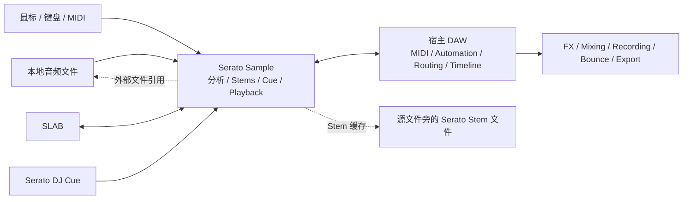
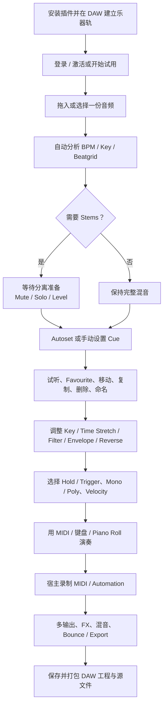
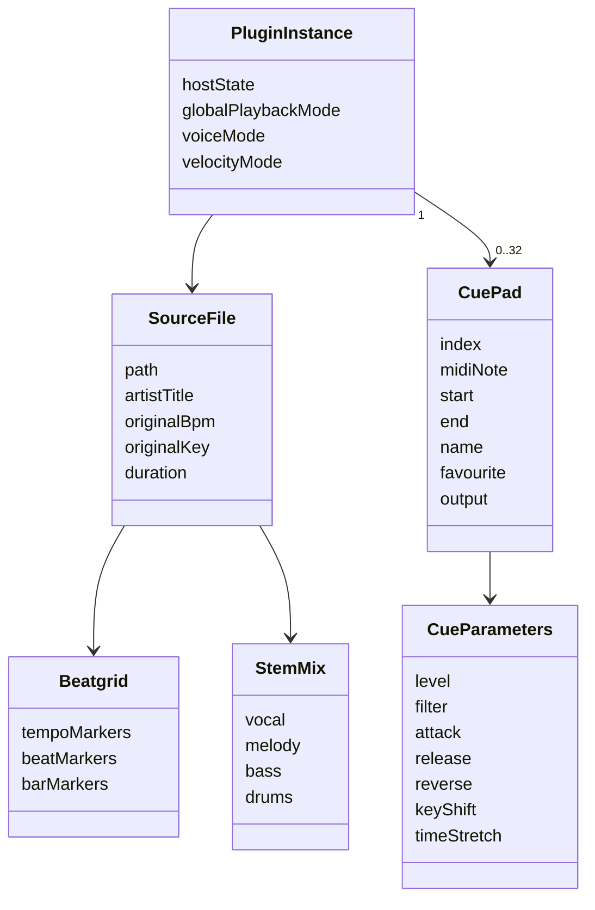
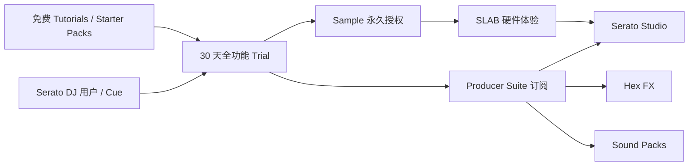

# Serato Sample 全景产品档案

> 研究日期：2026-07-28
>
> 研究对象：[Serato Sample](https://serato.com/sample)
>
> 当前公开版本：2.2.0
>
> 文档性质：中立产品档案；不构成购买、法律或音频质量保证

## 0. 摘要

Serato Sample 是一款运行在 DAW 内的桌面采样器插件。它把完整音频文件快速转换为可通过鼠标、电脑键盘、MIDI、Piano Roll 或专用硬件演奏的切片乐器。产品的核心链路是：

```text
载入音频
→ 分析 BPM / Key / Beatgrid
→ 可选分离 Vocal / Melody / Bass / Drums
→ 自动或手动设置 Cue
→ 映射到最多 32 个 Pad
→ 调整每个 Cue 的播放与声音参数
→ 在宿主 DAW 中录制 MIDI、自动化、混音和导出
```

它不是独立 DAW、音频编辑器或完整 Groovebox。Serato Sample 内部负责“找到、切开、同步、变形和演奏素材”，宿主 DAW 负责“记录、排列、处理和交付作品”。这种边界让产品保持单窗口、低层级和高速，但也带来工程可移植性、直接音频导出、Loop、深度声音设计与宿主一致性方面的限制。

截至研究日期，产品最有辨识度的组合是：

1. Serato 的 Pitch ’n Time 变调与时间拉伸技术。
2. 四类实时/准实时 Stems 分离。
3. 继承自 DJ 软件的彩色频谱波形、Beatgrid 和 Cue 心智模型。
4. 最多 32 个 Cue Pad，以及 Find Samples、Slicer、Random 等快速建组方式。
5. 跨主流 DAW 的插件形态和多输出、自动化能力。
6. AlphaTheta SLAB 的原生硬件控制。

产品的主要设计张力不是“功能够不够多”，而是：

- 快速得到可用结果与精细控制之间的平衡；
- 插件轻量性与对宿主 DAW 的依赖；
- 实时 Stems 的即时性与算力、质量不确定性；
- 自动切片的惊喜感与可控性；
- 32 Pad 的表演容量与插件自动化、硬件 Bank、屏幕空间之间的复杂度。

---

## 1. 研究范围与证据方法

## 1.1 范围

本档案覆盖：

- 产品定位、边界、历史和版本策略；
- 用户分群、使用场景和 Jobs to Be Done；
- 用户旅程、信息架构、界面和交互；
- Source、Beatgrid、Stem、Cue、Pad 等核心对象；
- 分析、分轨、变调、时间拉伸和播放能力；
- 自动化与人工控制的关系；
- DAW、MIDI、多输出和硬件生态；
- 文件、工程保存、共享、授权和兼容性；
- 定价、试用、产品组合与增长结构；
- 竞争位置、优势、限制、风险和待验证事项。

不覆盖：

- 对 Serato 私有算法、模型结构或源代码的逆向推断；
- 未公开的收入、用户规模、转化率和留存数据；
- 对 Stems 或 Pitch ’n Time 的实验室级客观测评；
- 各国家或地区的采样版权法律意见；
- Serato Studio、Serato DJ Pro 或 SLAB 的完整独立产品档案。

## 1.2 证据等级

| 标记 | 含义 | 使用规则 |
| --- | --- | --- |
| **官方事实** | Serato 产品页、支持文档、版本说明、法律条款 | 可作为当前公开产品行为的主要依据 |
| **第三方实测** | 有明确作者和测试过程的媒体评测 | 只用于补充体验、性能和声音判断 |
| **分析判断** | 由多个公开事实推导出的产品设计解释 | 不表述为 Serato 官方意图 |
| **待验证** | 官方资料缺失、冲突或可能已过时 | 需要安装 2.2.0 或向 Serato 确认 |

官方营销语中的“best-in-class”“unrivaled”等表述不在本文中自动视为客观事实。第三方的听感和性能结果也只代表其测试素材、机器和宿主环境。

---

## 2. 产品快照

| 维度 | 当前状态 |
| --- | --- |
| 产品类型 | 桌面采样器插件 |
| 当前版本 | 2.2.0，官方档案日期为 2025-12-02 |
| 平台 | macOS、Windows |
| 插件格式 | VST、VST3、AU（macOS）、AAX Native |
| 官方支持宿主 | Serato Studio、Pro Tools、Ableton Live、FL Studio、Logic Pro、Maschine |
| 输入 | 本地音频文件；不提供文档化的插件内录音入口 |
| 单实例 Source | 一份源音频文件 |
| Pad / Cue | 最多 32 个 |
| Stem | Vocal、Melody、Bass、Drums |
| 主要播放方式 | Hold / Trigger、Mono / Poly、Keyboard Mode |
| 控制方式 | 鼠标、电脑键盘、MIDI、Piano Roll、SLAB |
| 输出 | 插件主输出；Pad 可路由到宿主多路输出 |
| 工程承载 | 宿主 DAW 工程 + 外部源音频引用 + Serato Stem 缓存 |
| 永久授权 | 129 美元 |
| 订阅 | Producer Suite 9.99 美元/月 |
| 试用 | 30 天、全功能、无需信用卡 |

版本、格式、系统和安装包信息来自 [2.2.0 下载页](https://serato.com/sample/downloads/2.2.0)；官方宿主列表来自 [DAW 支持说明](https://support.serato.com/hc/en-us/articles/115000503094-What-DAWs-does-Serato-Sample-support)；价格来自 [定价页](https://serato.com/sample/pricing)。

---

## 3. 历史与版本演进

Serato 的第一项产品 Pitch ’n Time 源于“降低音频速度但不改变音高”的需求。公司此后以 DJ 软件建立了彩色波形、Beatgrid、Cue 和硬件控制方面的品牌资产。2017 年推出 Sample，代表 Serato 重新进入音乐制作工具领域。[Serato 官方公司历史](https://serato.com/about)

### 3.1 公开版本时间线

| 日期 | 版本 | 主要变化 | 产品含义 |
| --- | --- | --- | --- |
| 2017-07-01 | 1.0.0 | 首个公开版本 | 把 Pitch ’n Time 与 DJ 式 Cue 工作流做成跨 DAW 采样器 |
| 2017-11-28 | 1.1.0 | 首个后续大版本 | 早期工作流迭代 |
| 2020-02-03 | 1.2.0 | 功能与兼容更新 | 维持插件基础 |
| 2020-10-14 | 1.3.0 | Beatgrid、Glide、Serato DJ Cue 导入、更多宿主自动化 | 从简单切片器扩展为更完整的时间与表演工具 |
| 2021-10-20 | 1.4.0 | Pitch ’n Time 开关、Quantize、Beatgrid 改进、Windows HiDPI | 同时支持现代拉伸与传统“变调即变速”采样 |
| 2023-02-26 | 1.4.1 | Apple Silicon 等兼容更新 | 原生平台迁移 |
| 2023-08-22 | 2.0.0 | 四轨 Stems、VST3、32 Pad 的 8×4 布局、Pad 命名 | 从“高速切片器”升级为“分轨 + 切片”一体插件 |
| 2025-10-19 | 2.1.0 | AAX Native、Key 元数据与显示改进 | 进入 Pro Tools 工作流 |
| 2025-12-02 | 2.2.0 | SLAB 原生支持、Stem Levels、Stem Automation、鼠标滚轮、macOS Tahoe | 从纯软件插件走向软硬件生态，并补足 Stem 混合控制 |

日期来自 [Serato Sample 下载档案](https://serato.com/sample/downloads/archive)。具体变化来自 [1.3.0](https://serato.com/sample/downloads/1.3.0)、[1.4.0](https://serato.com/sample/downloads/1.4.0)、[2.0.0](https://serato.com/sample/downloads/2.0.0)、[2.1.0](https://serato.com/sample/downloads/2.1.0) 和 [2.2.0](https://serato.com/sample/downloads/2.2.0) 的官方说明。

### 3.2 版本策略判断

**分析判断：** Sample 的版本演进主要围绕三层资产累加，而不是持续扩张为 DAW：

1. **音频引擎层**：Pitch ’n Time → Beatgrid → Stems。
2. **演奏工作流层**：Cue → 32 Pad → Keyboard / Velocity / Quantize。
3. **生态层**：Serato DJ Cue → VST3 / AAX → SLAB。

Serato 没有把 Sequence、Arrangement、录音和完整 Mixer 填入 Sample，而是把这些能力留给宿主或 Serato Studio。这使 Sample 的产品边界在九年间仍然相对稳定。

### 3.3 官方资料差异

官方 [2.1.0 下载页](https://serato.com/sample/downloads/2.1.0) 和下载档案把 AAX Support 记为 2.1.0；但官方 [旧工程升级指南](https://support.serato.com/hc/en-us/articles/12201424350607-Updating-Serato-Sample-Without-Breaking-Old-DAW-Projects) 写成“2.2 及以上加入 AAX Native”。本文以版本下载页和档案的 2.1.0 记载为主，同时保留这一文档冲突。

---

## 4. 产品定位

## 4.1 一句话定位

**Serato Sample 是面向 DAW 制作人的高速采样乐器：把一份完成音频快速同步、分轨、切片并映射为可演奏的 32 Pad。**

## 4.2 它替代的工作

在没有专用插件时，用户可能需要：

```text
导入音频到 DAW
→ 识别 BPM 和调性
→ 手动 Warp / 对齐
→ 运行 Stem 分离工具
→ 导出或导入 Stem
→ 切出多个片段
→ 把片段装入 Sampler / Drum Rack
→ 设置每个声音的音高、包络和路由
```

Serato Sample 将其压缩为：

```text
载入一个文件
→ 等待分析
→ 开关或混合 Stems
→ Autoset / 点击 / 演奏建立 Cue
→ 立即触发和录制
```

产品不一定减少最终精修时间，但显著缩短第一次听到“可用 Flip”的时间。

## 4.3 产品不是什么

| 非目标 | 边界说明 |
| --- | --- |
| 独立应用 | 必须在兼容 DAW 中运行 |
| 完整 DAW | 没有自己的 Timeline、Sequencer、Song Arrangement 或完整 Mixer |
| 录音采样器 | 官方手册只描述加载本地文件，没有文档化的麦克风/线路录音流程 |
| 专业离线 Stem 编辑器 | 只能开关、调电平和自动化四类 Stem，不提供谱图级修补或源分离编辑 |
| 深度多采样合成器 | 单实例围绕一个 Source 和一组 Cue，不是 Key/Velocity Zone 多采样器 |
| 素材授权服务 | 软件处理音频，但不为用户自动取得采样许可 |

---

## 5. 目标用户、场景与 Jobs to Be Done

## 5.1 核心用户分群

### A. 以采样为核心的 Beat 制作人

- 主要环境：Ableton Live、FL Studio、Logic Pro、Maschine、Serato Studio。
- 目标：从旧唱片、完整歌曲、Loop 或 Found Sound 中尽快获得可演奏材料。
- 价值：快速切片、变调、同步和 Stems。

### B. 从 DJ 工作流进入制作的用户

- 熟悉彩色波形、Hot Cue、BPM、Key、Beatgrid。
- 不一定熟悉复杂 Sampler、Bus Routing 或音频编辑器。
- 价值：沿用 Serato DJ 的视觉语言和 Cue 心智模型。

### C. 已有成熟 DAW 工作流的专业制作人

- 不需要新的 DAW，只需要更快的前端采样入口。
- 目标：在现有工程中迅速产生多个候选切片或隔离素材。
- 价值：跨宿主插件、多输出、自动化和较高品质的变调/拉伸。

### D. 需要即时 Stem 操作的 Remix / Edit 制作者

- 目标：去掉原鼓、提取人声、保留低音或组合多个 Stem。
- 价值：不离开采样器和宿主工程即可进行四类分离。

### E. 软硬件一体工作流用户

- 使用 SLAB 或通用 MIDI Pad。
- 目标：减少鼠标操作，通过 Pad、旋钮、Dial 和 Touch Strip 操作 Cue、Stem 与参数。

## 5.2 主要 Jobs to Be Done

| 情境 | 用户工作 | 成功标准 |
| --- | --- | --- |
| “我听到一段值得采样的歌” | 尽快找到多个可用片段 | 几十秒内获得一组可演奏 Cue |
| “我只要这首歌的人声/鼓/旋律” | 隔离或弱化目标之外的部分 | 不离开 DAW 即可试听并继续切片 |
| “素材与工程速度或调性不一致” | 对齐 BPM / Key | 保持可接受音质并与宿主同步 |
| “我想把一个片段弹成旋律” | 将单个 Cue 铺到键盘 | 不需要建立多采样映射 |
| “自动结果不完全满意” | 保留好结果并替换差结果 | 自动重试不会覆盖 Favourite |
| “我要进一步混音” | 把不同 Pad 送入不同通道 | 可使用宿主的 FX、EQ、录音和 Bounce |
| “我要现场或手感操作” | 用硬件完成切片、触发和参数修改 | 尽量减少在插件与硬件之间来回看屏幕 |

## 5.3 非核心用户

- 需要直接录制麦克风、Vinyl 或 Line-in 的用户；
- 需要完全脱离电脑或 DAW 创作的用户；
- 需要复杂 Loop、Granular、调制矩阵或多层 Velocity Mapping 的声音设计师；
- 需要可人工修复分离掩码的音频修复工程师；
- 需要在手机和平板上完成全流程的移动创作者。

---

## 6. 产品边界与生态位置



### 6.1 内部职责

Serato Sample 负责：

- 加载和分析一份 Source；
- BPM、Key 和 Beatgrid；
- Stems 分离与混合；
- Cue 生成和编辑；
- Pad 播放、变调、时间拉伸和基础音色参数；
- MIDI 接收、宿主自动化和多输出；
- 插件状态保存与恢复。

### 6.2 外部职责

宿主 DAW 负责：

- 音频与 MIDI 轨道；
- Record Arm、Piano Roll 和 Note 编辑；
- Pattern / Clip / Arrangement；
- Effect Chain、Bus 和完整 Mixer；
- Freeze、Flatten、Resample、Bounce 和最终 Export；
- 工程打包与协作。

**分析判断：** Sample 的价值建立在“宿主已经存在”这一前提上。它不是一个封闭创作系统，而是 DAW 工作流中非常靠前的素材转化层。

---

## 7. 端到端用户旅程



## 7.1 阶段一：安装与激活

用户必须先：

1. 安装适配宿主的插件格式；
2. 在 DAW 内创建虚拟乐器轨并加载 Sample；
3. 点击 Get Started，通过浏览器登录 Serato Account；
4. 返回插件完成激活或开始试用。

这一流程由 [官方激活说明](https://support.serato.com/hc/en-us/articles/115007312487-Serato-Sample-activation-deactivation) 和 [30 天试用页](https://serato.com/sample/free-trial) 确认。

**设计影响：** 首次价值体验不是“下载后打开”，而是“安装 → 宿主扫描 → 建轨 → 登录 → 返回宿主 → 加载音频”。Serato 通过分宿主 Quickstart Guide 缓解插件产品天然较长的激活链路。

## 7.2 阶段二：加载与分析

用户可以把文件从 Finder / Explorer 拖入插件，或使用 Load Audio File。成功载入后，插件显示分析进度；取消会终止分析。更换 Source 会丢弃当前全部 Cue。[官方加载说明](https://support.serato.com/hc/en-us/articles/115000489094-Loading-a-file)

## 7.3 阶段三：建立第一组 Cue

三种基础入口：

- Autoset；
- 点击 Pad 或波形；
- 在当前 Playhead 位置触发对应 MIDI Note。

用户可以先让系统填满，再用 Favourite 锁定满意结果并重复 Autoset。这个流程把“自动化”设计为可反复抽取候选的工具，而不是一次性完成任务的黑箱。

## 7.4 阶段四：演奏与记录

Sample 自身只负责发声。用户要记录作品，需要在宿主中：

- Arm MIDI Track；
- 实时录制 Pad 演奏，或在 Piano Roll 画入 Note；
- 记录或绘制自动化；
- 将多输出接到音频轨；
- 最终渲染为音频。

## 7.5 阶段五：保存与协作

宿主工程保存插件参数和对外部文件的引用，但不会自动保证 Source 被打包。协作或迁移电脑时，用户必须按照宿主规则收集源音频，否则每个丢失引用的 Sample 实例都可能要求重新定位文件。[官方项目分享说明](https://support.serato.com/hc/en-us/articles/115000416594-How-to-share-a-Sample-project)

---

## 8. 信息架构与界面设计

## 8.1 单窗口结构

2.0 之后的主要界面可抽象为：

```text
┌──────────────────────────────────────────────────────────────┐
│ Undo / Redo   Play Mode   Voice Mode   Stem Controls         │
│ Track / File   Key / Detune   BPM / Sync   Velocity / PnT    │
├──────────────────────────────────────────────────────────────┤
│ Waveform Overview                                            │
│ Main Colored Waveform + Cue Start/End + Playhead             │
│ Hover: Freeze / Grid / Zoom                                  │
├──────────────────────────────────────────────────────────────┤
│ 32 Pads：8 × 4                                               │
│ Selected / Empty / Favourite / Named / Cue Color             │
├──────────────────────────────────────────────────────────────┤
│ Autoset + Mode | Cue Parameters | Select / Delete / Options  │
└──────────────────────────────────────────────────────────────┘
```

[官方 Overview](https://support.serato.com/hc/en-us/articles/115000487673-Overview) 列出 43 个界面元素；2.0 版本说明确认 Pad 扩大并改成 8×4。

## 8.2 视觉层级

### 全局层

位于顶部，作用于整个 Source 或整个实例：

- Stems；
- Key / Detune；
- BPM / Sync；
- Pitch ’n Time；
- Velocity；
- Hold / Trigger；
- Mono / Poly。

### 时间层

波形是最大的连续编辑面：

- 整体 Overview 用于导航；
- Main Waveform 用于精确定位；
- Cue Start / End 与 Playhead 叠加；
- Beatgrid 作为可切换的时间校准层。

### 对象层

32 Pad 把时间位置转换为离散、可记忆、可演奏的对象。Pad 颜色来自其在彩色频谱波形上的位置，建立“声音位置—颜色—Pad”之间的视觉联结。

### 参数层

底部参数只围绕当前选中 Cue；多选时同一组控件批量作用。这避免为 32 个 Pad 同时展示 32 组旋钮。

## 8.3 渐进披露

- Freeze、Grid 和 Zoom 只在鼠标悬停波形时出现；
- Options 折叠 Pad/MIDI 信息和多输出；
- Keyboard Mode 只对当前 Cue 生效；
- 多选后同一参数面板转为批量操作；
- Stems 保持为顶部四个直接按钮。

**分析判断：** 高频动作始终可见，精修和路由被折叠，减少初始密度。但 Hover、右键、Alt/Option、Shift 和双击承载了不少能力，发现性依赖教程和经验。

## 8.4 桌面原生交互语法

| 动作 | 含义 |
| --- | --- |
| Click | 选择、触发或切换 |
| Click + Drag | Scrub、移动 Cue、调整 Start/End 或参数 |
| Double Click | 输入 BPM/Key 等精确值 |
| Right Click | Pad 命名等上下文动作 |
| Shift + Click | Stem Solo、重置或组合动作 |
| Cmd/Ctrl + Click | 多选 Cue |
| Alt/Option + Drag | 复制 Cue |
| Mouse Wheel | 2.2.0 起调整旋钮和可拖字段 |

这种语法适合已有 DAW 经验的桌面用户，但不是完全自解释的触屏式界面。

---

## 9. 核心对象与心智模型



这不是 Serato 公开的数据模型，而是依据用户手册建立的产品心智模型。

## 9.1 Source

一个插件实例围绕一份完整源音频。Source 是所有 Cue 共享的底层材料，而不是先切成 32 份独立 WAV。

由此带来：

- Cue 编辑是非破坏性的；
- 更换或丢失 Source 会影响整个实例；
- 32 个 Cue 可以共享分析、Stems 和全局 Key/BPM；
- 工程迁移必须保留原始文件引用。

## 9.2 Beatgrid

Beatgrid 把连续音频映射为音乐时间。它既影响 Sync，也影响 Quantize、Slicer 和 Find Samples。错误的 Grid 会在多个下游功能中放大。

## 9.3 Cue 与 Pad

Cue 是 Source 上的时间区域；Pad 是 Cue 的演奏入口。产品在视觉上将两者近似合并，但语义上可以区分：

- Cue 决定播放哪里、多久；
- Pad 决定从哪个 MIDI Note、颜色和位置触发；
- 移动 Pad 可以交换或复制 Cue 及其参数；
- Output Routing 会随 Cue 一起移动。

## 9.4 Favourite

Favourite 不只是标签，而是自动化保护状态：后续 Autoset 不会覆盖它。它把用户判断写回自动流程，形成：

```text
系统提供候选 → 用户保留好结果 → 系统只替换其余结果
```

## 9.5 Plugin Instance

Undo/Redo 最多记忆 100 次操作，按 DAW Project Session 和插件实例隔离。[官方 Miscellaneous](https://support.serato.com/hc/en-us/articles/115003945934-Miscellaneous)

这种隔离符合插件心智模型：每个实例拥有自己的 Source、Cue 和历史，而不是整个产品共享一座全局素材库。

---

## 10. Source 分析、BPM、Key 与 Beatgrid

## 10.1 加载时分析

成功加载文件后，Sample 分析：

- Track / Artist 元数据；
- Duration；
- BPM；
- Key；
- Beatgrid；
- 为后续 Stems 和波形显示准备数据。

2.1.0 起，插件可读取文件内已存储的 Key Metadata，也允许手动编辑 Key，并可在 Classical、Camelot 和 Open Key 显示间切换。[2.1.0 版本说明](https://serato.com/sample/downloads/2.1.0)

## 10.2 Beatgrid 编辑能力

Sample 的 Beatgrid 支持：

- Tempo、Bar、Beat Marker；
- Slip 整体网格；
- Stretch / Contract 整体或局部网格；
- 直接输入 BPM、2× / ½；
- Tap Tempo；
- Metronome；
- Set Grid Start；
- 最多 128 个 Tempo Marker；
- Save、Cancel、Clear。

这意味着它可以处理并非严格恒定速度的旧录音或现场录音，而不只依赖单一平均 BPM。[官方 Beatgrids](https://support.serato.com/hc/en-us/articles/360002025835-Beatgrids)

## 10.3 Sync 与 Pitch ’n Time

- Sync 开启时，Source BPM 跟随宿主 DAW；
- Key Shift 与 Tempo 可以解耦；
- 关闭 Pitch ’n Time 后，产品回到传统采样器行为：变调同时改变速度；
- Pitch ’n Time 关闭时不可使用 Sync；
- 短于 3 秒的文件，或文件名含 “808” 且短于 10 秒的文件，会默认关闭 Pitch ’n Time。

最后一条是一个有方向性的智能默认：短 One-shot 和 808 更可能需要经典 Repitch 行为，而不是保持时长不变。[官方 Overview](https://support.serato.com/hc/en-us/articles/115000487673-Overview)

## 10.4 Quantize

Quantize 开启后，新 Cue 的 Start 和 End 会以 1/8 Beat 增量吸附到 Beatgrid；关闭后可自由定位。Slicer 的 Cue 长度则可在 1/16 到 16 Beats 之间选择。

**分析判断：** 产品同时提供“按听觉自由切”和“按网格快速切”，没有把量化设为不可绕过的正确答案。

---

## 11. Stems 设计

## 11.1 能力

Sample 2.0 引入四类分离：

- Vocal；
- Melody；
- Bass；
- Drums。

用户可以：

- 点击 Mute；
- Shift + Click Solo；
- 在 2.2.0 调整每类 Stem Level；
- 将 Stem On 和 Level 暴露给宿主自动化；
- 看到波形颜色随 Stem 状态动态变化。

官方将其描述为机器学习算法。[Sample 2.0 公告](https://the-drop.serato.com/announcements/serato-sample-2-0-now-with-stems/) 和 [2.2.0 版本说明](https://serato.com/sample/downloads/2.2.0) 是当前主要公开依据。

## 11.2 处理与缓存边界

2.0 版本说明确认：

- Stems 首次启用时需要准备；
- 持久化后，会在原始音频位置旁保存 Serato Stem 文件；
- Windows 机器若不支持分轨所需能力，2.0 将拒绝安装；
- 2.0 以上 x86 CPU 需要 AVX。

官方性能文档也提示，Stems 初次启用可能耗时并增加 CPU 负担，多实例或旧电脑要谨慎。[官方 Stems](https://support.serato.com/hc/en-us/articles/7645256113551-Stems) [AVX 说明](https://support.serato.com/hc/en-us/articles/5766792501903-What-is-AVX-and-why-does-Serato-software-require-a-processor-with-AVX-support)

**分析判断：** 公开证据强烈指向本机处理与本地缓存，而不是云端上传后返回结果；但 Serato 没有公开模型架构、训练数据、推理框架或缓存格式，不应进一步猜测。

## 11.3 交互设计

Stems 位于全局顶部，不要求用户先进入独立编辑器。它们既能在切片前改变用户听到的 Source，也能在切片和演奏过程中切换或自动化。

这使 Stems 在产品中不是单独的“导出四轨”任务，而是实时声音状态：

```text
同一 Source + 同一 Cue + 不同 Stem Mix = 不同可演奏声音
```

## 11.4 质量与性能证据

官方没有发布可复现的分离基准。2024 年 MusicRadar 用多首素材与 RipX 对比，认为部分素材结果接近、速度快，但也指出更专业的离线工具可以进行细节修补。[MusicRadar Sample 2 评测](https://www.musicradar.com/reviews/serato-sample-2-review)

第三方对 CPU 的描述并不一致：

- MusicRadar 在其机器上认为可以使用多个实例；
- Serato 官方则明确提示多实例、长文件和 Stems 会增加 CPU/内存压力。

因此不能给出脱离机器、宿主、Buffer、Source 长度和 Stem 状态的统一性能结论。

---

## 12. Cue、Pad 与自动选点

## 12.1 Cue 建立方式

最多 32 个 Cue，可以通过：

1. Autoset；
2. 点击 Pad；
3. 在 Playhead 位置触发 MIDI Note；
4. 移动、复制已有 Cue；
5. 从 Serato DJ 载入 Cue。

[官方 Cues](https://support.serato.com/hc/en-us/articles/115000501614-Cues) 说明了建立、编辑、删除、移动、复制、命名和多选流程。

## 12.2 Autoset 模式

| 模式 | 行为 | 适用情境 |
| --- | --- | --- |
| Find Samples | 找出较适合采样的区域，再在其中按 Beat 随机放置 Cue | 快速探索完整歌曲 |
| Set Slicer | 从当前 Playhead 起建立 32 个连续、等距、有长度的 Cue | Drum Break、Loop、规则切片 |
| Set Random | 在全曲随机选择 32 个位置 | 制造意外 |
| Key Shift Pad | 将一个 Cue 复制到多个 Pad，并分配 -12 到 +12 的音高变化 | 快速得到旋律化 Pad Bank |
| Serato DJ | 读取已有 Serato DJ Cue 及颜色 | DJ 到制作的工作流衔接 |

详细行为来自 [官方 Autoset](https://support.serato.com/hc/en-us/articles/115000489113-Autoset)。

## 12.3 人机协作模型

Find Samples 的设计不是“算法替用户完成采样”，而是：


这个循环包含四种控制：

- 可以完全手动；
- 可以选择不同 Autoset 逻辑；
- 可以反复重试；
- 可以锁定局部结果。

它兼顾了速度、惊喜和可逆性。

## 12.4 Cue 参数

| 参数 | 官方范围 / 行为 |
| --- | --- |
| Level | -12 dB 到 +12 dB |
| Filter | 80 Hz 到 17 kHz |
| Attack | 0 到 10 秒 |
| Release | 0 到 10 秒 |
| Reverse | 正向 / 反向 |
| Key Shift | -24 到 +24 Semitones |
| Time Stretch | 原速度的 1/4 到 4×，即 -75% 到 +300% |
| Favourite | 防止 Autoset 覆盖 |
| Glide | Keyboard Mode 下 0.01 ms 到 5 秒；Mono 可用 |

范围来自 [官方 Cue Parameters](https://support.serato.com/hc/en-us/articles/115000500413-Cue-parameters)。

## 12.5 批量操作

- Cmd/Ctrl 多选；
- Select All；
- 多选时参数面板转为白色；
- 同一修改应用到全部选中 Cue；
- Move 到占用 Pad 时交换；
- Alt/Option Drag 到空 Pad 时复制；
- Output Routing 随 Cue 移动。

批量能力让单一参数面板在 32 Pad 规模下仍可用，但依赖修饰键和状态颜色提示。

---

## 13. 播放、声音塑形与表演

## 13.1 Hold / Trigger

| 模式 | 行为 |
| --- | --- |
| Hold | 按住时播放；松开后进入 Release |
| Trigger | 不受按住时长影响，播放至 Cue End 或 Source End |

这相当于 Gate 与 One-shot 的两种基础语义，但官方界面使用 Hold / Trigger 命名。

## 13.2 Mono / Poly

- Poly 允许最多 32 个 Cue 同时播放；
- Mono 同时只保留一个 Cue；
- Keyboard Mode 的 Glide 只在 Mono 下可用。

## 13.3 Keyboard Mode

Keyboard Mode 将一个选中 Cue 映射到钢琴键盘：

- 每个 Note 对 Cue 施加相对音高；
- 可在保持或不保持速度的两种 Pitch ’n Time 行为间选择；
- Mono 下可以用 Glide 在 Note 之间滑音。

它把“切片 Pad”临时转换为“单 Sample 乐器”，但不是多 Sample Keymap。

## 13.4 Velocity

Velocity 开启时，插件遵守宿主或硬件发送的 MIDI Velocity；关闭时触发力度不影响输出。Velocity 是全局开关，不是每个 Cue 独立开关。

## 13.5 Filter 与 Envelope

每个 Cue 只有一组面向高频任务的塑形参数：

- Level；
- 单一 Filter；
- Attack；
- Release；
- Reverse。

没有文档化的 LFO、完整 ADSR、Filter Resonance、Modulation Matrix、内置 FX Chain 或每个 Cue 独立 Stem Mix。

**分析判断：** Sample 的声音设计深度被刻意限制在“不离开当前页面即可完成”的范围。更复杂的处理被导向宿主多输出和 FX。

## 13.6 Loop 边界

官方 2.2.0 产品页和 Sample 用户手册描述 Hold、Trigger 和 Cue Length，但没有文档化的 Cue Loop 开关。MusicRadar 2024 评测也把 “No looping” 列为缺点。

因此本文将“无 Cue Loop”记为当前公开边界；由于这是基于官方能力列表与第三方实测的交叉判断，而非 Serato 的明确否定声明，仍建议在安装版 2.2.0 中人工复核。

---

## 14. DAW、MIDI、自动化与多输出

## 14.1 宿主支持

官方完整测试的宿主：

- Serato Studio；
- Avid Pro Tools；
- Ableton Live；
- FL Studio；
- Logic Pro；
- Maschine。

其他支持 AU、VST、VST3 或 AAX 的宿主可能可用，但 Serato 不保证性能。[官方 DAW 支持说明](https://support.serato.com/hc/en-us/articles/115000503094-What-DAWs-does-Serato-Sample-support)

## 14.2 MIDI

每个 Cue 对应 MIDI Note，因此可以由：

- 外部 MIDI Controller；
- 电脑键盘；
- DAW Piano Roll；
- 宿主录制的 MIDI Clip；
- SLAB Trigger / Piano Mode

触发。

MIDI Note 属于演奏控制，Cue 的 Start/End 和参数仍保存在插件状态中，而不是写进 MIDI 文件。

## 14.3 宿主自动化

官方 Miscellaneous 列出的自动化包含：

- Play、Seek、BPM、Sync、Pitch / Key；
- Cue Play Mode、Mono / Poly、Velocity；
- Autoset 及模式；
- Slicer Size / Shift；
- Cue Key Shift、Time Stretch、Filter；
- Level、Attack、Release、Reverse；
- Glide。

2.2.0 进一步增加 Stem On 和 Stem Level 自动化。

### 自动化文档的潜在边界

当前官方 Miscellaneous 页面仍把 Cue Key Shift、Time Stretch 和 Filter 标为 1–16，而产品提供 32 Cue。可能解释包括：

- 只有前 16 个 Cue 暴露部分自动化；
- 文档尚未随 32 Pad 更新；
- 不同参数的暴露范围不同。

这是 **待验证项**，不能仅凭现有文档确定。

## 14.4 多输出

每个 Cue 可以被指定到不同宿主输出。以 Ableton 为例，默认 Channel 2–16 对应 Sample 的 2–16 输出，用户需要在宿主建立音频轨并选择对应输入。[Ableton Cue Output 指南](https://support.serato.com/hc/en-us/articles/115003573213-Using-Cue-Output-routing-with-Serato-Sample-and-Ableton-Live)

多输出的作用：

- 每个 Pad 使用独立 EQ、FX 和 Compressor；
- 将不同声音录成独立音频；
- 减少为每个声音创建多个 Sample 实例的需求。

代价是不同 DAW 的路由步骤不同，产品必须维护宿主专属教程。

## 14.5 插件格式兼容债务

旧工程按最初使用的插件格式寻找实例。只安装 VST3 不会自动替代旧工程中的 VST；切换到 AAX 或 Wrapper 也可能破坏召回。Serato 官方建议：

- 更新前备份工程；
- 保持原插件格式；
- 保持安装位置；
- 更新后强制 DAW 重新扫描。

这反映了跨 DAW 插件的长期兼容成本。[官方升级指南](https://support.serato.com/hc/en-us/articles/12201424350607-Updating-Serato-Sample-Without-Breaking-Old-DAW-Projects)

---

## 15. SLAB 硬件集成

AlphaTheta SLAB 是首先为 Serato Studio 设计、同时原生控制 Sample 和 Serato DJ Pro 的 USB-C Pad Controller。Sample 2.2.0 起支持。

## 15.1 对 Sample 的原生能力

- 16 个力度 RGB Pad；
- Trigger Mode：Cues 1–16 / 17–32 两个 Bank；
- Piano Mode：当前 Cue 的音高演奏；
- Dial：Deck Scrub、Waveform Zoom、Cue Start/End 编辑；
- Encoders：Stem Level 或 Pad 参数；
- Touch Strip：Filter、Pad Level、Note Repeat；
- Autoset、Favourite、Delete、Select All；
- Mono / Poly；
- Undo / Redo；
- Focus Mode：控制鼠标悬停对象。

完整映射来自 [SLAB Quickstart Guide for Serato Sample](https://support.serato.com/hc/en-us/articles/14187304054287)。

## 15.2 多实例控制

当工程存在多个 Sample 实例时：

- SLAB 一次只原生控制一个实例；
- 插件显示 Take Control；
- 用户显式指定当前受控实例；
- MIDI 触发仍依赖 DAW Track Arm 与 MIDI Routing。

这是一个必要的焦点仲裁机制，避免一套物理控件同时修改多个插件实例。

## 15.3 Transport 边界

SLAB 的 Play / Record 不由 Sample 原生处理，而是发送标准 Mackie Control 信息，由宿主 DAW 映射。

**分析判断：** 硬件集成遵守 Sample 的产品边界：Sample 控制声音和 Cue，宿主控制录音和 Transport。

## 15.4 商业连接

SLAB 接入后可解锁 Serato Studio，但使用 Sample 仍需要 Sample 永久授权或订阅。[SLAB 官方产品页](https://serato.com/dj/hardware/alphatheta-slab)

它同时承担：

- Sample 的高阶体验入口；
- Serato Studio 的获客和留存硬件；
- Serato DJ、Studio、Sample 三个产品之间的共享控制面。

---

## 16. 文件、持久化、共享与导出

## 16.1 支持文件

| 平台 | 支持格式 |
| --- | --- |
| macOS | AAC、AIFF、MP3、MP4、M4A、WAV、OGG、FLAC |
| Windows | AIFF、MP3、WAV、FLAC、WMA、OGG |

支持 Sample Rate：

- 44.1 kHz；
- 48 kHz；
- 88.2 kHz；
- 96 kHz；
- 176.4 kHz。

支持 16、24、32 Bit；高于 176.4 kHz 的文件无法载入；参数未知的 “Free format MP3” 不在正式支持范围。[官方文件格式](https://support.serato.com/hc/en-us/articles/115000380193-Supported-File-Formats-for-Serato-Sample)

## 16.2 Source 引用

插件引用源文件路径。移动文件后，再打开宿主工程会进入 Missing File 状态，需要 Locate Audio File。官方建议在导入前把 Source 放到稳定位置。

**设计影响：**

- 初次加载快，不需要复制大文件到插件数据库；
- 用户可以继续用既有文件组织方式；
- 工程自包含性依赖宿主 Collect / Package 能力；
- 外接硬盘改名、断开或目录重组会破坏引用。

## 16.3 Beatgrid 写入

保存 Beatgrid 需要源文件可写，或至少需要 Serato 能在该位置保存相关数据。只读、锁定或被其他 Serato 产品锁住的文件会阻止保存。[官方文件格式说明](https://support.serato.com/hc/en-us/articles/115000380193-Supported-File-Formats-for-Serato-Sample)

## 16.4 Stem 缓存

2.0 说明写明，持久化 Stems 时会在 Source 所在位置旁保存 Serato Stem 文件。

这意味着：

- Source 目录需要可写；
- 项目可能产生 Source 之外的伴随文件；
- 移动、备份和清理时需要理解缓存关系；
- 多个工程引用同一 Source 时可能共享或复用相关数据，但官方未公开精确规则。

最后一项是待验证，不应从“文件在 Source 旁”直接推定共享缓存语义。

## 16.5 直接导出边界

官方 Sample 用户手册没有插件内 “Export Cue as WAV” 或拖拽 Cue 到 DAW 的流程。官方性能建议反而让用户在完成采样后，通过宿主 Render、Export 或 Flatten 音频。[Sample 优化指南](https://support.serato.com/hc/en-us/articles/115000475714-Optimization-for-Serato-Sample-users)

因此当前公开工作流是：

```text
Sample 发声 / 多输出
→ DAW 录音、Freeze、Flatten 或 Bounce
→ DAW 导出音频
```

这与 Serato Studio 自身的 Master / Stem Export 不应混为一谈。

## 16.6 工程共享

官方分别提供 Ableton、Logic、Maschine 和 FL Studio 的共享建议：

- Ableton：共享 Source，并使用 Live 的工程收集能力；
- Logic：Source 仍可能是外部引用；
- Maschine：使用 Save Project with Samples；
- FL Studio：使用 Zipped Project Package。

产品把协作责任交给宿主，因此同一个 Sample 项目在不同 DAW 中具有不同的打包体验。

---

## 17. Onboarding、帮助系统与可访问性

## 17.1 Onboarding

公开的新手入口包括：

- 下载页的 2:09 Overview Video；
- 30 天全功能试用；
- Serato Studio、Ableton、FL Studio、Logic、Maschine、SLAB Quickstart；
- 在线 User Manual；
- Tutorial 视频；
- 免费 Starter Pack 和 Core Pack。

[Sample Resources](https://serato.com/sample/resources) 通过 Loopmasters 和 Serato Studio Sounds 提供可直接试验的素材，减少“装完插件但没有合适 Source”的空白状态。

## 17.2 学习曲线

基础路径较短：

```text
Load → Autoset → Play
```

高级路径则需要理解：

- Beatgrid；
- Modifier Keys；
- Multi-select；
- Host Automation；
- Multi-output Routing；
- Plugin Format；
- Project Packaging；
- SLAB Focus / Take Control。

因此产品呈现出“低进入门槛、高宿主依赖”的学习曲线：Sample 自身易懂，但完整生产工作流仍要求 DAW 知识。

## 17.3 错误与恢复

公开文档覆盖的关键错误：

- Source Missing → Locate；
- 分析中 → Progress / Cancel；
- Beatgrid 不可写 → 调整权限或解锁；
- 激活次数不足 → Deactivate / Remote Deactivate；
- 无许可证、网络错误、硬件变化或 License Version 不匹配；
- 插件更新后旧格式丢失 → 安装相同格式、路径并 Rescan；
- 性能问题 → 减少文件长度、实例数量，Render / Flatten。

[Activation Errors](https://support.serato.com/hc/en-us/articles/115006104768-Serato-Sample-Activation-errors) 将授权故障映射到具体解决方式；2.0 以上支持远程停用已激活设备。

## 17.4 可访问性观察

官方 2.2.0 资料确认：

- Windows HiDPI；
- Mouse Wheel 参数调整；
- 键盘快捷键；
- MIDI 与硬件控制；
- Pad 颜色、波形和文字/数字参数并存。

但研究没有找到：

- WCAG 或类似可访问性声明；
- 完整键盘焦点顺序说明；
- 屏幕阅读器支持说明；
- 色觉模式或高对比度模式说明；
- 可缩放插件 UI 的明确当前说明；
- 非英语版 Sample Manual 的当前清单。

**分析判断：** 彩色频谱和 Pad 颜色提高了视觉定位速度，但如果状态只通过颜色表达，会形成色觉风险；Hover、右键和修饰键也会增加发现与运动操作门槛。是否有替代文本或非颜色状态，需要安装版测试。

---

## 18. 性能、系统要求与可靠性

## 18.1 当前公开要求

2.2.0 下载页给出的推荐值包括：

- 2017 年或之后的 Mac；
- Intel Core i5 或 Apple M1/M2 及以上；
- 8 GB 及以上内存；
- 15 GB 及以上 SSD 可用空间；
- macOS 26 Tahoe、15 Sequoia、14 Sonoma；
- Windows 11、10；
- 2.0 以上 x86 CPU 必须支持 AVX；
- Windows ARM / Qualcomm Snapdragon X 当前不支持。

安装包约为：

- macOS：1.45 GB；
- Windows：384.25 MB。

官方页面没有解释两个平台安装包体积差异。

## 18.2 主要负载来源

- Source 文件长度和大小；
- 同时运行的 Sample 实例数；
- Stems 准备与播放；
- Pitch / Time Stretch 算法；
- 高 Sample Rate；
- 低 Buffer 带来的实时压力；
- 宿主本身与其他插件。

[官方优化指南](https://support.serato.com/hc/en-us/articles/115000475714-Optimization-for-Serato-Sample-users) 建议减少长 Source、多实例，并在完成后 Render / Flatten。

## 18.3 可靠性边界

跨平台插件需要同时处理：

- OS 更新；
- Intel / Apple Silicon / Windows x86 / Windows ARM；
- 多种插件格式；
- 多个 DAW 的扫描、状态召回和自动化；
- DPI、多显示器和窗口生命周期；
- MIDI 和控制器 Firmware。

2.0、2.1、2.2 的发布说明持续包含宿主自动化、DPI、窗口关闭 Crash、Cue 拖动和登录问题修复，说明兼容性维护是长期产品成本，而非一次完成。

## 18.4 本地优先与隐私边界

除账号激活和在线资源外，公开的音频处理链路表现为本地：

- 文件从本地加载；
- CPU / AVX 是明确要求；
- Stems 在本机准备；
- Stem 文件保存在本地 Source 旁；
- DAW 工程保存插件状态。

本文未发现“Source 音频上传云端处理”的官方说明。由于 Serato 未公开完整遥测细节，不能进一步断言所有音频相关数据永不离开设备；隐私判断应以安装时 EULA 和当前 [Privacy Policy](https://serato.com/legal/serato-privacy-policy) 为准。

---

## 19. 商业模式、授权与增长结构

## 19.1 定价

| 方案 | 价格 | 内容 |
| --- | --- | --- |
| 永久购买 | 129 美元 | Serato Sample |
| Producer Suite | 9.99 美元/月 | Sample、Hex FX、Serato Studio、全部 Sound Packs |
| Trial | 30 天 | Sample 全功能；无需信用卡 |

价格不含可能存在的当地税费，且未来可能变化。[官方定价](https://serato.com/sample/pricing)

## 19.2 试用结束行为

试用结束后：

- 已有工程中的 Sample 轨道继续工作；
- 用户不能再修改 Sample，直至购买或订阅。

这是一个重要的工程安全设计：试用到期不会立即让旧项目静音，但会冻结编辑能力。[官方 Trial FAQ](https://serato.com/sample/free-trial)

## 19.3 授权

- 在插件中点击 Get Started；
- 浏览器完成 Serato Account 登录；
- 返回插件激活；
- 可在原机器 Logout 停用；
- 2.0 以上可从账号远程停用设备；
- 许可证数量不足、网络、硬件变化、时钟和版本不匹配都有独立错误。

公开支持页没有在本文研究范围内明确给出 Sample 的默认同时激活台数，因此不记录具体数字。

## 19.4 产品组合



**分析判断：** 商业结构有四个互补入口：

1. 单插件永久授权服务不喜欢订阅、已有 DAW 的制作人；
2. Producer Suite 用低月费打包 DAW、FX 和内容；
3. Serato DJ 的品牌和 Cue 数据降低跨入 Sample 的成本；
4. SLAB 提供软硬件一体体验，并把用户连接到 Serato Studio。

## 19.5 获客与激活

公开漏斗可以概括为：

```text
Artist Demo / Tutorial / Free Pack
→ 无信用卡 30 天 Trial
→ Load + Autoset 的快速首次成功
→ 在真实 DAW 工程中形成依赖
→ 永久购买或 Producer Suite
→ Sound Packs / Studio / Hex FX / SLAB
```

这是分析模型，不代表 Serato 公开的内部漏斗数据。

## 19.6 留存机制

- Sample 状态嵌入 DAW 工程；
- 用户建立自己的 Cue 和 Pad 工作法；
- 与 Serato DJ Cue、Studio、SLAB 形成生态连接；
- 完成的项目持续需要插件召回；
- Trial 到期保持旧轨可播放，降低用户对试用的风险感。

同时，外部 Source 引用和插件格式也可能形成负面锁定：旧工程迁移、Source 丢失或格式变更会增加维护成本。

---

## 20. 竞争格局

Serato Sample 处在“高速采样器”“DAW 内置 Sampler”“Stem 工具”和“硬件 Groovebox”交叉区域，但并不完整替代其中任何一类。

## 20.1 竞争类别

### A. DAW 内置快速 Sampler

代表：

- Ableton Simpler；
- Logic Quick Sampler；
- FL Studio Slicex；
- Maschine Sampler。

它们与宿主深度集成，通常拥有 Loop、Envelope、LFO、Slice 或 Drum Rack 能力，但只服务各自生态。

### B. 深度 Sampler / Sound Design Instrument

代表：

- Ableton Sampler；
- Native Instruments Kontakt；
- TAL-Sampler 等。

它们提供多采样、调制、Zone、Script 或更深声音设计，但从完整歌曲到第一组可玩切片的路径通常更长。

### C. Stem / 音频拆分工具

代表：

- RipX；
- iZotope RX；
- DAW 内建 Stem Separation；
- 各类云端分轨服务。

它们可能提供更深编辑、更多 Stem 或离线质量取向，但不一定直接把结果变成 Cue Pad 乐器。

### D. Groovebox、移动和硬件采样器

代表：

- MPC；
- Maschine；
- SP-404；
- Koala Sampler。

它们提供录音、Sequence、Resample、FX 和独立创作闭环，但不是以“跨 DAW 单插件”作为主要边界。

## 20.2 代表性能力对照

| 维度 | Serato Sample | Ableton Simpler | Logic Quick Sampler | FL Studio Slicex | 专业 Stem 工具 |
| --- | --- | --- | --- | --- | --- |
| 跨 DAW | 是 | 否，仅 Live | 否，仅 Logic | 否，主要在 FL Studio | 取决于产品 |
| 单窗口快速切片 | 强 | 强 | 强 | 中到强 | 通常不是重点 |
| 内置四轨 Stems | 是 | Simpler 自身无 | Quick Sampler 自身无 | Slicex 自身无 | 是，通常更深 |
| Cue / Slice 数 | 32 | 最多 64 Slice | 依模式和音频 | 多 Region | 不以 Pad 为核心 |
| Loop | 当前无文档化 Cue Loop | 有 | 有 | 有相关循环/Region 能力 | 非核心 |
| 深度调制 | 低 | Filter、Envelope、LFO | LFO、Pitch/Filter/Amp Envelope | 较深 Articulation | 非采样器 |
| 内部录音 | 无文档化入口 | 通过 Live | Quick Sampler Recorder | 通过 FL / Edison | 取决于产品 |
| Sequence / Arrangement | 依赖宿主 | Live | Logic | FL Studio | 通常无 |
| 直接分轨后演奏 | 强 | 需额外步骤 | 需额外步骤 | 需额外步骤 | 通常需导入 Sampler |

Ableton Simpler 的 Slice、Warp、Loop、Envelope 和 LFO 依据 [Live 12 Manual](https://www.ableton.com/en/live-manual/12/live-instrument-reference/)；Logic Quick Sampler 的 Recorder、Slice、Loop 和 Flex 依据 [Apple Support](https://support.apple.com/en-gb/102041)；Slicex 的 Beat Detection、Region 和 Piano Roll 依据 [FL Studio Manual](https://www.image-line.com/fl-studio-learning-content/fl-studio-online-manual/html/plugins/Slicex.htm)。

## 20.3 差异化判断

Serato Sample 的主要差异不是任一单项功能的独占，而是下列组合：

```text
跨 DAW
+ 高速完整歌曲分析
+ 四类 Stems
+ DJ 式 Cue / Beatgrid
+ 32 Pad
+ Pitch ’n Time
+ 单窗口
+ 原生 SLAB
```

随着 DAW 内建 Stem Separation 和快速 Sampler 普及，Stems 本身会逐渐商品化。Serato 更难替代的资产是：

- 长期形成的音频拉伸品牌信誉；
- DJ 与制作人共享的 Cue / Waveform 心智模型；
- 跨宿主的一致工作流；
- Serato DJ、Studio、Sample 和 SLAB 之间的生态连接。

---

## 21. 产品优势

## 21.1 极短的首次成功路径

`Load → Autoset → Play` 在同一窗口完成。用户不需要先建立 Zone、Drum Rack、Track Routing 或文件导出。

## 21.2 分轨与切片在同一对象上

用户不必先导出四个 Stem 再分别载入 Sampler。Stem 状态与 Cue 共享同一 Source 和时间轴。

## 21.3 自动结果可被局部锁定

Favourite 使 Autoset 从“一次性覆盖”变为“保留局部、继续探索”，是清晰的人机协作设计。

## 21.4 DJ 语言迁移

彩色波形、Cue、BPM、Key 和 Beatgrid 让 Serato DJ 用户以熟悉对象进入制作。

## 21.5 传统与现代采样行为共存

Pitch ’n Time On/Off 允许：

- 保持速度、独立变调；
- 经典 Repitch：音高升高、速度变快。

## 21.6 宿主扩展性

多输出和 Automation 让有限的插件参数可以接入完整 DAW Mixing 与 Arrangement。

## 21.7 可逆性

Cue、Start/End、Stem 状态和参数是非破坏编辑；Undo/Redo 最多记录 100 个实例内操作。

---

## 22. 产品限制与风险

## 22.1 功能限制

- 无独立 Sequencer / Arrangement；
- 无文档化的插件内录音；
- 无文档化的 Cue Loop；
- 无文档化的单 Cue WAV 导出或拖拽导出；
- 无内置完整 FX Chain；
- 无深度调制和多采样；
- Stem 只分四类，不能手工修补分离结果；
- 32 Cue 与部分自动化文档 1–16 的关系不清楚。

## 22.2 工作流风险

- Source 是外部路径引用，工程可能因移动文件而失效；
- Stem 缓存写在 Source 旁，目录权限和备份规则更复杂；
- 跨电脑协作依赖各宿主不同的收集方式；
- VST / VST3 / AU / AAX 格式不会自动互相替代；
- Sample 本身简单，但完成多输出、Bounce 和工程打包仍需要 DAW 知识。

## 22.3 技术风险

- Stems、长 Source 和多实例带来 CPU / 内存压力；
- x86 需要 AVX，Windows ARM 不支持；
- OS、DAW、插件格式和硬件 Firmware 的组合测试面很大；
- 分离质量取决于 Source，无法承诺无串音或无伪影；
- 闭源模型和无公开 benchmark 使质量变化难以外部追踪。

## 22.4 商业风险

- 主要 DAW 正在强化内置 Sampler、Warp 和 Stem 能力；
- 单插件 129 美元要与已包含在 DAW 价格中的工具竞争；
- Producer Suite 增强价值，但也可能模糊 Sample、Studio 与宿主 DAW 的角色；
- 硬件原生体验有助于差异化，却会增加 Firmware、焦点、多实例和映射维护成本。

## 22.5 法律风险

Stems、变调和切片改变创作方式，但不自动改变 Source 的版权状态。Serato 的销售条款把产品的非法使用列入用户责任范围；工具本身不等于 Sample Clearance。[Serato Terms of Sale](https://serato.com/legal/terms-of-sale)

## 22.6 可访问性风险

- 彩色频谱与 Pad 色彩占重要地位；
- 多项功能通过 Hover、右键和修饰键进入；
- 没有找到公开无障碍合规说明；
- 专用硬件提高触觉可达性，但不是软件许可证自带能力。

---

## 23. 核心产品设计张力

| 张力 | Serato Sample 当前选择 | 收益 | 代价 |
| --- | --- | --- | --- |
| 速度 vs 深度 | 单窗口、有限参数 | 快速进入创作 | 高级编辑依赖宿主或其他工具 |
| 自动 vs 控制 | Autoset + Favourite + 手动 Cue | 既有惊喜也可收敛 | 用户仍需试听和判断 |
| 非破坏 vs 资产化 | Cue 引用同一 Source | 可逆、低复制 | 无直接独立 Slice 文件，迁移依赖 Source |
| 插件 vs 工作站 | 不做 Sequencer/Arrangement | 跨 DAW、边界清晰 | 完整体验受宿主影响 |
| 实时 vs 质量 | 快速 Stems | 能边听边创作 | 无细节修补，质量随素材变化 |
| 32 Pad vs 简单 UI | 8×4 单面板 + 批量参数 | 容量高、可演奏 | 屏幕密度、Bank 和 Automation 复杂 |
| 软件通用 vs 硬件原生 | 通用 MIDI + SLAB | 兼容和最佳体验兼得 | 两套控制逻辑与硬件依赖 |
| 现代拉伸 vs 经典采样 | Pitch ’n Time 可关闭 | 两类声音美学兼容 | 增加全局状态和 Sync 规则 |

---

## 24. 产品设计原则归纳

以下是根据公开产品行为归纳的设计原则，不是 Serato 官方内部原则原文。

### 24.1 先让素材可玩，再要求用户精修

默认路径不是编辑参数，而是加载、分析、Autoset 和触发。

### 24.2 把连续音频转换为离散记忆对象

Cue、颜色、Pad 和 MIDI Note 将歌曲中的时间位置转化为可重复访问的演奏对象。

### 24.3 自动化应允许锁定局部成果

Favourite 是产品中最重要的信任机制之一：算法不能覆盖用户已经确认的判断。

### 24.4 让智能默认保留退出路径

- BPM / Key 可以修改；
- Beatgrid 可以修正；
- Quantize 可以关闭；
- Pitch ’n Time 可以关闭；
- Find Samples 可以换成 Slicer、Random 或手动；
- Stems 可以完全不启用。

### 24.5 高级能力通过宿主接口扩展

Sample 不内建完整 Mixer 和 Timeline，而是提供：

- MIDI；
- Automation；
- Multi-output；
- Plugin State。

### 24.6 用同一视觉语言连接 DJ 与制作

彩色波形、Cue、Beatgrid 和 Key 显示减少 Serato DJ 用户切换到制作工具时的概念成本。

### 24.7 硬件焦点必须显式

Take Control 把“这台硬件正在控制哪个插件实例”变成可见状态，避免隐形焦点错误。

---

## 25. 待验证事项

以下问题不能仅凭当前公开资料可靠回答：

1. 2.2.0 中 Cue Key Shift、Time Stretch、Filter 的宿主自动化是否只覆盖 Pad 1–16。
2. 是否存在未记录的 Cue Loop 或新版拖拽导出能力。
3. 插件窗口能否连续缩放，以及最小/最大尺寸。
4. 32 Pad 的电脑键盘映射、MIDI Note 起点和不同宿主中的默认差异。
5. Stem 缓存的扩展名、体积、复用、失效和清理规则。
6. Stem Level 是全 Source 状态，还是能被每个 Cue 以某种方式独立保存。
7. Source、分析数据、Stem 缓存和插件状态的精确持久化边界。
8. 断网后已激活插件的完整可用期限和重新验证规则。
9. 永久授权的默认同时激活设备数。
10. 完整键盘可操作性、屏幕阅读器、色觉和高对比度表现。
11. 不同 DAW / Plugin Format 之间项目状态能否无损迁移。
12. 2.2.0 在相同硬件上的 Stems 延迟、CPU、内存和声音质量。
13. 官方不同页面所述 AAX 首次版本为何不一致。

建议验证方式：

- 在 macOS 和 Windows 各安装 2.2.0；
- 至少覆盖 Ableton、Logic、FL Studio、Pro Tools；
- 使用短 One-shot、固定 BPM Loop、自由速度旧录音和完整歌曲；
- 分别测试 VST3、AU、AAX；
- 建立 32 Cue、宿主自动化和 16 路输出；
- 移动 Source、Stem 缓存和工程目录；
- 断网重开、试用到期和设备停用；
- 用键盘、普通 MIDI 和 SLAB 完成同一任务。

---

## 26. 结论

Serato Sample 的产品设计可以概括为一个明确的转换器：

```text
完成音频
→ 可校准的音乐时间
→ 可选择的声音层
→ 可记忆的 Cue
→ 可演奏的 Pad
→ 宿主中的作品
```

它没有追求成为最深的 Sampler，也没有试图替代 DAW。其竞争力来自把 Serato 已有的 Pitch ’n Time、波形、Beatgrid、Cue 和 Stems 资产组织成一条非常短的制作路径。

这一设计在三个方面成立得最好：

1. **第一次成功很快**：Load、Autoset、Play。
2. **自动化可被用户收敛**：Favourite、手动 Cue、Beatgrid 修正和 Undo。
3. **边界稳定**：Sample 负责声音对象，DAW 负责作品结构。

它的限制也来自同一边界：

- 深度编辑、录制、Arrangement、Loop、独立 Slice 资产和 Export 需要宿主或其他工具；
- 工程由插件状态与外部文件共同组成；
- Stems 的质量和性能无法脱离素材与机器保证；
- 跨 DAW、跨格式和硬件生态扩大了兼容性成本。

因此，Serato Sample 更准确的类别不是“完整采样工作站”，而是“面向 DAW 的高速歌曲采样前端与演奏插件”。

---

## 27. 主要来源

### 官方产品与版本

- [Serato Sample 产品页](https://serato.com/sample)
- [Serato Sample 2.2.0 下载与 Release Notes](https://serato.com/sample/downloads/2.2.0)
- [Serato Sample 下载档案](https://serato.com/sample/downloads/archive)
- [Serato Sample 2.0 公告](https://the-drop.serato.com/announcements/serato-sample-2-0-now-with-stems/)
- [Serato 公司历史](https://serato.com/about)

### 官方手册与支持

- [Serato Sample User Manual](https://support.serato.com/hc/en-us/sections/115000138014-Serato-Sample-user-manual)
- [Overview](https://support.serato.com/hc/en-us/articles/115000487673-Overview)
- [Loading a File](https://support.serato.com/hc/en-us/articles/115000489094-Loading-a-file)
- [Source Player](https://support.serato.com/hc/en-us/articles/115000489334-Source-Player)
- [Beatgrids](https://support.serato.com/hc/en-us/articles/360002025835-Beatgrids)
- [Autoset](https://support.serato.com/hc/en-us/articles/115000489113-Autoset)
- [Cues](https://support.serato.com/hc/en-us/articles/115000501614-Cues)
- [Cue Parameters](https://support.serato.com/hc/en-us/articles/115000500413-Cue-parameters)
- [Stems](https://support.serato.com/hc/en-us/articles/7645256113551-Stems)
- [Miscellaneous / Automation / Undo / Velocity](https://support.serato.com/hc/en-us/articles/115003945934-Miscellaneous)
- [Supported File Formats](https://support.serato.com/hc/en-us/articles/115000380193-Supported-File-Formats-for-Serato-Sample)
- [Supported DAWs](https://support.serato.com/hc/en-us/articles/115000503094-What-DAWs-does-Serato-Sample-support)
- [Project Sharing](https://support.serato.com/hc/en-us/articles/115000416594-How-to-share-a-Sample-project)
- [Performance Optimization](https://support.serato.com/hc/en-us/articles/115000475714-Optimization-for-Serato-Sample-users)
- [Updating Without Breaking Old Projects](https://support.serato.com/hc/en-us/articles/12201424350607-Updating-Serato-Sample-Without-Breaking-Old-DAW-Projects)
- [SLAB Quickstart Guide for Sample](https://support.serato.com/hc/en-us/articles/14187304054287)

### 商业与法律

- [Serato Sample Pricing](https://serato.com/sample/pricing)
- [30-day Free Trial](https://serato.com/sample/free-trial)
- [Sample Resources](https://serato.com/sample/resources)
- [Activation and Deactivation](https://support.serato.com/hc/en-us/articles/115007312487-Serato-Sample-activation-deactivation)
- [Serato Legal](https://serato.com/legal)

### 第三方实测与竞品一手资料

- [MusicRadar: Serato Sample 2 Review](https://www.musicradar.com/reviews/serato-sample-2-review)
- [Ableton Live 12 Manual: Simpler](https://www.ableton.com/en/live-manual/12/live-instrument-reference/)
- [Apple Support: Quick Sampler](https://support.apple.com/en-gb/102041)
- [FL Studio Manual: Slicex](https://www.image-line.com/fl-studio-learning-content/fl-studio-online-manual/html/plugins/Slicex.htm)
