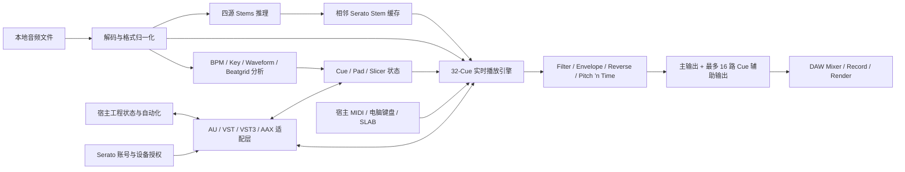

# Serato Sample 技术栈与底层实现档案

> 研究日期：2026-07-28
>
> 研究对象：[Serato Sample](https://serato.com/sample)
>
> 当前公开版本：2.2.0（官方发布日期：2025-12-02）
>
> 文档性质：中立技术档案；基于公开资料、官方分发元数据和可复核的工程推断

## 0. 结论摘要

Serato Sample 是一个运行在 DAW 进程中的原生桌面音频插件。公开资料能够确认它对外提供 AU、VST/VST3、AAX Native 等插件接口，在 macOS 与 Windows 上完成本地音频解码、波形与节拍分析、调性分析、32 个 Cue 的复音播放、滤波与包络、Pitch ’n Time 变调/时间拉伸、四类 Stems 分离、宿主自动化、多路音频输出、MIDI 输入和 SLAB 硬件控制。

从产品行为、平台覆盖、实时音频要求和 Serato 的公开招聘资料看，Sample 的共享核心高度可能是以 C++ 编写的跨平台原生音频引擎；AU、VST/VST3、AAX 只是包裹这个核心的宿主适配层。但 Serato 没有公开 Sample 的源码、软件物料清单（SBOM）、插件 SDK 组合、构建系统或模型文件格式，因此不能把 C++ 之外的 Qt、JUCE、Boost、TensorFlow、PyTorch、iZotope、pffft、TagLib、RtMidi、hidapi 等候选库直接写成 Sample 的已确认依赖。

当前公开证据支持以下判断：

| 结论 | 证据强度 | 说明 |
| --- | --- | --- |
| Sample 是 DAW 内原生插件，不是 Web/Electron 应用 | **已确认** | 官方提供 AU、VST/VST3、AAX Native 安装格式 |
| 产品拥有跨平台共享的实时音频/DSP 核心 | **强推断** | macOS/Windows 功能一致，需在不同插件接口中保存同一工程状态 |
| 主要产品代码高度可能使用 C++ | **强推断** | Serato 的音乐制作软件工程岗位明确以 C++、跨平台、DSP、实时性能为核心 |
| Pitch ’n Time 是 Serato 自有 DSP 技术 | **已确认** | 官方历史、产品文档和 Serato 早期专利可相互印证 |
| Stems 是本机执行的四源机器学习分离 | **已确认** | 官方称其为自有机器学习算法，并给出本地 CPU/AVX 运行约束 |
| Stems 的确切神经网络、训练数据和推理框架 | **未知** | 官方没有公开模型架构、权重格式、TensorFlow/ONNX/Core ML 等运行时归属 |
| 2.0 以后安装包包含显著增加的大型资源 | **已观察** | macOS 安装包约由 77.7 MiB 增至 1.38 GiB，Windows 约由 32.6 MiB 增至 364.6 MiB |
| 大型资源就是某个特定模型或框架 | **不能确认** | 体积变化与 Stems 同期，但仅凭体积不能识别模型架构或运行时 |
| JUCE、Qt 或 Boost 是 Sample 的 GUI/插件框架 | **候选，未确认** | Serato 公司层面存在使用信号，Sample 二进制尚未验证 |
| TensorFlow 是 Sample Stems 的推理引擎 | **候选，未确认** | Serato 全产品法律清单出现 TensorFlow，但未映射到 Sample |
| PyTorch 是 Sample 的运行时依赖 | **没有产品级证据** | Serato 音频研究工作存在 PyTorch 信号，更可能涉及研究/训练，不能外推到发行插件 |
| SLAB 的深度控制只依赖普通 MIDI | **不成立** | 部分按键走 Mackie Control，Pad 走 MIDI，Stem/Cue 等深度控制还需要 Sample 原生设备协议 |

因此，当前最严谨的技术栈描述是：

```text
macOS / Windows 原生插件
  ├─ 宿主适配：AU / VST2 / VST3 / AAX Native
  ├─ 高概率共享 C++ 核心
  │   ├─ 文件解码与元数据
  │   ├─ 波形 / BPM / Key / Beatgrid 分析
  │   ├─ 32-Cue 实时采样播放引擎
  │   ├─ Pitch ’n Time 变调与时间拉伸
  │   ├─ 四源 Stems 本地机器学习推理
  │   ├─ 自动化 / MIDI / 多路输出
  │   └─ 工程状态、撤销栈与资源定位
  ├─ Serato 账号与设备绑定授权
  └─ 可选 AlphaTheta SLAB 深度控制
```

其中只有外部接口、产品行为和运行约束可以视为已确认；“共享 C++ 核心”属于高可信架构推断，具体第三方库仍需官方安装包或 Serato 的 Sample 专属 SBOM 才能定案。

---

## 1. 研究目标、范围与证据规则

### 1.1 本文试图回答什么

本文集中回答：

- Sample 以何种进程、插件和平台形态运行；
- 它与宿主 DAW 之间交换哪些音频、MIDI、状态和自动化数据；
- 文件载入、分析、播放、变调、时间拉伸、分轨与缓存可能如何分层；
- 公开资料能够确认哪些语言、框架、SDK、库、模型或系统组件；
- 哪些依赖只出现在 Serato 全产品法律清单，不能归因到 Sample；
- 安装、授权、设备绑定、硬件控制和工程迁移涉及哪些技术边界；
- 若获得官方安装包，如何通过只读方法继续验证。

本文不做：

- 绕过 Serato 登录、授权或许可保护；
- 对闭源算法作源码级复原；
- 把竞品常用技术自动归因给 Sample；
- 把 Serato 网站前端技术栈混同于 Sample 插件运行时；
- 把全公司招聘要求或全产品第三方许可清单写成 Sample 的确定 BOM。

### 1.2 证据等级

| 等级 | 名称 | 定义 | 可用于何种表述 |
| --- | --- | --- | --- |
| **A** | Sample 产品级官方证据 | Sample 产品页、支持文档、版本说明、安装说明 | “Sample 支持/使用/要求……” |
| **B** | 官方分发或可观察运行证据 | 官方下载页嵌入元数据、安装包类型、公开安装路径、产品行为 | “发行物显示/运行行为表明……” |
| **C** | Serato 公司或产品族证据 | 公司法律清单、招聘、其他 Serato 产品文档 | “Serato 体系存在……，但未确认属于 Sample” |
| **D** | 工程推断 | 由多项 A/B/C 证据共同推导 | 必须写成“高概率”“合理推断” |
| **U** | 未知 | 没有足够公开证据或证据冲突 | 不给出确定答案 |

### 1.3 “库清单”最容易出现的误区

Serato 的[软件法律声明](https://serato.com/legal/software-legal-notices)面向“Serato software products”整体，并未给出产品到依赖的映射，也没有版本号、链接方式或使用模块。因此：

- 清单中出现 TensorFlow，不等于 Sample Stems 已确认使用 TensorFlow；
- 出现 Qt、Boost 或 JUCE 的公司使用信号，不等于 Sample UI 已确认基于这些框架；
- 出现 RtMidi、hidapi，不等于 SLAB 的 Sample 深度控制已确认由它们实现；
- 出现 FLAC、Ogg、LAME、TagLib，不等于 Sample 的每个解码器和标签读写器已经被识别；
- 出现 Crashpad 或 sentry-native，不等于 Sample 一定采集崩溃或遥测。

本文会保留这些候选，因为它们有助于后续二进制验证，但不会把候选写成事实。

---

## 2. 系统边界与总体架构

### 2.1 运行位置

Sample 作为插件被 DAW 扫描并载入，主要代码运行在宿主进程或宿主为插件提供的隔离进程中。具体是否进程内运行由宿主决定，例如某些 DAW 会为插件提供桥接、沙箱或独立扫描进程；这不是 Sample 可以统一控制的部署形态。

Sample 不是独立的音频驱动宿主。它通常不直接负责：

- 选择 Core Audio、ASIO 或 WASAPI 设备；
- 决定全局音频 buffer；
- 录制和排列宿主时间线；
- 保存整个歌曲工程；
- 完成最终离线导出。

这些职责由 DAW 承担。Sample 负责在宿主给定的采样率、buffer、transport、tempo 和 MIDI 事件下生成音频。

### 2.2 高层数据流



这张图中的公开可确认对象包括文件、分析、Stem 缓存、Cue、宿主状态、插件格式、MIDI、多输出和账号授权。内部模块边界是为解释产品行为而构造的工程模型，不代表 Serato 的源码目录或类名。

### 2.3 建议的内部层次模型

一个能够解释现有行为的最小实现至少需要以下层：

1. **插件封装层**
   - AU、VST2、VST3、AAX Native 入口；
   - 宿主生命周期、参数、状态保存、总线与 transport 适配；
   - 不同格式间保持相同产品对象语义。

2. **应用状态层**
   - Source、Beatgrid、Cue、Pad Bank、Stem、播放模式；
   - 100 步会话级撤销/重做；
   - 源文件重定位和缺失文件状态。

3. **异步分析层**
   - 解码、波形 overview、BPM、Key、Beatgrid；
   - Stems 推理与缓存；
   - 进度、取消和结果切换。

4. **实时音频层**
   - MIDI 事件到 Cue voice 的调度；
   - 32 Cue 的 Mono/Poly/Hold/Trigger 行为；
   - 包络、滤波、Reverse、增益、Velocity；
   - Pitch ’n Time、同步、Glide 和多路输出。

5. **持久化与外部服务层**
   - 宿主工程状态；
   - 外部源音频引用；
   - Beatgrid/Serato 元数据写入；
   - 相邻 Stem 缓存；
   - 浏览器登录、许可证下发、设备绑定与远程停用。

这种分层是强工程推断。公开资料没有披露具体类库、进程间通信方式、线程池或状态序列化格式。

---

## 3. 插件 SDK、宿主接口与兼容层

### 3.1 已确认插件格式

官方[宿主支持说明](https://support.serato.com/hc/en-us/articles/115000503094-What-DAWs-does-Serato-Sample-support)和[安装说明](https://support.serato.com/hc/en-us/articles/115000488174-Installation)确认：

| 格式 | 平台 | 角色 | 技术归属 |
| --- | --- | --- | --- |
| Audio Unit（AU） | macOS | Logic Pro 等 Apple 宿主的插件接口 | Apple |
| VST2 / VST | macOS、Windows | 历史宿主兼容 | Steinberg |
| VST3 | macOS、Windows | 当前主流跨宿主插件接口 | Steinberg |
| AAX Native | macOS、Windows | Pro Tools 原生 CPU 插件接口 | Avid |

“支持某格式”可以确认 Serato 构建并分发对应插件 wrapper，但不能单独证明使用 JUCE、iPlug2 或自研 wrapper。这些框架都能生成多格式插件，直接使用各厂商 SDK 也可以。

### 3.2 插件身份是持久化协议的一部分

官方[升级而不破坏旧 DAW 工程](https://support.serato.com/hc/en-us/articles/12201424350607-Updating-Serato-Sample-Without-Breaking-Old-DAW-Projects)文档要求保留原插件格式。旧工程使用 VST2 时，安装新版后若只留下 VST3，宿主可能把它视为不同插件。

这说明宿主保存的并不是抽象的“Serato Sample”名称，而是包含：

- 插件格式；
- 插件唯一 ID 或 bundle/component identity；
- 该格式的状态块；
- 宿主自己的实例和路由关系。

因此 VST2 → VST3 或 AU → AAX 不能被假定为透明迁移。即便共享核心相同，宿主识别符和状态装载入口仍不同。

### 3.3 AAX 版本资料存在冲突

- [2.1.0 发布页](https://serato.com/sample/downloads/2.1.0)表示安装器已包含 AAX Native；
- 上述升级支持文档又写作 Sample 2.2 及以后支持 AAX。

可能原因包括文档更新时间、正式支持范围与首次打包时间不同，或 2.1 的 AAX 发布范围有限。公开资料不足以消解冲突，本文不自行选择其中一个版本作为唯一事实。

### 3.4 宿主 transport 与参数

Sample 至少需要从宿主获得或处理：

- 当前采样率和音频 block size；
- 宿主 BPM；
- 播放/停止等 transport 状态；
- MIDI note、velocity 与时间偏移；
- 参数自动化值；
- 插件状态保存/恢复；
- 音频总线配置；
- 离线/实时渲染生命周期。

官方[Miscellaneous](https://support.serato.com/hc/en-us/articles/115003945934-Miscellaneous)文档列出的可自动化参数包括播放模式、Key/Pitch、BPM、Sync、Seek、Autoset、Slicer、Clear、Cue Key/Time/Filter、Cue Level/Attack/Release/Reverse、Mono/Poly、Detune、Velocity、Glide 等。2.2.0 还把 Stem 开关和电平暴露给宿主自动化。

需要注意：支持文档只列出 Cue 1–16 的若干自动化参数，而当前产品有 32 个 Cue。它可能反映旧版本文档、只暴露首个 Bank，或宿主参数数量/兼容策略；没有 2.2.0 的实际参数枚举，不能确定后 16 个 Cue 的自动化覆盖。

### 3.5 多路音频输出

官方 Maschine 路由文档说明 Sample 的 Output 2–17 对应 16 个 Cue 的独立输出。这意味着插件至少向宿主声明：

- 一个主立体声输出；
- 16 个可选辅助输出；
- Cue 到输出总线的可保存路由。

这不表示 32 个 Cue 各自拥有固定独立总线；已公开的辅助总线数量是 16。不同 DAW 对多输出插件的启用和显示方式也不同。

---

## 4. 语言、框架、构建与工具链

### 4.1 C++：高可信但仍是间接确认

Serato 当前公开的 C++ 软件工程职位描述把工作对象定义为：

- C++ 音乐制作应用；
- macOS 与 Windows 跨平台交付；
- 多线程、高性能与实时约束；
- UI、DSP、后端、数据库/SQL/REST 等领域；
- Qt、Boost、JUCE 作为加分经验。

来源：[Serato Junior Software Engineer – C++](https://serato-limited.breezy.hr/p/797f066a1507-junior-software-engineer-c)

结合 Sample 的四种原生插件格式、跨平台实时 DSP 和 Apple Silicon/Intel/x86 支持，共享核心使用 C++ 的概率很高。C++ 也是 VST3、AAX、AU 和大多数专业音频框架的主流交集。

但职位属于 Serato 工程组织，不是 Sample 2.2.0 的构建清单，所以严谨措辞是“高概率使用 C++”，不是“已从 Sample 二进制确认 C++ ABI 和编译器”。

### 4.2 Qt、JUCE、Boost

| 候选 | 公开信号 | 可能角色 | Sample 归属 |
| --- | --- | --- | --- |
| Qt | Serato 招聘列为相关经验；全产品法律声明含 Qt | 跨平台 UI、基础设施 | 未确认 |
| JUCE | 招聘列为相关经验；JUCE 官网客户页列出 Serato | 插件 wrapper、音频/MIDI、UI | 未确认 |
| Boost | 招聘列为相关经验；全产品法律声明含 Boost | C++ 容器、线程、算法、基础工具 | 未确认 |

[JUCE Made with JUCE](https://juce.com/made-with-juce/page/2/)只能证明 Serato 公司曾/正在使用 JUCE，不能定位到 Sample。Sample 也可能混合使用自研 UI、直接插件 SDK 和少量通用库。

### 4.3 编译器与二进制架构

从平台要求可以推断发行链至少覆盖：

- macOS Intel x86_64；
- macOS Apple Silicon arm64；
- Windows x86-64，且 2.0+ 要求 AVX；
- AAX、AU、VST/VST3 的不同 bundle 或模块产物。

但以下信息没有公开：

- macOS 是单个 Universal 2 二进制还是安装器中分别携带架构 payload；
- 使用 Apple Clang、LLVM 还是其他编译器及具体版本；
- Windows 使用 MSVC、Clang-cl 或其他工具链；
- C++ 标准版本；
- Debug symbol、LTO、SIMD dispatch 和链接策略；
- CMake、Meson、Xcode project、Visual Studio solution 或自研构建系统；
- Conan、vcpkg、Buck、Bazel 等依赖管理方式；
- CI/CD 平台、测试框架和签名流水线。

这些都需要安装包、Mach-O/PE 头、PDB/dSYM 线索或官方工程资料才能确认。

### 4.4 GUI 渲染技术

Sample 的彩色波形、高 DPI 缩放、实时状态和跨平台一致界面要求一个原生绘制层。可能的实现包括：

- JUCE Graphics/OpenGL；
- Qt Widgets/Qt Quick；
- Core Graphics + Direct2D/DirectWrite 的自研抽象；
- OpenGL 或其他 GPU/CPU 混合渲染；
- 完全自研的软件栅格化波形组件。

当前没有公开证据识别其渲染 API。Serato 全产品法律声明出现 Qt、GLEW、mesa-llvm 等名称，但不能据此判断 Sample 使用 OpenGL、Mesa 或 Qt。

### 4.5 测试、性能分析和发布工具

没有 Sample 专属公开资料披露：

- 单元测试/集成测试框架；
- DAW 宿主兼容自动化；
- 音频 golden master 或 null test；
- 模型质量评测集；
- CPU profiler、实时线程 watchdog；
- 崩溃收集和符号服务器；
- 安装包生成器；
- 版本发布和回滚流程。

从专业插件产品的交付需求看，这些能力很可能存在，但“应该存在”不是依赖证据。

---

## 5. 安装包、分发与文件布局

### 5.1 分发形式

官方安装说明确认：

- macOS 下载 `.pkg`；
- Windows 下载 `.zip`，内部包含安装器 `.exe`；
- 安装时可选择 AU、VST、VST3、AAX 等组件；
- Windows 安装需要 UAC 权限；
- macOS 安装器可通过 Customize 选择组件。

这表明发行包不是单一可执行程序，而是将同一产品核心装配进多个插件格式和平台特定目录。

### 5.2 官方默认安装路径

| 平台 | 格式 | 默认路径 |
| --- | --- | --- |
| macOS | VST2 | `/Library/Audio/Plug-Ins/VST/` |
| macOS | VST3 | `/Library/Audio/Plug-Ins/VST3/` |
| macOS | AU | `/Library/Audio/Plug-Ins/Components/` |
| macOS | AAX | `/Library/Application Support/Avid/Audio/Plug-Ins/` |
| Windows | VST2 | `C:\Program Files\VSTPlugins\` |
| Windows | VST3 | `C:\Program Files\Common Files\VST3\` |
| Windows | AAX | `C:\Program Files\Common Files\Avid\Audio\Plug-Ins` |

来源：[升级与插件路径说明](https://support.serato.com/hc/en-us/articles/12201424350607-Updating-Serato-Sample-Without-Breaking-Old-DAW-Projects)。

VST2 允许用户选择自定义目录，因此宿主扫描失败并不必然表示安装失败；也可能是 DAW 的扫描目录与安装位置不一致。

### 5.3 安装包体积演进

以下字节数来自 Serato 官方下载页嵌入的发行资源元数据。MiB/GiB 为本文按 1024 进制换算。

| 版本 | 平台 | 官方文件名 | 精确字节数 | 约合 |
| --- | --- | --- | ---: | ---: |
| 1.4.1 | Windows | `Serato Sample 1.4.1.2866.zip` | 34,233,036 | 32.65 MiB |
| 1.4.1 | macOS | `Serato Sample 1.4.1.2866.pkg` | 81,509,826 | 77.73 MiB |
| 2.0.0 | Windows | `Serato Sample 2.0.zip` | 382,291,725 | 364.58 MiB |
| 2.0.0 | macOS | `Serato Sample 2.0.pkg` | 1,480,140,419 | 1.38 GiB |
| 2.1.0 | Windows | `Serato Sample 2.1.0.zip` | 387,443,843 | 369.50 MiB |
| 2.1.0 | macOS | `Serato Sample 2.1.0.pkg` | 1,474,714,370 | 1.37 GiB |
| 2.2.0 | Windows | `Serato Sample 2.2.0.zip` | 402,918,570 | 384.25 MiB |
| 2.2.0 | macOS | `Serato Sample 2.2.0.pkg` | 1,555,920,240 | 1.45 GiB |

1.4.1 → 2.0 的时间点正好对应 Serato Stems 引入：

- Windows 增加约 348 MiB；
- macOS 增加约 1.30 GiB。

这是“2.0 发行物加入大型 Stems 模型、运行时或多架构资源”的强旁证。macOS 体积明显更大，可能与 Intel + Apple Silicon 双架构、多个插件格式、不同模型 payload 或打包压缩策略有关；没有解包结果时不能选定原因。

### 5.4 本次未能完成的二进制核验

Serato 当前下载接口要求账号持有相应数字资产授权。官方页面前端请求：

```text
POST https://da.serato.com/api/v1/resources/{resource_id}/download
```

未登录请求返回 403 和 `Access denied. Invalid grants.`。本次研究没有绕过授权，也没有在研究机器上发现已安装的 Sample 插件或现成安装包，因此未进行：

- macOS package 展开；
- Mach-O 架构、动态链接和 bundle ID 检查；
- Apple 签名、notarization、entitlement 检查；
- Windows PE 导入表和 Authenticode 检查；
- 模型、许可证、第三方 notice 和资源文件枚举；
- 插件参数、总线和状态块的宿主内实测。

这是一项明确的证据缺口，不应以 Serato 全产品法律清单代替。

---

## 6. 音频文件、解码器与元数据

### 6.1 已确认输入格式

官方[支持的文件格式](https://support.serato.com/hc/en-us/articles/115000380193-Supported-File-Formats-for-Serato-Sample)列出：

| 平台 | 格式 |
| --- | --- |
| macOS | AAC、AIFF、MP3、MP4、M4A、WAV、OGG、FLAC |
| Windows | AIFF、MP3、WAV、FLAC、WMA、OGG |

采样率范围：

- 44.1 kHz；
- 48 kHz；
- 88.2 kHz；
- 96 kHz；
- 176.4 kHz。

位深：

- 16-bit；
- 24-bit；
- 32-bit。

文档未明确 32-bit 指整数、浮点或两者，也未说明每个容器/编码组合的通道数上限。

### 6.2 解码实现不能从格式表直接推出

可能的实现来源包括：

- macOS 的 AudioToolbox/Core Audio；
- Windows Media Foundation；
- Serato 自带跨平台 codec；
- libFLAC、libvorbis、libogg、LAME 或其他第三方库；
- Serato 自研统一解码层加平台特定后端。

Serato 全产品法律清单确实出现 FLAC、libVORBIS、libOGG、LAME、TagLib 等，但未标注 Sample。平台格式差异——例如 macOS 有 AAC/M4A/MP4，Windows 有 WMA——也可能说明部分能力委托给操作系统媒体框架。

### 6.3 载入与资源定位

官方[Loading a file](https://support.serato.com/hc/en-us/articles/115000489094-Loading-a-file)文档显示：

- 用户选择本地音频文件；
- Sample 对其执行分析并显示进度；
- 分析可以取消；
- 源文件丢失时可 Locate；
- Eject 会丢弃当前 Cue。

这说明 Sample 的工程状态至少保存源文件引用或可重定位标识，而不是总把完整音频嵌入插件状态块。

### 6.4 Beatgrid 和 Serato 元数据写入

官方指出，当音频文件只读或被其他应用锁定时，保存 Beatgrid 可能失败。这意味着 Sample 会把至少一部分 Serato 分析数据写回音频文件或与文件紧密关联的 Serato 元数据结构。

Sample 1.3.0 的“Serato DJ” Autoset 能读取 Serato DJ Cue。由此可以确认 Sample 与 Serato DJ 至少共享某种可互操作的 Cue/分析元数据语义。

尚未确认：

- 数据位于 ID3、RIFF、AIFF chunk、XMP、自定义 tag 还是旁车文件；
- 不同文件格式的写入策略；
- tag schema、版本和校验方式；
- 写入是否原子化；
- Sample 与 Serato DJ 的全部兼容字段。

TagLib 出现在 Serato 全产品法律清单中，是元数据候选库，但不能在没有二进制证据时归因到 Sample。

### 6.5 采样率转换

源音频与宿主工程可以使用不同采样率，实时播放也支持 ¼×–4× 时间尺度和 ±24 半音变调，因此内部必然存在重采样、插值或频域重建能力。

但公开资料没有说明：

- 使用线性、sinc、多相 FIR 或其他 SRC；
- 实时与离线是否采用不同质量；
- 是否使用系统 SRC、iZotope SRC、自研 SRC 或其他库；
- 多高采样率输入何时被转换为内部格式。

---

## 7. 波形、BPM、Key 与 Beatgrid 分析

### 7.1 分析产物

Sample 载入音频后产生或读取：

- 彩色频谱波形；
- overview waveform；
- BPM；
- musical key；
- Beatgrid；
- bar/beat marker；
- 最多 128 个 tempo marker 的变速映射；
- 已有 Serato DJ Cue；
- 可供自动切片算法使用的结构信息。

参考：[Beatgrids](https://support.serato.com/hc/en-us/articles/360002025835-Beatgrids)和[Source Player](https://support.serato.com/hc/en-us/articles/115000489334-Source-Player)。

### 7.2 Beatgrid 数据模型

公开交互至少体现以下对象：

- **Grid Start**：网格起点；
- **Bar Marker**：小节定位；
- **Beat Marker**：拍点定位；
- **Tempo Marker**：局部 BPM/变速段；
- **Fixed/Variable Tempo**：恒定或变化速度的网格；
- **Slip / Stretch / Contract**：移动网格或改变局部密度；
- **Tap Tempo / Metronome**：人工校准。

支持 128 个 tempo marker 意味着 Beatgrid 不是单一 `{bpm, offset}`，而是可表示分段时间映射的结构。实时同步需要把 source time、beat position 和 host time 互相转换。

### 7.3 BPM 与 Key 算法

Sample 官方只声明能够检测 BPM 和 Key，没有公开：

- onset detector；
- beat tracker；
- tempogram；
- half/double-time 决策；
- chroma/HPCP 或调性模板；
- Camelot/Open Key 与传统调名之间的内部表示；
- 置信度；
- 分析窗口长度；
- 是否复用 Serato DJ 的分析核心。

彩色频谱波形、Beatgrid 和 DJ Cue 心智模型来自 Serato DJ 产品传统，因此“共享部分分析基础设施”是合理推断，但不是源码级确认。

### 7.4 自动切片算法

Sample 提供 Find Samples、Random、Slicer、Serato DJ Cue 等 Autoset 方法。公开 UI 可以确认其输入输出，却不能确认具体算法。

可能使用的特征包括 transient、spectral novelty、beat/downbeat、能量、和声变化、重复度和片段间差异；这些是通用音频工程候选，不应被写成 Sample 已使用的特征集。

### 7.5 异步执行

分析有进度和取消，Stems 初次计算也需要明显时间。为避免阻塞宿主 UI 与实时音频回调，高概率存在：

- 后台 worker thread 或线程池；
- 可取消的任务状态；
- 结果提交到 UI/音频状态的同步边界；
- 音频数据和波形/分析结果缓存。

线程数量、优先级、调度器和锁策略均未公开。

---

## 8. 实时采样播放引擎

### 8.1 Cue/Voice 模型

当前产品最多提供 32 个 Cue。每个 Cue 至少包含：

- source start/end 或切片范围；
- cue color；
- playback mode；
- key/pitch；
- time scaling；
- level；
- filter；
- attack；
- release；
- reverse；
- output routing；
- MIDI note 映射；
- Stem 混合上下文。

全局还包括：

- Hold / Trigger；
- Mono / Poly；
- Keyboard Mode；
- Velocity；
- Detune；
- Glide duration 与 mode；
- Quantize；
- Sync。

### 8.2 复音与 voice allocation

Poly 模式允许多个 Cue 同时发声，Mono 模式需要在新 note 到达时终止、切换或 glide 到新 Cue。32 个 Cue 不等于最大 32 voices；Release 尾音、重复 note、宿主 block 内多事件和实现的 voice stealing 策略都可能改变实际 voice 数。

公开资料没有说明：

- 最大并发 voice；
- voice stealing 策略；
- 同一 Cue 的 retrigger 行为；
- sample-accurate MIDI 调度；
- denormal 处理；
- oversampling；
- 内部 mix headroom。

### 8.3 每 Cue DSP 参数

官方[Cue parameters](https://support.serato.com/hc/en-us/articles/115000500413-Cue-parameters)给出：

| 参数 | 公开范围/行为 |
| --- | --- |
| Level | ±12 dB |
| Filter | 80 Hz–17 kHz |
| Attack | 0–10 s |
| Release | 0–10 s |
| Reverse | 反向播放 |
| Key Shift | ±24 semitones |
| Time Stretch | ¼×–4× |
| Glide | 0.01 ms–5 s，仅 Mono |

Filter 的响应类型、斜率、Q、是否零延迟、系数平滑方式均未公开。Attack/Release 的曲线也未说明是线性、指数或其他形状。

### 8.4 Trigger、Quantize 与延迟

Quantize 需要把输入 note 对齐到 Beatgrid/宿主节拍。实现可能选择：

- 延迟事件到下一个网格；
- 在可预测输入时预调度；
- 依据宿主 PPQ 和 block offset 修正；
- 在不同播放模式下采用不同策略。

官方没有公布 quantize resolution、look-ahead 或附加延迟。插件报告给宿主的 latency 也未公开。

### 8.5 Real-time safety

一个合格实现必须避免在音频 callback 中进行：

- 文件 I/O；
- 网络请求；
- 不可控内存分配；
- 长时间 mutex 等待；
- Stems 模型初始化；
- 大型波形重建；
- 许可证交互。

这是实时音频系统的通用必要条件，不是对 Serato 源码的直接观察。Sample 的实际 lock-free queue、double buffering、内存池或 RCU 策略未知。

---

## 9. Pitch ’n Time：变调与时间拉伸

### 9.1 产品级确认

[Serato 公司历史](https://serato.com/about)显示 Pitch ’n Time 是 Serato 1999 年起家的核心技术。Sample 把它用于：

- 改变调性而尽量保持时长；
- 改变播放速度而尽量保持音高；
- 将 Sample BPM 同步到宿主 BPM；
- 对 Cue 进行 ±24 半音和 ¼×–4× 的变形；
- Mono 模式下进行 Glide。

关闭 Pitch ’n Time 时，Sync 不可用。对于文件名含“808”且短于 10 秒、或源文件短于 3 秒的素材，产品可能自动关闭 Pitch ’n Time，以避免不必要处理或优化 one-shot 行为。[Overview](https://support.serato.com/hc/en-us/articles/115000487673-Overview)

### 9.2 历史专利能够说明什么

Serato Audio Research 的[美国专利 US6266003B1](https://patents.google.com/patent/US6266003B1/en)优先权可追溯至 1998 年，描述一种时长与音高独立变换的频域分析/重合成方法，包含：

- 将信号划分为带窗 frame；
- FFT 或频域表示；
- 对局部频谱极值和区域进行分析；
- 把区域聚合成表示频率结构的 vector；
- 调整频率、相位和 frame 映射；
- 重新合成变调或变速信号。

它说明 Serato 的早期核心技术路线与频域分析/重合成有关。

但该专利已经到期，而且 1998 年专利不等于 Sample 2.2.0 的当前实现。二十多年间可能加入：

- transient preservation；
- phase coherence；
- formant 处理；
- 多分辨率分析；
- 内容自适应模式；
- SIMD 优化；
- 完全不同或混合的现代算法。

因此不能把专利权利要求当作当前源码说明书。

### 9.3 具体库与算法仍未知

未确认：

- 当前 Pitch ’n Time 引擎版本；
- phase vocoder、WSOLA、PSOLA、elastique 类方法或混合策略；
- FFT 库；
- window、hop size 和 overlap；
- transient/formant 模型；
- 实时与离线质量档；
- AVX/NEON 优化方式；
- 是否使用 iZotope 组件。

Serato 全产品法律清单出现 FFTConvolver、pffft 和 iZotope，但没有 Sample/Pitch ’n Time 映射。

---

## 10. Serato Stems：机器学习分离栈

### 10.1 已确认行为

[Sample 2.0.0 发布说明](https://serato.com/sample/downloads/2.0.0)和[Stems 支持文档](https://support.serato.com/hc/en-us/articles/7645256113551-Stems)确认：

- 分为 Vocal、Melody、Bass、Drums 四类；
- 在本机执行，首次触发需要计算时间；
- 计算负载较高；
- 分离结果会更新波形显示；
- 可以开关各 Stem；
- 2.2.0 可调 Stem level，并可由宿主自动化；
- 保存后会在原始音频附近生成 Serato Stem 文件；
- 缓存可删除并重新生成。

Serato 将 Stems 描述为自有、实时音源分离机器学习技术。[Serato Stems 公告](https://the-drop.serato.com/announcements/the-best-real-time-audio-source-separation-technology-serato-stems/)

### 10.2 推理发生在哪里

公开系统要求强调：

- x86 处理器需要 AVX；
- 2.0+ 在不支持 AVX 的 Windows 机器上不安装；
- macOS 推荐 Intel i5 或 Apple M1/M2 及以上；
- Stems 对 CPU 压力明显；
- 没有规定 NVIDIA、CUDA 或独立 GPU。

这些证据支持“CPU 是必须可用的主要推理路径”。但没有 GPU 要求不等于从不使用 GPU，也不能排除 Apple Accelerate、Metal、Core ML、DirectML 或其他可选后端。

### 10.3 AVX 边界

官方[AVX 说明](https://support.serato.com/hc/en-us/articles/5766792501903-What-is-AVX-and-why-does-Serato-software-require-a-processor-with-AVX-support)明确：

- 要求原始 AVX；
- 不要求 AVX2 或 AVX-512；
- Sample 2.0+ 使用该要求；
- 1.4.1 是最后一个不要求 AVX 的版本。

AVX 可能用于：

- 神经网络矩阵/卷积运算；
- FFT 和音频预处理；
- 大块向量混音；
- 模型运行时内部 kernel。

仅凭 CPU flag 不能定位是哪一层使用 AVX。

### 10.4 模型和运行时候选

| 候选 | 支持信号 | 反证/缺口 | 当前结论 |
| --- | --- | --- | --- |
| TensorFlow / TensorFlow Lite | Serato 全产品法律清单含 TensorFlow | 无 Sample 二进制、模型文件或版本映射 | 候选，未确认 |
| PyTorch / LibTorch | Serato 音频研究工作存在 PyTorch 能力信号 | 全产品法律清单未把它映射到 Sample；发行体积和 AVX 不能证明 | 研究/训练候选，运行时未确认 |
| ONNX Runtime | 跨平台本地推理的常见选择 | 无公开 Serato Sample 证据 | 纯可能性，不应列为依赖 |
| Core ML | Apple Silicon/macOS 可用 | Windows 同功能要求另一后端；无模型证据 | 纯可能性 |
| 自研推理引擎 | Serato 称算法自有 | “算法自有”不代表运行时也自研 | 未知 |
| Demucs / Spleeter / Open-Unmix | 同属音乐分离领域 | Serato 强调自有算法，且无代码/模型归属证据 | 不应归因 |

### 10.5 可能的处理阶段

一个典型四源分离路径可能包括：

```text
解码
→ 重采样 / 声道归一化
→ 分块与重叠
→ 时域或时频域特征
→ 神经网络推理
→ mask / waveform 估计
→ overlap-add / 重建
→ loudness 或一致性处理
→ 写入 Stem 缓存
→ 生成各 Stem 波形 overview
```

这是领域通用流程，仅用于列出需要被安装包/实测验证的模块，不表示 Sample 使用 STFT mask 或特定网络类型。

### 10.6 缓存文件

Sample 2.0 发布说明称保存后会把 “Serato Stem file” 写在原文件旁边。Serato Studio 的官方文档进一步把同族缓存称为 `.serato-stems`，可删除并重建。

对 Sample 可确认的是“存在相邻、可再生成的 Serato Stem 文件”；`.serato-stems` 扩展名在 Serato 产品族中得到确认，但仍应通过 Sample 2.2.0 实测确认其扩展名、版本和互操作性。

缓存可能包含：

- 四个分离音频；
- 压缩/分块后的 stem 数据；
- 波形 overview；
- 模型或算法版本；
- 源文件指纹；
- 校验信息。

这些字段均未公开。也不知道缓存是否加密、压缩、可跨 Serato 产品共享或在源文件修改后如何失效。

### 10.7 模型未知项

公开资料没有回答：

- 网络属于频谱 mask、时域波形、hybrid transformer 还是其他结构；
- 参数量和权重精度；
- FP32、FP16、INT8 或混合量化；
- 上下文长度、chunk/overlap；
- latency 和 real-time factor；
- 训练集来源、许可和数据治理；
- vocal bleed、drum transient、bass phase 的目标函数；
- 模型是否随版本更新；
- macOS 与 Windows 是否使用同一权重；
- 是否根据 CPU 架构选择不同模型；
- 推理引擎和线程数；
- 是否调用 GPU/NPU；
- Stem 文件是否保存完整音频还是可重建特征。

任何对这些问题的确定答案都需要新的产品级证据。

---

## 11. 线程、内存、性能与实时约束

### 11.1 CPU 与 buffer

官方[性能优化说明](https://support.serato.com/hc/en-us/articles/115000475714-Optimization-for-Serato-Sample-users)指出：

- 更长、更大的音频占用更多 CPU/RAM；
- 更多 Sample 实例会增加负载；
- 更高宿主采样率增加 CPU；
- 增大 buffer 可缓解爆音；
- 可通过 render/flatten 减少实时实例。

这符合以下资源模型：

```text
总内存 ≈ 每实例源音频/缓存 + 波形 + 分析结果 + Cue 状态 + DSP 工作区
总 CPU ≈ 活跃 voice DSP + Pitch ’n Time + Stem 处理 + 宿主采样率 × 实例数
```

实际是否把整段音频解码到 RAM、内存映射、分块 streaming 或混合策略，官方未披露。

### 11.2 Stems 与音频回调隔离

初次 Stems 计算耗时且可感知，理论上不能直接运行在实时 audio callback。高概率架构是：

- 音频线程继续使用原始音频或已有缓存；
- 后台任务执行分离；
- 完成后通过无阻塞或短临界区切换可播放资源；
- UI 接收进度和结果；
- 保存时持久化缓存。

切换是否无缝、是否等到 transport 停止、是否存在 crossfade，官方没有说明。

### 11.3 多实例

每个 DAW 工程可创建多个 Sample 实例。需要考虑：

- 许可证状态是否进程级共享；
- 模型权重是否实例间共享；
- Stem worker 是否全局限流；
- 相同源文件是否复用缓存；
- SLAB 只控制一个实例的仲裁；
- 多插件格式在同一宿主中的资源共享。

官方仅确认资源负载随实例数增加，以及 SLAB 同时控制一个 Sample 实例。共享模型、进程服务或单例管理器属于推断。

### 11.4 Undo/Redo

官方说明每个 Sample 实例在一次 project session 中保留最多 100 个操作的 undo/redo。可以推断存在命令历史或状态快照机制。

未确认：

- 历史是否写入宿主工程；
- 关闭再打开工程后是否保留；
- 音频大对象是否 copy-on-write；
- Stems 计算和源文件定位是否进入历史；
- 自动化写入是否可撤销。

---

## 12. 工程状态、文件共享与缓存

### 12.1 宿主状态与外部文件的双层模型

官方[共享 Sample 工程](https://support.serato.com/hc/en-us/articles/115000416594-How-to-share-a-Sample-project)要求使用 DAW 的 Collect All and Save、Save copy with samples 等机制一并收集源文件。

因此工程由两类状态组成：

1. **插件状态**
   - Cue、颜色、参数、Beatgrid 编辑、Stem mix、路由等；
   - 由宿主的插件 state/chunk/preset 机制保存。

2. **外部资源**
   - 源音频文件；
   - 相邻 Stem 缓存；
   - 可能的 Serato 元数据。

只复制 DAW 工程文件不一定足以在另一台机器恢复声音。

### 12.2 Locate 机制

源文件缺失时 Sample 允许 Locate。可能匹配：

- 绝对路径；
- 文件名；
- 大小/修改时间；
- 内容 hash；
- Serato 数据库 ID。

公开资料没有说明匹配算法。若用户选错同名文件，Beatgrid/Cue 是否基于内容校验也未知。

### 12.3 状态序列化

VST2、VST3、AU、AAX 各自有状态保存接口。共享核心可能使用统一内部 schema，再由 wrapper 写入宿主格式。

未确认：

- JSON、XML、protobuf、二进制 struct 或自定义 archive；
- schema version 和迁移逻辑；
- endian 与跨平台兼容；
- preset 格式；
- 是否嵌入波形或分析缓存；
- 是否压缩；
- VST2/VST3 状态能否由内部工具转换。

“旧工程必须保留同一插件格式”只证明宿主 identity 有差异，不证明内部状态 schema 完全不同。

---

## 13. MIDI、自动化、路由与 SLAB 硬件

### 13.1 标准 MIDI

官方[键盘快捷键说明](https://support.serato.com/hc/en-us/articles/115006095827-Serato-Sample-Keyboard-shortcuts)记录：

- 默认 Pad 音符覆盖 C1–D#2；
- 某些 DAW 使用不同 octave 编号，显示为 C3 等；
- velocity 可影响播放；
- Keyboard Mode 可把一个 Cue 作为可演奏音高映射。

octave 显示差异来自 MIDI note number 与宿主命名约定，不代表实际 note number 发生变化。

### 13.2 Host automation

自动化参数需要：

- 稳定 parameter ID；
- normalized value 与 UI unit 映射；
- sample/block 级 parameter change 处理；
- state restore；
- 参数平滑，避免 zipper noise；
- 不同插件格式中的一致暴露。

Sample 2.2 对 Stem 开关与电平的自动化扩展还要求保持旧工程参数 ID 稳定，或提供 schema 迁移。具体实现未公开。

### 13.3 SLAB 的多协议控制

官方[SLAB Quickstart](https://support.serato.com/hc/en-us/articles/14187304054287-SLAB-Quickstart-Guide-for-Serato-Sample)确认：

- Sample 2.2+；
- SLAB firmware 1.10+；
- USB-C 连接；
- 不需要独立驱动；
- Pad 发送 MIDI；
- Play/Record 发送标准 Mackie Control 消息给宿主；
- Stem、BPM、Cue 编辑、slice、波形 scrub 等由 Sample 原生映射控制；
- 同一时间只有一个 Sample 实例取得控制；
- 保持相同插件格式有助于硬件正确重新关联。

这说明至少存在三条控制路径：

```text
SLAB Pad → MIDI Note → Sample Cue
SLAB Play/Record → Mackie Control → DAW Transport
SLAB 深度控制 → Sample 原生设备映射 → 当前 Sample 实例
```

### 13.4 深度控制的传输层未知

原生映射可能基于：

- MIDI CC/NRPN；
- SysEx；
- USB HID；
- 多端点 USB composite device；
- Serato/AlphaTheta 自定义协议；
- 宿主插件与外部共享服务之间的 IPC。

Serato 全产品法律清单出现 RtMidi、hidapi、oscpack，但没有 Sample/SLAB 映射。无需驱动只表示使用操作系统已有 class driver，不足以识别传输协议。

### 13.5 单实例控制仲裁

“一个 Sample 实例取得控制”需要某种 focus/ownership 状态。可能依据：

- 最近点击的实例；
- 当前 hardware focus；
- 宿主中被选中的 track；
- 插件进程级单例；
- 外部服务广播。

具体仲裁和跨进程行为未公开。

---

## 14. 授权、网络与设备身份

### 14.1 已确认激活流程

官方[激活/停用说明](https://support.serato.com/hc/en-us/articles/115007312487-Serato-Sample-activation-deactivation)描述：

1. 在插件内点击激活；
2. 打开系统默认浏览器；
3. 登录 Serato 账号；
4. 浏览器授权后返回插件；
5. 许可证发送到当前电脑；
6. v2+ 支持远程停用。

这是一种浏览器辅助的桌面应用授权流，但官方没有公开协议细节。

### 14.2 设备绑定

官方[Activation errors](https://support.serato.com/hc/en-us/articles/115006104768-Serato-Sample-Activation-errors)显示许可证与电脑身份绑定，BIOS、主板、磁盘、computer name/ID、系统时钟、版本不匹配或网络防火墙都可能影响激活。

因此授权子系统至少涉及：

- 本机设备指纹；
- Serato 账号 entitlement；
- 许可证服务；
- 本地许可证持久化；
- 版本兼容检查；
- 时钟与有效性检查；
- 远程 deactivation。

### 14.3 不能确认的安全细节

未公开：

- OAuth/OIDC 是否用于插件本身；
- browser callback 使用 custom URL scheme、localhost 回调还是轮询；
- token 格式、刷新机制与存储位置；
- 设备指纹字段和隐私处理；
- 许可证签名算法；
- 离线宽限期；
- TLS/certificate pinning；
- 本地凭据是否使用 Keychain/DPAPI；
- crash/telemetry 上报内容。

Serato 网站当前使用的账号和下载 API 技术不能自动归因给插件激活运行时。

---

## 15. 操作系统、CPU 与硬件兼容

### 15.1 macOS

官方 2.2.0 页面支持 Intel Mac 和 Apple Silicon，并建议：

- 2017 年或更新机器；
- Intel i5，或 Apple M1/M2 及以上；
- 8 GB RAM；
- 15 GB SSD 空间。

未确认：

- 最低 macOS deployment target；
- Universal 2 结构；
- Rosetta fallback；
- Accelerate/vDSP、Metal 或 Core ML；
- hardened runtime entitlements；
- notarization ticket；
- AU sandbox 行为。

### 15.2 Windows

2.0+ x86 要求 AVX。官方还明确[Windows on ARM 当前不受支持](https://support.serato.com/hc/en-us/articles/360004005756-Serato-software-Windows-ARM-based-computers-not-currently-supported-including-Qualcomm-Snapdragon-X-series)。

未确认：

- 最低 Windows SDK；
- MSVC runtime 静态或动态链接；
- Direct2D/DirectWrite/OpenGL；
- Media Foundation；
- AVX runtime dispatch；
- 是否仍保留 SSE fallback；
- 安装器技术和驱动/服务组件。

### 15.3 15 GB 存储建议的含义

2.2.0 安装包本身约 0.38 GiB（Windows）或 1.45 GiB（macOS），但官方建议 15 GB SSD。较大余量可能用于：

- 解压与安装临时空间；
- Stem 缓存；
- DAW 工程与源音频；
- 多版本安装或 Serato 共用资产。

官方没有给出 15 GB 的逐项预算，不能把它当作模型权重大小。

---

## 16. 第三方技术与库：分级清单

### 16.1 Sample 产品级已确认的外部标准/接口

| 技术/接口 | 角色 | 证据 | 注意事项 |
| --- | --- | --- | --- |
| Audio Unit | macOS 插件接口 | Sample 安装/宿主文档 | 不能说明 wrapper 框架 |
| VST2/VST | 跨宿主插件接口 | Sample 安装/升级文档 | VST2 identity 与 VST3 不同 |
| VST3 | 跨宿主插件接口 | Sample 2.0+/安装文档 | 不能说明是否使用 JUCE |
| AAX Native | Pro Tools 插件接口 | 2.1/2.2 文档 | 首发版本资料冲突 |
| MIDI | Pad、velocity、keyboard | Sample/SLAB 文档 | 深度控制不一定是 MIDI |
| Mackie Control | SLAB Play/Record 控制 DAW | SLAB 官方文档 | 消息发给宿主，不是 Sample DSP |
| macOS Installer PKG | macOS 分发 | 官方下载/安装文档 | payload 未解包 |
| Windows ZIP + EXE | Windows 分发 | 官方下载/安装文档 | 安装器框架未知 |
| AVX | x86 SIMD 最低要求 | 官方 AVX 文档 | 不代表 AVX2 |

### 16.2 Serato 公司/产品族存在、Sample 未确认的候选

下表只表示“Serato 公开材料中出现过”，不是 Sample 2.2.0 的 BOM。

| 候选 | 常见用途 | Serato 公开信号 | Sample 需要何种证据才能确认 |
| --- | --- | --- | --- |
| Qt | 跨平台 UI/应用框架 | 招聘、全产品法律声明 | bundle framework、导入符号或 notice |
| JUCE | 音频插件、MIDI、UI | 招聘、JUCE 客户页 | JUCE 符号、模块 notice、二进制特征 |
| Boost | C++ 通用库 | 招聘、法律声明 | 链接符号/许可证/源码 notice |
| TensorFlow | ML 训练/推理 | 全产品法律声明 | TF runtime、模型、符号和版本 |
| iZotope | 音频 DSP | 全产品法律声明 | 组件 notice 或二进制符号 |
| pffft | FFT | 全产品法律声明 | 静态符号/notice |
| FFTConvolver | 卷积 | 全产品法律声明 | 模块或符号 |
| RtMidi | MIDI I/O | 全产品法律声明 | Sample/SLAB 二进制或 notice |
| hidapi | USB HID | 全产品法律声明 | SLAB 路径的库/导入 |
| oscpack | OSC | 全产品法律声明 | 网络/IPC 模块证据 |
| TagLib | 音频标签 | 全产品法律声明 | Sample 文件模块符号/notice |
| libFLAC | FLAC codec | 全产品法律声明 | Sample plugin 导入/静态符号 |
| libvorbis / libogg | OGG/Vorbis codec | 全产品法律声明 | Sample plugin 导入/静态符号 |
| LAME | MP3 编码 | 全产品法律声明 | Sample 主要是读取，是否需要编码未知 |
| libpng | PNG | 全产品法律声明 | Sample UI 资源或链接证据 |
| libjpeg-turbo | JPEG | 全产品法律声明 | Sample 使用场景不明确 |
| RapidJSON | JSON | 全产品法律声明 | 状态/服务模块符号或 notice |
| tinyxml / libxml2 | XML | 全产品法律声明 | 状态/配置模块证据 |
| SQLiteCpp | SQLite wrapper | 全产品法律声明 | Sample 数据库文件/符号 |
| curl | HTTP | 全产品法律声明 | Sample 授权模块导入/notice |
| OpenSSL | TLS/crypto | 全产品法律声明 | Sample 插件或授权服务模块证据 |
| Crashpad | 崩溃收集 | 全产品法律声明 | handler、database、符号 |
| sentry-native | 崩溃/遥测 | 全产品法律声明 | DSN/config/二进制链接 |
| spdlog | 日志 | 全产品法律声明 | 字符串、符号或 notice |
| fmt | 格式化 | 全产品法律声明 | 静态/动态符号 |
| ICU | Unicode | 全产品法律声明 | 动态依赖或 data 文件 |
| zlib | 压缩 | 全产品法律声明 | 导入/静态符号 |
| libzip | ZIP | 全产品法律声明 | 导入/notice |
| GLEW / Mesa LLVM | OpenGL/图形 | 全产品法律声明 | Sample 图形模块证据 |
| PortAudio | 独立音频 I/O | 全产品法律声明 | 插件通常依赖宿主，Sample 归属较弱 |
| The Amazing Audio Engine | Apple 音频应用框架 | 全产品法律声明 | 更可能来自其他 Serato 产品 |
| ASIO | Windows 专业音频驱动接口 | 全产品法律声明 | Sample 是插件，通常由 DAW 使用 ASIO |
| mDNSResponder | 局域网发现 | 全产品法律声明 | Sample 使用场景不明确 |
| RakNet | 网络通信 | 全产品法律声明 | Sample 使用场景不明确 |

### 16.3 Serato 法律清单中的其他项目

官方全产品法律页还列出或引用：

- libiconv；
- md5；
- mDNSResponder；
- libplist；
- asyncsocket；
- blowfish；
- dockutil；
- glog；
- Roboto Condensed Font；
- qtwinmigrate；
- libusbmuxd；
- qsb；
- gyp；
- libb64；
- tinydir；
- addr2line；
- BlackHole；
- FacebookSDK-iOS；
- ed25519；
- box2d；
- syphon；
- 以及一批 Rust crates。

这些名称覆盖 Serato 的 DJ、Studio、移动端、硬件和后台工具等多个产品域。大部分与 Sample 插件没有明确产品级连接，列出它们只是防止把法律页误读为 Sample 依赖表。

### 16.4 库归因的判断标准

后续只有出现下列至少一种证据，才应把候选提升为 Sample 已确认依赖：

- Sample 安装包内的专属 third-party notice；
- Sample bundle 的动态链接项；
- 未被裁剪的库符号或明确命名空间；
- 与库对应的资源、模型、license/version 文件；
- Serato Sample 官方工程说明；
- Serato 员工对 Sample 具体模块的可核验技术说明；
- Sample 崩溃栈或诊断日志中稳定出现该库。

单个通用字符串、文件扩展名或公司级招聘要求不足以完成归因。

---

## 17. 当前不能声称的技术

在没有安装包和产品专属资料的情况下，以下表述都不成立：

- “Sample 使用 Demucs/Spleeter/Open-Unmix 做分轨”；
- “Sample Stems 是某个公开论文模型的封装”；
- “Sample 使用 TensorFlow Lite/ONNX Runtime/Core ML/LibTorch 推理”；
- “Sample 的训练框架就是 PyTorch”；
- “Sample UI 基于 JUCE/Qt/OpenGL”；
- “Sample 用 iZotope 做拉伸或 SRC”；
- “Sample 用 TagLib 写 Serato DJ tag”；
- “Sample 用 RtMidi/hidapi 控制 SLAB”；
- “Sample 用 SQLite 保存工程”；
- “Sample 使用 Crashpad/Sentry 上报崩溃”；
- “Sample 通过 GPU、Metal、CUDA 或 DirectML 加速”；
- “Sample 的 macOS 包是 Universal 2”；
- “Sample 使用 CMake、Xcode、Visual Studio、Conan 或 vcpkg”；
- “Sample 的网络授权就是官网可观察到的 OAuth/PKCE 实现”。

这些都是可验证问题，不是可以靠行业常识填补的事实。

---

## 18. 若取得官方安装包，可执行的只读验证方案

以下步骤只读取合法取得的官方安装包和已安装插件，不修改二进制、不绕过许可证。

### 18.1 通用取证记录

先记录：

```bash
shasum -a 256 "Serato Sample 2.2.0.pkg"
stat -f "%z bytes" "Serato Sample 2.2.0.pkg"
```

Windows 可用：

```powershell
Get-FileHash ".\Serato Sample 2.2.0.zip" -Algorithm SHA256
Get-Item ".\Serato Sample 2.2.0.zip" | Select-Object Name,Length,LastWriteTime
```

目标是建立版本、文件大小与 hash，不把来源不明的二进制混入结论。

### 18.2 macOS PKG

安全展开到临时目录：

```bash
pkgutil --check-signature "Serato Sample 2.2.0.pkg"
pkgutil --expand-full "Serato Sample 2.2.0.pkg" "/tmp/serato-sample-2.2.0-pkg"
find "/tmp/serato-sample-2.2.0-pkg" -type f -maxdepth 8
```

重点核验：

- 子 package 与各插件格式的 payload；
- `.component`、`.vst`、`.vst3`、`.aaxplugin`；
- 共用 framework、dylib、model、resource；
- 第三方 license/notice；
- postinstall/preinstall script；
- bundle ID、版本与 minimum OS。

对每个插件主二进制：

```bash
file "/path/to/binary"
lipo -archs "/path/to/binary"
codesign -dv --verbose=4 "/path/to/bundle"
codesign -d --entitlements :- "/path/to/bundle"
otool -L "/path/to/binary"
nm -m "/path/to/binary" | head
```

签名与系统校验：

```bash
spctl -a -vv -t install "Serato Sample 2.2.0.pkg"
spctl -a -vv -t exec "/path/to/bundle"
```

### 18.3 Windows ZIP/EXE

先只列目录：

```powershell
tar -tf ".\Serato Sample 2.2.0.zip"
Get-AuthenticodeSignature ".\installer.exe" | Format-List
```

安装后对 `.dll`、`.vst3`、`.aaxplugin`：

- 查看 PE machine、subsystem、section；
- 查看 import table；
- 查看 Authenticode signer；
- 枚举旁加载 DLL、模型和 notice；
- 核对 MSVC runtime；
- 核对 AVX 指令和最低系统 manifest。

可使用 Microsoft `dumpbin /headers`、`dumpbin /imports` 或等价只读 PE 查看工具。

### 18.4 模型和推理运行时线索

搜索资源名：

```bash
find "/tmp/serato-sample-2.2.0-pkg" -type f \
  \( -iname "*.pb" -o -iname "*.tflite" -o -iname "*.onnx" \
  -o -iname "*.mlmodel" -o -iname "*.mlmodelc" \
  -o -iname "*.pt" -o -iname "*.pth" -o -iname "*.weights" \
  -o -iname "*.bin" -o -iname "*.json" \)
```

还应检查：

- `tensorflow`、`tflite`、`onnx`、`torch`、`coreml` 等动态库或符号；
- 大型无扩展资源；
- 多架构重复 payload；
- model version 与 checksum；
- AVX/NEON 特定 kernel；
- 模型是否嵌入主二进制。

未找到已知扩展名也不能证明没有模型：资源可能被打包、压缩、改名或嵌入。

### 18.5 插件宿主内动态核验

使用能枚举插件信息的宿主或测试工具记录：

- plugin ID、vendor ID、version；
- input/output bus；
- parameter ID、name、range、default、automatable；
- reported latency 与 tail；
- MIDI input/output；
- state save/restore；
- 32 Cue 与 automation 的实际覆盖；
- Stem 参数；
- 多输出 2–17；
- 不同插件格式的 identity。

动态分析应在合法激活和正常宿主环境中完成，不需要修改插件。

### 18.6 性能与线程核验

在固定素材、采样率和 buffer 下记录：

- 初次分析耗时；
- 首次 Stems 耗时；
- 缓存命中耗时；
- 每实例常驻内存；
- idle/playing/Stems 阶段 CPU；
- 44.1/48/96/176.4 kHz 差异；
- Intel AVX 与 Apple Silicon 差异；
- 多实例是否共享模型内存；
- Stem 文件大小与源时长的关系；
- 缓存删除后的再生成行为。

这些结果属于特定机器实测，必须与产品级事实分开。

---

## 19. 待验证问题清单

### 19.1 二进制与构建

- Sample 2.2.0 的各 bundle ID、plugin ID 和签名主体是什么？
- macOS 是否为 Universal 2？
- 四种插件格式是否包含重复静态核心，还是链接共享 framework？
- Windows 是否静态链接 MSVC runtime？
- 使用哪些编译器和最低 OS SDK？
- 是否包含调试符号、source path 或 build ID？

### 19.2 GUI 与框架

- UI 是 JUCE、Qt 还是自研？
- 波形由 CPU、OpenGL、Metal、Direct2D 还是其他 API 绘制？
- HiDPI 如何处理缩放、字体和宿主坐标？
- SLAB Focus 的鼠标滚轮模拟位于插件还是外部服务？

### 19.3 DSP

- Pitch ’n Time 当前算法和 FFT/SRC 后端是什么？
- Filter 类型、斜率与平滑策略是什么？
- Quantize 分辨率和 look-ahead 是什么？
- reported latency 是否随 PnT/Stem 状态变化？
- voice 上限和 stealing 策略是什么？

### 19.4 Stems

- 模型架构、权重格式与推理引擎是什么？
- Windows/macOS 权重是否相同？
- Apple Silicon 是否使用 NEON、Accelerate、Metal 或 Core ML？
- x86 是否只有 AVX kernel，是否有 AVX2 dispatch？
- 模型是否常驻内存并跨实例共享？
- `.serato-stems` 是否就是 Sample 2.2 的缓存格式？
- 缓存是否跨 Sample、Studio、DJ Pro 互操作？

### 19.5 数据与授权

- 插件 state schema 和 preset 格式是什么？
- Beatgrid/Cue 写入哪些 tag/chunk？
- 源文件如何识别和重定位？
- 许可证存储在哪里，使用何种设备指纹？
- browser callback 与离线宽限期如何实现？
- 是否有 crash/telemetry，使用哪些库与数据字段？

---

## 20. 最终技术判断

### 20.1 可以作为事实使用

Serato Sample 2.2.0 是一个 macOS/Windows 原生 DAW 插件，分发 AU、VST/VST3、AAX Native，接收 MIDI 和宿主自动化，提供主输出与 16 个 Cue 辅助输出。它在本机分析多种音频格式，建立 BPM、Key、彩色波形和可变 tempo Beatgrid；以 32 Cue 的实时采样引擎完成包络、滤波、反向、变调、时间拉伸、同步、量化和多路路由；使用 Serato 自有 Pitch ’n Time 与四源 Stems；x86 的 2.0+ 版本要求 AVX；源文件、宿主工程状态和相邻 Stem 缓存共同构成可恢复工程；授权通过浏览器登录、账号 entitlement 和设备绑定完成；SLAB 同时使用 MIDI、Mackie Control 与 Sample 原生深度控制。

### 20.2 可以作为高可信架构推断使用

产品大概率以一个跨平台 C++ 核心承载实时音频、分析、状态和设备逻辑，由四类插件 wrapper 接入不同宿主。耗时分析与 Stems 推理应在非实时线程运行，结果经同步边界交给 UI 和音频引擎。插件状态与大音频/Stem 文件分离，模型资源很可能随安装包本地分发。

### 20.3 仍不能写成事实

没有产品级证据确认 Sample 使用 JUCE、Qt、Boost、TensorFlow、PyTorch、ONNX Runtime、Core ML、iZotope、pffft、TagLib、RtMidi、hidapi、Crashpad、Sentry 或其他具体第三方库。Serato 的全产品法律页只能形成候选集合，不能替代 Sample 的 SBOM。

当前技术档案的最重要结论不是“某个猜中的框架名称”，而是证据边界：

```text
接口与行为：已经能较完整确认
内部架构：可以形成高可信模型
具体库和模型：安装包受账号授权保护，尚未完成二进制归因
```

---

## 21. 来源

### 21.1 Serato Sample 官方资料

- [Serato Sample 产品页](https://serato.com/sample)
- [Serato Sample 2.2.0](https://serato.com/sample/downloads/2.2.0)
- [Serato Sample 2.1.0](https://serato.com/sample/downloads/2.1.0)
- [Serato Sample 2.0.0](https://serato.com/sample/downloads/2.0.0)
- [Serato Sample 1.3.0](https://serato.com/sample/downloads/1.3.0)
- [Serato Sample 下载档案](https://serato.com/sample/downloads/archive)
- [What DAWs does Serato Sample support?](https://support.serato.com/hc/en-us/articles/115000503094-What-DAWs-does-Serato-Sample-support)
- [Installation](https://support.serato.com/hc/en-us/articles/115000488174-Installation)
- [Updating Serato Sample Without Breaking Old DAW Projects](https://support.serato.com/hc/en-us/articles/12201424350607-Updating-Serato-Sample-Without-Breaking-Old-DAW-Projects)
- [How to uninstall Serato Sample](https://support.serato.com/hc/en-us/articles/115000317114-How-to-uninstall-Serato-Sample)
- [Loading a file](https://support.serato.com/hc/en-us/articles/115000489094-Loading-a-file)
- [Supported File Formats for Serato Sample](https://support.serato.com/hc/en-us/articles/115000380193-Supported-File-Formats-for-Serato-Sample)
- [How to share a Sample project](https://support.serato.com/hc/en-us/articles/115000416594-How-to-share-a-Sample-project)
- [Beatgrids](https://support.serato.com/hc/en-us/articles/360002025835-Beatgrids)
- [Source Player](https://support.serato.com/hc/en-us/articles/115000489334-Source-Player)
- [Overview](https://support.serato.com/hc/en-us/articles/115000487673-Overview)
- [Cue parameters](https://support.serato.com/hc/en-us/articles/115000500413-Cue-parameters)
- [Miscellaneous](https://support.serato.com/hc/en-us/articles/115003945934-Miscellaneous)
- [Serato Sample Keyboard shortcuts](https://support.serato.com/hc/en-us/articles/115006095827-Serato-Sample-Keyboard-shortcuts)
- [Optimization for Serato Sample users](https://support.serato.com/hc/en-us/articles/115000475714-Optimization-for-Serato-Sample-users)
- [Stems](https://support.serato.com/hc/en-us/articles/7645256113551-Stems)
- [Using Cue Output routing with Serato Sample and Maschine](https://support.serato.com/hc/en-us/articles/115003641274-Using-Cue-Output-routing-with-Serato-Sample-and-Maschine)
- [SLAB Quickstart Guide for Serato Sample](https://support.serato.com/hc/en-us/articles/14187304054287-SLAB-Quickstart-Guide-for-Serato-Sample)
- [Serato Sample activation/deactivation](https://support.serato.com/hc/en-us/articles/115007312487-Serato-Sample-activation-deactivation)
- [Serato Sample Activation errors](https://support.serato.com/hc/en-us/articles/115006104768-Serato-Sample-Activation-errors)

### 21.2 Serato 平台与公司资料

- [What is AVX and why does Serato software require it?](https://support.serato.com/hc/en-us/articles/5766792501903-What-is-AVX-and-why-does-Serato-software-require-a-processor-with-AVX-support)
- [Windows ARM-based computers are not currently supported](https://support.serato.com/hc/en-us/articles/360004005756-Serato-software-Windows-ARM-based-computers-not-currently-supported-including-Qualcomm-Snapdragon-X-series)
- [The best real-time audio source separation technology: Serato Stems](https://the-drop.serato.com/announcements/the-best-real-time-audio-source-separation-technology-serato-stems/)
- [Serato Studio: Misc. Stems](https://support.serato.com/hc/en-us/articles/6214861307663-Misc-Stems)
- [Removing .serato-stems files in Serato Studio](https://support.serato.com/hc/en-us/articles/6240265900687-Removing-serato-stems-files-in-Serato-Studio)
- [Serato company history](https://serato.com/about)
- [Serato software legal notices](https://serato.com/legal/software-legal-notices)
- [Serato C++ engineering role](https://serato-limited.breezy.hr/p/797f066a1507-junior-software-engineer-c)

### 21.3 历史和外部技术来源

- [US6266003B1 — Method and apparatus for manipulating an audio signal](https://patents.google.com/patent/US6266003B1/en)
- [JUCE: Made with JUCE](https://juce.com/made-with-juce/page/2/)

---

## 22. 研究限制

本档案的版本、文件体积和接口信息以 2026-07-28 可访问的公开页面为准。Serato 可以在不修改帮助文档 URL 的情况下更新内容。

本次没有获得需 Serato 账号授权的 2.2.0 安装包，也没有在研究机器上安装或激活 Sample。因此：

- 没有把二进制字符串当作证据；
- 没有验证动态依赖和静态链接库；
- 没有验证模型资源；
- 没有验证签名、bundle ID、参数枚举和 latency；
- 没有运行 CPU、内存、分轨质量或多实例 benchmark。

若后续取得合法官方下载的安装包，应在保持本档案证据分级的前提下补充“安装包静态核验附录”，而不是覆盖现有公开事实层。
