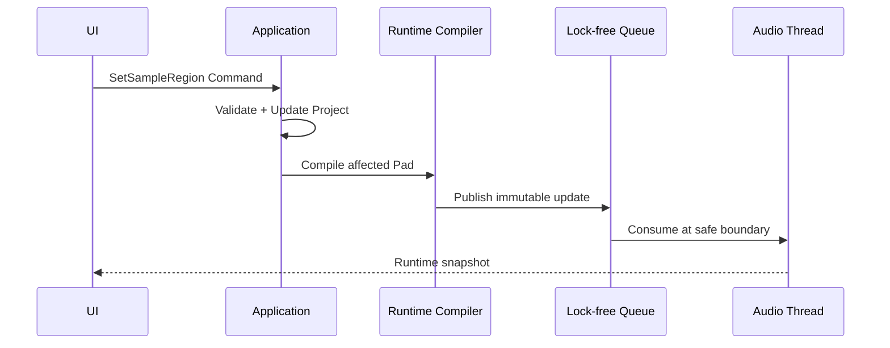

# 跨平台音频核心的模块化、C++ 与 UI 架构建议

> 日期：2026-07-29
>
> 目标平台：iOS、Android、macOS、Windows、Linux、Raspberry Pi，以及可选的浏览器 WebAssembly 版本
>
> 适用对象：以 Sampler、Sequencer、Mixer、Performance FX、Resample 和 Export 为核心的音乐创作产品
>
> 文档性质：跨平台技术架构建议，不代表相关 LMDJ Native 产品、UI 或迁移计划已经批准或实现

相关研究：

- [Koala Sampler 技术栈、底层架构与工具链研究](./2026-07-28-koala-sampler-technical-stack.md)
- [Koala 能力迁移到纯前端 Web App 的技术可行性分析](./2026-07-28-koala-web-app-feasibility-analysis.md)
- [Koala Sampler 业务流程、UI 布局与流程设计研究](./2026-07-28-koala-sampler-business-flows.md)

---

## 0. 结论先行

如果未来要把核心能力同时部署到 iOS、Android、macOS、Windows、Linux、Raspberry Pi 和 Web，正确方向是：

1. **核心必须模块化。**
2. **实时音频和 DSP 核心优先使用 C++，但不需要把所有业务代码都改成 C++。**
3. **平台音频、MIDI、文件、权限、生命周期和插件能力必须通过 Adapter 隔离。**
4. **UI 不一定每个平台完整重写一套。**
5. **更合理的是共享核心、共享大部分产品组件和交互语义，再为手机、桌面、嵌入式和 Web 提供不同布局及少量平台专用界面。**
6. **性能不是由“使用 C++”自动保证，而是由实时线程纪律、数据所有权、内存策略和可测量的性能门槛共同保证。**

推荐总体架构：

```mermaid
flowchart TB
    subgraph Apps["产品与 UI"]
        Mobile["Mobile UI<br/>iOS / Android"]
        Desktop["Desktop UI<br/>macOS / Windows / Linux"]
        Embedded["Embedded UI<br/>Raspberry Pi"]
        Web["Web UI<br/>React / WASM"]
    end

    subgraph Facade["稳定产品接口"]
        Commands["Commands"]
        Snapshots["Runtime Snapshots"]
        CAPI["C ABI / Language Bindings"]
    end

    subgraph Core["共享跨平台核心"]
        Model["Project / Patch / Pad / Pattern"]
        Transport["Transport / Sequencer"]
        Sampler["Sampler / Voice Engine"]
        DSP["Mixer / DSP / FX"]
        Capture["Take / Record / Resample"]
        Serialization["Serialization / MIDI / WAV"]
    end

    subgraph Ports["平台接口"]
        AudioPort["Audio Device Port"]
        MidiPort["MIDI Port"]
        FilePort["File / Storage Port"]
        ClockPort["Clock / Thread Port"]
        PluginPort["Plugin / Host Port"]
    end

    subgraph Backends["平台实现"]
        Apple["CoreAudio / CoreMIDI"]
        Android["Oboe / Android MIDI"]
        Windows["WASAPI / ASIO"]
        Linux["ALSA / JACK / PipeWire"]
        Pi["ALSA / JACK / GPIO"]
        Browser["AudioWorklet / Web MIDI / OPFS"]
    end

    Apps --> Facade
    Facade --> Core
    Core --> Ports
    Ports --> Backends
```



最重要的边界是：

```text
共享音乐行为
平台适配系统能力
UI 发送命令和读取快照
Audio Thread 独立持有实时运行状态
```

---

## 1. 对两个关键问题的直接回答

### 1.1 是否需要将核心部分全部模块化

需要，但“模块化”不只是把源文件分目录。

真正的模块化需要做到：

- 每个模块有明确职责；
- 每个模块有稳定输入输出；
- 核心模块不直接依赖 UIKit、Android SDK、Win32、ALSA 或浏览器；
- UI 不直接访问 Audio Driver；
- DSP 不直接读写 Project JSON；
- 文件和设备错误通过明确结果返回；
- 模块可以单独测试；
- 平台实现可以替换；
- 项目文件可以跨版本迁移；
- 实时线程和非实时线程边界明确。

下面这种目录虽然看似模块化，实际上仍可能强耦合：

```text
audio/
ui/
project/
platform/
```

更重要的是依赖方向：

```text
UI / Application
        ↓
Product Facade
        ↓
Domain + Audio Core
        ↓
Abstract Platform Ports
        ↓
Platform Backends
```

依赖不能反向：

```text
Core 不认识 SwiftUI
Core 不认识 Android Activity
Core 不认识 React
Core 不直接调用 Windows Dialog
Core 不直接操作某个 App 的全局状态
```

### 1.2 是否必须全部用 C++ 才能保证性能

不必须，而且 C++ 本身不保证性能。

推荐使用 C++ 的部分：

- Audio Callback；
- Sampler Voice；
- Mixer；
- Filter、Delay、Reverb、Dynamics 等 DSP；
- Resampler；
- Pitch Shift / Time Stretch；
- Transport 的 Frame Clock；
- Sequencer 实时事件消费；
- Resample / Record PCM；
- Offline Render；
- 需要复用于 AUv3、VST3、CLAP、Standalone 和 WASM 的算法。

不必强制使用 C++ 的部分：

- 页面导航；
- 设置页面；
- 商店、账户和云端 API；
- Project Library UI；
- 普通表单；
- 帮助、教程；
- 权限说明；
- 平台文件选择器；
- Marketing 页面；
- 大部分非实时产品编排。

可以采用：

| 层 | 推荐技术 |
| --- | --- |
| 实时核心 | C++20 |
| DSP 算法 | C++，必要时使用 SIMD |
| 数据契约 | JSON Schema / Protobuf / FlatBuffers，视场景选择 |
| iOS/macOS Shell | Swift / SwiftUI / AppKit |
| Android Shell | Kotlin / Jetpack Compose |
| Windows Shell | C++、C# 或跨平台 UI |
| Linux/Pi Shell | C++、Qt、GTK 或 SDL |
| Web Shell | TypeScript / React |
| Web DSP | C++ → WebAssembly + AudioWorklet |

### 1.3 UI 是否需要每个平台各写一套

不一定。

可以选择：

1. 一套完全自绘跨平台 UI；
2. 每个平台完全 Native UI；
3. 共享 UI Framework，平台提供少量专用页面；
4. 按设备族共享：Mobile 一套、Desktop 一套、Embedded 一套、Web 一套。

对多数音乐产品，第四种通常最实际：

```text
共享：
Pad Matrix
Waveform Editor
Piano Roll
Mixer
Transport
Performance FX
Design Tokens
Command / View Model

按设备族变化：
布局密度
触控目标
快捷键
窗口和菜单
文件浏览
音频设备设置
插件管理
树莓派硬件按键和旋钮
```

---

## 2. 目标平台差异

| 平台 | 音频后端 | MIDI | UI 特征 | 主要限制 |
| --- | --- | --- | --- | --- |
| iOS | CoreAudio / RemoteIO | CoreMIDI | 触控、前后台严格 | Audio Session、中断、AUv3 生命周期 |
| Android | Oboe / AAudio | Android MIDI | 设备碎片化、触控 | 延迟差异、厂商系统、电源管理 |
| macOS | CoreAudio | CoreMIDI | 键鼠、菜单、多窗口 | Plugin、Sandbox、签名与公证 |
| Windows | WASAPI / ASIO | WinMM / UWP MIDI / RtMidi | 键鼠、窗口、触控可选 | Driver 差异、ASIO 分发 |
| Linux | ALSA / JACK / PipeWire | ALSA MIDI / RtMidi | 桌面环境多样 | 发行版、Server、Device Routing 差异 |
| Raspberry Pi | ALSA / JACK / PipeWire | USB MIDI / GPIO | 小屏、硬件旋钮、可无窗口 | CPU、内存、SD 卡、散热和实时调度 |
| Web | AudioWorklet | Web MIDI 条件支持 | DOM、触控、键鼠 | 浏览器沙盒、后台冻结、设备 API 受限 |

不能设计一个“最小公分母”接口，把所有平台压成同样能力。更合理的是：

```text
Stable Core Capability
+ Optional Platform Capability
+ Feature Detection
```

例如：

```cpp
struct PlatformCapabilities {
    bool supports_midi_input;
    bool supports_midi_output;
    bool supports_plugin_hosting;
    bool supports_multiple_audio_outputs;
    bool supports_background_audio;
    bool supports_ableton_link;
    bool supports_hardware_controls;
};
```

产品层依据 Capability 决定：

- 展示；
- 禁用；
- 降级；
- 提供替代；
- 明确不支持。

---

## 3. 推荐的分层架构

### 3.1 Domain Layer

负责稳定的产品对象：

```text
Project
Patch
Pad
SampleAsset
SampleRegion
Pattern
Scene
Take
Mixer
Effect
Render
Lineage
```

它定义：

- 对象关系；
- ID；
- 不变量；
- 编辑命令；
- Undo/Redo；
- Schema Version；
- Project Migration。

它不负责：

- 打开 Audio Device；
- 实时播放；
- 绘制 UI；
- 请求权限；
- 选择文件；
- 运行 OS Thread。

### 3.2 Audio Engine Layer

负责：

- Audio Graph；
- Voice Pool；
- Sample Playback；
- Mixer；
- FX；
- Transport；
- Event Queue；
- Resample；
- Recording；
- Meter；
- Offline Render。

Audio Engine 消费已经转换好的 Runtime Snapshot，而不是直接解析复杂 Project 文档。

```text
Project Document
  → Compile
  → Audio Runtime Snapshot
  → Lock-free Publish
  → Audio Engine
```

### 3.3 Platform Port Layer

核心只依赖抽象接口：

```cpp
class AudioDevicePort;
class MidiPort;
class FileSystemPort;
class ClockPort;
class ThreadPort;
class SecureStoragePort;
class PluginHostPort;
```

各平台实现：

```text
AppleAudioDevice
AndroidOboeDevice
WindowsWasapiDevice
LinuxJackDevice
RaspberryAlsaDevice
WebAudioWorkletBridge
```

### 3.4 Application Layer

负责：

- 用户操作；
- Command Dispatch；
- Project 生命周期；
- 自动保存；
- 导入导出；
- 功能权限；
- 平台 Capability；
- UI View Model；
- 错误展示。

### 3.5 UI Layer

只处理：

- 布局；
- 绘制；
- Pointer、Touch、Keyboard；
- 可访问性；
- 页面导航；
- 状态摘要；
- 编辑反馈。

UI 不应：

- 在 View 中执行 DSP；
- 直接持有 Audio Device；
- 直接修改 Audio Thread 对象；
- 把 UI 帧率当作音乐时钟；
- 从音频回调读取复杂 Project 数据。

---

## 4. 共享核心模块建议

### 4.1 `core-model`

职责：

- 数据结构；
- Schema；
- ID；
- 不变量；
- 版本迁移；
- Command；
- Undo/Redo。

建议保持无平台依赖，最好不依赖音频 Driver。

### 4.2 `audio-engine`

职责：

- Audio Callback 入口；
- Graph；
- Buffer；
- Channel；
- Master；
- Voice；
- Runtime Metrics。

对外只暴露：

- 初始化配置；
- Process；
- Command/Event Queue；
- Runtime Snapshot；
- Error/Diagnostic。

### 4.3 `sampler`

职责：

- One-shot；
- Gate；
- Loop；
- Start/End；
- Reverse；
- Pitch；
- Envelope；
- Choke Group；
- Voice Stealing；
- Sample Cache。

### 4.4 `sequencer`

职责：

- Frame Clock；
- BPM；
- PPQ；
- Pattern；
- Loop；
- Quantize；
- Swing；
- Pattern Launch；
- Note On/Off；
- Automation Event；
- Raw Take。

### 4.5 `mixer`

职责：

- Pad/Channel/Bus；
- Gain/Pan/Mute/Solo；
- Send/Return；
- Master；
- Meter；
- Routing Graph；
- Tail 生命周期。

### 4.6 `dsp`

按算法拆分：

```text
dsp/filter
dsp/delay
dsp/reverb
dsp/dynamics
dsp/saturation
dsp/resampler
dsp/stretch
dsp/loudness
dsp/spectral
```

每个 Processor 建议使用统一接口：

```cpp
class Processor {
public:
    virtual void prepare(const ProcessSpec& spec) = 0;
    virtual void reset() noexcept = 0;
    virtual void process(AudioBlock block) noexcept = 0;
};
```

在真实项目中可以避免实时路径上的 Virtual Dispatch，使用静态图、Variant、函数表或预绑定 Node。

### 4.7 `capture`

职责：

- Input Record；
- Master Record；
- Event Take；
- Audio Bounce；
- Resample；
- Ring Buffer；
- Dropout Detection；
- Partial File Recovery。

### 4.8 `media`

职责：

- WAV；
- AIFF；
- FLAC/MP3/AAC 等可选 Codec；
- Channel Conversion；
- Sample Rate Conversion；
- Peak Cache；
- Metadata。

Codec 许可和平台解码能力要与 DSP Core 分离。

### 4.9 `project-io`

职责：

- Project Manifest；
- JSON/二进制序列化；
- Migration；
- Asset Hash；
- 相对路径；
- Import/Export；
- Project Validation。

### 4.10 `midi`

职责：

- MIDI Message；
- Mapping；
- Learn；
- MIDI File；
- Clock Event；
- Device-independent Event。

设备枚举和权限属于平台 Adapter，不属于核心 MIDI Model。

---

## 5. C++ 使用边界

### 5.1 为什么 C++ 适合核心

- 跨 Apple、Android、Windows、Linux 和 ARM 工具链成熟；
- 音频 Driver 和 Plugin SDK 生态成熟；
- 可以控制内存和线程；
- 可以使用 SIMD；
- 适合编译成 WebAssembly；
- 适合复用大量现有 DSP；
- 可同时构建 Standalone、Plugin、Embedded 和 Test Runtime。

### 5.2 C++ 不等于自动高性能

以下 C++ 同样会破坏实时音频：

```cpp
void audio_callback(...) {
    std::vector<float> temp(frames);  // 分配
    std::mutex lock;                  // 锁
    load_file();                      // I/O
    log_to_console();                 // 不可控
    project.to_json();                // 大量分配
}
```

性能来自：

- 预分配；
- 固定上限；
- 数据局部性；
- 无锁或单生产者/单消费者队列；
- 不抛异常；
- 不进行文件或网络 I/O；
- 不等待其他线程；
- 避免共享可变对象；
- 明确每个 Block 的时间预算；
- 可观测的 Overrun/Underrun。

### 5.3 实时线程规则

Audio Callback 中禁止：

- Heap Allocation；
- Mutex；
- Condition Variable Wait；
- File I/O；
- Network；
- UI 调用；
- 日志格式化；
- JSON；
- 资源加载；
- 不可控系统调用；
- 大型对象复制；
- 触发 GC 的语言桥调用。

可以：

- 读取不可变 Snapshot；
- 消费预分配 Ring Buffer；
- 使用固定 Voice Pool；
- 操作连续 Float Buffer；
- 更新 Atomic Counter；
- 写入预分配 Meter Buffer。

### 5.4 C++ 标准

建议使用 C++20，但要限制语言特性：

- 核心保持无异常或明确异常边界；
- 避免 RTTI 依赖；
- 实时路径不使用复杂动态多态；
- 使用 `std::span`、`std::array`、RAII；
- 使用 `noexcept` 明确实时函数；
- 保持编译器矩阵可用；
- WebAssembly 构建单独验证。

如果现有工具链或插件 SDK 有限制，C++17 仍然足够。

### 5.5 Rust 是否可替代

Rust 也可用于：

- DSP；
- Project；
- WASM；
- 文件和网络；
- C ABI。

优势：

- 内存安全；
- 现代工具链；
- WASM 体验好；
- 并发类型约束强。

代价：

- 商业音频 Plugin 和硬件生态中的 C++ 资源更多；
- 与现有 C++ DSP/SDK 集成需要 FFI；
- 实时音频仍需避免分配、锁和不可控抽象；
- 团队能力可能成为更大限制。

如果目标包含 AUv3/VST3/CLAP、已有 C++ DSP 和嵌入式，C++ 作为主核心通常更直接。也可以使用：

```text
C++ Audio/DSP Core
+ Rust Media/Project Tooling
+ C ABI
```

但早期不要为了技术完整性同时维护两套核心语言。

---

## 6. 稳定接口与 C ABI

### 6.1 为什么不直接暴露 C++ Class

直接跨语言暴露 C++ Class 会带来：

- ABI 不稳定；
- 编译器差异；
- STL 类型不能安全跨边界；
- Exception 边界；
- Ownership 模糊；
- Swift/Kotlin/C#/Dart Binding 复杂；
- WebAssembly Binding 膨胀。

推荐核心内部使用 C++，对外提供窄 C ABI。

### 6.2 示例

```c
typedef struct AudioCore AudioCore;

typedef struct {
    uint32_t sample_rate;
    uint32_t max_block_size;
    uint32_t output_channels;
    uint32_t max_voices;
} AudioCoreConfig;

typedef enum {
    AUDIO_CORE_OK = 0,
    AUDIO_CORE_INVALID_ARGUMENT,
    AUDIO_CORE_UNSUPPORTED,
    AUDIO_CORE_INTERNAL_ERROR
} AudioCoreResult;

AudioCore* audio_core_create(const AudioCoreConfig* config);
void audio_core_destroy(AudioCore* core);

AudioCoreResult audio_core_prepare(
    AudioCore* core,
    uint32_t sample_rate,
    uint32_t max_block_size
);

void audio_core_process(
    AudioCore* core,
    const float* const* inputs,
    float* const* outputs,
    uint32_t frames
);

AudioCoreResult audio_core_trigger_pad(
    AudioCore* core,
    uint32_t pad_id,
    float velocity,
    uint64_t audio_frame
);
```

### 6.3 ABI 规则

- 使用固定宽度整数；
- 不跨边界传 STL；
- 不跨边界抛 Exception；
- Ownership 明确；
- Buffer 的创建者和释放者一致；
- API 带版本；
- Struct 带 Size；
- String 使用 UTF-8 + Length；
- 错误使用 Code + 可选非实时消息；
- 音频线程接口和管理接口分开。

### 6.4 Command 与 Snapshot

UI 操作转换为 Command：

```cpp
struct TriggerPadCommand {
    PadId pad;
    float velocity;
    AudioFrame frame;
};

struct SetMixerGainCommand {
    ChannelId channel;
    float linear_gain;
    AudioFrame effective_frame;
};
```

Audio Engine 对外返回低频摘要：

```cpp
struct RuntimeSnapshot {
    uint64_t audio_frame;
    double beat;
    uint32_t active_voice_count;
    float peak_left;
    float peak_right;
    uint64_t underrun_count;
};
```

UI 不需要读取每个 DSP Node 的内部可变状态。

---

## 7. 平台音频 Adapter

### 7.1 统一音频设备接口

```cpp
class AudioDevicePort {
public:
    virtual DeviceList enumerate() = 0;
    virtual Result open(const DeviceConfig&) = 0;
    virtual void start() = 0;
    virtual void stop() = 0;
    virtual DeviceStatus status() const = 0;
};
```

不要假设所有平台都支持：

- 自定义 Buffer Size；
- 任意 Sample Rate；
- 多输入输出；
- 同一设备名；
- 热插拔；
- Exclusive；
- 后台运行。

### 7.2 Apple

推荐适配：

- `AVAudioSession`：iOS Session、Route、Category；
- RemoteIO / VoiceProcessingIO：iOS；
- CoreAudio / HAL：macOS；
- CoreMIDI；
- AUv3 独立 Wrapper。

需要处理：

- Interruption；
- Route Change；
- Sample Rate Change；
- Bluetooth；
- Phone Call；
- Background Audio Entitlement；
- Plugin 与 Standalone 不同生命周期。

### 7.3 Android

推荐：

- Oboe；
- AAudio 优先；
- 必要时 OpenSL ES 降级；
- Android MIDI；
- JNI 只做窄 Binding。

需要处理：

- Device Fragmentation；
- Performance Mode；
- Sharing Mode；
- Buffer Burst；
- Audio Focus；
- Bluetooth；
- 厂商后台限制；
- Activity 重建。

### 7.4 Windows

推荐：

- WASAPI Shared 作为通用基线；
- WASAPI Exclusive 可选；
- ASIO 作为专业增强；
- RtMidi 或平台 MIDI；
- VST3/CLAP 独立 Host/Plugin Wrapper。

必须把 ASIO 与产品 Core 隔离，避免 Driver、SDK 和分发问题污染核心。

### 7.5 Linux

需要考虑：

- ALSA；
- JACK；
- PipeWire；
- 桌面发行版；
- Headless；
- Device Hotplug；
- Packaging。

可以先选择一个主 Backend，再通过 Adapter 增加其他实现，而不是第一天全部支持。

### 7.6 Raspberry Pi

Raspberry Pi 不只是“小型 Linux PC”，需要额外关注：

- ARM64；
- CPU 代际；
- NEON；
- SD 卡写入寿命；
- USB Audio 兼容；
- ALSA/JACK/PipeWire；
- 小屏或无屏；
- GPIO；
- 编码器、旋钮、Pad；
- 散热降频；
- 电源稳定；
- 开机自启；
- Read-only Root FS；
- Watchdog。

适合把 Pi 定义成独立 Capability Tier：

```text
Pi Baseline:
16/32 Voice
固定 Sample Rate
有限 FX
无 Stem Split
本地 Project
USB MIDI
硬件控制
```

不要直接承诺桌面端的所有实时 Stretch、Convolution 和 ML 能力。

### 7.7 Web

Web Adapter 使用：

- AudioWorklet；
- WebAssembly；
- MessagePort；
- 可选 SharedArrayBuffer；
- Web MIDI；
- OPFS；
- Service Worker。

Web 不能实现完整 Native Device Port，因此应把它作为同一核心的受限 Backend，而不是假装所有 `AudioDevicePort` 方法都能成功。

---

## 8. UI 策略选择

### 8.1 方案 A：完全自绘跨平台 UI

类似：

```text
C++ Layer Tree
  → Metal
  → D3D
  → OpenGL
  → WebGL/WebGPU
```

优点：

- 高代码共享；
- 高视觉一致性；
- 适合 Pad、波形、Piano Roll、Mixer；
- 可以形成统一乐器交互。

缺点：

- 自己维护布局、文本、输入法、无障碍；
- Platform Dialog 仍需桥接；
- Web 版本复杂；
- 调试和人才门槛高；
- 系统视觉与行为适配成本高。

适合：

- 产品就是一件视觉高度统一的数字乐器；
- 团队准备长期维护渲染框架；
- Native 和 Embedded 是主要目标；
- Web 不是唯一主平台。

### 8.2 方案 B：每个平台原生 UI

| 平台 | UI |
| --- | --- |
| iOS/macOS | SwiftUI / AppKit |
| Android | Jetpack Compose |
| Windows | WinUI / WPF |
| Linux/Pi | GTK / Qt |
| Web | React |

优点：

- 平台体验最佳；
- 可访问性和输入法自然；
- 系统文件、窗口、菜单集成容易；
- 团队按平台独立演进。

缺点：

- 重复开发；
- 功能漂移；
- 交互一致性难维护；
- 测试矩阵大；
- 小团队难以承受。

适合：

- 各平台团队完整；
- 产品在平台交互上差异很大；
- UI 原生感优先于统一视觉。

### 8.3 方案 C：共享跨平台 UI Framework

候选：

- Qt；
- Flutter；
- React Native；
- JUCE UI；
- 自研轻量 Renderer。

不同方案的适配：

| 方案 | 优势 | 限制 |
| --- | --- | --- |
| Qt | Desktop/Linux/Pi 成熟 | Mobile 体验和商业许可需评估 |
| Flutter | Mobile/Desktop UI 共享高 | 专业音频和 Plugin 仍需 Native/C++ Bridge |
| React Native | Mobile 产品开发成熟 | 高频绘制和音频桥接需专门设计 |
| JUCE | Audio/Plugin/Desktop 强 | Mobile 和普通产品 UI 风格有限 |
| 自研 | 最可控 | 成本和长期维护最高 |

### 8.4 方案 D：按设备族共享

推荐：

```text
Mobile UI
  iOS + Android

Desktop UI
  macOS + Windows + Linux

Embedded UI
  Raspberry Pi / Hardware

Web UI
  Browser / PWA
```

四个 Shell 共享：

- Design Tokens；
- Component Specification；
- Command；
- View Model；
- Project Contract；
- Interaction State Machine；
- Icon；
- Test Vector；
- User Flow。

这样不是四个独立产品，而是四种表现层。

### 8.5 推荐判断

对 LMDJ/Koala-like 产品，推荐：

```text
第一阶段：
继续 Web UI
+ 抽象 Product Command
+ 独立 Audio Core

第二阶段：
Desktop Shell 复用 Core
+ 共享 Desktop Component Spec

第三阶段：
Mobile Shell
+ Touch Layout

第四阶段：
Raspberry Pi
+ Embedded Layout
+ Hardware Input Adapter
```

不建议现在同时启动六个平台 UI。

---

## 9. UI 共享的正确单位

UI 共享不只有“共享源代码”。

可以共享：

### 9.1 Design Token

```text
Color
Spacing
Typography
Radius
Pad Role
State Color
Motion Duration
Touch Target
```

### 9.2 Component Contract

```ts
interface PadViewModel {
  id: string;
  label: string;
  role: string;
  state: "empty" | "ready" | "playing" | "muted" | "recording";
  colorToken: string;
  progress?: number;
}
```

SwiftUI、Compose、Qt 和 React 都可以消费同一语义。

### 9.3 Interaction State Machine

例如 Pad：

```text
Empty
  → Tap → Select
  → Record → Recording
  → Import → Loading

Ready
  → Press → Playing
  → Release → Ready
  → Long Press → Edit
  → Mute → Muted
```

状态机共享，具体手势和视觉反馈按平台调整。

### 9.4 Command

所有 UI 最终发送同样 Command：

```text
TriggerPad
ReleasePad
SetSampleRegion
StartTake
StopTake
LaunchPattern
SetMixerGain
BeginResample
```

### 9.5 Golden Screenshot 与 Flow Spec

可以共享：

- 页面区域关系；
- 操作步骤；
- 状态变化；
- 错误文案；
- Disabled 条件；
- 空状态；
- 性能反馈。

这样即使 UI 源代码不同，也不会演变成六套业务逻辑。

---

## 10. 数据、线程与状态边界

### 10.1 三类状态

| 状态 | 示例 | 所有者 |
| --- | --- | --- |
| Project State | Pad、Pattern、Mixer 设置 | Application/Domain |
| Runtime State | Voice、Playhead、Meter | Audio Engine |
| Platform State | Device、Permission、Route | Platform Adapter |

UI 可以读取三者的摘要，但不能把它们混成一个巨型全局 Store。

### 10.2 Project 到 Audio Runtime



### 10.3 不可变 Snapshot

UI/业务线程创建新的配置：

```cpp
struct PadRuntimeConfig {
    AssetHandle asset;
    uint64_t start_frame;
    uint64_t end_frame;
    float gain;
    bool loop;
};
```

Audio Thread 在 Block Boundary 切换指针，旧数据由非实时线程安全回收。

### 10.4 Sample Asset Ownership

Sample 不应在每个模块复制：

```text
Asset Store
  → Stable Asset Handle
  → Decoded PCM Cache
  → Voice Reader
```

定义：

- 谁加载；
- 谁缓存；
- 谁释放；
- 热素材；
- 冷素材；
- Streaming；
- 失败；
- 文件被删除后的行为。

### 10.5 大文件与嵌入式

桌面可以缓存完整 PCM，Raspberry Pi 可能需要：

- Memory Map；
- Chunk Cache；
- Streaming；
- 固定 Cache Budget；
- 低质量 Preview；
- 限制同时活跃长素材。

同一核心应通过配置调整：

```cpp
struct ResourceBudget {
    uint64_t pcm_cache_bytes;
    uint32_t max_voices;
    uint32_t max_realtime_stretch_voices;
    uint32_t max_convolution_instances;
};
```

---

## 11. Build 与仓库结构

建议目录：

```text
core/
  model/
  engine/
  sampler/
  sequencer/
  mixer/
  dsp/
  capture/
  media/
  midi/
  project-io/
  include/
    product_core/

platform/
  apple/
  android/
  windows/
  linux/
  raspberry-pi/
  web/

bindings/
  c/
  swift/
  kotlin/
  csharp/
  dart/
  wasm/

apps/
  ios/
  android/
  desktop/
  raspberry-pi/
  web/

plugins/
  auv3/
  vst3/
  clap/

tests/
  unit/
  dsp-golden/
  integration/
  realtime/
  platform/
```

### 11.1 CMake

推荐用 CMake 组织 C++ 核心：

```cmake
add_library(product_core STATIC)
target_compile_features(product_core PUBLIC cxx_std_20)

add_library(product_core_c_api STATIC)
target_link_libraries(product_core_c_api PRIVATE product_core)
```

每个平台只链接需要的 Backend：

```text
product_core
+ platform_apple
+ app_ios
```

Web：

```text
product_core
+ platform_web
→ Emscripten
→ AudioWorklet WASM
```

### 11.2 依赖隔离

第三方库按职责隔离：

- DSP；
- Codec；
- MIDI；
- Plugin SDK；
- UI；
- Test。

不要让：

- Plugin SDK 进入移动 App Core；
- PyTorch/ML 进入基础音频引擎；
- Qt 类型进入 Domain；
- Swift/Java 类型进入 C ABI；
- Web API 出现在公共核心 Header。

### 11.3 编译目标

最少 CI Matrix：

```text
macOS arm64
macOS x86_64（如仍支持）
iOS arm64
Android arm64-v8a
Windows x64
Linux x64
Linux arm64
WebAssembly
```

Raspberry Pi 最好有真实 ARM Device Runner，不能只依赖 Cross Compile 成功。

---

## 12. Plugin 与 Standalone 的未来兼容

如果未来考虑：

- AUv3；
- VST3；
- CLAP；
- Standalone；
- Headless Renderer；
- WebAssembly；

核心不能依赖某个 App 生命周期。

推荐：

```text
Shared Engine
  ├─ Standalone Host Adapter
  ├─ AUv3 Wrapper
  ├─ VST3 Wrapper
  ├─ CLAP Wrapper
  ├─ Headless Render CLI
  └─ Web AudioWorklet Wrapper
```

Plugin 与 Standalone 的区别由 Wrapper 处理：

| 能力 | Standalone | Plugin |
| --- | --- | --- |
| Audio Device | 自己打开 | DAW 提供 |
| MIDI | 自己枚举 | Host Event |
| Tempo | 自己 Transport | Host Transport |
| Project | App Project | Plugin State |
| File UI | App 管理 | Host/Plugin UI |
| Window | App Window | Plugin Editor |

不要把 ASIO/CoreAudio Device 逻辑写进 `audio-engine`，否则 Plugin 版本难以复用。

---

## 13. Raspberry Pi 产品化建议

### 13.1 两种 Pi 形态

#### 桌面 App

- Raspberry Pi OS；
- HDMI/Touch Screen；
- Qt/SDL UI；
- USB Audio；
- USB MIDI；
- 鼠标键盘。

#### 嵌入式乐器

- 固定屏幕；
- GPIO；
- Encoder；
- Physical Pad；
- 自启动；
- 无桌面环境；
- Read-only System；
- Watchdog。

两者不能共用完全相同的 Application Shell，但可以共享：

- Engine；
- Project；
- Sequencer；
- DSP；
- Hardware-independent Command；
- Embedded View Model。

### 13.2 硬件输入 Adapter

```text
GPIO / I2C / SPI / USB MIDI
  → Hardware Input Adapter
  → Product Command
  → Audio Engine
```

物理 Pad 事件应尽量直接进入高优先级事件队列，不绕过复杂 UI Thread。

### 13.3 性能档位

建议设置：

```text
Desktop High
Desktop Balanced
Mobile
Embedded
Web
```

配置：

- Voice；
- Oversampling；
- Reverb Quality；
- Stretch Quality；
- Meter Rate；
- Waveform Resolution；
- Cache；
- Stem 功能；
- Export 并发。

---

## 14. 测试策略

### 14.1 Core Unit Test

- Project Invariant；
- Pattern Math；
- Quantize/Swing；
- Voice Stealing；
- Choke；
- Loop；
- Mixer Routing；
- Migration；
- MIDI；
- WAV。

### 14.2 DSP Golden Test

```text
固定输入 PCM
+ 固定参数
→ 固定离线输出
→ Peak/RMS/LUFS/Spectral/容差比较
```

不同 CPU/Compiler 可能不 Bit-exact，需要定义可接受误差。

### 14.3 Realtime Test

- Audio Callback Duration；
- Worst Block；
- Underrun；
- Allocation；
- Lock；
- Voice；
- Hot Swap Snapshot；
- Device Restart；
- Sample Rate Change；
- Recording Dropout。

### 14.4 Platform Test

每个平台验证：

- Device；
- Permission；
- Hotplug；
- Background/Foreground；
- Route Change；
- MIDI；
- File；
- Sleep/Wake；
- Audio Interruption。

### 14.5 UI Contract Test

即使 UI 源代码不同，也验证同样的业务结果：

```text
Tap Pad
  → TriggerPad Command
  → Playing Snapshot
  → Pressed Feedback
  → Release
  → Ready Feedback
```

### 14.6 Raspberry Pi

必须在真实设备测试：

- 冷启动；
- 长时间运行；
- 热降频；
- 电源异常；
- SD 卡 I/O；
- USB Audio；
- GPIO Latency；
- Watchdog Recovery。

---

## 15. 分阶段落地路线

### Phase 0：边界设计

交付：

- Core Module Map；
- Public API；
- Project Contract；
- Command；
- Snapshot；
- Platform Port；
- Threading Rules；
- Resource Budget。

退出条件：

- UI、Core、Platform 依赖方向明确；
- 不需要选择全部 UI Framework；
- 一个最小 Audio Core 可以无 UI 测试。

### Phase 1：Headless Core

交付：

- Sampler；
- Voice；
- Mixer；
- Transport；
- Pattern；
- WAV；
- Offline Render CLI；
- Golden Tests。

这是跨平台复用的真正基础。

### Phase 2：第一个 Native Backend

建议选择当前最重要的平台，而不是同时实现所有平台。

例如 macOS：

- CoreAudio；
- CoreMIDI；
- 简单 Test UI；
- Device/Latency/Hotplug；
- 真实播放和录音。

### Phase 3：WebAssembly Bridge

如果 Web 是现有主产品：

- 保留 React UI；
- C++ Core 编译 WASM；
- AudioWorklet Bridge；
- 与当前 Web Engine 做输出/行为对比；
- 按功能逐步切换。

不要一次替换整个现有 Web 产品。

### Phase 4：第二平台验证

选择架构差异最大的第二个平台，例如 Android 或 Raspberry Pi。

目标不是发布，而是验证：

- Port 是否真的可替换；
- C ABI 是否足够；
- Resource Budget 是否有效；
- UI 是否混入核心；
- 文件和生命周期是否被正确隔离。

### Phase 5：UI 产品化

在核心和两个 Backend 证明后，才最终确定：

- 自研 UI；
- Qt；
- Flutter；
- Native UI；
- 按设备族共享。

### Phase 6：Plugin

最后增加：

- AUv3；
- VST3；
- CLAP；
- Host Transport；
- State；
- Parameter Automation；
- Plugin Validation。

Plugin 不应成为第一阶段核心模块化的阻塞项。

---

## 16. 常见错误

### 16.1 先写六套 UI

结果：

- 核心尚未稳定；
- 每个平台复制业务 Bug；
- API 每周变化；
- 测试成本爆炸。

应先完成 Headless Core 与两个差异明显的 Backend。

### 16.2 所有代码都改写为 C++

结果：

- 开发效率下降；
- UI 和业务调试困难；
- 语言桥仍然存在；
- C++ Core 被平台产品逻辑污染。

应只把跨平台、性能关键和可复用的能力放入 C++。

### 16.3 UI 直接控制 Audio Object

结果：

- Race；
- Lock；
- 生命周期混乱；
- 平台 UI 差异进入 Engine；
- 难以做 Headless 和 Plugin。

应使用 Command/Snapshot。

### 16.4 Core 直接调用平台 API

结果：

- 条件编译遍布；
- 单元测试依赖设备；
- Web/Pi 构建困难；
- Plugin Wrapper 无法复用。

应使用 Platform Port。

### 16.5 把 C++ 当作性能验收

结果：

- 没有 Block Time；
- 没有 Underrun；
- 没有内存预算；
- 没有目标设备；
- “应该很快”无法发布。

应建立性能 Gate。

### 16.6 追求所有平台功能完全一致

结果：

- 产品被最低能力平台限制；
- 桌面 Plugin、Mobile Touch 和 Pi Hardware 的优势无法发挥。

应共享核心语义，允许 Capability-based Feature。

---

## 17. 对 LMDJ 的建议

LMDJ 当前不应直接把整个 Web 产品重写成 C++。

建议边界：

```text
保留：
React Workbench
Web Product Flow
lmdj.patch.v1
API / Worker / Material Pipeline

逐步抽取：
Sampler Runtime
Transport
Take Timing
Mixer / FX
Resample
Offline Render

新增：
C ABI
Platform Port
WASM AudioWorklet Bridge
Native Test Host
```

### 17.1 第一块值得抽取的核心

建议是：

```text
Sampler + Voice + Transport + Mixer
```

而不是：

- 登录；
- Upload；
- Queue；
- My Songs；
- Project Library UI；
- 整个 React Workbench。

### 17.2 保留 `lmdj.patch.v1`

`lmdj.patch.v1` 可以继续作为 Web/API/Worker 的公开内容契约。

Native Audio Core 应消费编译后的 Runtime Model：

```text
patch.json
  → Platform/Application Loader
  → Validated Domain Model
  → Audio Runtime Snapshot
  → C++ Engine
```

不要让实时 Audio Thread 直接解析 JSON。

### 17.3 Native Core 与服务器 Pipeline

跨平台 Audio Core 负责创作和播放，不等于替代：

- Demucs；
- Timing；
- Material Extractor；
- Patchify；
- Job Queue；
- Artifact Store。

这些是材料生产系统，与本地实时乐器核心是两个不同边界。

### 17.4 推荐验证顺序

```text
1. Headless C++ Sampler
2. WAV Golden Render
3. macOS 或 Linux Test Host
4. WebAssembly AudioWorklet
5. 与现有 Web AudioEngine 行为对比
6. Raw Take / Resample
7. Android 或 Raspberry Pi Backend
8. 再决定正式跨平台 UI
```

---

## 18. 建议记录的架构决策

在实施前至少确认：

| 决策 | 待确认内容 |
| --- | --- |
| 核心语言 | C++17/C++20，是否允许 Rust 模块 |
| 第一平台 | Web、macOS、Android 或 Pi |
| 第一音频 Backend | CoreAudio、Oboe、WASAPI、ALSA/JACK |
| UI 策略 | 自绘、Qt、Flutter、Native、按设备族 |
| C ABI | 版本、Ownership、Error、Thread |
| Project Contract | `lmdj.patch.v1` 与编辑项目的关系 |
| Audio Runtime | Snapshot 编译方式 |
| Asset Store | 内存、流式、Hash、缓存 |
| Resource Tier | Desktop/Mobile/Pi/Web |
| Plugin | 是否进入近期范围 |
| Web | WASM 是否替换现有引擎、如何渐进迁移 |
| License | DSP、Codec、UI、Plugin SDK |

---

## 19. 最终推荐

### 推荐技术形态

```text
C++20 Headless Audio Core
+ 稳定 C ABI
+ 独立 Platform Ports
+ 各平台 Audio/MIDI/File Backend
+ 按设备族设计 UI
+ React Web Shell 保留
+ AudioWorklet/WASM Web Backend
+ Project Contract 和 Command 共享
```

### 推荐组织原则

1. Core 只表达音乐和音频能力；
2. Platform 只表达系统能力；
3. Application 负责编排；
4. UI 负责交互；
5. Audio Thread 不信任 UI Thread；
6. 文件和 ML 不进入实时引擎；
7. Capability 决定功能，不用最低公分母限制所有平台；
8. 先证明两个差异明显的平台，再扩展全部平台。

### 一句话判断

> 为未来跨 iOS、Android、macOS、Windows、Linux、Raspberry Pi 和 Web，应该模块化共享音频核心，并优先使用 C++ 实现实时 DSP；但不应该把全部产品代码 C++ 化，也不需要为六个平台维护六套完全独立的业务 UI。最可持续的方案是共享核心、共享交互契约、按设备族复用 UI，并用薄平台适配层接入各自系统能力。

---

## 20. 研究与实施边界

- 本文定义的是目标架构，不代表已经选择 C++、Qt、Flutter、JUCE 或其他 UI Framework。
- C++ 不替代性能测试；每个平台仍需真实设备验证。
- Raspberry Pi 能力必须按具体型号、Audio Interface、屏幕和散热方案确定。
- WebAssembly 复用需要单独实现 AudioWorklet、存储和浏览器生命周期适配。
- Native Plugin、Ableton Link、后台音频和多路设备能力属于平台增强，不应污染基础核心。
- UI 是否共享源代码应在 Headless Core 和至少两个平台 Backend 验证后决定。
- 本文不授权立即重写 LMDJ Web 或迁移现有服务器 Pipeline。
