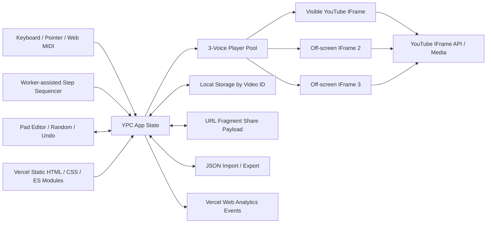

# YPC 技术分析

> 研究对象：[YPC — finger-drum any YouTube video](https://ypc2000.fun/)
>
> 研究日期：2026-08-06
>
> 研究目的：从公开运行时、线上模块和平台文档重建 YPC 的前端、播放器、MIDI、音序、状态、部署与风险边界，并判断其对 LMDJ 的技术参考价值
>
> 相关产品研究：[YPC 产品分析](./2026-08-06-ypc2000-product-analysis.md)
>
> LMDJ 对照基线：[Playable Beat Instrument Core Redesign](../design/2026-07-30-lmdj-playable-beat-instrument-core-redesign.md)
>
> 状态：公开客户端技术档案与工程推断；不代表 YPC 私有开发环境、源码仓库、部署流水线或法律状态的完整事实

## 0. 结论摘要

YPC 是一个部署在 Vercel 的静态前端应用。当前公开客户端由原生 HTML、CSS 和压缩后的 ES Modules 组成，没有可见 React / Vue / Svelte 运行时，也没有自己的音频解码、DSP、媒体服务器或用户后台。

它的核心架构不是“Web Audio Sampler”，而是：

```text
Keyboard / Pointer / Web MIDI / Sequencer
  → 选择 Pad
  → 设置 YouTube Player Rate 与 Volume
  → seekTo(timestamp)
  → playVideo()
  → 到 Slice 时间后 pauseVideo()
```

为了支持有限复音，应用同时创建三个 `YT.Player`：一个显示在页面中，两个以 `160×90` 放到 `left/top: -9999px`。每次触发优先选空闲 Player；没有空闲 Voice 时，替换最久未使用的 Player。因此它拥有三复音，但每个 Voice 都是完整的 YouTube IFrame Player，不是轻量音频 Voice。

当前实现的主要技术优点：

- 自有客户端代码小、模块边界清晰、无重型框架；
- 输入、Pad、编辑器、Sequencer、MIDI、Storage、Share 和 Analytics 已拆分；
- Pad / Sequence / Import 数据都有白名单 Sanitizer；
- URL Fragment 与 Local Storage 让应用在无后台情况下完成保存和分享；
- Sequencer 用绝对目标时间修正漂移，并优先用 Worker Timer；
- Slice Timer 在 YouTube Player 真正进入 Playing 后重新计时，避免把 Buffering 时间算进片段长度；
- 页面有较好的 ARIA、焦点样式、Reduced Motion 与响应式基础。

决定其上限的不是前端代码质量，而是底层媒体边界：

1. `seekTo()` 对未缓冲区域会落到最接近的 Keyframe，毫秒输入不等于毫秒音频精度。
2. 调度经过主线程 / Worker、`postMessage`、YouTube IFrame API、网络缓冲和播放器状态机，不是 Audio Clock 或 Sample-accurate Scheduler。
3. Rate 只是请求 YouTube Player 改速；API 不保证接受，且没有独立 Pitch 或 Time-stretch DSP。
4. 三个 IFrame 显著放大网络、CPU、内存和平台策略风险。
5. 两个隐藏 Player 与 YouTube 对 Background Player 和最小 Player Viewport 的当前规则存在明显冲突风险。
6. 应用没有离线音频、离线渲染、Source Asset、Lineage、Project Truth 或可验证 Audio Export。

对 LMDJ 的结论：

> **YPC 的 UI 分层、状态压缩和首次体验可以参考；YouTube Player Pool、时钟、Voice、媒体和持久化架构不能进入 LMDJ 正式 Audio Runtime。**

---

## 1. 研究方法与证据等级

### 1.1 已确认与未知

| 结论 | 证据强度 | 说明 |
| --- | --- | --- |
| Vercel 托管 | **已确认** | HTTP Header 为 `server: Vercel`，DNS 使用 Vercel NS |
| 静态 HTML / CSS / ES Modules | **已确认** | 线上入口和模块可直接读取 |
| 不使用 Web Audio API | **当前公开路径已确认** | 全部公开模块未调用 `AudioContext`、`decodeAudioData`、AudioWorklet 等 |
| 三个 YouTube Player Voice | **已确认** | `POOL_SIZE = 3`，Live DOM 也显示一个可见、两个屏幕外 Player |
| 无用户后台 / 数据库 | **强推断** | 当前功能全部落在 URL、Local Storage、JSON；不排除未公开的部署或统计服务 |
| 原生 JavaScript，无前端框架 | **当前分发物已确认** | 无框架运行时依赖，直接 DOM Query / Event Listener |
| 源码仓库、构建器、测试框架 | **未知** | 本次未定位到可确认属于作者的公开仓库 |
| 开源许可证 | **未知** | 官网与分发资源未发现许可证声明 |
| Vercel Project 配置与 CI | **未知** | 公开部署结果不能反推私有流水线 |
| YouTube 使用合规 | **需审查** | 公开实现与 Background Player / Player Size 规则存在风险，本文不作法律结论 |

### 1.2 证据来源

本报告使用：

- Live Desktop Chrome 页面、DOM 和屏幕布局；
- `curl` 获取的当前 HTTP Header、HTML、Manifest、CSS 和 JavaScript；
- 官网直接分发的 `app.js` 与 `js/*.js`；
- YouTube IFrame API Reference 和 Developer Policies；
- W3C Web MIDI 标准、MDN 兼容信息和 Chrome 权限说明；
- Vercel Web Analytics 隐私说明；
- 媒体与用户反馈只用于解释外部环境，不用于识别私有技术。

### 1.3 重要限制

- 线上 JavaScript 已压缩，变量名不是作者源代码中的原始命名；本文使用导出名称和行为描述模块。
- 浏览器扩展上下文不适合给出可复现的完整网络体积基准，因此不把单次缓存命中的 Resource Timing 写成性能结论。
- 没有实体 MIDI、Safari、Firefox、Android、iPadOS 或弱网物理测试。
- 没有触发受保护内容录制、下载或外部上传。
- HTTP Header 和线上代码是 2026-08-06 的快照，站点无公开版本号。

---

## 2. 系统边界与总体架构



YPC 自己控制：

- UI 和交互；
- Video ID 解析；
- 16 Pad 的时间点、Label、Slice 与 Rate；
- MIDI Note Mapping；
- Step Pattern、BPM、Swing 与 Transport；
- 本地保存、URL 编码和 JSON；
- 选择哪个 Player Voice、何时 Seek / Play / Pause。

YPC 不控制：

- YouTube 媒体解码和 Buffer；
- Seek 落点的 Keyframe 精度；
- 实际可用 Playback Rate；
- 音高与速度之间的底层关系；
- 广告、登录、Bot Verification、地区限制和 Embed Permission；
- YouTube Player 内部 Audio Thread、网络策略和缓存；
- 原视频是否持续存在；
- 最终音频文件或离线渲染。

---

## 3. 当前技术栈

| 层 | 当前技术 | 证据 |
| --- | --- | --- |
| Hosting / CDN | Vercel | HTTP Header、DNS |
| Document | 静态 HTML5 | 入口 HTML |
| Styling | 单一压缩 CSS、CSS Variables、Media Query、`color-mix()` | `styles.css` |
| Client | 原生 JavaScript ES Modules | `app.js`、`js/*.js` |
| DOM | 原生 Query / Event Listener / Dynamic Element | 公开模块 |
| Media | YouTube IFrame Player API | HTML、`pool.js`、`app.js` |
| MIDI | Web MIDI `navigator.requestMIDIAccess()` | `midi.js` |
| Timer | Dedicated Worker `setTimeout`，失败时主线程 `setTimeout` | `seq-ui.js`、`transport-worker.js` |
| Clock | `performance.now()` 绝对目标时间 | `sequencer.js` |
| Persistence | Browser Local Storage | `storage.js` |
| Share | URL Fragment + Base64URL JSON + Hex Pattern Packing | `share.js` |
| File I/O | Browser Blob Download、File Input、JSON Parse | `kit-io.js` |
| PWA Metadata | Web App Manifest、192 / 512 Icon、Standalone Display | `manifest.webmanifest` |
| Analytics | Vercel Web Analytics + Custom Event | HTML、`analytics.js` |
| Fonts | Self-hosted Barlow Condensed、Inter、JetBrains Mono | CSS |
| Framework / Runtime | 未观察到 React、Vue、Svelte、Web Audio、WASM | 公开分发物 |

### 3.1 模块责任

| 模块 | 责任 |
| --- | --- |
| [`app.js`](https://ypc2000.fun/app.js) | Boot、全局状态、DOM Wiring、视频生命周期、Pad Trigger、Theme、Random / Reset / Undo |
| [`utils.js`](https://ypc2000.fun/js/utils.js) | 常量、默认 Pad、Video ID / Timestamp Parse、Pad Sanitizer |
| [`pool.js`](https://ypc2000.fun/js/pool.js) | 三个 YouTube Player、Voice 选择、Cue、失败与 Active Voice 清理 |
| [`editor.js`](https://ypc2000.fun/js/editor.js) | Timestamp、Jog、Timeline、Label、Slice 和 Rate 编辑 |
| [`midi.js`](https://ypc2000.fun/js/midi.js) | Web MIDI Permission、Input Attach、Note On Decode |
| [`sequencer.js`](https://ypc2000.fun/js/sequencer.js) | Pattern Schema、Sanitizer、Step Duration、Swing、Transport Clock |
| [`seq-ui.js`](https://ypc2000.fun/js/seq-ui.js) | Sequence Grid、Record、Transport UI、Worker Timer Adapter |
| [`transport-worker.js`](https://ypc2000.fun/js/transport-worker.js) | Worker 内单次 `setTimeout`，到期回传消息 |
| [`storage.js`](https://ypc2000.fun/js/storage.js) | Theme、Notice、Pads、Sequence 的 Local Storage |
| [`share.js`](https://ypc2000.fun/js/share.js) | Share / Export Schema、Base64URL、Pattern Hex Packing、Import Parse |
| [`kit-io.js`](https://ypc2000.fun/js/kit-io.js) | Clipboard、Address Bar Fallback、JSON Download / Upload、Kit Apply |
| [`analytics.js`](https://ypc2000.fun/js/analytics.js) | Custom Event、Once Event、全局 Error / Rejection 上报 |
| [`demo.js`](https://ypc2000.fun/js/demo.js) | 可选 Demo Kit Hash；当前线上值为空 |

模块边界清晰，但共享的 `state` 和 `els` 对象由 `app.js` 注入，各模块直接修改对象字段和 DOM。对于当前体量这是低成本方案；若继续增加多 Bank、多 Pattern、项目、异步媒体和协作，单一可变对象会逐渐缺少 Command、Revision、Transaction 和明确所有权。

---

## 4. 启动与视频加载生命周期

### 4.1 HTML 启动顺序

入口 HTML：

1. 对 `youtube.com`、`ytimg.com` 和字体源建立 Preconnect；
2. 在 Head 中异步加载 `https://www.youtube.com/iframe_api`；
3. 定义 Vercel Analytics Queue 和 Custom Event Bridge；
4. `defer` 加载 Vercel Insights；
5. 加载本地 CSS；
6. Body 末尾以 `type="module"` 加载 `app.js`。

HTML 注释称三个 YouTube Embed 约 `12.5 MB`，自有页面约 `220 KB`，因此优先启动 YouTube 连接。这个数字是站点作者写入的性能说明，不是本报告重新测得的稳定基准；但“第三方播放器远大于自有前端”与架构一致。

### 4.2 App Boot

`app.js` 在 `DOMContentLoaded` 后：

- 安装 Error Tracking；
- 查询并缓存 DOM；
- 恢复 Theme；
- 创建两个额外 Player Container；
- 创建 Pad Editor、Sequence UI 和 Kit I/O；
- 应用 URL Fragment；
- 处理移动端 Notice；
- 构建 Pad / Timeline / Sequence DOM；
- 绑定事件；
- 设置默认 Slice Label；
- 等待或接管 YouTube IFrame Ready。

如果 URL 和 Share Hash 都没有提供 Source，输入框会被写入默认 Video ID `UYIAfiVGluk`，并在 Player Ready 后自动 Load。

### 4.3 IFrame API 和错误超时

应用注册全局 `window.onYouTubeIframeAPIReady`。如果 API 已在 Boot 前加载，直接初始化；否则等待 Script Event，并设置 8 秒超时。失败时：

- State 标记 `apiFailed`；
- Status 显示 `YouTube unreachable`；
- Player 区显示网络或浏览器不可达说明。

这条失败路径明确，但 8 秒是固定墙钟，不区分慢网、Script 被拦截、Cookie / Consent、CSP、地区或浏览器 Privacy Protection。

### 4.4 加载一个新 Video

Load 流程：

1. 从完整 URL、`youtu.be`、`watch?v=`、`embed`、`shorts`、`live` 或裸 ID 解析 Video ID；
2. 停止 Sequence；
3. 清理 Player Pool Active State；
4. 重置失败标记和 Duration；
5. 三个 Player 一起 `cueVideoById()`；
6. Primary Player 进入 Playing 或 Cued 后读取 Duration；
7. 若 Duration 仍为 0，每 250ms 重试，最多 40 次；
8. 优先应用 Share / Import Pending State，否则读取 Local Storage；
9. 如果没有已存 Pad，则随机化；
10. 应用已存 Sequence 或默认空 Pattern。

Duration Poll 最长约 10 秒。没有 AbortController 或视频加载 Revision Token，但检查了 Pending Video ID；用户快速切换视频时，旧 Player Event 仍可能与新 State 交错，需要实际压力测试确认是否出现状态闪烁。

---

## 5. Player Pool 与 Pad Trigger

### 5.1 Pool 结构

[`pool.js`](https://ypc2000.fun/js/pool.js) 固定 `POOL_SIZE = 3`。每个 Slot 包含：

- `index`；
- `player`；
- `ready` / `failed`；
- `activePad`；
- `pendingSliceMs`；
- `sliceTimer` / `flashTimer`；
- `lastUsedAt`。

Slot 0 插入可见 `#player`；Slot 1、2 插入 `#player-pool-1/2`。CSS 将后两者固定在 `-9999px`，尺寸为 `160×90`、Opacity 0、Pointer Events None。

Live DOM 观察与代码一致：

| Player | 页面位置 | 尺寸 | 可见性 |
| --- | --- | --- | --- |
| Primary | 正常 Video Frame | 本次约 608×341 | 可见 |
| Voice 2 | `left/top: -9999px` | 160×90 | 不可见 |
| Voice 3 | `left/top: -9999px` | 160×90 | 不可见 |

### 5.2 Voice 分配

每次触发：

1. 筛掉未 Ready 或 Failed 的 Slot；
2. 优先选择“不忙”的 Slot；
3. 如果全部忙，选择 `lastUsedAt` 最旧的 Slot。

一个 Slot 在以下任一条件成立时被视为忙：

- `activePad !== null`；
- 距离上次使用不足 300ms；
- Player State 为 Playing 或 Buffering。

这相当于三 Voice 的 LRU Steal。第四个并发 Pad 会替换最旧 Voice，而不是排队或拒绝。

### 5.3 Trigger 顺序

Pad Trigger：

```text
pickSlot()
  → clear old timers
  → activePad = padIndex
  → setPlaybackRate(pad.rate)
  → setVolume(velocity × 100)
  → seekTo(pad.timestamp, true)
  → playVideo()
  → schedule pause / visual release
```

Pointer 和 Keyboard 默认 Velocity 为 1；MIDI Velocity 归一化为 `0..1` 后传给 `setVolume()`。Sequence 永远以 Velocity 1 触发，Pattern 本身只保存二进制 On / Off。

### 5.4 Slice Timer 对 Buffering 的补偿

如果 Slice 大于 0，Trigger 先设置：

```text
sliceTimer = sliceLength + 3000ms
```

同时记录 `pendingSliceMs`。当 YouTube Player 真正发出 Playing State，应用清除旧 Timer，再从此刻计完整 Slice Length。这样可以避免网络 Buffering 吃掉用户设置的片段长度；额外 3 秒 Timer 是未收到 Playing Event 时的安全停止。

这个设计对基于外部 Player 的实现很实用，但只能保证“进入 Playing 后的大致墙钟长度”，不能保证样本帧边界。

### 5.5 Slice Off 的真实语义

Slice `Off` 对应数值 `0`：

- 不安排 `pauseVideo()`；
- 220ms 后只清除 Pad Active Highlight；
- Player 继续播放；
- Slot 仍会因 Player State 为 Playing 而保持 Busy；
- 之后的第四个并发 Trigger 可能通过 LRU 抢占它。

所以 Off 是“No automatic stop”，不是 Mute、Gate 或 Stop。当前 UI 没有全局 Stop / Panic，也没有按同一个 Pad 切换停止。

### 5.6 Secondary Player 失败降级

Primary Player Error 会显示具体错误；Secondary Player Error 只显示 `Voice N unavailable — polyphony reduced`，应用仍可用剩余 Voice。

已专门映射错误码：

- `2`：Invalid Video ID；
- `5`：HTML5 Player Error；
- `100`：Private / Removed / Unavailable；
- `101 / 150`：Owner 不允许 Embed。

YouTube 在 2025 增加了 `153`（缺少 Referer 或 Client Identity）；当前代码没有单独文案，会落入 Generic Error。

---

## 6. 时间精度与声音语义

### 6.1 UI 精度不是播放精度

YPC 把 Timestamp 保存和显示到 0.001 秒，Exact Field 也接受毫秒。但 YouTube 官方文档明确说明：`seekTo()` 在目标区域尚未下载时，会跳到目标时间之前最接近的 Keyframe。

因此应区分：

| 层 | 精度 |
| --- | --- |
| Pad 数据模型 | 1ms Round / Display |
| JavaScript 调用时间 | 受 Event Loop 和 Worker Message 影响 |
| IFrame API Command | 跨 Frame 异步控制 |
| YouTube Seek | 受 Buffer 与 Keyframe 影响 |
| 实际 Audio Onset | 受解码、网络、Player State 和浏览器策略影响 |

YPC 的 `00:11.947` 是用户意图，不是可证明的 Audio Onset。

### 6.2 Rate 不是独立 Time-stretch

Pad Rate 直接调用 `player.setPlaybackRate()`。YouTube 官方说明：

- 调用不保证 Rate 实际改变；
- Unsupported Rate 会向 1 的方向舍入；
- 应通过 `onPlaybackRateChange` 确认真实结果；
- Cue / Load 新视频会把 Rate 重置为 1。

YPC 当前：

- 提供固定的七个 Rate；
- 每次 Trigger 都重新设置 Rate；
- 不调用 `getAvailablePlaybackRates()`；
- 不监听 `onPlaybackRateChange`；
- 不把“实际接受的 Rate”反馈到 UI；
- 不提供独立 Pitch、Formant 或 Time-stretch Mode。

所以 UI 表示的是 Requested Rate，而不是 Confirmed Rate。

### 6.3 Playback Quality Hint 已失效

Pool 传入 `playbackQuality: "small"`，并调用 `setPlaybackQuality()`，`cueVideoById()` 也附带 `suggestedQuality`。YouTube 官方从 2019 年起已说明：

- `setPlaybackQuality()` 是 No-op；
- `suggestedQuality` 会被忽略；
- 实际质量由 YouTube 根据播放条件决定。

因此这段代码不能证明 YPC 把三个 Player 固定在低清晰度，也不能依靠它稳定降低流量。

---

## 7. Sequencer 与 Transport

### 7.1 Pattern Schema

```text
Sequence
  bpm: 40..240
  swing: 50..75
  bars: 1 | 2 | 4
  pattern: 16 rows × (bars × 16 steps)
```

每格是 `0 / 1`。最大 Pattern 为：

```text
16 Pads × 64 Steps = 1,024 Binary Cells
```

没有 Velocity、Length、Probability、Microtiming、Ratchet、Automation 或 Note ID。

### 7.2 Step Duration

每 Step 是十六分音符：

```text
stepDurationMs = 60,000 / BPM / 4
```

Swing 只延迟奇数 Step：

```text
swingOffset = (swing - 50) / 50 × stepDuration
```

在 Swing 75 时，奇数 Step 最多延后半个 Step。

### 7.3 Transport 算法

Transport 使用 `performance.now()` 和绝对 `straightTime`：

1. Start 时记录基准时间并立即触发 Step 0；
2. 每次触发后将 Straight Target 增加一个 Step Duration；
3. 叠加当前 Step 的 Swing Offset；
4. 下一次 Delay 使用 `target - now()`；
5. Delay 最低为 0，以追赶已经落后的 Clock。

相比固定 `setInterval`，这种绝对目标时间能减少累积漂移。

### 7.4 Worker Timer

`seq-ui.js` 优先创建 Dedicated Worker。Worker 只做一件事：

```text
收到 {type: "set", delay}
  → setTimeout(delay)
  → postMessage(0)
```

如果 Worker 创建失败，退回主线程 `setTimeout`。

Worker 可以减少部分主线程阻塞，但最终 Step 仍需要：

```text
Worker Timer
  → postMessage
  → Main Thread onStep
  → JavaScript 遍历 16 Row
  → IFrame API seek / play
  → YouTube Media Pipeline
```

它不是 AudioWorklet，也没有 Look-ahead Queue、AudioContext Time、Buffer Scheduling 或 Offline Render，因此不能提供 DAW / Sampler 级 Timing。

### 7.5 Live Record Quantize

播放中触发 Pad 时，Transport 判断：

- 距离刚刚触发的 Step 小于半个 Straight Step：记到当前 Step；
- 否则记到下一个 Step。

Pattern 只把 Cell 设置为 1，不重复叠加，也不记录 Velocity。该算法简单易懂，但没有考虑完整 Swing Grid 的最近点，也没有保存 Raw Take；用户无法事后改变 Quantize 或恢复原始 Timing。

---

## 8. Web MIDI

### 8.1 权限与设备连接

用户点击 MIDI 按钮后调用：

```js
navigator.requestMIDIAccess()
```

没有请求 SysEx。成功后：

- 遍历所有当前 Input；
- 给每个 Input 设置同一个 `onmidimessage`；
- 监听 `MIDIAccess.onstatechange`；
- 设备变化时重新绑定并在状态区列出设备名。

关闭 MIDI 时清除 Handler 和 State Change Listener。

Web MIDI 是 Secure Context 的 Powerful Feature，当前浏览器通常要求用户权限。YPC 通过明确按钮触发请求，符合用户手势预期。

### 8.2 Message Mapping

当前只处理：

```text
(status & 0xF0) == 0x90
velocity > 0
```

即所有 Channel 的 Note On。映射：

```text
Pad Index = MIDI Note - 36
Valid Range = 0..15
```

Velocity 归一化为 `velocity / 127` 并设置 YouTube Player Volume。

不处理：

- Note Off 或 Note On Velocity 0 的 Release 语义；
- CC、Pitch Bend、Aftertouch、Program Change；
- MIDI Clock、Start / Stop / Continue；
- MIDI Output；
- MIDI Learn；
- Device Profile、Channel Filter 或 Pad Remap；
- MPE / Polyphonic Expression。

### 8.3 浏览器边界

截至本次研究，MDN 仍将 Web MIDI 标为 Limited Availability；Safari 桌面与 iOS 不支持，Chromium 和 Firefox Desktop 支持情况更好。YPC 在不支持的浏览器显示状态文案并保持 Keyboard / Pointer 可用。

这意味着“支持 MIDI”必须写成受浏览器、系统、权限和硬件共同约束的 Capability，不能只靠 `requestMIDIAccess` Feature Detection 就宣布 Hardware Ready。

---

## 9. 状态、持久化与数据交换

### 9.1 运行时状态

`app.js` 维护一个可变 State：

- Player Ready / API Failed；
- `videoId`、Duration；
- Selected Pad；
- 16 Pads；
- Pending Share / Import；
- MIDI Enabled；
- Duration Poll / Save Timer；
- 单层 Undo Snapshot。

Sequence UI 另有自己的 State，并通过 Callback 获取 / 应用 / 持久化。这是轻量应用状态，不是带 Revision 的 Domain Model。

### 9.2 Pad Schema 与 Sanitizer

每个 Pad：

```text
id
label
timestamp
keyBinding
colorIndex
slice: null | allowed seconds
rate: allowed rate
```

Import / Storage 恢复时：

- 必须恰好 16 项；
- ID、Key 和 Color 由位置重新生成，不信任输入；
- Label Trim 后最多 24 字符；
- Timestamp 必须是非负有限数；
- Slice 只接受白名单；
- Rate 只接受白名单。

这能有效阻止数据结构漂移和 UI 注入；Label 最终使用 `textContent`，不是 `innerHTML`。

### 9.3 Local Storage

Key：

```text
yt-mpc:theme
yt-mpc:mobile-notice-dismissed
yt-mpc:pads:<videoId>
yt-mpc:seq:<videoId>
```

所有读写都包裹 `try/catch`，Private Mode、Quota 或 Storage 禁止不会阻断应用。Pad 保存 Debounce 为 250ms，Page Hide 时会 Flush。

缺少：

- Storage Schema Version；
- Migration；
- 项目索引、更新时间和清理 UI；
- Quota / Save Failure 可见反馈；
- 跨设备同步；
- 多个 Kit 对应同一个 Video ID。

同一视频在本地只有一组隐式 Current Kit。

### 9.4 Share URL

URL Fragment：

```text
#v=<videoId>&p=<pads>&s=<sequence>
```

Pad 被压缩为 16 个短数组：

```text
[timestamp, slice, rate, label]
```

再做 JSON → UTF-8 → Base64URL。Sequence：

- 保存 `[bpm, swing, bars, rows]`；
- 每 4 个 Binary Step 打包成一个 Hex Digit；
- 再做 Base64URL。

Fragment 通常不会被浏览器作为 HTTP Request Path 发送给 Vercel，应用在客户端解析。Clipboard 失败时，代码使用 `history.replaceState()` 把 Share URL 放到 Address Bar。

Share Payload 没有：

- Signature / Hash；
- Source Ownership；
- Asset Content Digest；
- Expiry；
- Permission；
- Project Revision；
- Forward / Backward Compatibility 声明。

它适合轻量草稿，不适合作为可信工程包。

### 9.5 JSON Export / Import

当前 Export：

```json
{
  "app": "yt-mpc",
  "version": 2,
  "videoId": "...",
  "pads": [],
  "sequence": {}
}
```

Import 兼容：

- 完整对象；
- 直接以 Pad Array 为 Root；
- 有 / 无 Video ID；
- 有 / 无 Sequence。

Sanitizer 会拒绝非法 Pad / Sequence，但 Import Parser 没有强制检查 `app` 或 `version`。这提高了兼容性，也使导出版本号目前只具说明意义，没有迁移语义。

File Input 没有显式大小限制。超大 JSON 会先完整 `file.text()` 和 `JSON.parse()`，之后才 Sanitization，存在内存与 UI Freeze 风险。

---

## 10. UI、响应式、PWA 与可访问性

### 10.1 DOM 与渲染

HTML 预先声明主要结构；Pad Grid 和 Sequence Grid 由 JavaScript 动态创建。没有 Virtual DOM。

优点：

- 启动路径短；
- Runtime 依赖少；
- 事件和 DOM 关系直接；
- 页面在 JavaScript 失败时仍有 Noscript 说明和静态表单结构。

代价：

- 重新构建 Sequence / Pad 时直接清空 `innerHTML`；
- 最大 1,024 个 Step Button 都是真实 DOM；
- 模块共享 DOM Handle，缺少独立 View State；
- 未来多 Project / 多 Pattern 的增量更新成本会上升。

### 10.2 Theme

Theme 使用 Root `data-theme` 和 CSS Variable Token 切换 `2000xl` / `modern`。Theme 写入 Local Storage。结构和行为不随 Theme 改变，只有视觉 Token 和少量样式变化，边界清晰。

### 10.3 响应式

主要 Breakpoint：

- `1100px` 或低高度：压缩工具按钮；
- `900px`：Header 重排；
- `640px`：进入 Phone Layout。

Phone Layout：

- 全屏单列；
- Video 高度限制在约 84–124px；
- 4×4 Pad 占剩余高度；
- Selected Editor 只保留 Jog，隐藏 Label / Slice / Rate / Exact / Nudge；
- Sequence 与 Pad 重排；
- Footer 隐藏。

代码还通过 Coarse Pointer 检测显示一次性 Mobile Notice。响应式不是简单缩放，但移动端能力明显收缩。

### 10.4 Manifest 与离线能力

Manifest 声明：

- `display: standalone`；
- Start URL / Scope；
- 192 / 512 Icon；
- Background / Theme Color。

公开代码没有注册 Service Worker，也没有 Cache Storage / IndexedDB Offline Media。即使浏览器允许把页面添加到桌面，核心体验仍依赖在线加载 Vercel Asset、YouTube IFrame API 和 YouTube Media，不构成离线乐器。

### 10.5 可访问性

正向实现：

- 语义 Button / Input / Select；
- Pad 和 Step Cell 动态生成 ARIA Label；
- Timeline / Jog 使用 Slider Role；
- Status `aria-live`；
- Theme Radio Group；
- Focus-visible Outline；
- Reduced Motion；
- Active / Selected 不只依赖瞬时动画，部分状态有 ARIA。

风险：

- 屏幕外两个 YouTube IFrame 没有 `aria-hidden`，Live Snapshot 中可见三套重复 Player 内容；
- Sequence 最大 1,024 个 Button，键盘与 Screen Reader 导航成本高；
- Pointerdown Pad 通过 `preventDefault()`，需验证触控、Assistive Technology 与 Keyboard Activation 一致；
- Phone Layout 隐藏多个编辑能力；
- 没有统一 Keyboard Shortcut Help 或 Panic / Stop Control。

---

## 11. Analytics、隐私与安全

### 11.1 Analytics 事件

HTML 创建 `window.ytmpcTrack`，转发到 Vercel Web Analytics。当前 Custom Event 包括：

- `video-loaded`，属性只有 `via: shared-kit | url`；
- `pad-played`，每次 Page Session 只发送一次；
- `midi-enabled`；
- `seq-played`，一次；
- `share-copied`；
- `kit-exported`；
- `kit-imported`；
- `demo-loaded`；
- `js-error`。

全局 Error / Unhandled Rejection 最多上报 5 次，Message 转字符串后截断到 200 字符。

站点 HTML 注释把 Vercel Analytics 描述为 Cookieless；Vercel 官方说明其默认 Page View 和 Event 可以匿名聚合、不绑定个人或 IP。但 Custom Event 是否带入个人信息仍由应用数据决定。当前已识别事件没有主动发送 Video ID、Pad Label 或 MIDI Device Name；`js-error` 内容仍可能带入意外运行时字符串。

### 11.2 第三方数据路径

打开页面会连接：

- `ypc2000.fun` / Vercel；
- `/_vercel/insights/script.js`；
- YouTube IFrame API；
- YouTube Embed、Thumbnail 和 Media 相关域。

用户输入的 Video ID 会传给三个 YouTube Player。MIDI Device Name 只写入页面 Status，本次公开代码未把它加入 Analytics Event。

官网没有当前可见的 Privacy Policy / Terms 页面。YouTube Developer Policies Guide 明确要求 API Client 提供保护用户的 Privacy Policy；即便没有账号，YPC 也应说明第三方连接、Analytics、MIDI Permission、本地保存和数据删除方式。

### 11.3 输入安全

正向：

- Pad Label 使用 `textContent`；
- URL 只提取 Video ID，不把任意 URL嵌入 DOM；
- Share 和 Import 经结构化 Sanitizer；
- Sequence 的 BPM / Swing / Bars / Pattern 都 Clamp；
- JSON Import 不执行代码；
- External Link 使用 `noopener noreferrer`。

风险与缺口：

- JSON Import 无大小上限；
- Local Storage Save Failure 静默；
- Share Payload 无签名，但只进入受控数据模型；
- Error Message 上报应避免意外包含用户输入；
- 未公开依赖锁定、SBOM、SAST、更新流程或 Security Contact。

### 11.4 HTTP Header 观察

2026-08-06 对入口的响应观察：

| Header | 观察 |
| --- | --- |
| HTTPS / HTTP2 | 正常 |
| `strict-transport-security` | `max-age=63072000` |
| `cache-control` | `public, max-age=0, must-revalidate` |
| Vercel Edge | `x-vercel-cache: HIT` |
| `access-control-allow-origin` | `*` |
| CSP | 未观察到 |
| Permissions-Policy | 未观察到 |
| Referrer-Policy | 未观察到 |
| X-Content-Type-Options | 未观察到 |

静态站点没有自己的敏感 Session / API，降低了攻击面；但 YouTube、Analytics、MIDI 和 Import 仍值得用 CSP、Permissions Policy、Referrer Policy 与明确 Privacy 文档约束。需要注意，过度收紧 MIDI 或 YouTube Frame Source 也会直接破坏产品，Header 必须配合实际资源清单验证。

---

## 12. 部署、性能与可靠性

### 12.1 静态部署

当前站点没有 Server-rendered Route 或可见 API Call。入口、CSS、Font、Icon 和 Module 都可由 Vercel Static Delivery 提供。

优点：

- 部署简单；
- 无账号和媒体存储成本；
- Edge Cache 命中；
- 失败域主要集中在 YouTube 与浏览器。

代价：

- 无法在服务端维护 Project、Migration、权限或资产完整性；
- 无法控制第三方媒体 SLA；
- 无法做可信 Render / Export；
- Analytics 以外缺少可观察的业务后台。

### 12.2 自有前端优化

已观察优化：

- 原生 JavaScript，Module 体积较小；
- CSS / JS 压缩；
- Font Self-host + `font-display: swap`；
- YouTube / Thumbnail Preconnect；
- IFrame API Async；
- Analytics Defer；
- 只在 Sequence 展开时显示复杂 Grid；
- Pad Save 250ms Debounce；
- Reduced Motion。

### 12.3 第三方播放器成本

三个完整 IFrame 带来：

- 三套 Player 文档和脚本上下文；
- 三次 Cue 和可能的 Media Buffer；
- 更多 Memory、CPU、Network 与 Decoder 活动；
- 三套 Cookie / Embed / Policy 状态；
- 屏幕外 Player 的 Accessibility 和 Compliance 问题。

即使自有代码很轻，Core Interaction 的性能仍主要由 YouTube 决定。

### 12.4 可预期故障

| 故障 | 当前行为 | 剩余风险 |
| --- | --- | --- |
| IFrame API 8 秒未 Ready | 显示 YouTube Unreachable | 慢网与永久失败混为一类 |
| Primary Video Invalid / Private / No Embed | 显示错误 | Kit 整体不可演奏 |
| Secondary Voice 失败 | 降低 Polyphony | 用户不知道哪些 Voice 可用 |
| Duration 读取失败 | 约 10 秒后提示 Reload | 无 Retry Button / 诊断 |
| Web MIDI 不支持 / 拒绝 | 状态提示，其他输入继续 | 无浏览器建议和权限恢复入口 |
| Clipboard 失败 | Share Link 放入 Address Bar | 用户可能没意识到 URL 已改变 |
| Local Storage 失败 | 静默继续 | 用户可能误以为已保存 |
| Import 非法 | 状态提示 | 超大文件仍可能先阻塞解析 |
| Worker 不可用 | 回退主线程 Timer | Timing 进一步受 UI 阻塞 |
| Page Hidden / Mobile Lifecycle | 只 Flush Pad Save | Playback / Transport 生命周期未显式封口 |

### 12.5 页面隐藏与生命周期

当前 `pagehide` 只用于 Flush Pad Save。没有观察到：

- Visibility Change 时停止 Sequence；
- Page Freeze / Resume State；
- Audio / Player Voice Panic；
- Mobile Background / Foreground 恢复；
- Suspend / Resume Clock Rebase。

浏览器将 Tab 放到后台后 Timer Throttling、YouTube Background Policy 和系统媒体行为都可能改变结果。桌面短时演奏可用，不等于移动或后台生命周期可靠。

---

## 13. YouTube 平台合规边界

### 13.1 正向边界

YPC 没有：

- 下载 YouTube 媒体文件；
- 把音频 URL 暴露给用户；
- 使用 Web Audio 分离或重新编码 YouTube 音频；
- 内建 MP3 / WAV Export；
- 绕过 Private / No Embed / Removed Error；
- 隐藏 Primary Player 的标题和 YouTube 链接。

它还向 `YT.Player` 提供 `origin`，这是官方建议的安全参数。

### 13.2 高风险冲突

YouTube Developer Policies 当前明确限制：

- 修改、构建于或阻挡 YouTube Player 功能；
- 分离、隔离或修改音视频组件；
- 单独推广音频或视频组件；
- 从未显示在用户当前页面、Tab 或屏幕中的 Background Player 播放内容。

YPC 的两个 Secondary Player：

- 移到 `-9999px`；
- Opacity 0；
- Pointer Events None；
- 尺寸 160×90；
- 被用于实际音频复音。

YouTube IFrame Reference 还记录 Player Viewport 至少应为 200×200，推荐 16:9 Player 至少 480×270。两个 Secondary Player 同时存在“不可见”和“低于最小尺寸”的问题。

因此工程判断是：

> **三复音隐藏 Player Pool 是当前架构最大的外部生存风险，必须由 YouTube API Compliance Audit 或书面确认消解；不能因为技术上可运行就视为可长期依赖。**

### 13.3 不应作出的错误推论

- “不下载”不等于自动合规；
- “使用官方 IFrame API”不等于所有产品形态都被允许；
- “不导出音频”不等于用户拥有 Sample Rights；
- “Primary Player 可见”不自动覆盖 Secondary Background Player 问题；
- “个人免费项目”不免除平台条款；
- “媒体称其为 Sampler”不是平台或权利人的许可。

本文不作违规法律结论，只确认公开实现与官方规则存在需要高优先级处理的技术事实冲突。

---

## 14. 对 LMDJ 的技术启示

### 14.1 可以借鉴的实现思想

| YPC 思想 | LMDJ 可采用的正式形态 |
| --- | --- |
| 输入完成后立即生成 16 Pad Candidate | Provider 输出 Artifact Candidate，经用户 Command 接纳后进入 Project Truth |
| 固定 Pad / Keyboard / MIDI Mapping | Host Input Adapter 映射到稳定 Bank + Pad Slot |
| Global Slice + Per-pad Override | Workspace Default + Pad-specific Authoring Command |
| 粗 Timeline + Jog + Exact | Facade Command 驱动的 Waveform / Numeric Editor |
| Absolute Clock 抵消累计漂移 | Audio Runtime 采用 Audio Clock / Look-ahead Scheduling，并与离线 Render 共用事件语义 |
| Worker Timer Fallback | UI Animation / 非实时状态可用 Worker；声音调度不可依赖墙钟 Timer |
| Data Sanitizer | Contract / Bundle Loader 对 Pad、Pattern、Project Version 做严格验证 |
| Share Payload 与 Audio 分离 | 分享 Project Intent 与 Asset Availability，但保持 Content Digest / Offline State |
| Secondary Voice 失败可降级 | Attempt / Capability Failure 与 Project Truth 分离，显式报告 Runtime Capacity |

### 14.2 不能进入正式 Audio Runtime 的部分

- YouTube IFrame 或任何远程媒体 Player 作为 Pad Voice；
- `seekTo()` 作为 Sample Start；
- `setTimeout` / Worker Message 作为 Pattern Audio Clock；
- LRU 抢占而没有公开 Voice Policy；
- 请求 Rate 但不确认结果；
- 毫秒 Timestamp UI 被写成播放精度承诺；
- Local Storage 作为 Project Truth；
- Base64URL Kit 作为 Asset Bundle；
- 无 Source Digest、Lineage 和 Revision 的 Import；
- 不可离线复现的 Export；
- 屏幕外第三方播放器实现复音。

### 14.3 对 LMDJ 模块边界的映射

```text
YPC UI 行为参考
  ├─ Keyboard / Pointer / MIDI
  │    → Host Input Adapter
  ├─ Pad Editor
  │    → Application Facade Commands
  ├─ Sequence Grid
  │    → Pattern Authoring Commands
  ├─ Player Pool
  │    → 不复用；由正式 Audio Runtime Voice Engine 取代
  ├─ Local Storage / Share Hash
  │    → 不复用；由 Project Bundle + Artifact Store 取代
  └─ YouTube Source
       → 若未来研究，只能是独立 Source Provider / Capability
```

Host 仍然只使用 Application Facade，不直接解析 Project Bundle；Pattern Event 仍引用 Pad Slot；Provider 只能接收 Artifact Input 和 Output Sink。YPC 研究不改变这些架构不变量。

### 14.4 如果未来研究 YouTube Source Provider

必须先回答：

1. 平台是否书面允许目标用例；
2. 是否只支持用户自己上传且已授权的内容；
3. Provider 是否能产生合法、可持久化的 Artifact；
4. 失败是否只属于 Attempt State；
5. Source 被删除后 Project 如何进入 Offline；
6. Web / Native / Offline Render 是否得到一致输入；
7. 是否需要 Data API Credentials、Privacy Policy 和 Delete Flow；
8. 是否完全避免隐藏 Player、背景播放与音视频分离限制；
9. 内容许可如何随 Export 进入 Manifest；
10. 这一能力是否值得承担平台依赖，而不是让用户导入自己拥有的音频。

在这些问题有明确答案前，不应进入正式 Roadmap。

---

## 15. 风险优先级

| 优先级 | 风险 | 影响 | 建议 |
| --- | --- | --- | --- |
| **P0** | 两个隐藏 YouTube Player | 核心三复音可能不符合平台规则 | 申请 Compliance Audit；没有结论前不扩大 |
| **P0** | 用户把毫秒 Cue 当成精确采样 | 产品承诺与实际音频不一致 | 明确标注 Remote Seek，避免“精准 Sample”文案 |
| **P0** | 无 Privacy / Terms | 第三方媒体、Analytics、MIDI 缺少告知 | 补 Privacy、Third-party Services、Rights Notice |
| **P1** | 无 Stop / Panic | Slice Off 或异常播放难以收口 | 增加全局 Stop，并处理 Page Visibility |
| **P1** | Rate 不验证 | UI 与实际播放器行为可能不同 | 监听 Rate Change，按 Available Rates 限制 |
| **P1** | Local Save 静默失败 | 用户误以为 Kit 已保存 | 显式 Save State 和 Export Reminder |
| **P1** | MIDI Browser / Hardware 未系统验收 | “支持 MIDI”不可靠 | 公布 Browser Matrix，做实体 Controller Evidence |
| **P1** | 无 Import 大小限制 | 超大 JSON 阻塞 UI | File Size Limit + Worker Parse / Early Reject |
| **P2** | Sequence 1,024 DOM Buttons | 无障碍和低端设备负担 | Grid Virtualization / Roving Tabindex |
| **P2** | `setPlaybackQuality` No-op | 性能优化假设失效 | 删除无效 Hint，测量真实 Player 成本 |
| **P2** | 无 CSP / Permissions Policy | 第三方与 Powerful Feature 边界不显式 | 按资源清单配置并回归验证 |

这些建议面向 YPC 架构评估；LMDJ 的正式方案应从自有 Audio Runtime 和 Contract 出发，而不是修补 IFrame Pool。

---

## 16. 最终技术判断

| 维度 | 判断 |
| --- | --- |
| 前端结构 | 小而清晰，适合个人静态产品 |
| 启动与无后台分享 | 高效，产品 / 技术匹配 |
| 输入与编辑组织 | 值得参考 |
| 数据 Sanitization | 对当前范围较完整 |
| 音频精度 | 不可视为 Sampler 级 |
| Sequencer 精度 | 适合草稿，不适合生产 Runtime |
| MIDI 深度 | 基础 Note Trigger，可用但有限 |
| 复音架构 | 技术上巧妙，平台与资源风险高 |
| 离线 / 导出 | 不具备 |
| 隐私 / 合规完备度 | 不足，需要高优先级补齐 |
| 对 LMDJ UI 参考价值 | 高 |
| 对 LMDJ 运行时复用价值 | 低 |

一句话总结：

> YPC 用很少的自有代码把 YouTube Player 变成了有趣的控制对象，但外部 Player 仍然决定精度、复音、性能、生命周期和合规；LMDJ 必须把这些关键能力收回到自己的 Audio Runtime、Project Truth 和 Artifact 边界内。

---

## 17. 主要来源与线上代码索引

### YPC 一手资源

- [官网与入口 HTML](https://ypc2000.fun/)
- [Web App Manifest](https://ypc2000.fun/manifest.webmanifest)
- [Stylesheet](https://ypc2000.fun/styles.css)
- [`app.js`](https://ypc2000.fun/app.js)
- [`utils.js`](https://ypc2000.fun/js/utils.js)
- [`storage.js`](https://ypc2000.fun/js/storage.js)
- [`pool.js`](https://ypc2000.fun/js/pool.js)
- [`midi.js`](https://ypc2000.fun/js/midi.js)
- [`sequencer.js`](https://ypc2000.fun/js/sequencer.js)
- [`editor.js`](https://ypc2000.fun/js/editor.js)
- [`seq-ui.js`](https://ypc2000.fun/js/seq-ui.js)
- [`transport-worker.js`](https://ypc2000.fun/js/transport-worker.js)
- [`share.js`](https://ypc2000.fun/js/share.js)
- [`kit-io.js`](https://ypc2000.fun/js/kit-io.js)
- [`analytics.js`](https://ypc2000.fun/js/analytics.js)

### 平台与标准

- [YouTube IFrame Player API Reference](https://developers.google.com/youtube/iframe_api_reference)
- [YouTube API Services Developer Policies](https://developers.google.com/youtube/terms/developer-policies)
- [Complying with YouTube's Developer Policies](https://developers.google.com/youtube/terms/developer-policies-guide)
- [W3C Web MIDI API](https://www.w3.org/TR/webmidi/)
- [MDN Web MIDI API](https://developer.mozilla.org/en-US/docs/Web/API/Web_MIDI_API)
- [Chrome：Web MIDI Permission](https://developer.chrome.com/blog/web-midi-permission-prompt)
- [Vercel Web Analytics Privacy and Compliance](https://vercel.com/docs/analytics/privacy-policy)

所有当前实现和 Header 描述均以 2026-08-06 线上快照为准。站点没有公开版本号；后续分析应重新读取 Live Asset，而不是假定本文中的模块与规则长期不变。
