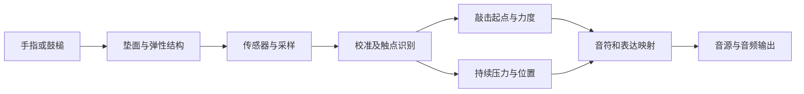

# 打击垫、四象限压感与霍尔效应输入方案研究

> 调研日期：2026-09-30。
> 目标：了解现有打击垫的传感路线，识别“四象限”产品，评估霍尔效应对手指打击垫的适用性。
> 证据范围：厂商技术说明、用户手册、元件应用资料和作者论文；没有实物拆解、采购或性能实测。
> 文中的产品与手册版本用于标识所读资料，不是 LMDJ 选型决定。公开页面可能更新，来源登记保留了访问日与关键原文。

## 1. 结论

1. **打击垫没有统一的传感器。** 压电适合捕获敲击瞬态；FSR、压阻膜和导电织物适合做薄型受力表面及持续压力；可形变的电容结构也能测力。不能从“橡胶 pad”“支持 aftertouch”反推出内部材料。[S01][S02][S03][S04]
2. **“近期推出、每个 pad 四象限”的描述高度吻合 Akai MPCe 系列，尤其 MPC Live III / MPC XL。** 但目前能确认的是象限映射、力度、压力和 XY 表达；本次没有找到足以确认其物理传感器类型、数量，以及每 pad 四个同时独立压力流的一手证据。第 4 节区分这些能力。
3. **四角压力输出不是全新的交互。** QuNeo 的官方手册已经明确区分 Drum Mode 与 Grid Mode，后者允许每角的 note 和 pressure。它比“4 个角各触发一种音色”的描述更接近四路压力控制，但也不能据此猜出四颗独立传感器的电路布局。[S05]
4. **霍尔已经用于商业连续表情乐器。** Haken Continuum 用 Hall 追踪逐指表达；ContinuuMini 甚至公开了“弹簧悬挂铝板、四角磁铁、四个 Hall、ribbon”的结构。因此其音乐用途有实际先例；离散打击垫的连击、冲击耐久与触底手感仍需要单独验证。[S06][S07]
5. **对 LMDJ 的研究建议：把 FSR/压阻方案作为对照，先验证单轴 Hall 垫的力度和持续压力；若目标是四区同时独立受力，优先研究局部力单元或空间压力阵列。** 不宜先选“磁轴”，再假定它自然具备四象限能力。这是工程建议，不是已批准的硬件实施计划。

## 2. 先把“压感”拆成不同能力

本文将“官方事实”用于厂商对自己产品的披露，将“论文结果”限定在作者的实验条件内；“工程推断/建议”不代表厂商的实际实现。“未证实”表示本次公开资料不足，不表示该技术不存在。

| 名称 | 真正要表达的信息 | 常见误解 |
| --- | --- | --- |
| Strike / MIDI Velocity | 触发一次音符时的演奏强弱编码 | 名叫 velocity，不保证测量的是以 m/s 计的速度；也可以由受力包络导出 |
| Aftertouch / Pressure | 发声之后，持续按压如何变化 | 输出叫 pressure，不保证是以 N 或 Pa 标定的物理量 |
| X/Y 接触位置 | 手指在表面的哪里、如何滑动 | 不等于控制板的倾斜，也不等于剪切力方向 |
| 四象限触发 | 在四块逻辑区域分别触发音色、层或演奏法 | 不自动等于四个可同时独立调制的压力通道 |
| 四区独立压力 | 两个或更多区域同时受压时，各自变化仍可分辨 | 四个传感器的读数未必就是四个区域的局部接触力 |
| 多点压力图 | 表面多个位置各自的受力分布，再识别触点 | 一个整体压力值加一个 XY 质心无法恢复任意多点分布 |

**官方事实：**Roger Linn 的教学材料直接讨论从 FSR 压力峰值生成 strike velocity；Arturia 则明确说明 MicroFreak 的 Pressure 随手指接触面积变化。这说明协议字段名不能替代物理传感原理。[S08][S09]

本文沿用乐器行业的“压力”说法。实际工程上应区分法向力、单位面积压力、位移和归一化控制值；如果没有测量接触面积，不能把总力直接叫作 Pa。

## 3. 现有打击垫一般怎么做

### 3.1 从表面到发声的共同链路

下面是功能抽象，不是某个品牌的逆向电路图：



**工程判断：**同一传感器可能同时服务瞬态和持续表达，但滤波、触发判定及复位逻辑通常有不同目标。只看芯片采样率，无法得出从手指接触到声音输出的延迟。

### 3.2 有一手证据的代表方案

| 设备/方案 | 已公开的传感原理 | 对本题有用的能力与边界 |
| --- | --- | --- |
| Roland PD-10P | 三个 piezo 压电传感器 | 是明确的电子鼓垫案例；多点布局用于改善鼓面触发表现，不能推广成所有手指垫都用 piezo。[S01] |
| LinnStrument | 定制电阻式触摸膜，包含固定电阻与 FSR 材料 | 在硅胶下读取 X/Y/Z；是压阻表面实现位置和持续压力的具体例子。[S02] |
| KMI BopPad | Smart Fabric：受压改变电阻的导电材料 | 整个圆鼓面有四个可编程区域及半径、压力表达；不是“16 个 pad 各四区”。[S03][S10] |
| Embodme Erae 2 | 官方手册明确为 FSR matrix | 密集采样点经触摸处理形成逐指 X/Y/Z，适合研究自由划分区域；LED 数、逻辑 pad 数与感应点数不同。[S11] |
| Sensel Morph | 官方 API 公开二维 force array 及触点提取 | 可以获取压力图与触点信息；仅凭该 API 页面不指定材料配方或电极工艺，也不推断现售状态。[S12] |
| Soundplane 8×8 研究原型 | 两层铜电极与橡胶介质构成可变电容阵列 | 受力压缩介质，改变层间电容耦合；是“电容测力”而非估计手指接触面积。此处证据对应 2009 年原型，不把其电路直接当成所有量产 Soundplane 的 BOM。[S04] |
| Ableton Push 3 | 官方确认每个 pad 有 XY sensor、支持 MPE | 确认交互能力；这些规格不足以确定是 Hall、光学、电容还是压阻，不采信未经证实的类型猜测。[S13] |
| Akai MPC Live III / MPC XL | 官方称 MPCe / 3D sensing | 功能证据强，内部器件证据不足；详见第 4 节。[S14][S15] |

这是一组可核实的代表案例，不是市场份额调查；不能据此量化哪种原理“占多数”。

### 3.3 三类路线的工作方式与取舍

**压电：敲击 → 材料受动态应力 → 电荷/电压波形。**

压电对动态变化很合适。厂商技术资料也区分动态和有限时间窗口内的准静态测量；普通压电鼓触发电路不适合作为长时间保持的唯一压力通道。[S16]

工程取舍：适合先实现敲击触发和强弱；需要处理串扰、回弹、热点以及波形峰值判定。若希望按住之后持续控制音色，可以另外引入力通道，而不是无限延长触发电路的保持时间。

**FSR / 压阻膜 / 导电织物：施力 → 接触或材料电阻变化 → 受力估计。**

这些是有关联、但不完全相同的技术家族。Interlink 的 FSR 指南记载了电子鼓用途，并讨论加载结构、迟滞、漂移和量程饱和。[S17] LinnStrument 提供了更具体的实现：两层膜上的行列电阻结构配合模拟开关，切换供电和 ADC 连接，分别读取单元的 X、Y 和压力；多音通过快速扫描得到，而不是每个音符都必须配四颗独立传感器。[S02]

工程取舍：薄型、可铺成阵列，适合软垫；但加载面积、上层硅胶、材料迟滞和磨损会影响结果。LinnStrument 官方还提醒其演奏面不适合反复用鼓垫式的大力击打，因此“能测压力”与“能承受打击”要分别验收。[S18]

**电容：需区分触摸电容与受力电容。**

普通触摸电容可用于接触位置、面积；接触面积会受手指角度影响，不能视为独立力测量。MicroFreak 的 Pressure 就是面积相关输出。[S09] 另一种设计让弹性介质压缩，改变电极间距/耦合，Soundplane 8×8 属于后者。[S04]

工程取舍：真实电容测力可做阵列，但结构公差、介质、寄生电容与抗干扰仍需要设计；“电容一定不能测力”和“电容触摸天然就是压力”都不准确。

## 4. 四象限产品：识别、已知实现和未知部分

### 4.1 最可能是 Akai MPCe，而非已确定某一台整机

**识别判断：**“新款、每个 pad 四象限”与 MPC Live III / MPC XL 的 MPCe 描述高度吻合。仅凭当前描述，无法确定用户看到的是哪台整机，也不把其中任何一台称为截至今日全市场最新产品。[S14][S15]

厂商时间线也吻合：Live III 于 2025 年 10 月推出；MPC XL 发布于 2026-01-20，发布稿明确写出每 pad 四象限；Live III Retro 发布于 2026-05-28，延续 Live III 的功能并采用复古外观。[S29][S30]

这里的四象限应理解为**左上、右上、左下、右下**四块区域；“上下左右”也可能被用来描述四方向控制，两者在硬件需求上不相同。

### 4.2 MPCe 已确认到哪一层

| 层次 | 本次能确认的内容 | 不能由此推出的内容 |
| --- | --- | --- |
| 演奏交互 | velocity、持续 pressure、X/Y 位置表达 | 单颗“3D Hall”或某种特定传感器 |
| 象限映射 | 四角用于不同样本层或演奏法等映射 | 每角有一个物理上独立的力敏器件 |
| 信号到音色 | 位置、压力等可作为表达源；具体功能取决于所读手册及程序设置 | 所有模式都能输出四角各自的外部 MIDI 压力流 |
| 硬件制造 | 厂商称 MPCe / 3D sensing | 传感膜材料、电极布局、芯片型号、扫描固件或四指独立压力能力 |

具体功能可在 Live III 3.6 原厂手册复查：第 62 页分别设置 Aftertouch 与 XY 事件的录制；第 209 页说明按击打位置控制样本层的 Crossfade 模式；第 224 页说明四角 articulation；第 365 页说明 velocity、pressure 和 XY。这里固定引用 3.6 的已知行为，不声称其等于今日最新固件的全部功能。[S14]

依据上述手册及官方产品资料，[S14][S15][S29] **本次没有找到可将 MPCe 与某一公开电路、物料表或专利实施例可靠对应的证据；因此不把工程上可行的压阻或 Hall 方案写成 Akai 的实际方案。**

可以把其功能理解成“采集击打和持续表达 → 按所在象限/位置选取或调制声音”。这是用户可观察功能的抽象，未声称内部固件一定先计算 XYZ 再判象限，也未证明同一 pad 能分离四个同时触点。

### 4.3 QuNeo：明确公开四角压力行为的对照

**官方事实：**QuNeo 手册 v2.0 第 18–19 页区分两类模式：[S05]

- **Drum Mode**：一个 pad 的 note、pressure 和 X/Y 位置用于演奏与连续控制。
- **Grid Mode**：每个角可配置 Note 和 Pressure CC，具体取决于 preset；还有 Corner Isolation 调整相邻角响应。

因此，“四角各有压力控制”有明确产品先例，但隔离程度、同 pad 多指同时演奏的实际表现仍需实测。手册的模式描述没有授权我们把它还原为“四颗互不耦合的 FSR”。

其官网明确每 pad 下有 Smart Fabric 传感层；结合 KMI 对该材料受压改变电阻的说明，可以将它作为电阻式传感家族的参照，但具体配方和电极布局仍未还原。QuNeo 在 2012 年已经出货，访问日官网标记为 discontinued，因此是历史技术对照，不是当前新款推荐。[S03][S31][S32]

### 4.4 若要自己实现，哪些路线成立

以下是**工程方案分类，不是 MPCe 的内部实现认定**：

| 目标行为 | 可以考虑的结构 | 根本限制 |
| --- | --- | --- |
| 一根手指在四角选音色，再持续按压 | 位置感应 + 整体力/位移感应；或空间压力阵列 | 不需要四路独立压力，但需明确换区时是切换音色还是连续混合 |
| 一根手指平滑滑动 XY，同时控制 Z | 电阻式 XY/Z 膜；压力阵列触点追踪；位置与力混合感应 | 必须区分接触位置与板的倾斜，避免改变压力时位置乱跳 |
| 两个以上象限同时独立按压 | 各区局部柔顺结构与力通道；或能分离多个触点的压力阵列 | 共用刚性承托板或大范围力扩散，可能让不同输入产生相同读数 |
| 倾斜、摇动、揉压一整块 pad | 浮动结构 + 多个 Hall；或弹性体 + 3D Hall | 输出可以是位移/姿态/剪切估计，不应直接标成四区独立触摸压力 |

Erae 2 是压力阵列的公开例子：官方手册说明其 FSR matrix 覆盖 42×24 LED 网格，每个 LED cell 对应 16 个原始感应点，处理后输出触点 X/Y/Z。这里引用的是厂商的结构说明，不是本研究实测其扫描率或有效分辨率。[S11]

## 5. 霍尔压感真正需要什么

### 5.1 感应磁场，再通过结构估计力

霍尔元件将磁场分量转为电信号；器件可能输出连续值，也可能只是阈值开关。压感设计应选可读取连续磁场信息的器件，而不是只输出开/关的 Hall switch。[S19]

```text
手指的力
   ↓
弹簧、弹性片或弹性体产生形变
   ↓
磁铁相对传感器移动或转动
   ↓
Hall 读数 → 校准后的位移/姿态 → 受力或音乐表达估计
```

**工程模型：**近似单自由度、线性弹簧、准静态条件下，可写成 `ΔF ≈ k·Δx`。动态敲击则还含惯性、阻尼、非线性和触底接触；不能只用静态弹簧曲线就宣称测到了瞬时冲击力。

在短窗口内读取 `x(t)` 的变化，可以估计敲击强弱并映射成 velocity；按住时则使用较稳定的受力估计。但位移求导会放大噪声，等待完整峰值会增加延迟，这两类输出需要各自验证。

### 5.2 四个 Hall，不一定是四个压力区域

**最直接的官方实例是 ContinuuMini。** 它把 ribbon 安装在可动铝板上，用两根钢琴线弹簧支撑，四角有钕磁铁，四个 Hall 追踪板运动。厂商同时明确：有限双指模式下，两指共享整体 pressure 和前后信息；Y 主要表示板的前后摇动。[S07]

这说明四个角的位移可以用于描述一块板的整体运动，却不自动提供四个区域各自的接触力。

**工程推断：**即使使用四个真正的支承力传感器，读数首先也是支反力。若所有法向载荷均通过这些支点、处于准静态，并忽略切向力及额外外力矩，可估计：

```text
总力 F = Σ fᵢ
受力中心 x = Σ(xᵢ fᵢ) / F
受力中心 y = Σ(yᵢ fᵢ) / F
```

其中 `fᵢ` 是标定后、扣除自重与预载基线的法向支反力增量，不能直接代入 Hall 原始值；`F` 接近零时位置也没有稳定意义。不同的多指施力分布可以拥有相同总力和力矩，因此这些量不足以重建任意四区压力。局部柔顺结构或空间阵列提供的是额外可观测信息。

### 5.3 “3D Hall”也不是“直接测手指 XYZ”

3D Hall 首先测的是磁场 `Bx、By、Bz`。磁铁位置、姿态、材料刚度和外部磁场都会影响读数。MagOne 论文用“磁铁 + 弹性体 + 三轴 Hall”实现了法向/剪切力标定，但论文明确其评估主要是准静态，动态响应与带宽需要进一步研究。[S20]

它可以支持揉压、侧推等探索；无法仅凭三轴磁场值，就无条件区分任意接触位置、多个手指、法向力和剪切力。

另一个有用的负面案例是 NIME 2020 的 Daïs：作者最初尝试 Hall，但自由移动盘片的距离与角度同时影响磁场，造成读数歧义，后来改用其他传感组合。这是该原型的工程结果，不是对所有 Hall 结构的否定。[S21]

### 5.4 真正的难点

- **触底之后的力。** 若磁铁不再移动，继续加力没有新的位置证据；持续压力工作范围内必须保留可测形变。
- **受力位置一致性。** 大 pad 的中心、边缘、角落会有不同的形变和倾斜，不能照搬小键帽的导向结构假设。
- **回弹和连击。** 弹簧/硅胶的复位、质量和阻尼共同决定能否快速重触发；传感器无触点不等于没有机械振铃。
- **漂移和耦合。** 需要分别测磁场干扰、相邻磁铁影响、机械串扰、温度和材料蠕变；一个滤波器不能替代所有问题的结构处理。
- **量产与成本。** 磁铁装配、间隙公差、每垫标定、机械件及校准工时都进入成本。没有供应商报价和样机数据，不能声称 Hall 一定比 FSR 更便宜、更灵敏或更耐用。

以上是由所述结构及 Hall/弹性体研究推导的验证重点，不是已测出的 LMDJ 性能。[S20][S21][S22]

## 6. 其他输入设备中，霍尔的好用法

表中“公开事实”来自来源；“迁移价值”是本研究判断。

| 应用 | 公开事实 | 可借鉴的方式 | 迁移到 pad 的限制 |
| --- | --- | --- | --- |
| Wooting 模拟键盘 | 磁铁在按键内，PCB Hall 测键程；启动校准，可能受外部磁场干扰。[S22] | 约束成单自由度，逐键标定，用连续行程做触发 | 键程不是直接的力；大软垫的边角与触底需要重做 |
| 手柄摇杆/扳机 | GameSir G7 SE 官方明确使用 Hall；TI 有完整摇杆/杠杆设计资料。[S23][S24] | 先固定转轴和轨迹，再选磁铁、量程及反演算法 | 消除电位器电触点磨损，不等于弹簧、轴承和中心校准永不漂移 |
| LEHLE DUAL EXPRESSION | 磁铁与 Hall 替代机械电位器，用踏板运动控制输出。[S25] | 音乐输入中成熟的连续位置映射 | 不移动时继续加力，需要另一种可形变的机械结构才能检测 |
| Audiofront eDRUMin 踩镲 | 官方 Hall 附件将磁铁装在脚踏板、传感器装在底座。[S26] | 读取开合位置，用于连续踩镲表达 | 这是脚踏位置通道，不是鼓面敲击力度的证明 |
| Haken Continuum | 官方明确逐指感知音高、压力和前后位置，使用多个 Hall。[S06] | 与本题最相关的商业表情乐器参照：结构、密集感应与声音映射协同设计 | 连续指板不等于重击鼓垫，也不能把其感应数量压缩成“一个 pad 一颗 Hall” |
| Haken ContinuuMini | 四 Hall 读浮动板，ribbon 补充位置；双指共享压力。[S07] | 少量磁性通道与另一种定位技术组合，可形成有用表达 | 必须接受整体压力与有限多指能力的边界 |
| Thrustmaster T-LCM | 产品同时采用 Hall 磁性技术与刹车 Load Cell。[S27] | 按输入含义选传感器：位置和力可以分工 | “磁性踏板”这一产品名称不代表每个控制量都由 Hall 测得 |

**优先借鉴顺序：**若研究“有行程的压力 pad”，先看 ContinuuMini 的弹性结构与混合感应；若研究丰富的逐指表情，再看 Continuum 与压力阵列；键盘和手柄更适合借鉴机械约束及标定方法。

截至本次检索，对本文列出的主流离散打击垫，没有找到足够一手资料确认其主击打/压力传感通道采用 Hall。检索覆盖厂商产品页、手册、公开技术说明和相关论文；这不是“世界上没有 Hall 鼓垫”的结论。商业连续表情乐器与踩镲位置感应已经明确有 Hall 用例。

## 7. 对 LMDJ 可比较的原型路线

这些是后续实验候选，本文不创建硬件选型、固件、产品接口或采购任务。

| 路线 | 首先回答的问题 | 结构方向 | 主要代价 |
| --- | --- | --- | --- |
| A：单轴 Hall 垫 | 能否同时做好轻重敲击和按住加压？ | 软触面 + 受导向的轻承托件 + 弹性支撑 + 磁铁/Hall | 行程、触底、回弹和逐垫标定；不提供真实 XY |
| B：表情 Hall 垫 | 倾斜/侧推能否形成好用的额外表达？ | 浮动板多点感应，或弹性体 + 三轴 Hall | 轴间解耦、位置/剪切歧义、多指能力受限 |
| C：四区/空间压力面 | 能否同时按住两个象限并独立调制？ | 局部力单元、FSR/压阻阵列，或更密集的压力图 | 扫描、力扩散、触点追踪、材料一致性与耐久 |
| D：混合感应 | 单种传感器是否难以兼顾击打与长按？ | piezo 负责瞬态，另一力/位移通道负责持续表达；或触摸定位 + Hall 力估计 | 传感融合、同步、校准与成本增加 |

**建议先比较 A 与一个成熟 FSR 参考垫。** 用相同面积、相近表面材料和同一音源做对照，判断机械手感和轻触表现；若“四区同时独立压力”是核心需求，直接将 C 加入第一轮。是否需要单 pad 多指，应该在机械设计前明确。

表达输出也要单独定义。MPE 用于逐音符的音高、压力等控制，是通信/声音控制方式，不是一种传感器；MPCe 的品牌名称也不能直接视为完整 MPE 互操作声明。将来验证应同时检查设备发出了什么、接收端识别了什么以及音源如何响应。[S28]

在 LMDJ 中，未来若接入原型，应延续现有 Host 使用 Application Facade 的边界，校准与设备选择按设备/Host 职责设计。本文不推断当前已有四象限或 MPE 能力，也不新增或修改 Contract，不把候选传感器写入 Project Truth。

## 8. 原型应怎样验收

以下是建议记录的观测，不是现有产品的性能排名，也不是本任务新增的 CI gate。阈值应在选定演奏方式、垫尺寸、力范围与音频链路后确定。

| 验证项 | 操作 | 必须保留的观测 |
| --- | --- | --- |
| 轻敲与动态范围 | 多个已知强弱等级；中心、四角和边缘重复测试 | 原始波形、力度分布、漏触发与饱和比例；不能只听一次演示 |
| 持续压力 | 缓慢加力、保持、减力、释放，再重复 | 与参考力传感器/加载装置对照，观察单调性、迟滞、蠕变和归零 |
| 连击/复位 | 逐步加快单指和交替双指连击 | 每次实际接触与输出事件一一对应，统计重复触发、漏击及释放时间 |
| 四区独立性 | A 区恒定受力，B 区独立变化；交换区域再测 | A/B 输出是否可分离；记录交叉影响，不能用单指依次按四角代替 |
| 位置与压力解耦 | 固定位置改变力；近似固定力滑动 | XY 抖动、Z 波动、区边界抖动及跨区音符行为 |
| 多垫串扰 | 敲击邻垫及外壳，邻垫保持长按 | 机械串扰与磁串扰分别记录，不以抬高触发阈值掩盖轻触损失 |
| 延迟与抖动 | 同步记录物理接触、设备事件、音频起点 | 中位数、尾部与最坏情况；分开传感、算法、传输和音频缓冲 |
| 环境与耐久 | 重复加载，温度变化，附近扬声器/金属环境 | 标定前后变化、永久变形、零点漂移、失效方式与可维修性 |

连续表达与触发的滤波应分开评价：平滑的压力曲线不代表敲击响应快；更早发声也不代表 velocity 准确。厂商标称扫描率、ADC 位数或触发延迟不能代替以上端到端证据。

## 9. 尚未解决的问题与证据边界

- 用户看到的具体整机型号仍未得到图片/型号确认；MPCe 是基于特征的高匹配识别。
- MPCe 的物理传感类型、供应商、BOM、扫描架构及同 pad 四点压力分离能力尚未证实。
- QuNeo 的四角输出已由手册支持，但实际串扰、同 pad 多指性能和当前主机互操作没有实测。
- Hall 原型的最佳磁铁、器件、行程、垫尺寸与回弹参数尚未确定；MagOne 的准静态实验不构成打击垫动态验收。
- 没有统一条件下的成本、耐久、延迟或音质对比；不作购买排名或量产承诺。
- 本文只转述公开技术事实并作工程分析，没有复制产品设计文件、固件或专利实施图，也没有评价商业实施自由度。

## 10. 来源登记与复查入口

下表访问日均为 **2026-09-30**。产品网页/在线手册是该日的资料快照；短引文用于辨认原始主张，不能保证网页以后保持不变。带版本号的手册和论文仅界定本次所读证据，不是采用版本。

| 编号 | 一手资料与定位 | 关键原文或证据用途 |
| --- | --- | --- |
| S01 | [Roland PD-10P][S01]，产品说明 | “triple piezo sensor layout” |
| S02 | [LinnStrument：How the sensor works][S02]，层结构及 X/Y/Z 测量 | “force-sensing resistor material”；公开行列扫描电路 |
| S03 | [KMI Labs][S03]，Smart Fabric Technology | “changes resistance as it is compressed” |
| S04 | [Jones 等，NIME 2009][S04]，§2 Hardware，PDF 第 2 页 | Soundplane 8×8 电容原型；电极、介质与解调 |
| S05 | [QuNeo Full Manual v2.0][S05]，第 18–19 页 | “a Note and Pressure CC# for each corner” |
| S06 | [Haken Continuum 介绍][S06]，Independent Control Dimensions | “up to 12 independent Hall-Effect sensors per finger” |
| S07 | [ContinuuMini FAQ][S07]，结构与复音问答 | “Four hall-effect sensors track the movement of the plate.”；“only one overall pressure” |
| S08 | [Roger Linn：CCRMA Workshop 页面][S08]，Force-sensing resistors | “derive strike velocity by measuring the peak of the pressure envelope” |
| S09 | [Arturia MicroFreak FAQ][S09]，键床 Pressure / Velocity | “surface area of your finger” |
| S10 | [BopPad 官方产品资料][S10] | “four independently programmable zones” |
| S11 | [Erae 2 在线手册][S11]，Chapter 3 / Surface & Touch | “Force-Sensitive Resistor”；压力阵列到触点的处理 |
| S12 | [Sensel API Guide][S12]，Technical Primer | “185 x 105”；二维 force array 与触点层不同 |
| S13 | [Push 3 技术规格][S13]，Pads | “each with an XY sensor for detecting finger movement” |
| S14 | [Akai MPC Live III 用户指南 3.6，Kraft Music 托管的原厂手册][S14]，第 62、209、224、365 页 | “The pads are velocity-sensitive and pressure-sensitive”；[原厂下载地址][S14-original] |
| S15 | [Akai MPC XL FAQ][S15]，MPCe pads | 型号与表达能力说明，未公开传感器 BOM |
| S16 | [PCB Piezotronics 力传感器原理][S16] | “dynamic force measurements”；压电测量的时间响应边界 |
| S17 | [Interlink FSR 400 Integration Guide][S17]，应用、性能与加载设计 | 电子鼓历史用途、迟滞、漂移和机械加载影响 |
| S18 | [LinnStrument：How hard should I play?][S18] | “prematurely wear out”；重击与触摸膜耐久限制 |
| S19 | [Allegro Hall 技术说明][S19] | “employed as a magnetic sensor”；连续与开关输出的区别 |
| S20 | [Wang 等，Sensors 2016，16(9):1356][S20]，§2 与 §5 | MagOne 结构、标定及准静态验证边界，DOI `10.3390/s16091356` |
| S21 | [Daïs，NIME 2020][S21]，§3.2–3.4，PDF 第 2 页 | Hall 原型的距离/角度歧义及后续改型 |
| S22 | [Wooting：磁场干扰说明][S22]，How it works / calibration | “measure how far you press a key” |
| S23 | [GameSir G7 SE 官方 FAQ][S23] | “Hall Effect”；摇杆与模拟扳机 |
| S24 | [TI SLYU064A][S24]，Joystick and Lever Design，2023-12 修订 | 机械轨迹、磁场与角度读取的参考设计 |
| S25 | [LEHLE DUAL EXPRESSION][S25]，传感原理 | “Hall sensor”；磁铁运动代替电位器 |
| S26 | [eDRUMin Hall Sensor][S26]，PDF 第 1–2 页 | “hihat footplate”；安装、供电与校准，不是鼓面力度 |
| S27 | [Thrustmaster T-LCM][S27]，Magnetic Technology / Load Cell | “HallEffect AccuRate Technology”；“Load Cell” |
| S28 | [MPE in Live FAQ][S28] | “pitch, slide, and pressure for individual notes” |
| S29 | [inMusic：MPC XL 发布稿][S29]，2026-01-20 | “With four quadrants per pad” |
| S30 | [inMusic：Live III Retro 发布稿][S30]，2026-05-28 | “since its October 2025 launch”；原机型时间回溯 |
| S31 | [QuNeo 产品页][S31]，Smart Fabric / 产品状态 | “Smart Fabric sensor layer under each pad”；“discontinued” |
| S32 | [QuNeo 出货公告][S32]，2012-09-06 | “September 6, 2012”；历史时间参照 |

S14 本次实际读取的托管副本 SHA-256：`8230697cf930d636497edfa54f219ee5cb013b2cbe077dce313460cdac94af9b`。它标识所读文件，不宣称与未来原厂下载内容相同；PDF 未复制进仓库。

## Version Management

Version impact: none

Reason: 本 Task 仅新增外部硬件研究文档，不更改 Product Build、Core Module、Provider、Host、Contract、Assembly 或 Channel 身份，也不选择发布候选。

## Documentation Impact

Documentation impact: none

Reason: 本文位于 `docs/research/`，记录外部资料与待验证建议；没有更改 Architecture Portal 页面、源图、工具或现有产品行为，不触发 Product Build 快照。

[S01]: https://www.roland.com/ca/products/pd-10p/
[S02]: https://www.rogerlinndesign.com/support/how-linnstruments-sensor-works
[S03]: https://keithmcmillen.com/labs/
[S04]: https://madronalabs.com/pdf/NIME09_k1_FINAL.pdf
[S05]: https://files.keithmcmillen.com/products/quneo/Manuals/QuNeo_FullManual_v2.pdf
[S06]: https://www.hakenaudio.com/continuum-introduction
[S07]: https://www.hakenaudio.com/continuumini-faq
[S08]: https://www.rogerlinndesign.com/more/ccrma-workshop-2020
[S09]: https://support.arturia.com/hc/en-us/articles/4405748052626-MicroFreak-General-Questions
[S10]: https://files.keithmcmillen.com/resources/dealer/boppad/product-info-boppad.pdf
[S11]: https://embodme.com/manual/erae-2
[S12]: https://guide.sensel.com/api/
[S13]: https://www.ableton.com/en/push/tech-specs/
[S14]: https://files.kraftmusic.com/media/ownersmanual/Akai_Professional_MPC_Live_III_User_Guide.pdf
[S14-original]: https://cdn.inmusicbrands.com/akai/MPC%20Live%20III%20-%20User%20Guide%20-%203.6.pdf
[S15]: https://support.akaipro.com/en/support/solutions/articles/69000875625-mpc-xl-frequently-asked-questions
[S16]: https://www.pcb.com/resources/technical-information/introduction-to-force-sensors
[S17]: https://www.interlinkelectronics.com/downloads/integration-guides/fsr-400-series-integration-guide.pdf
[S18]: https://www.rogerlinndesign.com/support/support-ls-pressure
[S19]: https://www.allegromicro.com/en/insights-and-innovations/allegro-technology/hall-effect-sensor-technology
[S20]: https://pmc.ncbi.nlm.nih.gov/articles/PMC5038634/
[S21]: https://www.nime.org/proceedings/2020/nime2020_paper119.pdf
[S22]: https://wooting.io/post/when-magnets-mess-with-your-wooting
[S23]: https://gamesir.com/pages/tutorial-how-to-use-gamesir-g7-se
[S24]: https://www.ti.com/lit/ug/slyu064a/slyu064a.pdf
[S25]: https://www.lehle.com/Lehle-Dual-Expression
[S26]: https://www.audiofront.net/HallSensor.pdf
[S27]: https://www.thrustmaster.com/en-us/products/t-lcm-pedals/
[S28]: https://help.ableton.com/hc/en-us/articles/360019144999-MPE-in-Live-FAQ
[S29]: https://www.inmusicbrands.com/press/mpc-xl/
[S30]: https://www.inmusicbrands.com/press/mpc-live-3-retro/
[S31]: https://keithmcmillen.com/products/quneo/
[S32]: https://keithmcmillen.com/press/quneo-now-shipping-drum-pad-emulation/
