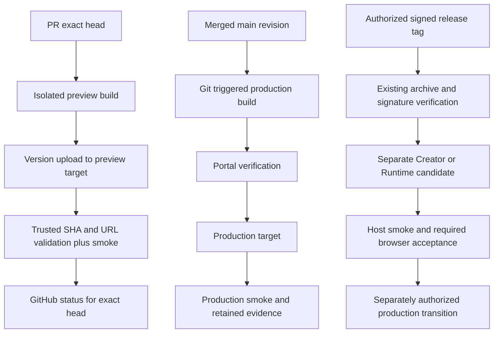

# Netlify → Cloudflare migration: evidence and proposed design

Status: design approved by the user on 2026-09-08; P0 account verification
and pilot evidence remain pending. Implementation plan:
[Cloudflare migration](../plans/2026-09-08-cloudflare-migration.md).
Umbrella: https://github.com/endaye/lmdj/issues/873
Incident: https://github.com/endaye/lmdj/issues/867
Repository audit baseline: `3903e122` (origin/main on 2026-09-08).
This document does not change live deployment policy or authorize cutover.

## 1. Observed state

Authenticated Netlify GET requests on 2026-09-08 at approximately 02:45–02:49 UTC
confirmed that account `endaye` remains Free and has an enforced build-minute
limit exceeded since `2026-09-07T15:07:00.515Z`. Its next usage period begins
`2026-10-01T00:00:00-07:00`. No account settings were changed.

| Site | Site ID | Current published deploy | Source identity |
| --- | --- | --- | --- |
| Portal (`lmdj.netlify.app`) | `d91d32de-26eb-4a5e-9dce-0304ddcfd8f5` | `6a9ec6dfe8b31900084bdb1b` | `d360d3805f21a18ec75d86bb0fc69cda747e9d9d` |
| Creator (`lmdj-creator.netlify.app`) | `59b1da0c-b80f-4673-88e3-56e6352b525a` | `6a9dd315d7eed87f6d9489d5` | API commit_ref is null; resolve through release evidence before migration |
| Runtime (`lmdj-runtime.netlify.app`) | `c58831b8-adbb-4025-a370-5a08daf2b005` | `6a9d0f4996fffd37340e49ea` | API commit_ref is null; resolve through release evidence before migration |

All three published deploys report `ready`. This is control-plane state, not a
fresh HTTP/browser acceptance. Creator and Runtime published objects report
`context: deploy-preview`; do not infer production identity from that field.
Their presence as the site's published deploy and their release evidence are
separate facts to verify.

Reproduce the inventory with authenticated GET `/api/v1/accounts`,
`/api/v1/sites?per_page=100`, `/api/v1/sites/{site_id}/deploys?per_page=100&page=N`
and `/api/v1/deploys/{deploy_id}/files`. Select only the three named sites and
non-secret identity/status fields; never save raw credential/config responses.

The three #867 samples have the identical API error
`Skipped due to account builds usage exceeded` at the SHAs recorded in #867.
The previous npm lockfile incident #590/#592 is a separate failure mode.

### Traffic and build demand sample

The latest 500 Portal deployment records, retrieved over five pages, span
`2026-09-05T03:13:48.251Z` through `2026-09-08T02:22:47.421Z`:

- 342 preview and 158 production records.
- 427 error and 73 ready records.
- Latest 100 records are all quota errors, with 51 preview / 49 production.
- Ready records have median `deploy_time` 147 seconds and maximum 602 seconds.

This is a bounded recent sample, not complete monthly billing data. Pagination
was not an atomic snapshot. `deploy_time` is not Cloudflare billed build time,
and the error count must not be read as 427 independently diagnosed failures.
At the sample rate, 500 attempts / roughly 2.96 days projects to approximately
5,060 attempts per 30 days. Using 147 seconds merely as a duration proxy yields
approximately 12,400 build minutes. Even 3,000 free minutes would require roughly
76% fewer attempts at that proxy duration. Obtain a seven-day distribution and
actual Cloudflare timing before treating any budget as demonstrated sufficient.

### Seven-day follow-up and HTTP baseline

Follow-up observed at `2026-09-08T02:53:06.586623Z`, covering exactly the previous
seven days. Eight API pages reached the lower time boundary. Records were
deduplicated by deploy ID and filtered to the fixed start/end timestamps;
pagination remains non-atomic. The resulting inventory contains 792 attempts:
543 previews, 249 production, 122 ready and 670 error records. Exactly 163 error
messages contain `usage exceeded`; the other errors were not diagnosed by this
aggregate audit and must not be called quota failures.

UTC daily counts (first and last dates are partial days):

| Date | Attempts |
| --- | ---: |
| 2026-09-01 | 62 |
| 2026-09-02 | 95 |
| 2026-09-03 | 74 |
| 2026-09-04 | 54 |
| 2026-09-05 | 104 |
| 2026-09-06 | 177 |
| 2026-09-07 | 195 |
| 2026-09-08 | 31 |

All 122 ready records provide deploy_time: median 122 seconds, maximum 602.
This supersedes the shorter sample as the planning baseline: 792 / 7 * 30 is
approximately 3,394 attempts/month, or about 6,902 minutes using 122 seconds as
a proxy. A 3,000-minute budget would need about a 57% reduction at that duration.
This projection still substitutes successful Netlify deploy duration for
Cloudflare build time; it is neither a bill nor proof of filter savings. The
recent three-day burst remains relevant for queue capacity and peak demand.

Fresh GET requests to the three root URLs returned 200 and
`Content-Type: text/html; charset=UTF-8`, without changing the final URL:

| Site | HTML response bytes | Cache-Control | COOP | COEP |
| --- | ---: | --- | --- | --- |
| Portal | 24,216 | public,max-age=0,must-revalidate | absent | absent |
| Creator | 1,039 | no-store | same-origin | require-corp |
| Runtime | 10,409 | no-store | same-origin | require-corp |

All three returned `X-Content-Type-Options: nosniff`. Portal also returned
`Referrer-Policy: strict-origin-when-cross-origin`; that header was absent on
the two Host root responses. This is an observed baseline, not a new requirement
to add headers to the Hosts. Root HTTP success does not verify hashed assets,
Product identity, audio/browser behavior, deep routes or complete smoke.
Production root availability and Preview build recovery are separate assertions.

The sanitized aggregate is retained alongside this design as
[`2026-09-08-cloudflare-seven-day-audit.json`](2026-09-08-cloudflare-seven-day-audit.json).
No token, account profile, or raw deploy body is included.

### Deployed asset inventory

The files API for the exact published deploys above reports:

| Site | Files | Largest asset | Bytes |
| --- | ---: | --- | ---: |
| Portal | 3,662 | `/assets/js/common.02116f66.js` | 1,345,429 |
| Creator | 9 | hashed runtime WASM | 3,712,631 |
| Runtime | 18 | hashed runtime WASM | 3,712,631 |

These are historical deployed inventories, not proof of the current checkout's
output, future snapshots, or Cloudflare upload compatibility. P2 must measure the
actual candidate output and check live platform limits before upload. Public
Workers limits currently allow 20,000 files/version on Free and 25 MiB/file;
these historical inventories fit those two bounds. Also validate generated
_headers against 100 rules / 2,000 characters per line, and redirects against
2,000 static + 100 dynamic rules. Source: the platform limits reference below.

### Source coupling

- Portal `netlify.toml` builds from `apps/architecture-portal` using
  `npm ci && npm run check`, publishing `build`; it defines security headers.
- `package.json` pins npm 10.9.3 and requires Node >=22.13.0. Netlify configuration
  selects Node 22 without an exact patch. The proposed toolchain pins an exact
  supported Node 22 patch and npm 10.9.3 after compatibility verification.
- `scripts/generate-facts.mjs` uses `PORTAL_REVISION` or Git HEAD and reads
  versioned metadata. `scripts/lib/repo-facts.mjs` reads Product manifests,
  assembly lock, Contracts, Module/Host/Provider manifests and selected source
  files to verify source identity. Portal is not an isolated directory build.
- `.github/workflows/architecture-portal-smoke.yml` listens to
  `deployment_status`, checks a Netlify domain and checks out the deployment SHA.
- Creator/Runtime workflows are manual `workflow_dispatch` with an exact signed
  Product tag, separate production concurrency groups and release preflight.
- `apps/web-runtime-host/tools/deploy_orchestrator.py` embeds Netlify URL/site
  identity and publish/recovery evidence semantics. Replacing a URL or CLI alone
  does not preserve these guarantees.
- `netlify_api_test.py`, `deploy_command_test.py`, headers tests and Creator
  equivalents must follow their actual consumer ownership during migration.

### Account/access gaps

No `CLOUDFLARE*` or `CF_*` environment keys, nor a Wrangler default config at
`~/.wrangler/config/default.toml` or
`~/Library/Preferences/.wrangler/config/default.toml`, were present. This does
not prove the user has no account or browser session. Account ID, effective plan,
repository installation, zone ownership, actual token scope, Preview behavior
and cloud upload limits have not been authenticated or exercised.

### Authenticated Cloudflare follow-up

On 2026-09-08, the user supplied a locally stored API token. GET
`/user/tokens/verify` returned `status: active`; GET `/user` returned the exact
login email the user had specified. The token was not written to Git or printed.
The earlier missing-credential observation above is historical and now resolved.

The login can access several accounts. The dedicated candidate `LMDJ` has actual
account ID `0b62b8881c07f48f7935f5380a1f55db`, with account creation timestamp
`2026-09-08T03:20:20.386343Z`. The account selection question was presented to the
user; read-only discovery is not an authorization to provision into this account.
Unrelated accounts and their resources are deliberately omitted from this record.

Authenticated GET results for the LMDJ candidate:

| Endpoint suffix after account ID | Result | Interpretation |
| --- | --- | --- |
| `/workers/scripts` | empty list | No existing scripts visible to this credential |
| `/pages/projects` | empty list | No existing Pages projects visible to this credential |
| `/workers/subdomain` | 404, code 10007 | workers.dev subdomain has not been initialized |
| `/subscriptions` | empty list | No subscriptions returned; does not prove a specific free allowance |
| `/workers/account-settings` | default_usage_model=standard | Observed usage model, not a complete entitlement report |
| `/builds/account/limits` | 403 | Effective Builds limit cannot be verified with this credential |

The missing subdomain response directs the account operator to open Workers &
Pages, which initializes it. Do not invent or claim a workers.dev hostname before
observing the assigned result. API token authentication resolves the OAuth
connectivity problem; it does not supply deployment write authority. T1 still
needs selected target, effective build limit and proven publisher isolation.

Workers Builds API setup also requires a Cloudflare GitHub App installation.
Its production and preview triggers use deployment build tokens; merely changing
the preview command to versions upload does not prove production isolation.
Preserve the approved trusted-publisher fallback until the actual permission
boundary is demonstrated. Reference:
https://developers.cloudflare.com/workers/ci-cd/builds/api-reference/

## 2. Options and recommendation

| Option | Benefit | Cost / unresolved concern | Proposed disposition |
| --- | --- | --- | --- |
| Workers Static Assets + Workers Builds | Provider-managed Git build, version Preview, Cloudflare's recommended static platform | Build budget; PR execution/deploy credential isolation; smoke callback mapping | Preferred Portal pilot, conditional on isolation and quota proof |
| Pages Git integration | Docusaurus and PR Preview support with familiar static build model | Free 500 builds/month is below sampled demand; new platform work focuses on Workers | Alternative only if pilot finds a specific Workers incompatibility |
| GitHub Actions builds + Workers upload | Explicit trusted publisher and SHA/artifact/smoke chain; avoids Workers Builds minutes | Consumes GitHub/runner capacity; credentials, artifact verification and governance changes require design | Fallback if managed-build isolation or capacity cannot satisfy requirements |

Workers Builds currently documents Free 3,000 minutes/month, one concurrent
build and 20-minute timeout. These are public limits, not this user's account
entitlements. Pricing/limit sources are listed below.

Proposed sequence: Portal first, then Creator and Runtime in distinct Tasks.
The target includes all three sites; no implicit permanent Host deferral.
If either Host cannot meet release/rollback requirements, record an explicit
retention decision and a tracked follow-up before umbrella closeout.

## 3. Proposed architecture

Use distinct preview and production targets. A preview uploader must have no
production mutation capability. Do not assume a different Worker name alone
provides permission isolation. P1 account verification must demonstrate token or
account-level isolation; if Workers Builds cannot provide it, use the trusted
CI publisher alternative before running untrusted PR code with credentials.
External PRs receive credential-free build validation until an explicit trusted
publication path is established. Never run PR scripts in a privileged
`pull_request_target` publishing context.

Preserve Portal's Git-triggered production requirement. A preview uploads a
version without production promotion; production only follows approved merged
source. A managed-platform check is evidence of build status, not automatically
of our smoke pass. Use an authenticated platform event or a trusted GitHub
observer to resolve the exact build/version/SHA, then invoke smoke from trusted
tooling. Select the concrete observer only after an actual event payload is
captured in P2; do not pretend the existing deployment_status hook already works.

Record source SHA, build ID, Worker/version/deployment ID, immutable version URL,
branch alias, content digest and smoke result separately. The branch alias may
move; only a version-bound URL is acceptable for exact-head acceptance. Export
verification evidence independently of platform Preview retention. Current docs
retain only the latest 1,000 preview aliases, expose previews publicly unless
protected with Access, and do not provide Workers runtime logs for Preview URLs.
Keep build logs and external smoke evidence; do not design acceptance around
Preview runtime log availability. A version URL is not a promise of indefinite
retention.

## 4. Build budget and inputs

P2 first measures complete candidate builds. Path filtering is added only with
producer/consumer tests proving relevant inputs are included. Treat unknown
paths as requiring a build. Include Portal sources and snapshots, docs and source
diagrams, Products, Contracts, consumed Module/Host/Provider source identities,
shared build tools and workflow/configuration inputs. Use the canonical scope
policy as an input, not a substitute for verifying the full dependency graph.

Avoid duplicate same-head previews and cancel superseded preview work only when
owned by this deployment pipeline. Serialize production transitions. Proposed
budget alerts are 50%, 75%, 90%; at 90% project remaining demand and require a
budget or scheduling decision before enabling broader automatic previews.
No automatic paid overage or silently disabled required validation. First pilot
is limited to the migration PR; broader activation depends on measured demand.

## 5. URLs, browser state and headers

Pilot uses the actual assigned workers.dev version URL; no invented account or
project identity. Formal domains require owner selection and verified DNS access.
The existing netlify.app domains cannot be repointed through our DNS; preserve
them during a defined transition and separately authorize any Netlify redirects.
Do not delete old sites as part of first cutover.

Portal uses generated static page routing, correct unknown-path 404 and migrated
security headers. Verify deep-link refresh, canonical URLs, version snapshots,
images/diagrams and cache behavior. Do not apply an indiscriminate SPA fallback.

Creator/Runtime also require WASM MIME, COOP/COEP, cross-origin isolation,
immutable hashed assets, mutable entry-point cache semantics and Service Worker
update tests. A hostname change creates a new browser origin: browser storage,
permissions and installed service workers do not automatically migrate. Design
an explicit export/import and user handoff if persisted user content is affected;
never claim that a redirect transfers origin-scoped Project Truth.

## 6. Failure and rollback

Retain the prior production version, routing state and evidence before any
transition. Candidate smoke failure stops promotion. Post-cutover failure rolls
back only the affected site to the recorded known version and repeats smoke.
Re-read current target identity immediately before mutation to detect another
operator's change. Unknown identity stops the operation instead of overwriting it.
For an empty new target, prove initial deployment/recovery behavior explicitly;
existing fake-server tests historically missed never-deployed API states.

Host adapters must preserve verified archive bytes, exact tag/host identity,
preflight, candidate readiness, same-version promotion, recovery evidence and
independent Channel authorization. Netlify-specific evidence schemas are not
silently relabeled Cloudflare; assess Contract version impact before changing
serialized evidence. Platform version retention must support the selected
rollback window or archived rebuild/redeploy must be proved as a distinct path.

## 7. Proposed work packages and acceptance

| Package | Declared ownership | Depends on | Completion evidence |
| --- | --- | --- | --- |
| P0 audit | This spec and measured inventory | None | Repository/live inventory; capacity sample; account/limits gaps explicitly resolved before pilot |
| P1 design | Spec, decision record if needed, implementation plan | P0 | Approved platform/isolation/budget/domain decisions and task dependencies |
| P2 Portal pilot | Portal config/tooling/tests and its smoke workflow | P1 | Candidate build, upload, version URL and correct SHA; real HTTP/content/headers/404/snapshot smoke; exact-head status |
| P3 Portal cutover | Portal URL/governance and controlled platform routing | P2 | Authorized Git production deploy, old/new identity, full smoke, rollback verification and observation |
| P4a Host deployment adapter | Shared deploy tools/evidence contracts and tests | P1 | New-site, wrong-target, timeout, upload mismatch, promotion and rollback failure cases |
| P4b Creator | Creator assembly/deploy integration and acceptance | P4a | Signed archive identity, browser and required physical acceptance, authorized cutover |
| P4c Runtime | Runtime assembly/deploy integration and acceptance | P4a | Signed archive identity, browser/runtime acceptance, authorized cutover |
| P5 retirement | Unused dependencies, old hooks, governance and incident records | Corresponding site acceptance | No stale failure check; preserved history; remaining consumers protected; #867 alternative acceptance approved |

One owner per shared file set. Child Issues are to be created from the approved
P1 decision, not from assumptions about unresolved credentials/domain choices.
Every Task retains exact-path changes and relevant local verification. Live
Preview, real browser and production acceptance cannot be replaced by a local
build or fake API test.

## 8. Decision status and remaining prerequisites

1. Approved: the three-site sequence and conditional Workers-first pilot.
2. Establish account/repository access and demonstrate Preview credential
   isolation. The pilot may use assigned workers.dev URLs; choose final domains
   before P3/P4 cutover.
3. Approve the measured build budget/trigger policy after pilot timing; decide
   whether paid capacity or trusted external CI is required.
4. Approve any Host evidence Contract or origin-storage migration policy changes
   before the affected Host implementation.

The user approved this design and identified the Cloudflare login on 2026-09-08.
The email is not an account ID. P0 cloud-specific checks remain incomplete until
authenticated access exists; the three-site scope and conditional Workers-first
pilot direction are approved. Actual budget/domain/Contract decisions remain
subject to their stated evidence and authorization boundaries.
No deployment, DNS, paid-plan change, Issue closeout or release operation has
been executed by this document.

## Version Management

Version impact: none for this audit and proposed design. No Product Build,
Assembly, Module, Host or Contract identity changes. Implementation Tasks must
reassess their own changes, especially serialized deployment evidence Contracts.

## Documentation Impact

Documentation impact: none for this proposed-design commit: it adds an audit
and proposal without changing current behavior or current Portal policy. The
migration implementation has Documentation impact: required and must update
`docs/governance/architecture-portal.md`, current Portal operations/host pages,
source diagrams and runbooks in the owning Tasks. Run the Portal check for this
audit as it records documented source facts; a pass does not approve this design.

## Sources and verification limits

Public references checked 2026-09-08; recheck before implementation:

- https://developers.cloudflare.com/workers/best-practices/workers-best-practices/
- https://developers.cloudflare.com/workers/ci-cd/builds/limits-and-pricing/
- https://developers.cloudflare.com/workers/platform/limits/
- https://developers.cloudflare.com/workers/static-assets/billing-and-limitations/
- https://developers.cloudflare.com/workers/versions-and-deployments/preview-urls/
- https://developers.cloudflare.com/workers/ci-cd/builds/git-integration/github-integration/
- https://developers.cloudflare.com/pages/platform/limits/

Authenticated Netlify inventory above provides the account/deploy observations.
Public Cloudflare documentation is not authenticated account or end-to-end proof.

Local verification on the audit worktree: Node 22.16.0 / bundled npm 10.9.2
used by the existing EMSDK installation; `architecture-portal.sh install` and
`architecture-portal.sh check` passed (65 tests; docs/diagrams/release-docs,
typecheck, build; 42 route/internal-link assertions). This is not the proposed
npm 10.9.3 cloud toolchain proof. The staged-index ownership suite
`python3 tests/build/ci_change_scope_test.py` passed 66 tests. No new runtime
regression test is appropriate for this audit-only file.
